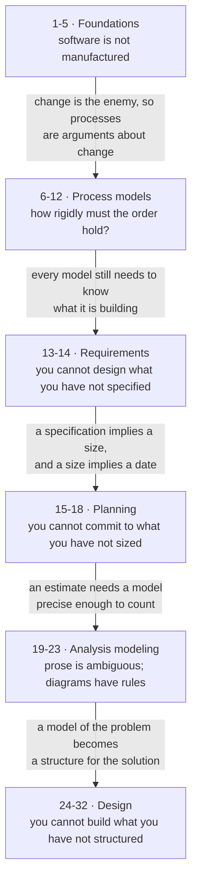
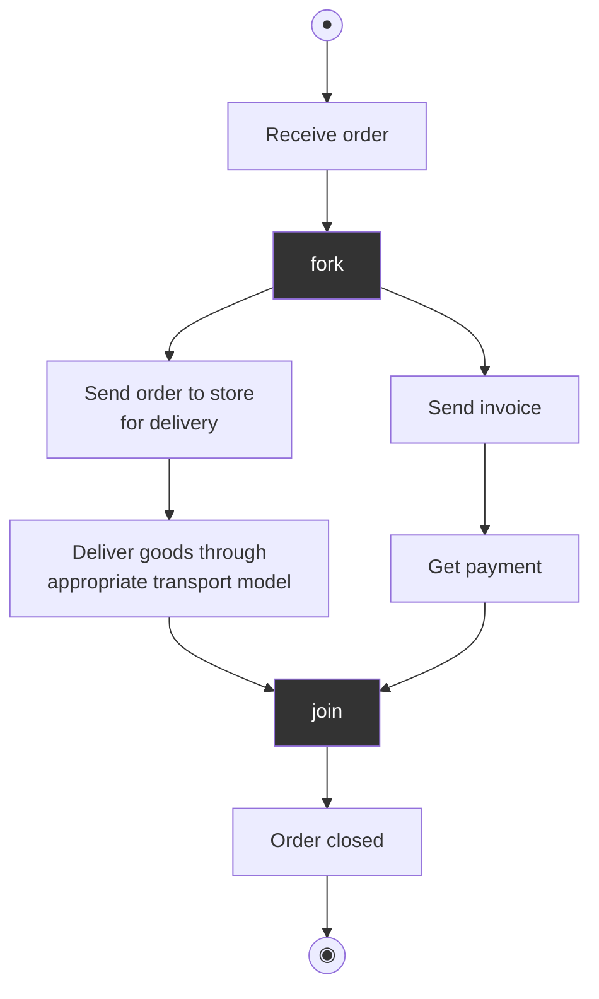

# Theory — Mid-Term (Lectures 1–32)

**Everything in the Mid-Term syllabus that is not arithmetic**, in the order the
53-lecture plan teaches it. The arithmetic lives on [[Numericals]]; Testing lives
on [[01 Testing]] and is **outside this exam**.

> [!info] What this page is
> Read top to bottom and you learn the material. Every section ends with a
> **Remember** block — the bullets to reproduce in an answer. Those blocks are the
> compression; the tables above them are where you meet the content.

> [!warning] Scope, stated once
> The handout marks lectures **1–34** as Mid-Term assessable. You have stated the
> Mid-Term is **lectures 1–32**, and that overrides the handout — see [[syllabus]].
> The cut drops Construction (33–34: coding standards, code review, walkthroughs)
> and takes **CO3 out of the Mid-Term entirely**. The MTE covers **CO1 (1–12) and
> CO2 (13–32)** only.

**How the paper words things** — five archetypes, all on [[answer-patterns]]:
*identify & justify* · *explain with reason* · *numerical* · *draw & label* ·
*compare & distinguish*. **There is no "define X" question in the whole corpus.**
Read the verb first; it tells you the shape before you have recalled any content.

---

## The spine

The lifecycle is an argument, not a list. Each phase exists because the one
before it cannot be skipped:



---

## Contents — what is here, where it came from, what it is worth

**One row per section.** *Lec* is the handout's 53-lecture plan. *Chapter* is the
deck the material was read from, with the Aggarwal & Singh chapter number where
the deck carries one. *Marks* is the topic's score on [[se-ete-2025-26]] — see the
warning below before you use that column.

| § | Section | Lec | Chapter / deck | Marks | Subtopics |
|---|---|---|---|---|---|
| **1** | What software is, and why this course exists | 1–3 | `L1 PPT 1–8` (A&S ch. 1–2) | **2** | 1.1 program vs software · 1.2 the software crisis · 1.3 adding people to a late project · 1.4 characteristics and the two failure curves · 1.5 legacy software and myths |
| **2** | Layered technology, process framework, umbrella activities | 4–5 | **no deck** — standard Pressman | 0 | 2.1 the four layers · 2.2 the generic process framework · 2.3 umbrella activities · 2.4 the process and software products |
| **3** | Conventional process models | 6–7 | `L1 PPT 1–8` | **2** | 3.1 classical waterfall · 3.2 iterative waterfall · 3.3 prototyping · 3.4 RAD |
| **4** | Evolutionary process models, and the comparison | 8 | `L1 PPT 1–8` | **4** | 4.1 incremental · 4.2 incremental vs iterative · 4.3 spiral · 4.4 component-based · 4.5 V-model · 4.6 model selection |
| **5** | Agile development | 9–11 | `L2 Lec 9–14`, `L3 Agile Development models` (Pressman ch. 4) | 0 | 5.1 the four values · 5.2 the twelve principles · 5.3 Scrum · 5.4 Extreme Programming · 5.5 ASD, DSDM, FDD, Crystal, AM, Kanban |
| **6** | SDLC, effort distribution, and CMMI | 12 | `L1`/`L2` for CMMI; **40-20-40 unsourced** | **8** | 6.1 the SDLC and its deliverables · 6.2 effort distribution across phases · 6.3 CMMI's five maturity levels |
| **7** | Requirements engineering and the SRS | 13 | `L5 Chapter 3 Software Requirements` | **2** | 7.1 what RE is · 7.2 types of requirements · 7.3 the SRS and IEEE 830 · 7.4 SRS in large projects vs Agile |
| **8** | SE practice: the five RE activities | 14 | `L5 Chapter 3 Software Requirements` | 0 | 8.1 elicitation and technique selection · 8.2 analysis, specification, validation, management |
| **9** | Project planning — the theory half | 15–18 | `L7 Software Project planning`, `Chapter 4 Software Project planning` | **12** | 9.1 feasibility and software scope · 9.2 three ways to measure size · 9.3 COCOMO concepts · 9.4 risk analysis and estimation |
| **10** | Analysis modeling: data and flow | 19–21 | `L6 Requirement Analysis Diagrams`, `DFD (2).pptx` | 0 | 10.1 data modeling and the ER diagram · 10.2 flow-oriented modeling and the DFD |
| **11** | UML, use cases and activity diagrams | 22–23 | `UML.pdf`, **`2026-27 UML & UseCase Diagram`** | **10** | 11.1 the diagram taxonomy · 11.2 the use case approach · 11.3 class, object, sequence · 11.4 activity diagrams · 11.5 the six OO analysis-and-design steps |
| **12** | Design concepts and principles | 24–26 | `L8 Chapter 5 Software Design` | 0 | 12.1 the design framework · 12.2 modularity · 12.3 abstraction, refinement, information hiding · 12.4 design strategies · 12.5 function- vs object-oriented · 12.6 design notations · 12.7 the SDD, IEEE 1016 |
| **13** | Software architecture | 27 | `L10 Chapter 5 Architecture Design` + `L8` | 0 | 13.1 control hierarchy and structural partitioning · 13.2 data design |
| **14** | Coupling and cohesion | 28 | `L9 Coupling and Cohesion`, `L8 Chapter 5` | **6** | 14.1 cohesion — seven levels · 14.2 coupling — six levels · 14.3 reading code for both |
| **15** | Alternative architectures and complexity | 29–30 | `L10 Chapter 5 Architecture Design` | 0 | 15.1 assessing alternatives — ATAM · 15.2 architectural complexity |
| **16** | Transform and transaction mapping | 31–32 | `L10 Chapter 5 Architecture Design` | 0 | 16.1 the six-step process · 16.2 transform flow · 16.3 transaction flow · 16.4 the resulting structure chart |
| | | | | **46** | **of the 80 on the paper fall in lectures 1–32** |

### Where the marks were — sections ranked

**Reconciles to 46 of 80**, which is what [[weightage]] records for the MTE window.

| Rank | § | Section | Marks | The question it was |
|---|---|---|---|---|
| 1 | **9** | Project planning | **12** | D1 COCOMO numerical (10) + A4 risk identification vs assessment (2) |
| 2 | **11** | UML | **10** | D2 — draw an activity diagram for a Bank Loan Processing System |
| 3 | **6** | SDLC & CMMI | **8** | A2 CMMI level scenario (2) + B3 effort distribution essay (6) |
| 4 | **14** | Coupling and cohesion | **6** | B2 — define and differentiate (3) + read a code snippet (3) |
| 5 | **4** | Evolutionary models | **4** | B1 cases 2 and 3 — identify the model and justify |
| 6= | **1** | Foundations | **2** | A5 — can adding people rescue a late project? |
| 6= | **3** | Conventional models | **2** | B1 case 1 — the architect/house scenario |
| 6= | **7** | Requirements | **2** | A3 — why an SRS survives in waterfall but not Agile |
| — | 2, 5, 8, 10, 12, 13, 15, 16 | | **0** | **not asked that day — see the warning** |

> [!warning] Read the Marks column twice — it is one paper, and it is the wrong exam
> **Two separate cautions, and both matter.**
>
> **First: these are End Term marks, not Mid-Term marks.** The handout sets the
> MTE at **30 marks, close book**, and says nothing about its section split. This
> vault holds **no past Mid-Term paper**, so the *format* of your exam is unknown.
> What the column gives you is the best available evidence of **what this
> instructor asks and how deeply** — nothing more.
>
> **Second: the corpus is one sitting.** A section showing **0** was not asked
> **once**. That is **absence of evidence, not evidence of absence** — and it is
> never permission to skip a syllabus topic, because scope comes from
> [[syllabus]], not from the paper. Three of the zeros are especially untrustworthy:
> - **§10 (ERD and DFD)** — two full lectures, a dedicated deck, and a **drawing**
>   topic on a paper that put 20 of 80 marks on drawings. **Three assignment
>   questions.**
> - **§5 (Agile)** — three lectures, the module's longest deck treatment, and
>   **five assignment questions**.
> - **§12–13, §15–16 (the Design block)** — nine lectures, 28% of the Mid-Term
>   window, and **zero marks on the one paper**. Do not read that as safe.
>
> **Coursework is evidence of emphasis, never of weight** (rule 2). It is recorded
> on [[Numericals]] and [[se-assign-1-2026]], and it says loudly that your
> instructor cares about agile, DFDs and estimation.

> [!note] On the handout's five modules
> The handout also groups the syllabus into **five modules**, and they do **not**
> line up with the lecture plan — module 4 pairs modeling with quality management,
> which the lecture plan teaches 25 lectures apart. Roughly: §1–2 and §6's CMMI
> are **Module 1**; §3–5 are **Module 2**; §7–8 are **Module 3**; §10–11 are
> **Module 4**; §9 is **Module 5**. **The Design block, §12–16, maps to no module
> cleanly** — the closest is Module 3's "Modeling Practices", which is a stretch.
> **This page follows the lecture plan**, because that is the order you meet the
> material and the order the exam follows.

## 1 · Lectures 1–3 — What software is, and why this course exists

- **Computer science says what a machine *can* compute.** It does not say how
  five people build a payroll system in nine months for a customer who keeps
  changing their mind. That gap is this subject.
- Software engineering: an engineering discipline covering **all aspects of
  software production**, aiming at **fault-free software, meeting user needs, on
  time and within budget** — by a systematic and organised approach, with tools
  and techniques chosen to fit the problem, the constraints and the resources.

| | Computer science | Software engineering |
|---|---|---|
| Supplies | theories, computer function and methods | tools and techniques to solve the problem |
| Faces | **the machine** | **the customer and their problem** |

### 1.1 Program vs software

> **Software = Program + Documentation + Operating Procedures**

A finished program is roughly **a third** of a finished product. Both other parts
are deliverables.

| Phase | Documents produced |
|---|---|
| Analysis / specification | formal specification, context diagram, DFDs |
| Design | flow charts, ER diagram |
| Implementation | source code listings, cross-reference listing |
| Testing | test data, test results |

**Operating procedures** are two manual families — **user manuals** (system
overview, beginner's guide, tutorial, reference guide) and **operational manuals**
(installation guide, system administration guide).

### 1.2 The software crisis

By the late 1960s software behaved like nothing else engineers built: projects
ran late, and the obvious fix — more programmers — made them **later**. Hardware
got cheaper as software got bigger and costlier, so the thing least under control
became the thing that mattered most. **It is the problem statement the remaining
50 lectures answer.**

**Six causes:** lack of communication between developer and user · cost of
software rising relative to hardware · growth in software size · project
management problems · inadequate training in software engineering · skill shortage.

**Three canonical failures:**

| Failure | Year | Cause |
|---|---|---|
| **Ariane 5** | 1996 | destroyed 39 s after launch; 10 years and $7 bn of development, four satellites lost |
| **Patriot missile** | 1991 | clock timing error accumulating over 100 h of operation; 28 US soldiers killed at Dhahran |
| **Y2K** | 2000 | two-digit year fields — an *assumption*, not a coding bug |

### 1.3 Why adding people to a late project makes it later

The deck's own wording: adding programmers "does not always help speed up the
development process. Instead, sometimes it may have negative impacts like delay
in achieving the scheduled targets, degradation of software quality."

1. **Training cost.** Newcomers are brought up to speed by the people who are
   already the bottleneck, so throughput **drops before it rises**.
2. **Communication overhead.** *n* people have ***n*(*n*−1)/2** pairwise channels.
   Doubling a team roughly **quadruples** coordination cost.
3. **Partitioning limits.** Some tasks cannot be subdivided at all.

**The remedies that actually work:** reduce scope · extend the schedule · re-plan
with the time remaining.

### 1.4 Software characteristics and the two failure curves

A bridge fails because steel fatigues. Software has no steel, so ideally its
failure rate falls as early defects are found and then stays flat forever. **It
does not** — every post-release change fixes one thing and disturbs another, so
the curve jumps at each release and settles *higher*.

| | Hardware | Software |
|---|---|---|
| Curve | **bathtub** — burn-in, useful life, wear-out | falling, then a **ratchet upward** at each change |
| Cause of failure | physical decay — dust, vibration, temperature | **change**: each fix introduces new faults |
| End of life | wears out | retired for environmental change, new requirements |

**Five characteristics:** does not wear out · **developed/engineered, not
manufactured** in the classical sense · components are reusable · highly flexible
· a **logical**, not physical, system element.

*Engineered, not manufactured* means the cost sits in **development**, not
reproduction. Copying is free — so every cost is a design cost.

**Eight application domains:** system · real-time · embedded · engineering and
scientific · business · web-based · personal computer · artificial intelligence.

### 1.5 Legacy software and software myths

> [!warning] Unsourced — no deck covers these
> Zero hits for "myth" across all 24 decks; "legacy" appears only incidentally.
> The handout names both at lecture 3, so rule 1 keeps them in scope. Standard
> Pressman material, **not your instructor's slides**.

**Legacy software** — an older system still in service, **business-critical yet
unmaintainable**: poor quality from years of unstructured patching, absent or
outdated documentation, brittle design, obsolete hardware/languages/platforms.
**Four responses, in increasing cost:** leave it alone if stable and isolated ·
re-engineer for maintainability · adapt it to interoperate · replace it.

**Software myths**, by who holds them:

| Myth | Held by | Reality |
|---|---|---|
| "A book of standards exists, so my people have all they need" | management | it may be unread, outdated, or quietly ignored |
| "We can add programmers to catch up" | management | it makes the project later |
| "Outsourcing lets me relax" | management | outsourced projects fail for the same reasons |
| "A general statement of objectives is enough to start" | customer | ambiguous requirements are the largest single cause of failure |
| "Change is easy to absorb — software is flexible" | customer | the cost of change rises steeply the later it lands |
| "Once the program works, we're done" | practitioner | 60%+ of total effort is spent *after* first delivery |
| "Until the program runs, quality can't be assessed" | practitioner | reviews and inspections find defects earlier and cheaper |
| "The only deliverable is the working program" | practitioner | software = program + documentation + procedures |

> [!abstract] Remember — Lectures 1–3
> - **Software = Program + Documentation + Operating Procedures.** A program is
>   one third of a software product.
> - **Hardware wears out; software deteriorates.** The verb matters. The curve
>   ratchets up at every maintenance release and never returns to baseline.
> - **Adding people to a late project makes it later** — training diverts your
>   best people · communication paths grow as *n*(*n*−1)/2 against at-best-linear
>   output · sequential work cannot be parallelised. Remedies: **cut scope,
>   extend the schedule, re-plan.** *Naming "Brooks's Law" and stopping earns
>   nothing — the mechanism is the mark.*
> - **Six crisis causes** · **Ariane 5 (1996) · Patriot (1991) · Y2K (2000)**.
> - **Five characteristics:** doesn't wear out · **engineered, not manufactured**
>   · reusable · flexible · logical.
> - **Eight domains** · **four legacy responses** (leave / re-engineer / adapt /
>   replace) · **three myth categories** (management / customer / practitioner).
> - **If asked to draw:** the two failure curves side by side, labelled.

---

## 2 · Lectures 4–5 — Layered technology, process framework, umbrella activities

> [!warning] Almost entirely unsourced
> Zero deck hits for "layered", "umbrella", "generic process" or "process
> framework" as lecture content, across all 24 decks. The handout names all of
> them at lecture 4 and again in Module 1, so rule 5 keeps them in scope.
> Standard Pressman.

### 2.1 The four layers

Organisations buy tools and expect to become good at software. **Tools sit at the
top of a stack.** Remove a lower layer and everything above has nothing to stand
on — a team with tools but no process just makes mistakes faster.

**Read bottom-up. Drawing it upside down is the classic error:**

| Layer | What it is | If it is missing |
|---|---|---|
| **Tools** *(top)* | automated or semi-automated support (CASE) | methods must be applied by hand |
| **Methods** | the technical "how to" — requirements analysis, design, coding, testing | activities exist with no technique to perform them |
| **Process** | the glue — holds methods and tools together, defines order and deliverables | methods applied ad hoc; results unrepeatable |
| **Quality focus** *(bottom)* | organisational commitment to continuous improvement | nothing above has a reason to exist |

### 2.2 The generic process framework

Strip any process model down and **the same five things happen**. Waterfall does
each once, in order. Spiral does all five per loop. Agile does all five per sprint.

| Activity | What happens |
|---|---|
| **Communication** | talk to the customer; gather requirements |
| **Planning** | define the work — tasks, risks, resources, schedule |
| **Modeling** | build the analysis and design models |
| **Construction** | code it and test it |
| **Deployment** | deliver, get feedback, support |

**What differs between models is the arrangement, never the ingredients** — which
is exactly why the model-comparison table in §4 is possible at all.

| | Process **framework** | Process **model** |
|---|---|---|
| What it is | the activities every project performs | a specific arrangement of them |
| Example | communication, planning, modeling, construction, deployment | waterfall, spiral, incremental |
| Varies by project? | **no** | **yes** — this is the choice you make |

### 2.3 Umbrella activities

You cannot schedule risk management as week six, or do configuration management
on Tuesday and then stop. Some work runs **continuously**, because the moment it
stops the project degrades without anyone noticing. Drawn as a **band across the
whole timeline**, not a box within it.

**The eight:** project tracking and control · **risk management** · quality
assurance · technical reviews · measurement · configuration management ·
reusability management · work product preparation and production.

| | Framework activity | Umbrella activity |
|---|---|---|
| When | happens **in sequence**, as a phase | runs **continuously**, across all phases |
| Example | modeling | risk management |

### 2.4 The process, and software products

**A process** is a set of activities with an order and deliverables — what turns
"we built something" into "we can build another one the same way".

**What you build shapes it.** A product sold to thousands has no single customer
to consult, so the developing organisation invents the requirements itself. A
bespoke system has exactly one customer, the sole authority. That difference
propagates into which process model is even viable.

| Product type | Built for | Requirements come from |
|---|---|---|
| **Generic** | the open market, many customers | the **developing organisation** |
| **Customised** (bespoke) | one specific customer | **that customer** |

> [!abstract] Remember — Lectures 4–5
> - **Four layers bottom-up: quality focus → process → methods → tools.** Quality
>   focus is the **bedrock**, not the top. Draw the stack; it costs ten seconds
>   and makes the ordering unambiguous.
> - **Five framework activities in order: communication · planning · modeling ·
>   construction · deployment.** Every project does all five; models differ only
>   in how often and in what order.
> - **Eight umbrella activities** — the examinable point is the **contrast**, not
>   the list: framework activities are **phases**, umbrella activities are
>   **continuous**.
> - **Framework vs model:** what every project does / how one project arranges it.
> - **Generic vs customised:** requirements from the developer / from the one
>   customer.

---

## 3 · Lectures 6–7 — Conventional process models

> [!warning] Your two sources group these differently
> The **handout** puts prototyping and RAD in *conventional* (lectures 6–7). The
> **deck** files prototyping under *Evolutionary* and RAD under *Incremental*.
> **Answer by naming the model, not its category** — the category is precisely
> where they disagree.

**All four models answer one question:** *how much do you commit before you start
building?* Waterfall makes the maximum bet and wins big when requirements hold
still; the rest are hedges against that bet failing.

### 3.1 The classical waterfall model

**Winston Royce, 1970**, named for the way the diagram cascades: each phase's
output flows into the next, and no phase begins until the one above is complete.
**Plan-driven** — every activity planned and scheduled before work starts. That
makes it the **most disciplined and the most brittle** model: beautiful when you
know exactly what you are building, expensive the moment you do not, because the
model has no mechanism for discovering you were wrong.

| # | Phase | Aim |
|---|---|---|
| 1 | Feasibility study | is it financially and technically feasible? |
| 2 | Requirements analysis and specification | gather, analyse, then specify |
| 3 | Design | transform the SRS into an implementable structure |
| 4 | Coding and unit testing | translate design into code; test each module |
| 5 | Integration and system testing | combine incrementally, then test the whole |
| 6 | **Maintenance** | **~60% of total effort — the largest phase** |

**The three system tests — who performs each is the examinable part:**

| Test | Performed by |
|---|---|
| **Alpha** | the **development team** |
| **Beta** | a **friendly set of customers** |
| **Acceptance** | **the customer**, after delivery, to accept or reject |

**Shortcomings:** assumes no error is ever committed · requirements hard to
define fully at the start · cannot accommodate change · unsuitable for large
projects · no working version until late · **big-bang delivery** carrying heavy
risk · document-driven, formal sign-off at each phase.

**The deck's charge:** the model "assumes that no development error is ever
committed by the engineers during any of the life cycle phases". A design defect
may go unnoticed until coding or testing, at which point you return to the phase
where it originated and redo everything after it.

### 3.2 The iterative waterfall model

**The fix:** add **feedback paths from every phase back to its predecessor** — the
same model with permission to go backwards. One of the most widely used in
practice.

| | Classical | Iterative |
|---|---|---|
| Feedback paths | **none** | from every phase to its predecessor |
| Error correction | impossible within the model | rework the phase where the error was made |
| Exception | — | **no feedback path to the feasibility study** |

**That missing arrow is deliberate** — once an organisation commits to a project
it does not readily abandon it. It is the detail that shows you looked at the
diagram rather than the summary.

**The principle:** detect errors **in the same phase in which they are
committed**. That minimises correction effort and time — the cost-of-change curve
restated as a process rule.

**Its own drawbacks:** change requests still hard to incorporate · **no
incremental delivery** · phases cannot overlap · no risk handling · limited
customer interaction (start and end only).

### 3.3 The prototyping model

**The situation it solves:** some customers cannot tell you what they want, but
can tell you instantly what is wrong with what you show them. The obstacle is not
disagreement but **ignorance** — nobody yet knows what the product should be.

**Definition:** "the process of developing a working replication of a product or
system that has to be engineered."

**The cycle:** interview the customer → incomplete high-level paper model →
initial prototype with basic functionality only → customer identifies problems →
refine → repeat until satisfactory → **then build the real product**, using the
approved prototype as the specification.

The system is **partially implemented before or during analysis**, which is what
lets the customer see it early in the life cycle.

### 3.4 Rapid Application Development (RAD)

**The bet:** if a project genuinely breaks into independent modules, build them in
**parallel** rather than in sequence. RAD **buys calendar time by spending
people**. First proposed by **IBM in the 1980s**.

**The precondition:** the project "can be broken down into small modules wherein
each module can be assigned independently to separate teams", and each module's
development "involves the various basic steps as in waterfall model, i.e.
analyzing, designing, coding and then testing".

**It works precisely when the work is partitionable** — and fails for the same
reason adding people to a late project fails when it is not. Worth naming that
tension in an answer.

> [!abstract] Remember — Lectures 6–7
> - **The one question that decides everything: how stable are the requirements?**
>   Stable and understood → **waterfall**. Unclear to the customer →
>   **prototyping**. Clear and decomposable with a tight deadline → **RAD**.
> - **Waterfall's six phases:** feasibility · requirements · design · coding+unit
>   test · integration+system test · maintenance. **Maintenance ≈ 60%.**
> - **Alpha = development team · Beta = friendly customers · Acceptance = the
>   customer after delivery.** Routinely mixed up.
> - **Classical vs iterative:** no feedback paths / feedback to every predecessor
>   — **except no feedback to the feasibility study.**
> - **Winston Royce, 1970** (waterfall) · **IBM, 1980s** (RAD).
> - **Waterfall's tells in a scenario:** *"all requirements are collected first"*,
>   strict irreversible stage order, phase-end inspections, **one final handover**.
> - **In a scenario question, name the model — never the category.** Your handout
>   and your deck disagree on the categories.

---

## 4 · Lecture 8 — Evolutionary process models, and the comparison

> [!warning] The same taxonomy disagreement
> Handout lecture 8: evolutionary = incremental, spiral, component-based, unified
> process. The **deck** instead uses *Evolutionary* = {prototyping, spiral},
> *Incremental* = {incremental, RAD}, *Specialized* = {component-based}, plus a
> standalone **V-model** the handout never mentions and **no** treatment of the
> Unified Process the handout does. **Name the model, not the category.**

**Where conventional models commit up front, these refuse to.**

### 4.1 The incremental model

Waterfall promises "wait nine months and get everything". Incremental promises
"wait three weeks and get something that works".

- No full specification up front: build a simple working system with a few basic
  features, deliver, then add successive versions until the desired system exists.
- **A multi-waterfall cycle** — each increment runs its own requirements, design,
  implementation and testing.
- The customer gets value early and, just as importantly, gets to **correct you
  early**, while correcting is still cheap.
- Requirements are **prioritised**, highest priority in early increments.
- **The easily-missed rule: once an increment's development starts, its
  requirements freeze.** Later increments' requirements may keep evolving. That
  freeze is what stops the model degenerating into endless churn.

### 4.2 Incremental vs iterative

**Why they get merged:** both repeat. The difference is *what* repeats.

| | **Incremental** | **Iterative** |
|---|---|---|
| Divides | requirements into stand-alone modules | the **work** into repeated cycles |
| Each pass | **adds a new feature** to the previous release | **refines** the existing whole |
| Analogy | building a house **room by room** | **sketching the whole house**, then adding detail each pass |
| After pass one you have | a *part* of the system | a *rough version of all* of it |

**Iterative, in the deck's framing:** "the same phases as the waterfall model, but
with fewer restrictions" — same order, conducted over several cycles, a reusable
product released at the end of each. **Use when** requirements are clearly defined
and easy to understand · the application is large · changes are expected.

### 4.3 The spiral model

**What makes it different:** every other model treats risk as something you cope
with. Spiral **schedules** it — an entire sector per loop identifying what could
sink the project and resolving it *before* building anything that depends on the
answer, then asking the customer whether to continue at all.

**Boehm, 1988.** Combines prototyping with waterfall.

| Sector | Activity |
|---|---|
| **Planning** | determine objectives, alternatives, constraints |
| **Risk analysis** | analyse alternatives; identify and resolve risks; **the prototype is produced here** |
| **Development** | build and test the product |
| **Evaluation** | customer evaluates output before the next spiral |

- **Each loop is one *phase*;** the number of loops is **not fixed**, varying by
  project.
- A **go/no-go decision** is taken each loop, after evaluation.
- Favoured for **large, expensive, complicated** projects; unnecessary overhead
  for small ones.
- **Distinguishing feature: explicit risk handling** — the thing every other model
  lacks. *Risk* is the word that earns the marks.

### 4.4 Component-Based Development (CBD)

**The bet:** the fastest way to build something is not to build it. CBD assumes a
library of tested, prepackaged components exists, so development becomes search,
evaluate and integrate — new code only for what the library lacks.

**The process:** identify candidate classes → search the class library → if the
class exists, **extract and reuse** it → if not, engineer it with OO methods.

Object-oriented technology supplies the framework, because **classes are the
natural unit of packaging**. Payoff: measurable **reuse**. Precondition: a library
worth searching.

### 4.5 The V-model

**The defect it fixes:** in waterfall all testing happens at the end, so a
requirements misunderstanding surfaces months after it was made.

**The shape:** development descends the left arm, testing ascends the right,
**coding at the vertex**, and each test stage is planned *while* its matching
development stage is done — "for each development activity, there is a testing
activity corresponding to it".

**What it does not fix:** it is as sequential as waterfall. What you can no longer
do is defer thinking about verification.

| | **Verification** | **Validation** |
|---|---|---|
| Question | **Are we building the product *right*?** | **Are we building the *right* product?** |
| Against | the specification | the user's actual need |
| Type | **static** — reviews, inspections | **dynamic** — executing code |
| When | during each development phase | after development completes |

**Learn both questions verbatim.** *Verify* = check against a written reference.
*Validate* = check against reality. A system can pass verification perfectly and
still be the wrong system.

### 4.6 Model selection — the table used backwards

**No exam asks you to recite the spiral model in isolation.** It asks you to
*pick* a model and defend the pick. Every selection traces to one question: **how
stable are the requirements, and how much does being wrong cost?**

| Model | Choose it when | Distinguishing feature |
|---|---|---|
| **Waterfall** | requirements stable, complete, well understood | strict sequence |
| **Iterative waterfall** | as waterfall, but errors expected and correctable | feedback paths |
| **Prototyping** | the customer cannot state requirements without seeing something | throwaway replica |
| **RAD** | the project decomposes into modules; deadline is tight | parallel teams |
| **Incremental** | working software needed early; features can be prioritised | delivery in slices |
| **Iterative** | requirements clear, system large, change expected | refinement each cycle |
| **Spiral** | the project is large, expensive and risky | **explicit risk analysis**, go/no-go per loop |
| **Component-based** | a component library exists, domain well understood | **reuse** |
| **V-model** | requirements stable and testing rigour required | a test stage per development stage |

> [!abstract] Remember — Lecture 8
> - **Incremental delivers working software early and repeatedly.** Requirements
>   prioritised; once an increment starts, its requirements **freeze**.
> - **Incremental vs iterative: adds a feature / refines the whole.** House room
>   by room vs sketch redrawn with more detail. The most confusable pair here.
> - **Spiral is the risk model.** Four sectors — planning · **risk analysis** ·
>   development · evaluation. **The prototype is made at the end of the risk
>   sector.** Boehm, 1988. Loops not fixed. Go/no-go each turn.
> - **CBD's tell is the phrase "reusable components"** — a mechanism no other
>   model in this course is characterised by. Its benefit is measurable reuse.
> - **V-model:** development down the left arm, testing up the right, joined at
>   coding. **Verification = building the product right (static, vs the spec).
>   Validation = building the right product (dynamic, vs the need).**
> - **Scenario tells:** "basic version, then multiple cycles adding features" →
>   **incremental**. "Reusable components, quickly" → **CBD** (RAD is a defensible
>   alternative — justify from the scenario's own words and either scores).

---

## 5 · Lectures 9–11 — Agile development

**The argument:** if requirements will change anyway, stop treating change as
failure and build the process to absorb it — short iterations, working software
over documents, the customer in the room.

**Agile is not "less process".** It is a bet that where requirements change, the
cost of *predicting* exceeds the cost of *adapting*.

### 5.1 The four values

Each is "**A over B**" — B still has value, A has *more*. **It is a priority, not
a prohibition.**

- **People over processes**
- **Working solutions over detailed documentation**
- **Customer collaboration over rigid contracts**
- **Adapting to change over following a strict plan**

**The classic misreading:** "working solutions over detailed documentation" does
*not* mean no documentation. It means documentation that does not help ship
working software is waste.

### 5.2 The twelve principles

| # | Principle | # | Principle |
|---|---|---|---|
| 1 | satisfy the customer through **early and continuous delivery** | 7 | **working software is the primary measure of progress** |
| 2 | **welcome changing requirements**, even late | 8 | sustainable development at a **constant pace**, indefinitely |
| 3 | deliver **frequently** — weeks, not months | 9 | continuous attention to **technical excellence** |
| 4 | business and developers work together **daily** | 10 | **simplicity** — maximise the work *not* done |
| 5 | build around **motivated individuals** | 11 | best architectures emerge from **self-organizing teams** |
| 6 | **face-to-face conversation** is the most efficient method | 12 | the team **reflects and adjusts** at regular intervals |

**The three assumptions every agile process addresses:**
1. It is **difficult to predict** which requirements will persist and how customer
   priorities will change.
2. For many types of software, **design and construction are interleaved** — both
   performed in tandem so models are proven as they are created.
3. Analysis, design, construction and testing are **not as predictable** as we
   would like, from a planning point of view.

**The six human factors** an agile team needs: **competence · common focus ·
collaboration · decision-making ability · fuzzy problem-solving ability · mutual
trust and respect · self-organization.** The point: *the process molds to the
needs of the people and team*, not the other way round.

**Benefits:** faster time to market · better stakeholder involvement · increased
team productivity.

**Disadvantages** — the likelier exam target, because students only revise the
benefits:

| Challenge | Impact |
|---|---|
| Unclear scope and timelines | hard to predict deadlines and costs |
| High stakeholder involvement | burnout and decision fatigue |
| Risk of lost details | less documentation may lose information |
| Harder to scale for large teams | coordination becomes complex |
| Team discipline needed | self-managing teams may lack focus |

### 5.3 Scrum

Agile's values do not tell anyone what to do on Monday. **Scrum does** — a small
self-organising team pulls a slice from a prioritised list, commits to finishing
it inside a fixed time box, meets briefly daily, shows the result at the end.

**The time box is the trick.** It is never extended, so when work does not fit,
**scope gives rather than the date**. That single rule is what makes agile
plannable.

| | |
|---|---|
| Created by | **Jeff Sutherland and Ken Schwaber** |
| Principles | transparency · reflection · adaptation |
| Values (5) | commitment · courage · focus · openness · respect |
| Sprint length | a time-boxed period, typically **30 days** |
| Team size | the **two-pizza rule** |

| Artifact | What it is |
|---|---|
| **Product Backlog** | dynamic prioritised list of **everything** needed; owned and reprioritised by the Product Owner |
| **Sprint Backlog** | the slice chosen for the current sprint |
| **Increment** | the **usable** end product of a sprint — not a demo, not a branch |

| Role | Responsible for |
|---|---|
| **Product Owner** | defines stories, prioritises the backlog, decides release timing |
| **Scrum Master** | sets up the team and sprint meetings, removes obstacles — **not a manager** |
| **Development Team** | self-organising, cross-functional; plans and estimates its own sprint work |

**Events:** Sprint Planning · Sprint · Daily Scrum / stand-up · Sprint Review ·
Sprint Retrospective.

**The four process patterns** — this is the wording that answers "how does the
sprint contribute?":

| Pattern | What it is |
|---|---|
| **Backlog** | prioritised list of requirements providing business value; items can be added **at any time** — this is how change is introduced |
| **Sprints** | work units achieving a backlog requirement within a **predefined time-box (typically 30 days)**. During the sprint the items it addresses are **frozen** — so "the sprint allows team members to work in a **short-term, but stable environment**" |
| **Scrum meetings** | 15-minute daily meetings answering three questions: *What did you do since the last meeting? What obstacles are you encountering? What do you plan to accomplish by the next meeting?* Led by the Scrum Master; produce "knowledge socialization" |
| **Demos** | deliver the increment to the customer for evaluation. **May not contain all planned functionality** — only what fit the time-box |

> **Change is absorbed *between* sprints, never inside one.** That is how agile
> stays adaptive without becoming chaotic, and it is the answer to any "why is
> the sprint valuable" question.

### 5.4 Extreme Programming

The most specific agile framework on **engineering practice**. Where Scrum
organises people and says nothing about the code, XP is opinionated about the
code and takes each practice to an "extreme" — if code review is good, review
continuously (**pair programming**); if testing is good, test before there is
anything to test (**unit test first**); if simple design is good, restructure
continuously (**refactoring**).

| Activity | Practices |
|---|---|
| **Planning** | **user stories** on index cards, written by the customer; the team assigns a cost to each; stories grouped into a deliverable increment; **project velocity** sets later delivery dates |
| **Design** | KIS (keep it simple) · **CRC cards** (Class-Responsibility-Collaborator) · **spike solutions** · **refactoring** |
| **Coding** | write the **unit test before the code** · **pair programming** |
| **Testing** | all unit tests run daily · **acceptance tests** defined by the customer |

- **User story** — a simple, informal statement of a needed function, written by
  the customer on an index card. Similar to a use case.
- **Spike** — a very simple program built to explore whether a proposed solution
  is suitable. Similar to a prototype.
- **Project velocity** — measured after the first increment, then used to set
  delivery dates for the rest. This is the input to the release-planning
  arithmetic on [[Numericals]].

### 5.5 The other agile models

**Each answers a different worry**, and picking between them is picking which
worry is yours:

| Model | Proposed by | Distinguishing feature |
|---|---|---|
| **ASD** — Adaptive Software Development | **Jim Highsmith** | three phases: **speculation → collaboration → learning**; mission-driven planning, time-boxing, explicit risk consideration |
| **DSDM** — Dynamic Systems Development Method | — | **timeboxing with firm deadlines**; deliver business benefit early and often |
| **FDD** — Feature Driven Development | — | five iterative activities, organised around **features** |
| **Crystal** | **Cockburn and Highsmith** | **colour-coded by risk to human life** (Crystal Clear → Crystal Sapphire); six aspects — people, interaction, community, communication, skills, talents; process is secondary |
| **Agile Modeling (AM)** | — | values, principles and practices for effective modeling |
| **Kanban** | — | named by the deck, not developed |

**"Speculation" rather than "planning"** in ASD is deliberate — it admits the plan
is a guess. **Crystal Clear** = a six-developer project in one room; **Crystal
Sapphire** = where lives are at stake.

> [!abstract] Remember — Lectures 9–11
> - **Four values, each "A over B" — a priority, not a prohibition.** People over
>   processes · working solutions over documentation · customer collaboration over
>   contracts · adapting to change over following a plan.
> - **Waterfall suits stable requirements; agile suits fast-changing ones.** Same
>   requirement-stability question as every model in §3–§4.
> - **Scrum: Sutherland & Schwaber · sprint ≈ 30 days · 3 roles (Product Owner,
>   Scrum Master, Development Team) · 3 artifacts (Product Backlog, Sprint
>   Backlog, Increment) · 5 events.**
> - **The sprint's value = a short-term but stable environment.** Backlog items
>   are frozen *during* a sprint; change enters *between* sprints.
> - **XP's two headline practices: pair programming and test-before-code.** Plus
>   user stories, CRC cards, spikes, refactoring, project velocity.
> - **One distinguishing feature each** for ASD (speculation→collaboration→
>   learning), DSDM (timeboxing), FDD (features), **Crystal (colour-coded by risk
>   to human life)**. Do not learn these to Scrum's depth.
> - **Do not say "Agile has no documentation."** It has less, and different — user
>   stories, the backlog, an on-site customer.

---

## 6 · Lecture 12 — SDLC, effort distribution, and CMMI

### 6.1 The SDLC and its deliverables

The skeleton every process model rearranges. Waterfall runs the phases once,
incremental per increment, agile per sprint. **The phases do not change; only
their scheduling does.**

| # | Phase | Deliverable |
|---|---|---|
| 1 | Requirement analysis | **SRS** |
| 2 | System design | design documents (ER diagrams, schema, UI) |
| 3 | Implementation (coding) | source code |
| 4 | Testing | test reports (unit, integration, system, UAT) |
| 5 | Deployment | delivered/deployed system |
| 6 | Maintenance | updates, fixes, new features |

**The deliverables are the examinable part.** A phase without a named output is a
phase you cannot verify has finished — exactly what waterfall's phase-end
sign-offs rely on.

### 6.2 Effort distribution across phases

> [!warning] Unsourced, and worth 6 marks on the End Term
> No deck treats effort distribution across traditional, structured and CASE
> environments; zero hits for "40-20-40" across all 24 files. Written from
> standard textbook material. **The largest unsourced block in the MTE window.**

Ask anyone outside software where the effort goes and they say coding. **They are
wrong by a factor of four.**

| Group | Share |
|---|---|
| Analysis and design (everything before coding) | **~40%** |
| Coding | **~20%** |
| Testing and debugging (everything after coding) | **~40%** |

**Finer split**, for an organic project: planning 2–3% · requirements 10–25% ·
design 20–25% · coding 15–20% · testing 30–40%.

**Lifetime vs development:** maintenance alone is ~60% of *lifetime* effort;
40-20-40 describes *development* effort. **Say which you mean.**

**Across development environments:**

| Phase | Traditional | Structured | CASE |
|---|---|---|---|
| Analysis | low | higher | **highest** |
| Design | low | higher | **highest** |
| Coding | **highest** | lower | **lowest** |
| Testing | high | lower | lower |
| Maintenance | **highest** | lower | **lowest** |

- **Traditional.** Little formal method, minimal tooling. Coding starts early and
  absorbs the largest share; defects escape into testing and maintenance.
  **Highest total effort.**
- **Structured.** Structured analysis and design methods (DFDs, structure charts,
  ER models) move effort **forward** into analysis and design. Coding is faster;
  testing and maintenance shrink.
- **CASE.** Tools automate diagramming, consistency checking and code generation.
  Analysis and design take the largest share — but coding drops sharply because
  much is generated, and maintenance drops furthest because models and code stay
  synchronised. **Lowest total effort.**

> **The mechanism — this is the third of the marks, and the part everyone skips.**
> The cost of correcting a defect **rises steeply with the phase in which it is
> found**. Effort spent early is not *additional* effort — it is effort
> **relocated** from a later phase where it would have bought much less.

### 6.3 CMMI and the five maturity levels

Every earlier lecture asked *which process should this project use?* **CMMI asks
whether the organisation can follow any process reliably**, and grades it on five
levels. **CMMI is a process improvement framework that assesses the maturity of an
organisation's software development process.**

**The progression is a story:** no process (1) → each project writes one down (2)
→ the organisation standardises one across all projects (3) → it measures that
process with real numbers so outcomes become predictable (4) → it uses those
numbers to improve the process itself (5). **Each level's capability is built
from the one below, which is why they cannot be skipped.**

| Level | Name | Characteristic | The analogy |
|---|---|---|---|
| **1** | **Initial** | ad-hoc, undocumented; success depends on individuals | cooking with **no recipe** |
| **2** | **Managed** | basic project management; requirements tracked; schedules, budgets; **still project-level** | **writing the recipe down** |
| **3** | **Defined** | **organisation-wide** standard processes, documented and shared; training | **one recipe book for the whole chain** |
| **4** | **Quantitatively Managed** | processes **measured and controlled with metrics**; decisions from data; focus = **predictability** | **measuring every ingredient precisely** |
| **5** | **Optimizing** | **continuous improvement**; innovation, lessons learned; proactive | **inventing new dishes** |

**The three shifts to remember:**

| Between | The shift |
|---|---|
| **2 → 3** | **project**-level process becomes **organisation**-level |
| **3 → 4** | processes are *followed* → processes are **measured** |
| **4 → 5** | measured and predictable → **continuously improved** |

**The deck's level-1 example** — a startup building a Hospital Management System:
no requirements documents or design blueprints · programmers code what they
*think* the hospital wants · no testing standards, each developer's own style, no
schedule. **The result depends entirely on whether the individuals happen to be
good.**

> [!abstract] Remember — Lecture 12
> - **Six SDLC phases with their deliverables:** requirements→SRS · design→design
>   docs · implementation→code · testing→test reports · deployment→system ·
>   maintenance→updates.
> - **40-20-40.** ~40% before coding, ~20% coding, ~40% testing and after.
>   **Coding is the smallest phase — that is the whole point.**
> - **Finer:** planning 2–3% · requirements 10–25% · design 20–25% · coding
>   15–20% · testing 30–40%.
> - **The more sophisticated the environment, the more effort moves into analysis
>   and design, and the less remains in coding and maintenance.** Traditional →
>   Structured → CASE, total effort falling.
> - **The mechanism sentence:** early effort is **relocated, not added**, because
>   the cost of fixing a defect rises steeply with the phase it is found in.
> - **CMMI: Initial → Managed → Defined → Quantitatively Managed → Optimizing.**
>   Level 4's keyword is **predictable**; level 5's is **improving**.
> - **Don't match one keyword.** "Documented" suggests 3, "metrics" suggests 4,
>   "improvement" suggests 5, and a scenario contains several on purpose. Read for
>   the **highest capability demonstrated**, and let the outcome phrase break the
>   tie. **Then say why the adjacent level is wrong.**

---

## 7 · Lecture 13 — Requirements engineering and the SRS

**The cheapest place in the entire lifecycle to be wrong.** Get this wrong and
every later phase amplifies the error.

### 7.1 What requirements engineering is

**The problem:** customers rarely know what they want in a form you can build
from. They know their problem, know their frustrations, and will happily describe
a solution that would not work.

**Definition.** The systematic process of **defining, documenting and maintaining**
requirements, ensuring the software meets user needs, business goals and technical
feasibility. Alternative phrasing: *the disciplined application of proven
principles, methods, tools and notations to describe a proposed system's intended
behaviour and its associated constraints.*

**The three discovery classes:**

| Class | Means |
|---|---|
| **Known** | the customer can state it |
| **Unknown** | they would state it if prompted |
| **Undreamed** | they cannot conceive it **until they see the system** |

The last is the honest admission that some needs cannot be elicited at all — and
it is the argument for prototyping.

**Stakeholder** — anyone with **direct or indirect** influence on the system
requirements, spanning users and merely affected persons. The breadth matters:
excluding an affected party is how requirements end up incomplete.

**Characteristics of a good requirement:**

| Property | Means |
|---|---|
| **Correct** | represents actual stakeholder needs |
| **Unambiguous** | only one possible interpretation |
| **Complete** | covers all scenarios |
| **Consistent** | no contradictions |
| **Verifiable** | can be tested or validated |
| **Feasible** | technically and financially possible |
| **Traceable** | linked to its origin |
| **Modifiable** | easy to change if needed |

### 7.2 Types of requirements

**Why the split exists:** "the system shall let a doctor view patient history" and
"the system shall respond within two seconds" are both requirements, but they
**fail differently**. Miss the first and a feature is absent; **miss the second
and every feature is present and the system is still rejected.**

> **Functional** requirements describe *what the software has to do* — product
> features, usually expressed as **input → process → output**.
> **Non-functional** requirements are mostly *quality* requirements: they
> stipulate *how well* the software does what it has to do.

| # | Type | Defines | Example |
|---|---|---|---|
| 1 | **Functional** | what the system **does** | "System shall allow users to register with email and password" |
| 2 | **Non-functional** | how **well** it does it | "Response time < 2 sec"; "99.9% uptime"; "AES-256 encryption" |
| 3 | Domain | rules imposed by the industry | "Interest calculation must follow RBI rules" |
| 4 | User | high-level, natural language, for non-technical readers | "Customers can track order status" |
| 5 | System | detailed technical specs **derived from** user requirements | "Store order details in a relational database" |
| 6 | Business | why the system is being built at all | "Reduce support costs by 20%" |
| 7 | Regulatory / compliance | law and standards | "Comply with GDPR" |
| 8 | Interface | interaction with external entities | "Provide a REST API" |
| 9 | Transition | temporary, valid only during migration | "Old system runs in parallel for 3 months" |
| 10 | Stakeholder | needs of customers, users, developers, managers — often conflicting | cost vs maintainability vs speed |

**Non-functional requirements, split by who cares:**

| For users | For developers |
|---|---|
| availability, reliability, usability, flexibility | maintainability, portability, testability |

**A non-functional requirement must be measurable to be verifiable.** "The system
should be fast" is not a requirement; "response time < 2 s under 500 concurrent
users" is.

**Three types of interface** in an interface specification: procedural interfaces
(APIs) · data structures · representation of data.

### 7.3 The SRS

Everything before this is conversation; **the SRS is the moment it becomes
binding.** It is simultaneously a blueprint for developers, a test basis for
testers, a scope boundary for managers and — critically — **a contract between
customer and developer**.

**Purpose:** clear understanding of what is to be built · reduce ambiguity · a
reference for design, coding and testing · **a contract** · help with estimation
of cost, time and resources · the basis for **acceptance testing**.

**IEEE 830 structure:**

| § | Section | Contains |
|---|---|---|
| 1 | **Introduction** | purpose · scope · definitions and acronyms · references · overview |
| 2 | **Overall description** | product perspective · product functions · user characteristics · constraints · assumptions and dependencies |
| 3 | **Specific requirements** | functional · non-functional · external interface requirements · system features |
| 4 | **Appendices** | glossary · supporting information · references |

**Benefits by audience:** developers get a blueprint · testers get the basis for
test-case design · customers get assurance their requirements are captured ·
managers get tracking and estimation.

**Common SRS mistakes:** ambiguous language ("system should be fast") · **mixing
requirements with design details** · incomplete requirements (missing error
handling) · ignoring non-functional requirements.

**Challenges in RE:** ambiguity · changing business needs · stakeholder conflicts
· communication gaps · over- or under-specification. The deck's *state of
practice* list adds: requirements change · over-reliance on CASE tools · tight
schedules · communication barriers · market-driven development · lack of resources.

### 7.4 Why an SRS is required in large projects but avoided in Agile

**The reason underneath both halves:** an SRS is worth its cost **when
communication cannot happen face to face and scope must be fixed in advance.**
Agile removes both conditions.

**Why large projects require it:**
1. **Many stakeholders and distributed teams** — designers, coders and testers who
   never meet the customer need one authoritative written source. Verbal agreement
   does not scale past a small co-located team.
2. **It is a contract** — it fixes scope legally and commercially, and it is the
   basis for **acceptance testing**.
3. **Downstream dependence** — design, coding, test-case design and estimation all
   read from it, and large projects need **traceability** from requirement to
   design to code to test.

**Why Agile often avoids it:**
1. **The manifesto trades it away** — *working software over comprehensive
   documentation*.
2. **Requirements are expected to change**, so a frozen SRS is stale almost
   immediately and maintaining it costs more than it returns.
3. **It is replaced, not simply dropped** — user stories, the product backlog and
   an on-site customer serve the same purpose continuously, at lower cost.

> [!abstract] Remember — Lecture 13
> - **Functional = what the system does. Non-functional = how well.** The most
>   used distinction in the module. A non-functional requirement must be
>   **measurable**.
> - **A good requirement is:** correct · unambiguous · complete · consistent ·
>   verifiable · feasible · traceable · modifiable.
> - **The SRS is a contract.** That single word explains both why large projects
>   need it and why agile can skip it.
> - **IEEE 830's four sections:** introduction · overall description · specific
>   requirements · appendices.
> - **Three discovery classes:** known · unknown · **undreamed**.
> - **Never write "Agile has no documentation."** *Working software **over**
>   comprehensive documentation* is a **priority, not a prohibition** — agile
>   **replaces** the SRS with stories, a backlog and an on-site customer.

---

## 8 · Lecture 14 — Software engineering practice: the five RE activities

[[Requirements Engineering]] said *what* a requirement is. This is the
**procedure** for getting them. **Each activity answers a different failure:** not
knowing · not agreeing · not writing it down · not checking · not keeping up.

| # | Activity | What happens | Techniques |
|---|---|---|---|
| 1 | **Elicitation** (gathering) | collect requirements from stakeholders | interviews · questionnaires · brainstorming · observation · workshops · prototyping · use cases / user stories |
| 2 | **Analysis** | understand, refine, resolve conflicts; classify as functional or non-functional | modeling with UML, ER diagrams |
| 3 | **Specification** (documentation) | document requirements clearly | **SRS to IEEE 830** · use cases · user stories · diagrams |
| 4 | **Validation** | check requirements are correct, complete and aligned with user needs | reviews · walkthroughs · prototyping · test-case generation |
| 5 | **Management** | handle change during development; maintain traceability | tracking tools · **traceability matrix** |

### 8.1 Elicitation — choosing the technique

**Requirements are not lying around waiting to be collected.** Users describe
solutions rather than problems, omit everything they consider obvious, and cannot
describe what they have never seen. So elicitation is a **technique selection
problem** — pick the method that suits how the knowledge is distributed.

| Use | When |
|---|---|
| **Interviews** | few stakeholders, deep detail needed |
| **Questionnaires** | many stakeholders, shallow breadth |
| **Observation** | **the stated process differs from the real one** |
| **Prototyping** | the customer cannot describe what they want — the **undreamed** case |
| **Workshops / brainstorming** | stakeholders disagree and must converge |

**Prototyping appears here as an *elicitation technique***, not only as a process
model — the same argument the prototyping model makes in §3.3.

### 8.2 Analysis, specification, validation, management

- **Analysis.** Elicitation produces a pile of wants, and some contradict each
  other — the customer wants low cost, the developer maintainability, the manager
  speed. Analysis **negotiates** those into a consistent set, **classifies** them
  functional/non-functional, and **models** them. This is where UML, ER and DFD
  notation enters.
- **Specification.** The output of analysis lives in people's heads and meeting
  notes. Specification writes it down in a form that can be handed to **someone
  who was not in the room** — the only way work can be divided at all.
- **Validation.** A requirements document can be internally perfect and still
  specify the wrong system. Validation shows the specification back to
  stakeholders **before anyone builds anything**: *are we building the right
  product?*
- **Management.** Requirements change during development. Management handles the
  change and maintains **traceability: requirement → design → code → test.**
  Maintaining that chain is why activity 3 must produce a written baseline.

> [!abstract] Remember — Lecture 14
> - **Five activities in order: elicitation · analysis · specification ·
>   validation · management.** Each answers a failure: not knowing · not agreeing
>   · not writing it down · not checking · not keeping up.
> - **Technique selection is the examinable skill:** interviews = few/deep ·
>   questionnaires = many/shallow · **observation = when what they say differs
>   from what they do** · prototyping = the undreamed case · workshops = when they
>   disagree.
> - **Traceability chain: requirement → design → code → test.**
> - **Validation is where "are we building the right product?" lives.**

---

## 9 · Lectures 15–18 — Project planning (the theory half)

**The arithmetic for all of this is on [[Numericals]].** What follows is the
conceptual material that a written question would ask for.

### 9.1 Feasibility study and software scope

**The deck opens with an uncomfortable question** — *is cancelling a project bad
news?* — and answers it with IBM's numbers:

> **31% of projects are cancelled before completion.** **53% over-run their cost
> estimates by an average of 189%.** For every 100 projects, there are **94
> restarts**.

**So the useful question is not how to avoid cancellation but how to cancel with
the least work wasted.** That is the feasibility study: a small, deliberate
investigation run before commitment, whose job is **partly to kill projects
cheaply**.

| Type | Asks |
|---|---|
| **Technical** | can it be built with **available technology and skills**? |
| **Economic** | do the benefits exceed the costs? |
| **Operational** | will it work in the organisation, and will people use it? |

The deck's technical-feasibility examples are deliberately extreme — *is it
feasible to provide direct communication connectivity through space between two
points on the globe?* · *is it feasible to design a programming language using
Sanskrit?* **The point:** technical feasibility asks whether the thing is possible
**with available technology**, not whether it is imaginable.

**Software scope** bounds what the system will and will not do: the functions and
features delivered, the data in and out, the content presented, the performance
and constraints. **It is the input to every estimate — you cannot size what you
have not bounded.**

### 9.2 Why three ways to measure size

| Measure | Counts | Its problem |
|---|---|---|
| **LOC** | what the **developer writes** | cannot be counted before the code exists; **language-dependent** |
| **Function points** | what the **user gets** | complexity ratings and the 14 factors are **subjective** |
| **Halstead** | the program's **token vocabulary** | needs the code to exist — measures what *was* built, not what *will* be |

- **A line of code** includes all lines containing **program header, declaration,
  and executable and non-executable statements** — so comments and declarations
  count under the deck's definition.
- **KLOC = LOC ÷ 1000**, and **KLOC is what every formula takes**.
- **Function point analysis** was devised by **Alan Albrecht at IBM** in the 1970s
  precisely because LOC is unusable at estimation time and language-biased. FPA
  counts **externally visible functionality** — what goes in, what comes out, what
  can be asked, what the system stores, what it borrows.
- **Halstead** (Maurice Halstead, 1977, "software science") treats a program as a
  stream of **tokens**, each an **operator** (anything that acts: `+`, `=`, `if`,
  function names, brackets) or an **operand** (anything acted upon: variables,
  constants). **Its counts are objective and mechanically extractable**, where LOC
  is formatting-sensitive and FP is subjective.

**The five function point units, in two categories:**

| Category | Unit | Definition |
|---|---|---|
| **Data** | **ILF** — Internal Logical File | user-identifiable group of related data **maintained within** the system |
| **Data** | **EIF** — External Interface File | related data **referenced by** the system but maintained in **another** system |
| **Transactional** | **EI** — External Input | processes data or control information coming **from outside** |
| **Transactional** | **EO** — External Output | information **leaving** the system |
| **Transactional** | **EQ** — External Inquiry | requests for **instant access** to information |

**An EIF for one system may be an ILF in another** — the classification depends on
which system you are counting.

**How FPA assists estimation** (a written question in its own right):
- **It sizes the system before any code exists.** All five counts are read off the
  requirements. **LOC cannot do this.**
- **It is language-independent.** The same functionality is more "lines" in C than
  in Python, but the same number of function points.
- **It measures what the *user* gets**, so the customer can review and validate the
  count.
- **It feeds effort, cost and schedule** via an organisational productivity figure
  (FP per person-month).
- **It supports benchmarking** — defect density per FP, cost per FP, productivity
  per FP.
- **It converts to KLOC** via a language factor, so it can feed COCOMO.
- **Its limitation:** complexity ratings and the 14 adjustment factors are
  **subjective**; consistency needs trained counters and a standard (IFPUG).

### 9.3 COCOMO — the concepts

**A hundred thousand lines of payroll code and a hundred thousand lines of
air-traffic-control code are not the same project.** COCOMO's first move is to
sort projects into three archetypes, because the coefficients converting size into
effort are wholly different for each.

| Mode | Size | Nature | Innovation | Deadline | Environment |
|---|---|---|---|---|---|
| **Organic** | 2–50 KLOC | small, experienced developers, familiar environment — payroll, inventory | little | not tight | familiar, in-house |
| **Semi-detached** | 50–300 KLOC | medium team, average prior experience — compilers, DBMS, editors | medium | medium | medium |
| **Embedded** | over 300 KLOC | large, real-time, complex interfaces, little prior experience — ATMs, air traffic control | significant | tight | complex hardware/customer interfaces |

**Mode selection is the first mark, and the size band is a guide, not a rule** —
the words *real-time*, *embedded*, *tight deadline* and *complex interfaces*
override it.

| Signal in the question | Mode |
|---|---|
| "payroll", "inventory", small, experienced team, in-house | **Organic** |
| "compiler", "database system", "editor", average experience | **Semi-detached** |
| **"embedded"**, "real-time", "ATM", "air traffic control", tight deadline | **Embedded** |

**The three levels:**

| Level | What it adds | Why |
|---|---|---|
| **Basic** | effort from size alone | simplest useful model |
| **Intermediate** | **15 cost drivers** → an **Effort Adjustment Factor** | basic COCOMO says a project costs the same regardless of *who* builds it, which is obviously false |
| **Detailed** | **phase-sensitive** multipliers + a **three-level product hierarchy** (module, subsystem, system) | one EAF across the whole project is still too blunt — reliability affects testing far more than preliminary design |

**The 15 cost drivers, in four groups:**

| Group | Drivers |
|---|---|
| **Product** | RELY (required reliability) · DATA (database size) · CPLX (product complexity) |
| **Hardware** | TIME (runtime performance) · STOR (memory) · VIRT (virtual machine volatility) · TURN (turnaround time) |
| **Personnel** | ACAP (analyst capability) · AEXP (application experience) · **PCAP (programmer capability)** · VEXP (virtual machine experience) · **LEXP (programming language experience)** |
| **Project** | MODP (modern programming practices) · TOOL (software tools) · SCED (required schedule) |

**The direction is the intuitive part:** anything making the job **easier**
(capable people, good tools) is **below 1.00** and reduces effort; anything making
it **harder** (high reliability, tight memory, complex product) is **above 1.00**.
**SCED is the odd one** — both ends exceed 1.00, because compressing *or*
stretching a schedule costs effort.

**Detailed COCOMO's one concrete figure:** for the **plan and requirements** phase,
effort is **6–8%** and development time **10–40%** of the total.

### 9.4 Risk analysis and estimation

**Estimation produces a number and pretends to certainty.** Risk management is the
discipline that **admits the number is a guess** and plans for the ways it could
be wrong. The deck's blunt diagnosis: *software developers are extreme optimists —
we assume everything will go exactly as planned*, and **software surprises are
never good news**.

> **"Risk is a problem that may cause some loss or threaten the success of the
> project, but which has not happened yet."**
> Memory hook: **tomorrow's problems are today's risks.**

**The definition turns on one word: a risk has not happened yet.** Once it has, it
is not a risk; it is a **problem**, and you have lost the chance to plan for it.
*Risk management deals with **potential** problems; project management deals with
**current** ones.*

**Risk management** is the process of **identifying, addressing and eliminating**
these problems before they can damage the project.

**Capers Jones's five risk factors:**

| # | Category | Examples |
|---|---|---|
| 1 | **Dependencies on outside agencies** | availability of trained people · inter-group dependencies · customer-furnished items · subcontractor relationships |
| 2 | **Requirement issues** | uncertain requirements · no clear product vision · no agreement · unprioritised requirements · rapidly changing requirements · inadequate impact analysis |
| 3 | **Management issues** | inadequate planning · poor visibility into status · unclear ownership · staff conflicts · unrealistic expectations · poor communication |
| 4 | **Lack of knowledge** | inadequate training · poor understanding of methods and tools · inadequate domain experience · new technologies |
| 5 | **Other** | inadequate testing facilities · turnover of essential personnel · unachievable performance requirements · technical approaches that may not work |

**Requirement issues produce one of two outcomes, both bad:** the wrong product,
or the right product built badly.

*The deck's aside worth stealing:* "Project managers usually write the risk
management plans, and most people do not wish to air their weaknesses in public."
**Management issues are therefore the category most likely to be under-reported.**

**The six activities, in two groups:**

```
Risk Management
├── Risk ASSESSMENT
│   ├── Risk Identification    — find the risks
│   ├── Risk Analysis          — how do outcomes change as risk variables change?
│   └── Risk Prioritization    — focus on the severe ones
└── Risk CONTROL
    ├── Risk Management Planning — a plan for each significant risk
    ├── Risk Monitoring          — track them as the project runs
    └── Risk Resolution          — execute the plans
```

> **The structural point that carries the exam question: risk identification is
> not the *opposite* of risk assessment — it is the *first step* of it.**

| | Risk identification | Risk assessment |
|---|---|---|
| **Scope** | a single activity | a **group** of three activities |
| **Question** | *what could go wrong?* | *what could go wrong, how badly, and which first?* |
| **Output** | a list of candidate risks | a **prioritised** list with exposure values |
| **Relationship** | the **first step** of assessment | **contains** identification |
| **Measurement?** | no — purely enumeration | yes — via risk exposure |

**Risk exposure = probability of loss × magnitude of loss.** It is the common
currency prioritisation ranks on, letting a likely-but-minor risk and an
unlikely-but-catastrophic one be compared on one scale.

**Risk avoidance** — the most under-rated control option. The deck's blunt
phrasing: ***do not do the risky things.*** Avoid risks by not undertaking certain
projects, or by relying on proven rather than cutting-edge technology. **It costs
opportunity rather than effort**, which is why it is easy to forget it is on the
menu.

Risk management is an **umbrella activity** (§2) — it runs across the whole
project rather than occupying a phase. That is why *monitoring* exists at all, and
it is also how risks nobody originally listed get caught.

> [!abstract] Remember — Lectures 15–18
> - **Feasibility: technical · economic · operational.** Its job is partly to
>   **kill projects cheaply**. IBM: **31% cancelled · 53% over-run by 189%**.
> - **LOC counts what the developer writes; function points count what the user
>   gets; Halstead counts tokens.** FP is countable **before code exists** and is
>   **language-independent** — that is its whole argument.
> - **ILF is maintained *inside* the system; EIF is referenced but maintained
>   *elsewhere*.** Same data can be one for one system, the other for another.
> - **COCOMO modes: organic (2–50 KLOC) · semi-detached (50–300) · embedded
>   (>300).** The *words* override the size band. "Embedded", "real-time", "tight
>   deadline" → embedded.
> - **Basic → Intermediate adds 15 cost drivers as an EAF → Detailed adds
>   phase-sensitive multipliers and a module/subsystem/system hierarchy.**
> - **Cost drivers: 4 groups — product · hardware · personnel · project.** Below
>   1.00 = easier. Above 1.00 = harder. **SCED exceeds 1.00 at both ends.**
> - **A risk has not happened yet.** Once it has, it is a problem.
> - **Assessment = identification + analysis + prioritisation. Control = planning
>   + monitoring + resolution.** **Identification is *inside* assessment** — do
>   not invent a false contrast like "identification finds, assessment evaluates".
> - **Risk exposure = probability × magnitude.** Ranking by probability alone is
>   wrong: a rare catastrophe can outrank a frequent nuisance.
> - **Risk avoidance = do not do the risky things.** A legitimate strategy, not a
>   failure to plan.

---

## 10 · Lectures 19–21 — Analysis modeling: data and flow

**Requirements written in prose are ambiguous; redrawn as a diagram with rules,
the ambiguity becomes a missing arrow.** Three modeling lenses, each asking a
different question:

| Lens | Asks |
|---|---|
| **ERD** (§10.1) | what does the system **remember**? |
| **DFD** (§10.2) | what does the system **do to data**? |
| **UML** (§11) | what **objects** exist, and in what **order** do things happen? |

### 10.1 Data modeling and the ER diagram

**Start by asking what the system has to remember.** A university remembers
students and courses; a hotel remembers rooms and reservations.

| Term | Definition |
|---|---|
| **Data object / entity** | something the system needs to store information about |
| **Attribute** | a named property of an entity **that is of interest to the organisation** — the qualifier is what stops the model growing without limit |
| **Relationship** | a named association between entities |
| **Candidate key** | an attribute, or combination, that **uniquely identifies** each instance |
| **Identifier** | the candidate key **chosen** to be *the* unique characteristic |

*Deck example:* STUDENT has Student_ID, Name, Address, Phone_No. **Student_ID is
the candidate key and becomes the identifier.**

**Degree vs cardinality — two different questions about the same line, and
students routinely answer one when asked the other.**

**Degree** — how many *entity types* the relationship connects:

| Degree | Entity types | Example |
|---|---|---|
| **Unary** (recursive) | 1 | PERSON *is married to* PERSON (1:1); EMPLOYEE *manages* EMPLOYEE (1:M) |
| **Binary** | 2 | the ordinary case |
| **Ternary** | 3 | VENDOR *ships* PART *to* WAREHOUSE |

**Cardinality** — for a given relationship, how many *instances* of one side
attach to each instance of the other:

| Cardinality | Example | Reading |
|---|---|---|
| **One-to-one** | EMPLOYEE *is assigned* PARKING PLACE | each employee has one place, each place one employee |
| **One-to-many** | PRODUCT LINE *contains* PRODUCT | a line has many products, a product belongs to one line |
| **Many-to-many** | STUDENT *registers for* COURSE | a student takes many courses, a course has many students |

**They vary independently** — a unary relationship can still be one-to-many, which
is exactly why they need separate names.

**Minimum cardinality and optionality.** Minimum cardinality is the *minimum*
number of instances of B associated with each instance of A. **If it is zero, B is
an optional participant.**

> *Deck example:* MOVIE *is stocked as* VIDEO TAPE. The minimum number of tapes
> for a movie is **zero**, so **VIDEO TAPE is an optional participant**.

**Why it matters in an exam:** it is the difference between drawing *"must have
exactly one"* and *"may have none"*.

**Attributes can belong to the relationship, not to either entity.** *Deck
example:* VENDOR *quote-price* PARTS, with **quantity** as an attribute of the
relationship — it belongs to the pairing, not to either entity alone.

**The validity rule for an ER answer:** cardinality at **both ends** of every
relationship · every many-to-many resolved into an associative entity · identifier
**underlined**.

### 10.2 Flow-oriented modeling and the DFD

**Draw the system as plumbing.** Data enters from outside, passes through
processes that transform it, sometimes rests in a store, and eventually leaves.

**Definition.** A Data Flow Diagram provides a **visual representation of the flow
of information within a system** — what information is provided by and delivered
to it, where it comes from and goes to, and where it is stored.

**Four symbols, no more** — which is why no technical knowledge is needed to read
one.

| Element | Yourdon / DeMarco | Gane-Sarson | Means |
|---|---|---|---|
| **Process** | **circle (bubble)** | rounded rectangle | transforms input data into output data |
| **External entity** | rectangle | rectangle | a source or sink **outside** the system boundary |
| **Data store** | **two parallel lines**, open-ended | open-ended rectangle | where data rests between processes |
| **Data flow** | named arrow | named arrow | data in motion |

**The deck uses the circle-for-process convention (Yourdon/DeMarco).**

**The discipline is in what a DFD deliberately cannot express: no decisions, no
loops, no sequence.** It answers *what data goes where*, never *in what order* or
*under what condition*. **Drawing a flowchart with DFD symbols is the standard
mistake.**

**Two notation rules that mark answers:**
- **Every flow is named.** An unlabelled arrow carries no information and earns no
  marks.
- **A data store is drawn open-ended** — not as a closed box, which would make it
  look like an entity.

**The levels:**

| Level | Also called | Contains |
|---|---|---|
| **0** | **context diagram** | **exactly one process** (the whole system) + all external entities + the flows between them. **No data stores.** |
| **1** | | the context process decomposed into its major processes, **now with data stores** |
| **2+** | | any level-1 process decomposed further |

**Process numbering.** Context process is **0**. Its children are **1, 2, 3…**.
Children of process 2 are **2.1, 2.2, 2.3…**. **The number says which level a
bubble belongs to.**

> **Levelling balance — the rule that makes DFDs worth drawing.**
> A child diagram must have **exactly the same net inputs and outputs as the
> parent bubble it decomposes.** If a level-1 diagram produces a report the
> context diagram never showed leaving the system, one of the two is wrong.
> **This is what stops a model quietly inventing data, and it is what a marker
> checks first.**

**Benefits of a context diagram:** shows the system boundary at a glance · needs
no technical knowledge to read, because the notation is so limited · simple to
draw, amend and elaborate.

**The deck's worked example — a Food Ordering System.** Context: one process
*Food Ordering System*, four external entities — **Customer, Kitchen, Manager,
Supplier** — no data stores. Level 1 opens it into three processes (**1 Order
Food · 2 Generate Reports · 3 Order Inventory**) with two stores (**D1 Order,
D2 Inventory**), keeping the same four entities and the same boundary-crossing
flows.

**Also at lecture 21:** the **control flow model** and **control specification**
(how the system responds to events, alongside the data view), the **process
specification** (what each bottom-level bubble actually does), and the **data
dictionary** — the central definition of every data item and flow named on the
diagrams. *Without a data dictionary two bubbles can use the same flow name for
different things and the diagram will not show it.*

> [!abstract] Remember — Lectures 19–21
> - **Candidate key** = uniquely identifies. **Identifier** = the candidate key
>   you chose. Underline it.
> - **Degree = how many entity *types* (unary/binary/ternary). Cardinality = how
>   many *instances* (1:1, 1:M, M:N).** They vary independently.
> - **Minimum cardinality zero ⇒ optional participant.**
> - **An attribute can belong to the *relationship*** (quantity on
>   VENDOR-quotes-PART).
> - **DFD's four symbols:** circle = process · rectangle = external entity ·
>   **open-ended parallel lines = data store** · named arrow = data flow.
> - **A DFD has no decisions, no loops, no sequence.** A flowchart drawn with DFD
>   symbols earns zero.
> - **Level 0 = context diagram = exactly ONE process, all external entities, and
>   NO data stores.**
> - **Levelling balance:** every flow crossing the parent's boundary crosses the
>   child's, unchanged in name — no more, no fewer.
> - **Numbering: 0 → 1, 2, 3 → 2.1, 2.2.**
> - **Label every arrow.** An unlabelled diagram is worth close to zero.

---

## 11 · Lectures 22–23 — UML, use cases and activity diagrams

**Before UML, every methodologist had their own notation**, so a diagram meant one
thing to its author and something else to everyone else. **UML is the agreed
vocabulary** — developed jointly by **Grady Booch, Ivar Jacobson and Jim
Rumbaugh**.

> **The practical consequence: the notation *is* the content.** Marks go to using
> the right symbol, not to drawing neatly.

### 11.1 The diagram taxonomy

Two counts, from different UML versions — **say which you are using**:

| Count | Diagrams |
|---|---|
| **9** (older) | use case, sequence, collaboration, activity, state-chart, deployment, class, object, component |
| **13** (current) | class, activity, object, use case, sequence, package, state, component, communication, composite structure, interaction overview, timing, deployment |

| **Structural** — what the system *is* | **Behavioral** — what the system *does* |
|---|---|
| class · package · object · component · composite structure · deployment | **activity** · sequence · use case · state · communication · interaction overview · timing |

**Structural** = the parts and their arrangement, frozen in time. **Behavioral** =
how it changes, responds and sequences.

### 11.2 The use case approach

Introduced by **Ivar Jacobson**. It gives the **functional view** of the system.

**A use case is a story about someone trying to get something done with your
system.** Its value is that **the customer can read it** — unlike a DFD or a class
diagram, a use case needs no technical training to validate.

| Term | Definition |
|---|---|
| **Use case** | a **structured** outline or template describing the sequence of interactions between actors and the system; initiated by a user with a particular goal |
| **Use case scenario** | an **unstructured** description of a user interaction |
| **Use case diagram** | the graphical representation |
| **Actor** | an external agent that **lies outside the system model** but interacts with it — a person, a machine, or another information system |

> **A use case captures who (actor) does what (interaction).**

**Use case template:** Introduction (background) · Actors · **Pre-conditions** ·
**Post-conditions** (the state after execution) · **Primary events** (what occurs
when the use case executes) · **Alternative flows** (subsidiary events; there may
be many).

**Three points worth precision:**
- **An actor lies outside the system boundary.** Drawing an actor inside it is a
  notation error.
- **Use case ≠ use case scenario.** The use case is the *structured* template; the
  scenario is an *unstructured* description of one interaction.
- **Use cases are implementation-independent.** They say what the system does,
  never how — which is what lets them be *realized* later by a class diagram.
  **Validation is done up front:** as soon as the model is ready it is presented
  to and discussed with customers.

**Drawing one:** each actor is a stick figure **outside** the boundary box; each
use case is an **ellipse inside** it; lines join an actor to every use case they
initiate. *Organise by actor* — if a question names four actors, that is the hint.

### 11.3 Class, object and sequence diagrams

> [!warning] Thin deck coverage
> The handout names class, object, sequence and use case diagrams at lecture 22.
> The decks cover **use case** thoroughly and the other three mostly by naming
> them in taxonomy lists; the 2026-27 deck's middle pages are images. Held to
> definition depth here.

| Diagram | Shows | Group |
|---|---|---|
| **Class** — the blueprint | classes with attributes and operations, and their associations | structural |
| **Object** — a snapshot | specific instances and their links **at one instant** | structural |
| **Sequence** — a timeline | messages between objects **ordered in time**, on vertical lifelines | behavioral |

**Class diagram notation:** a box in **three compartments — name / attributes /
operations** — with **multiplicity at both ends** of every association (1, 0..1,
1..\*, \*).

**Four relationship types in a class diagram:**

| Relationship | Means |
|---|---|
| **Association** | a semantic connection; each class can send messages to the other. Bi- or unidirectional |
| **Dependency** | **always unidirectional**; one class depends on the definitions in another |
| **Aggregation** | a **stronger form of association** — a whole-and-its-parts relationship |
| **Generalization** | an **inheritance** relationship between two classes |

**Sequence diagram notation:** each participant gets a **lifeline** (dashed
vertical line); an **activation bar** shows when it is doing work; arrows are
messages, **read top to bottom as time**; a reply is a **dashed** arrow.

**State chart diagram** — shows the **state space** of a class, the **events** that
cause a transition from one state to another, and the **actions** resulting from a
state change.

**Component diagram** — the static implementation view; a component typically maps
to one or more classes, interfaces or collaborations. **Deployment diagram** —
captures the relationship between physical components and the hardware.

### 11.4 Activity diagrams

**A flowchart shows one thread of control:** do this, then that, branch here.
**Real processes are not like that** — a bank verifying your documents *and*
checking your credit history does both at once, and only proceeds when both
finish.

> **The activity diagram's contribution over a flowchart is exactly this: the
> fork bar splits one flow into several running in parallel, and the join bar
> waits for all of them before continuing.**

**An activity diagram illustrates the dynamic nature of a system by modeling the
flow of control from activity to activity. An activity represents an operation on
some class in the system that results in a change in the state of the system.**

| Symbol | Means |
|---|---|
| **Filled circle** ● | **initial node** — where the flow starts |
| **Rounded rectangle** | action / activity |
| **Diamond** ◇ | **decision** (branch) or merge |
| **Solid horizontal bar** ▬ | **fork** (one flow in, many out) or **join** (many in, one out) |
| **Arrow** | control flow |
| **Circle containing a filled dot** ◉ | **final node** — where the flow ends |
| **Swimlane / partition** | which actor performs the actions in that column |

**Fork vs decision — the distinction that carries the marks:**

| | **Fork** (bar) | **Decision** (diamond) |
|---|---|---|
| Branches taken | **all of them, in parallel** | **exactly one**, by condition |
| Drawn as | **solid bar** | diamond |
| Closed by | a **join** bar — waits for **every** branch | a merge diamond |
| Words that signal it | "two **parallel** activities start", "**simultaneously**", "at the same time" | "**if**", "either", "depending on" |

**The deck's own template** — `L8`, Fig. 26, *activity diagram processing an order
to deliver some goods*:



*(The dark bars are forks and joins — drawn as **solid horizontal bars** in real
UML. Mermaid has no fork glyph.)*

**Reading.** After *Receive order*, the flow **forks**: delivery and invoicing
proceed simultaneously and independently. The **join** waits for both — the order
cannot close until the goods are delivered *and* the payment received.
**The validity rule: every fork has a matching join, and the join has as many
incoming flows as the fork had outgoing.**

### 11.5 The steps for analysing and designing an OO system

The deck's own sequence, which is also the order in which a question would build:

1. **Create the use case model** — identify actors, write the use cases, draw the
   use case diagram.
2. **Draw the activity diagram** (if required).
3. **Draw the interaction diagrams** — identify objects for every use case, then
   sequence diagrams, then collaboration diagrams. The object types used are
   **entity objects, interface objects and control objects**.
4. **Draw the class diagram** — types of objects and the four kinds of relationship.
5. **Design the state chart diagrams** — state space, events, actions.
6. **Draw component and deployment diagrams.**

> [!abstract] Remember — Lectures 22–23
> - **UML = Booch, Jacobson, Rumbaugh.** Use case approach = **Jacobson**.
> - **9 diagrams (old) / 13 (current). Structural = what it *is*; behavioral =
>   what it *does*.** Activity and sequence are behavioral; class and object are
>   structural.
> - **Actor lies OUTSIDE the system.** Use case = **structured** template;
>   scenario = **unstructured** description. Use cases are
>   **implementation-independent**.
> - **Class box = three compartments (name / attributes / operations),
>   multiplicity at both ends.** Four relationships: **association · dependency
>   (always unidirectional) · aggregation (whole-part) · generalization
>   (inheritance)**.
> - **Sequence: lifelines, activation bars, time runs downward, replies dashed.**
> - **Activity diagram legend:** ● initial · rounded rectangle action · ◇ decision
>   · **▬ solid bar fork/join** · ◉ final · swimlanes for actors. **State the
>   legend before you draw** — that is where the convention marks are.
> - **"Two parallel activities start" ⇒ FORK, not a decision diamond.** This is
>   the single error such a question exists to catch.
> - **Every fork has a matching join** with the same number of flows.

---

## 12 · Lectures 24–26 — Design concepts and principles

**Design is where "what" becomes "how".** More creative than analysis; a
problem-solving activity. Its output is the **Software Design Document (SDD)**.

### 12.1 The design framework and the two-part process

**The design framework**, as a loop: initial requirements → gather data on user
requirements → analyse requirements data → *(obtain answers to requirement
questions)* → conceive a high-level design → refine and document the design →
completed design → **validate the design against the requirements**.

**Design has two customers, and the deck splits it accordingly:**

| | **Conceptual design** | **Technical design** |
|---|---|---|
| Answers | **WHAT** | **HOW** |
| Written for | the **customer** | the **system builders** |

**Conceptual design answers:** where will the data come from? · what will happen
to data in the system? · how will the system look to users? · what choices will be
offered to users? · what is the timing of events? · how will the reports and
screens look?

**Technical design describes:** hardware configuration · software needs ·
communication interfaces · I/O of the system · software architecture · network
architecture · anything else translating requirements into a solution to the
customer's problem.

**The design needs to be:** **correct and complete · understandable · at the right
level · maintainable.**

**And design is a transformation, not an event:** informal design outline →
informal design → more formal design → **finished design**.

### 12.2 Modularity

> **"A module is a software component with parts, at any level of abstraction."**

The term ranges over a Fortran subroutine, an Ada package, Pascal/C procedures and
functions, C++/Java classes, Java packages, or **a work assignment for an
individual programmer**. **All of these definitions are correct.** A modular
system consists of **well-defined manageable units with well-defined interfaces
among the units**.

**Properties of a module:**

1. Well-defined **subsystem**
2. Well-defined **purpose**
3. Can be **separately compiled and stored in a library**
4. A module **can use other modules**
5. A module should be **easier to use than to build**
6. **Simpler from outside than from the inside**

> **Modularity is the single attribute of software that allows a program to be
> intellectually manageable.** It enhances design clarity, which in turn eases
> implementation, debugging, testing, documenting and maintenance of the software
> product.

**Advantages of a modular system:**
- **Easier to document** — each part documented as an independent unit.
- **Easier to program** — the programmer focuses on just one small module.
- **Easier to test and debug** individually.
- **Bugs are easier to isolate** and understand, and can be fixed without fear of
  introducing problems elsewhere.
- **Well-composed modules are more reusable.**

### 12.3 Abstraction, refinement and information hiding

> [!warning] Unsourced as standalone concepts
> The handout names *abstraction, refinement, modularity* at lecture 26 and
> *information hiding* at lecture 27. The decks teach **modularity** fully, and
> **abstraction / refinement / information hiding** only inside the
> object-oriented section (§12.5) and stepwise refinement (§12.4). What follows
> stitches the deck's own definitions to the handout's headings; standard
> Pressman fills the rest.

| Concept | Means |
|---|---|
| **Abstraction** | **"the elimination of the irrelevant and the amplification of the essentials"** — the deck's own wording. State *what* a component does without saying *how*. |
| **Refinement** | the complement of abstraction: **stepwise elaboration** of detail. Start from an abstract statement and refine level by level until it can be implemented directly. |
| **Modularity** | §12.2 — decomposition into named, addressable components |
| **Information hiding** | modules are designed so that the information inside is **inaccessible to modules that have no need for it**. The deck reaches it through **encapsulation**: *"the separation of the external aspects of an object from the internal implementation details of the object."* |

**Abstraction and refinement are the same idea run in opposite directions** —
abstraction hides detail, refinement reveals it, one level at a time.

**Why information hiding pays:** the hidden decision is the one you can change
without asking anyone's permission. It is also the reason **low coupling** (§14)
is worth having — an error is unlikely to propagate to modules that were never
allowed to see the internals.

### 12.4 Design strategies

| Strategy | How it works |
|---|---|
| **Top-down** | identify the **major modules** of the system, decompose them into their lower-level modules, iterate until the desired level of detail is achieved. **This is stepwise refinement** — from an abstract design to a concrete one, until no more refinement is needed and it can be implemented directly. |
| **Bottom-up** | build low-level modules first; **collect them into a "library"** and compose upward. |
| **Hybrid** | **top-down needs some bottom-up to be effective** |

**Why hybrid is necessary** — the deck gives three reasons:
1. To permit **common sub-modules**.
2. Near the bottom of the hierarchy the intuition is simpler and the need for
   **bottom-up testing** is greater, because there are **more modules at low
   levels than at high levels**.
3. To use **pre-written library modules** — in particular, **reuse**.

**A cost of pure top-down, worth knowing:** if a program is created strictly
top-down the modules become very specialised, and **each module is used by at most
one other module — its parent**, so reuse is lost. Requiring a module to serve
several parents is what produces a **reusable structure**.

**Stepwise refinement** — a top-down strategy where a program is refined as a
hierarchy of increasing levels of detail. **The simplest realistic design method,
widely used in practice; not appropriate for large-scale distributed systems** —
mainly applicable to the design of methods.

### 12.5 Function-oriented vs object-oriented design

> **Function-oriented design** decomposes the design into a set of **interacting
> units where each unit has a clearly defined function** — the system designed
> from a **functional viewpoint**.
> **Object-oriented design** is the result of focusing attention **not on the
> function performed by the program, but on the data to be manipulated by it.**
> It is therefore **orthogonal** to function-oriented design, and begins with an
> examination of the real-world "things" that are part of the problem, each
> characterised by its **attributes and behavior**.

**Objects have behavior (they do things) and state (which changes when they do
things).** OO design is **not dependent on any specific implementation language**.

**The OO vocabulary, in the deck's order:**

| Term | Definition |
|---|---|
| **Object** | an entity able to **save a state** (information) and offering a number of **operations** (behavior) to examine or affect that state |
| **Message** | how objects communicate — the **identity of the target object**, the **name of the requested operation**, and anything else needed. Often implemented as a procedure or function call |
| **Abstraction** | how complexity is managed — eliminating the irrelevant, amplifying the essentials |
| **Class** | **a set of objects that share a common structure and a common behavior**; acts as a **blueprint** (Indica, Santro, Maruti, Indigo are instances of class `car`) |
| **Attribute** | a **data value** held by the objects in a class; each attribute has a value **per object instance** |
| **Operation** | a **function or transformation** applied to or by objects in a class; **all objects in a class share the same operations** |
| **Inheritance** | abstracting the common features of several classes into a new higher-level class. Low-level classes (**subclasses / derived classes**) inherit state and behavior from the high-level class (**superclass / base class**) |
| **Polymorphism** | abstracting **just the interface** of an operation and leaving the implementation to subclasses |
| **Encapsulation** (= information hiding) | **separation of the external aspects of an object from its internal implementation details** |

**The deck's inheritance example:** a `Square` class and a `Triangle` class both
need to draw themselves. At a high level of abstraction we want to think of a
picture as made of **shapes** and draw each shape in turn — *we do not care that
one is a square and the other a triangle as long as both can draw themselves.* So
the common parts are lifted into a new class `Shape`. **That is inheritance; the
`draw()` call across shapes is polymorphism.**

### 12.6 Design notations

**For a function-oriented design**, the design can be represented graphically or
mathematically by: **data flow diagrams · data dictionaries · structure charts ·
pseudocode.**

**Structure chart** — **partitions a system into black boxes**, where a black box
means *functionality is known to the user without knowledge of the internal
design*. Drawn in a **hierarchical format**.

**A transaction-centered structure** describes a system that processes a number of
different **types** of transaction. **The MAIN module controls the system
operation**; its functions are to:

- **invoke the INPUT module to read a transaction;**
- **determine the kind of transaction and select one of a number of transaction
  modules to process that transaction; and**
- **output the results of the processing by calling the OUTPUT module.**

**Pseudocode** — usable in both preliminary and detailed design phases. The
designer describes system characteristics using **short, concise English phrases
structured by keywords** such as If-Then-Else, While-Do, End.

**Functional procedure layers** — functions built in layers, each adding detail:

| Level | Contains |
|---|---|
| **0** | function/procedure name · relationship to other system components (part of which system, called by which routines) · brief description of purpose · author, date |
| **1** | function parameters (variables, types, purpose) · global variables (variable, type, purpose, sharing information) · routines called by the function · **side effects** · input/output assertions |
| **2** | local data structures · **timing constraints** · exception handling (conditions, responses, events) · any other limitations |
| **3** | **body** — structure chart, English pseudocode, decision tables, flow charts |

### 12.7 The SDD — IEEE Std 1016-1998

**An SDD is a representation of a software system that is used as a medium for
communicating software design information.** It **shows how the software system
will be structured to satisfy the requirements identified in the SRS** — the
translation of requirements into a description of the software structure,
components, interfaces and data necessary for implementation. **Hence the SDD
becomes the blueprint for the implementation activity.**

| Term | Definition |
|---|---|
| **Design entity** | an element (component) of a design that is **structurally and functionally distinct** from other elements and is separately named and referenced |
| **Design view** | a subset of design entity attribute information specifically suited to the needs of a software project activity |
| **Entity attribute** | a named property or characteristic of a design entity; it provides a **statement of fact** about the entity |
| **SDD** | a representation of a software system created to facilitate analysis, planning, implementation and decision making |

**Ten entity attributes:** identification · type · purpose · function ·
subordinates · dependencies · interface · resources · processing · data.

**The four design views:**

| Design view | Scope | Example representation |
|---|---|---|
| **Decomposition** | partition of the system into design entities | hierarchical decomposition diagram, natural language |
| **Dependency** | relationships among entities and system resources | **structure chart, data flow diagrams, transaction diagrams** |
| **Interface** | everything a designer, developer or tester needs to know to **use** the design entities | interface files, parameter tables |
| **Detail** | internal design details of an entity | flow charts, PDL |

*Standards it references:* **IEEE 830-1998** (SRS) and **IEEE 610.12-1990**
(glossary of SE terminology).

> [!abstract] Remember — Lectures 24–26
> - **Design answers HOW; analysis answered WHAT.** Output = the **SDD**.
> - **Conceptual design (WHAT, for the customer) vs technical design (HOW, for the
>   system builders).**
> - **A design must be: correct & complete · understandable · at the right level ·
>   maintainable.**
> - **"Modularity is the single attribute of software that allows a program to be
>   intellectually manageable."** Learn this sentence verbatim.
> - **Six module properties**, of which two are quotable: **easier to use than to
>   build · simpler from outside than from the inside**.
> - **Abstraction = elimination of the irrelevant and amplification of the
>   essentials. Refinement = stepwise elaboration.** Same idea, opposite
>   directions. **Information hiding = encapsulation** = separating external
>   aspects from internal implementation.
> - **Top-down = stepwise refinement. Bottom-up = build a library.** Hybrid is
>   needed for **common sub-modules, bottom-up testing, and reuse**.
> - **Pure top-down costs reuse:** each module is used by at most one parent.
> - **Function-oriented = decompose by function. Object-oriented = organise by
>   data. They are orthogonal.**
> - **OO terms:** object (state + behavior) · message · abstraction · class
>   (blueprint) · attribute · operation · **inheritance** (sub/superclass) ·
>   **polymorphism** (abstract the interface, leave implementation to subclasses)
>   · **encapsulation = information hiding**.
> - **Function-oriented design notations: DFD · data dictionary · structure chart
>   · pseudocode.**
> - **SDD = IEEE 1016. Four design views: decomposition · dependency · interface ·
>   detail.**

---

## 13 · Lecture 27 — Software architecture

**Architecture is the structure the design commits to** — the control hierarchy,
how the system is partitioned, where data lives, and what each module is allowed
to know.

### 13.1 Control hierarchy and structural partitioning

> [!warning] Not taught by any deck as named concepts
> The handout names *control hierarchy, structural partitioning, data structure,
> software procedure, information hiding* at lecture 27. The design decks teach
> **structure charts** (which *are* the control hierarchy) and **information
> hiding** via encapsulation, but not these terms directly. Standard Pressman
> below, flagged.

**Control hierarchy** — also called *program structure*: the organisation of
modules showing which module **calls** which. It is what a **structure chart**
draws. Its vocabulary:

| Term | Means |
|---|---|
| **Depth** | number of **levels** of control |
| **Width** | overall **span** of control at the widest level |
| **Fan-out** | the number of modules **directly controlled by** a given module |
| **Fan-in** | how many modules **directly control** a given module — **high fan-in is a sign of reuse** |
| **Scope of control** | a module plus all its subordinates |
| **Scope of effect** | all modules affected by a decision taken in a module |

> **The design rule: the scope of effect of a module should lie within its scope
> of control.** A decision that reaches modules you do not control is a coupling
> problem waiting to happen.

**Structural partitioning** — how the hierarchy is split:

| | Means |
|---|---|
| **Horizontal partitioning** | separate branches for each **major function** (input, process, output). Easier to test, maintain and extend; the cost is more data passed across module interfaces. |
| **Vertical partitioning** ("factoring") | **control** modules at the top, **worker** modules at the bottom. Top-level modules decide, bottom-level modules do. Change at the bottom is less likely to ripple upward. |

**Software procedure** — the processing detail *inside* each module: the sequence,
the decisions, the loops. The architecture says which modules exist; the procedure
says what happens within one.

**Information hiding** at architecture level — modules are defined so that the
information inside is **inaccessible to modules that have no need for it**. Its
payoff is exactly the coupling argument in §14.

### 13.2 Data design

**Data design is the first of the design activities**, and the deck treats it in
three parts:

| Part | Content |
|---|---|
| **Data modeling** | the process of defining the **structure, relationships and constraints** of data to be stored in a database. Techniques: **Entity-Relationship Diagrams, UML diagrams, schema definitions** |
| **Data structures** | arrangement of data elements and their organisation within memory or storage for efficient access and manipulation — arrays, linked lists, trees, graphs, hash tables |
| **Databases and the data warehouse** | **Database**: a system for storing, managing and retrieving **structured** data. **Data warehouse**: a repository for **large volumes of historical, aggregated and analytical data for decision-making purposes** |

**The distinction the exam would want:** a **database** serves the running
application's transactions; a **data warehouse** serves **analysis and decisions**
across history. Different purposes, different shapes.

> [!abstract] Remember — Lecture 27
> - **Control hierarchy vocabulary:** depth (levels) · width (span) · **fan-out**
>   (modules I control) · **fan-in** (modules that control me — high fan-in signals
>   reuse) · scope of control · scope of effect.
> - **The rule: scope of effect ⊆ scope of control.**
> - **Horizontal partitioning = branches per major function. Vertical partitioning
>   (factoring) = control on top, workers at the bottom.**
> - **Data design has three parts: data modeling (ERD/UML/schema) · data
>   structures · databases and the data warehouse.**
> - **Database = structured operational data. Data warehouse = historical,
>   aggregated, analytical data for decision-making.**
> - **Information hiding: a module's internals are inaccessible to modules with no
>   need for them.**

---

## 14 · Lecture 28 — Coupling and cohesion

**Where "good design" stops being taste and becomes measurable.** Both are ranked
scales, so you can name exactly how bad a design is rather than just disliking it.

> **Cohesion is *within* a module and should be MAXIMISED. Coupling is *between*
> modules and should be MINIMISED.**

**A module having high cohesion and low coupling is said to be *functionally
independent* of other modules.** The deck gives three reasons functional
independence is the key to good design:

**a. Error isolation · b. Scope for reuse · c. Understandability.**

*(The deck's framing: "a good s/w design implies clean decomposition of the
problem into modules, and thereafter the neat arrangement of the modules. The
primary characteristics of a neat module decomposition are high cohesion and low
coupling.")*

### 14.1 Cohesion — the seven levels

**Ask why a module's parts are in the same box.** "They all serve one computation"
is the best possible reason. "No reason, they were just typed near each other" is
the worst. **The scale is a ranking of *reasons for togetherness*** — and the
practical consequence is change: a module with one reason to exist has one reason
to change; a module with three has three.

**Cohesion = the measure of the functional strength of a module** = the degree to
which the elements of a module are **functionally related**.

| Rank | Type | Elements are related by | Example |
|---|---|---|---|
| **1 best** | **Functional** | every element is part of a **single functional task** | a `Multiply` class whose only job is multiplying |
| 2 | **Sequential** | one module's **output is the next one's input** | `getSquare()` computes, `printSquare()` consumes it |
| 3 | **Communicational** | they operate on the **same input or output data** | update a record in the database, then send it to the printer |
| 4 | **Procedural** | instructions **accomplish different tasks** but are combined because there is a **specific order** in which they must be completed | calculate GPA, print record, calculate cumulative GPA, print it |
| 5 | **Temporal** | tasks **must all be executed in the same time-span** | system initialisation code |
| 6 | **Logical** | all elements perform **similar operations** — same category, significantly different work | error handling; data input; data output; a component reading from tape, disk and network |
| **7 worst** | **Coincidental** | instructions have **little or no relationship** to one another — they just coincidentally fall in the same module | print the next line **and** reverse a string, in one component |

**The deck's verdicts:** coincidental ❌ **worst, to be avoided as far as
possible** · logical ⚠ acceptable but not ideal · sequential ✅ recommended ·
**functional = the ideal situation**.

**Memory hook**, worst → best: **C**oincidental · **L**ogical · **T**emporal ·
**P**rocedural · **C**ommunicational · **S**equential · **F**unctional —
*"Cool Lemons Taste Pretty Cool, Says Fred."*

**The two most confusable pairs:**

| Pair | Difference |
|---|---|
| **Logical vs coincidental** | logical elements are the **same category** of task (all input routines); coincidental ones have **no** conceptual relationship at all |
| **Sequential vs communicational** | sequential: one's **output feeds** the next. Communicational: they merely **use the same data**, in no particular chain |

### 14.2 Coupling — the six levels

**Coupling is the cost of changing something.** If A only receives data through
parameters, you can rewrite A's insides freely. If A reaches into B and modifies
B's variables, neither can change without checking the other — and if a hundred
modules share a global, changing it means checking a hundred modules. **The scale
ranks how far a change can propagate.**

**Coupling = the measure of the degree of interdependence between two modules.**
**Uncoupled** (no dependencies) → **loosely coupled** (some) → **highly coupled**
(many).

| Rank | Type | Modules communicate by | Note |
|---|---|---|---|
| **1 best** | **Data** | passing **only data** as parameters — a **non-global** variable. Other than communicating through data, the two modules are independent | components independent; no tramp data |
| 2 | **Stamp** | a **complete data structure** is passed from one module to another | involves **tramp data**; may be necessary for efficiency — "this choice was made by the **insightful designer, not a lazy programmer**" |
| 3 | **Control** | passing **control information** — usually **flags set by one module and reacted upon by the dependent module** | **bad** if the flag selects completely different behaviour; **good** if it enables factoring and reuse (a sort taking a comparison function) |
| 4 | **External** | dependence on something **outside** the software | hardware, protocol, external file, device format |
| 5 | **Common** | **shared global data** | "making a change to the common data means **tracing back to all the modules which access that data** to evaluate the effect of changes" |
| **6 worst** | **Content** | one module **changes the data of another**, or **control is passed into the middle of another module**. "One module directly refers to the inner workings of another module" | the worst form; to be avoided |

**Tramp data** — data passed through a module that does not itself use it. It is
what distinguishes stamp coupling from data coupling.

**Memory hook**, worst → best: **C**ontent · **C**ommon · **E**xternal ·
**C**ontrol · **S**tamp · **D**ata — *"Come Christmas Eve, Consider Stamping
Data."*

**How to achieve low coupling** — the deck's four rules:
- **Control the number of parameters** passed among modules.
- **Avoid passing undesired data** to the calling module.
- **Maintain a parent/child relationship** between calling and called modules.
- **Pass data, not control information.**

**The deck's worked contrast** — editing a student record:

| Poor design: **tight** coupling | Good design: **loose** coupling |
|---|---|
| `Retrieve student record` is passed **student name, student ID, address, course** and returns **student record + EOF** | `Retrieve student record` is passed **student ID** only and returns **student record + EOF** |

### 14.3 Reading code for cohesion and coupling

**The exam form is not "define coupling"** but *"here is a class, name what is
wrong with it"*. **The method is mechanical:**

- **For cohesion:** list what the methods in one class actually **do**. Ask whether
  they serve a **single purpose**. If a `Library` class does `addBook()`,
  `issueBook()` **and** `generateBill()`, billing is a different concern from
  lending — the elements are the same *category* of task (library operations)
  doing significantly different work, so it is **logical cohesion**, not
  functional.
- **For coupling:** find every place one class **names** another. A field like
  `Library lib = new Library();` inside `Member` means `Member` **instantiates and
  holds** a `Library` — it depends on that class's existence and construction, not
  merely on data passed to it. That is a **tight, structural dependency**; if it
  goes on to touch the inner workings it becomes **content coupling**.
- **Then justify by pointing at specific lines.** An unsupported label earns almost
  nothing; **the justification is where the marks are.**

> [!abstract] Remember — Lecture 28
> - **Cohesion is intra-module and should be maximised; coupling is inter-module
>   and should be minimised.** That one line is the whole comparison answer.
> - **High cohesion + low coupling = functional independence**, whose three
>   payoffs are **error isolation · scope for reuse · understandability**.
> - **Cohesion, worst→best: Coincidental · Logical · Temporal · Procedural ·
>   Communicational · Sequential · Functional.** *"Cool Lemons Taste Pretty Cool,
>   Says Fred."*
> - **Coupling, worst→best: Content · Common · External · Control · Stamp ·
>   Data.** *"Come Christmas Eve, Consider Stamping Data."*
> - **Tramp data** = data passed through a module that does not use it —
>   distinguishes **stamp** from **data** coupling.
> - **Control coupling is not automatically bad** (a sort taking a comparison
>   function). **Stamp coupling can be a deliberate efficiency choice.**
> - **Common coupling's real cost is traceability.** **Content coupling is always
>   worst** — one module touching another's internals.
> - **Four rules for low coupling:** control the parameter count · avoid passing
>   undesired data · keep a parent/child relationship · **pass data, not control**.
> - **In a code question, quote the line.** Label **plus** justification, never
>   label alone.

---

## 15 · Lectures 29–30 — Alternative architectures and complexity

*(Data design — lecture 29's other half — is taught in §13.2, because the deck
teaches it alongside architecture.)*

### 15.1 Assessing alternative architectural designs — ATAM

**The Software Engineering Institute (SEI)** developed the **Architecture
Trade-Off Analysis Method (ATAM)**, which "establishes an **iterative** evaluation
process for software architectures". **The six design analysis activities,
performed iteratively:**

1. **Collect scenarios.** A set of **use cases** developed to represent the system
   from the **user's point of view**.
2. **Elicit requirements, constraints and environment description.** Determined as
   part of requirements engineering, used to be certain **all stakeholder concerns
   have been addressed**.
3. **Describe the architectural styles/patterns** chosen to address the scenarios
   and requirements, using one of three views:
   - **Module view** — analysis of **work assignments** with components, and **the
     degree to which information hiding has been achieved**.
   - **Process view** — analysis of **system performance**.
   - **Data flow view** — the degree to which the architecture **meets functional
     requirements**.
4. **Evaluate quality attributes**, considering **each attribute in isolation**.
   The number chosen is a function of the time available for review and their
   relevance to the system. The attributes: **reliability · performance ·
   security · maintainability · flexibility · testability · portability ·
   reusability · interoperability.**
5. **Identify the sensitivity of quality attributes** to various architectural
   attributes for a specific style — by **making small changes in the architecture
   and determining how sensitive** a quality attribute (say performance) is to the
   change. **Any attributes significantly affected by variation are termed
   *sensitivity points*.**
6. **Critique candidate architectures** (from step 3) using the sensitivity
   analysis of step 5.

### 15.2 Architectural complexity

**A useful technique for assessing the overall complexity of a proposed
architecture is to consider the dependencies between components within the
architecture.** These dependencies are driven by information and control flow
within the system. **Zhao suggests three types:**

| Dependency | Represents |
|---|---|
| **Sharing** | dependence among **consumers who use the same resource**, or **producers who produce for the same consumers** |
| **Flow** | dependence between **producers and consumers of resources** |
| **Constrained** | **constraints on the relative flow of control** among a set of activities |

> [!abstract] Remember — Lectures 29–30
> - **ATAM = Architecture Trade-Off Analysis Method, from the SEI. Iterative,
>   six steps:** collect scenarios · elicit requirements/constraints/environment ·
>   describe the styles in **module / process / data flow** views · evaluate
>   quality attributes **in isolation** · identify **sensitivity points** by making
>   small architectural changes · critique the candidates.
> - **The three ATAM views map to three concerns:** module → **work assignment and
>   information hiding** · process → **performance** · data flow → **functional
>   requirements**.
> - **Nine quality attributes:** reliability · performance · security ·
>   maintainability · flexibility · testability · portability · reusability ·
>   interoperability.
> - **Sensitivity point** = a quality attribute significantly affected by small
>   variation in the architecture.
> - **Architectural complexity = dependencies between components. Zhao's three:
>   sharing · flow · constrained.**

---

## 16 · Lectures 31–32 — Transform and transaction mapping

**The bridge from analysis to design.** A DFD says what the system does to data;
a **structure chart** says which module calls which. **Structured design is the
procedure that turns the first into the second** — which is why it "is often
characterized as a **data flow-oriented design method**, because it provides a
convenient transition from a data flow diagram to software architecture."

Its origins are in earlier design concepts stressing **modularity, top-down design
and structured programming**. **Stevens, Myers and Constantine** were early
proponents of software design based on the flow of data through a system; the work
was refined later by Myers, and by Yourdon and Constantine.

*Note the scope limit the deck states honestly:* the architectural styles are
radically different, so **no comprehensive mapping from the requirements model to
every architectural style exists.** The technique below derives **call-and-return
architectures** — an extremely common structure — from data flow diagrams.

### 16.1 The six-step process

**The transition from information flow (represented as a DFD) to program structure
is accomplished as part of a six-step process:**

| # | Step |
|---|---|
| 1 | **the type of information flow is established** |
| 2 | **flow boundaries are indicated** |
| 3 | **the DFD is mapped into the program structure** |
| 4 | **control hierarchy is defined** |
| 5 | the resultant structure is **refined using design measures and heuristics** |
| 6 | the **architectural description is refined and elaborated** |

**Step 1 is the driver for step 3** — "the type of information flow is the driver
for the mapping approach required in step 3". So the whole method turns on telling
the two flow types apart.

### 16.2 Transform flow

**Recall the fundamental system model (the level-0 DFD): information must enter and
exit software in an "external world" form** — data typed on a keyboard, tones on a
telephone line, video images in a multimedia application.

- **Such externalized data must be converted into an internal form for
  processing.** The paths along which information enters and is converted are
  **incoming flow**.
- **At the kernel of the software, a transition occurs.** Incoming data are passed
  through a **transform center** and begin to move along paths that now lead *out*
  of the software — **outgoing flow**.
- **The overall flow of data occurs in a sequential manner and follows one, or
  only a few, "straight line" paths.** When a segment of a DFD exhibits these
  characteristics, **transform flow is present.**

> **Shape:** incoming flow → **transform center** → outgoing flow. **Linear.**

### 16.3 Transaction flow

**The fundamental system model implies transform flow, so it is possible to
characterize all data flow in this category. However** — information flow is often
characterized by **a single data item, called a *transaction*, that triggers other
data flow along one of many paths.**

- **Transaction flow is characterized by data moving along an incoming path that
  converts external world information into a transaction.**
- **The transaction is evaluated and, based on its value, flow along one of many
  action paths is initiated.**
- **The hub of information flow from which many action paths emanate is called a
  *transaction center*.**

> **Shape:** incoming path → **transaction center** → **one of many** action paths.
> **Radial / fan-out.**

**Both can appear in the same DFD.** "Within a DFD for a large system, both
transform and transaction flow may be present. For example, in a
transaction-oriented flow, information flow along an action path may have
**transform flow characteristics**."

### 16.4 The resulting structure chart

Transaction mapping produces a **transaction-centered structure**, which the design
deck describes directly: **the MAIN module controls the system operation**, and its
functions are to

- **invoke the INPUT module to read a transaction;**
- **determine the kind of transaction and select one of a number of transaction
  modules to process that transaction; and**
- **output the results of the processing by calling the OUTPUT module.**

**That is the shape to draw** if asked: MAIN on top; INPUT, the several transaction
modules, and OUTPUT beneath it — one branch per transaction type.

```
                        ┌──────────┐
                        │   MAIN   │
                        └────┬─────┘
        ┌───────────┬────────┼────────┬───────────┐
        │           │        │        │           │
   ┌────┴───┐  ┌────┴───┐ ┌──┴───┐ ┌──┴───┐  ┌────┴────┐
   │ INPUT  │  │ TRANS  │ │TRANS │ │TRANS │  │ OUTPUT  │
   │        │  │  TYPE1 │ │TYPE2 │ │TYPE3 │  │         │
   └────────┘  └────────┘ └──────┘ └──────┘  └─────────┘
        │            the transaction center: one branch
        │            selected per transaction type
   reads the
   transaction
```

*(Real structure charts use rectangles with named arrows for data couples and
control flags — label every arrow.)*

> [!abstract] Remember — Lectures 31–32
> - **Structured design converts a DFD into a structure chart.** It is a **data
>   flow-oriented design method**. Origins: **Stevens, Myers, Constantine**;
>   refined by Yourdon and Constantine. It derives **call-and-return**
>   architectures.
> - **Six steps:** establish the **type of information flow** · indicate **flow
>   boundaries** · **map the DFD into program structure** · define the **control
>   hierarchy** · **refine using design measures and heuristics** · refine and
>   elaborate the architectural description.
> - **Step 1 drives step 3** — the flow type decides the mapping.
> - **Transform flow is LINEAR:** incoming flow → **transform center** → outgoing
>   flow. External form is converted in, processed at the centre, converted back
>   out. It follows one or a few "straight line" paths.
> - **Transaction flow is RADIAL:** a single data item — **the transaction** —
>   arrives, is **evaluated**, and **based on its value** triggers **one of many
>   action paths** from a **transaction center**.
> - **Both can occur in one DFD** — an action path of a transaction flow can
>   itself have transform flow characteristics.
> - **The transaction-centered structure chart:** MAIN invokes INPUT, selects one
>   of several transaction modules, then calls OUTPUT.

---

## The cram card — the whole MTE theory in one screen

**Everything below is taught above.** This is the last-ten-minutes form.

| Ask | Answer |
|---|---|
| Software = | **program + documentation + operating procedures** |
| Hardware vs software failure | bathtub (**wears out**) / **ratchets upward at each change** (**deteriorates**) |
| Adding people to a late project | **makes it later** — training · *n*(*n*−1)/2 channels · unpartitionable work |
| Four layers, bottom-up | **quality focus · process · methods · tools** |
| Five framework activities | communication · planning · modeling · construction · deployment |
| Framework vs umbrella | a phase in sequence / **continuous across all phases** |
| Waterfall's six phases | feasibility · requirements · design · coding+unit test · integration+system test · maintenance (**~60%**) |
| Alpha / beta / acceptance | development team / friendly customers / the customer after delivery |
| The one missing arrow | **no feedback to the feasibility study** in iterative waterfall |
| Incremental vs iterative | **adds** a feature / **refines** the whole |
| Spiral's four sectors | planning · **risk analysis** (prototype made here) · development · evaluation. **Boehm 1988** |
| Verification / validation | building the product **right** (static, vs spec) / building the **right** product (dynamic, vs need) |
| Agile's four values | people > process · working software > documentation · collaboration > contracts · adapting > plan |
| Scrum: roles / artifacts | Product Owner, Scrum Master, Dev Team / Product Backlog, Sprint Backlog, Increment. **Sprint ≈ 30 days** |
| The sprint's value | a **short-term but stable environment** — items frozen during, change enters between |
| XP's two headline practices | **pair programming · test-before-code** |
| CMMI's five levels | Initial · Managed · Defined · **Quantitatively Managed** (predictable) · **Optimizing** (improving) |
| 40-20-40 | ~40% before coding · **~20% coding** · ~40% testing and after |
| The effort-distribution mechanism | early effort is **relocated, not added** — defect cost rises steeply with the phase it is found in |
| Functional vs non-functional | what it does / **how well** — and NFRs must be **measurable** |
| SRS's four IEEE-830 sections | introduction · overall description · specific requirements · appendices |
| Why agile drops the SRS | it is a **contract**; agile removes the two conditions that make one worth its cost |
| Five RE activities | elicitation · analysis · specification · validation · management |
| Traceability chain | requirement → design → code → test |
| Feasibility's three types | technical · economic · operational |
| ILF vs EIF | maintained **inside** / referenced but maintained **elsewhere** |
| COCOMO's three modes | organic (2–50) · semi-detached (50–300) · **embedded (>300)** — but the *words* override the band |
| Risk, defined | a problem that **has not happened yet** |
| Risk assessment = | identification **+** analysis **+** prioritisation. **Identification is inside it** |
| Risk exposure | **probability × magnitude of loss** |
| Degree vs cardinality | how many entity **types** / how many **instances** |
| DFD level 0 | **one process, all external entities, NO data stores** |
| Levelling balance | the child's net inputs and outputs **exactly match** the parent's |
| Fork vs decision | **all branches in parallel (solid bar)** / exactly one branch (diamond) |
| Modularity, one line | "the single attribute of software that allows a program to be **intellectually manageable**" |
| Abstraction / refinement | eliminate the irrelevant, amplify the essentials / **stepwise elaboration** — same idea, opposite directions |
| Cohesion, worst→best | Coincidental · Logical · Temporal · Procedural · Communicational · Sequential · **Functional** |
| Coupling, worst→best | Content · Common · External · Control · Stamp · **Data** |
| The one-line design rule | **cohesion is intra-module and maximised; coupling is inter-module and minimised** |
| Fan-in vs fan-out | modules that control me (**reuse signal**) / modules I control |
| SDD's four design views | decomposition · dependency · interface · detail (**IEEE 1016**) |
| ATAM | SEI's iterative architecture evaluation — scenarios · requirements · **module/process/data-flow views** · quality attributes in isolation · **sensitivity points** · critique |
| Zhao's three dependencies | sharing · flow · constrained |
| Transform vs transaction flow | **linear**, through a **transform center** / **radial**, one of many action paths from a **transaction center** |

### The definitions worth memorising verbatim

1. *"Modularity is the single attribute of software that allows a program to be
   intellectually manageable."*
2. *"Risk is a problem that may cause some loss or threaten the success of the
   project, but which **has not happened yet**."*
3. *"**Verification** — are we building the product right? **Validation** — are we
   building the right product?"*
4. *"**Cohesion** is a measure of the degree to which the elements of a module are
   **functionally related**; **coupling** is the measure of the degree of
   **interdependence between modules**."*
5. *"**Abstraction** is the elimination of the irrelevant and the amplification of
   the essentials."*
6. *"Software = Program + Documentation + Operating Procedures."*

### The three highest-value habits in this exam

1. **Name it in the first line, then map the scenario's own phrases onto it.** The
   mapping is the mark, not the name. Hedging ("it could be 4 or 5") scores as
   neither — commit, then say why the other loses.
2. **On a 6-marker, always write the third component — the *mechanism*.** State,
   apply, then say **why**. That third is what everyone skips and where the top
   third of the marks live.
3. **State the legend before you draw**, and **label every element**. An unlabelled
   diagram is worth close to zero in this subject.

---

## Sources

- `raw/sources/ppts/2025/L1 PPT from 1 to 8.pdf` — lectures 1–8: SE vs CS, the
  crisis with six causes and three failures, program vs software with both
  documentation tables, the five characteristics and two failure curves, the eight
  application domains, the SDLC model list, waterfall in full with the three
  system tests and the shortcomings list, iterative waterfall, prototyping, RAD.
- `raw/sources/ppts/2025/L2 Lec (9 - 14).pdf` · `L3 Agile Development models.pdf`
  — agile: the four values, the 12 principles, the three assumptions, the six
  human factors, Scrum with its four process patterns, XP, ASD/DSDM/FDD/Crystal.
- `raw/sources/ppts/2025/L5 Chapter 3 Software Requirements_2.pdf` — requirement
  types, the SRS with IEEE 830, the five RE activities, feasibility with the IBM
  statistics, and a full worked SRS for a Hospital Management System (**worth
  reading once end to end** — it shows the specificity IEEE 830 expects).
- `raw/sources/ppts/2025/L6 Requirement Analysis Diagrams.pdf` · `DFD (2).pptx` —
  ER modeling (degree, cardinality, keys, optionality) and DFDs (symbols, levels,
  the Food Ordering System worked at both levels).
- `raw/sources/ppts/2025/L7 Software Project planning_6.pdf` — feasibility, LOC,
  function point analysis in full, the static models, all three COCOMO levels with
  the 15 cost drivers and the complete multiplier table, and the entire risk
  section.
- `raw/sources/ppts/2025/UML.pdf` · `ppts/2026-27/UML & UseCase Diagram.pdf` — the
  UML taxonomy, the use case approach and template. **The 2026-27 deck is the only
  file from this year's session, 33 pages and almost entirely images — open it by
  eye before the exam.**
- `raw/sources/ppts/2025/L8 Chapter 5 Software Design_3.pdf` — **read for this
  page.** Conceptual vs technical design, the design framework, modularity with
  its six properties and five advantages, coupling and cohesion in full with the
  student-record contrast, top-down/bottom-up/hybrid, stepwise refinement,
  function-oriented design, structure charts and the transaction-centered
  structure, pseudocode, the functional procedure layers, the SDD to IEEE 1016
  with its four design views, object-oriented design with the full OO vocabulary,
  the six OO analysis-and-design steps, and **Fig. 26 — the activity-diagram
  template**.
- `raw/sources/ppts/2025/L9 Coupling and Cohesion.pptx` — the Java examples and
  the deck's verdicts on each coupling type.
- `raw/sources/ppts/2025/L10 Chapter 5 Architecture  Design.pdf` — **read for this
  page.** Data design in three parts, ATAM's six steps with the three views and
  nine quality attributes, Zhao's three dependency types, the six-step
  architectural mapping, and transform vs transaction flow in full.

**Gaps, stated rather than papered over:**

| Handout content | Lecture | Deck coverage |
|---|---|---|
| Software myths | 3 | **none** — zero hits for "myth" in any deck |
| Legacy software | 3 | **none** as lecture content |
| Layered technology, process framework, umbrella activities | 4 | **none** — zero hits for "layered", "umbrella", "generic process" |
| Effort distribution across traditional/structured/CASE | 12 | **none** — zero hits for "40-20-40" |
| Halstead size estimation | 16 | **none** — appears only as MCQ options |
| Control hierarchy, structural partitioning | 27 | partial — structure charts only, not the named terms |

- **Pressman 8e is not in `raw/sources/`**, so rule 6's fallback is unavailable.
  Everything above comes from the decks or is flagged inline as standard textbook
  material.
- **The lecture 4–5 and lecture 12 slides are the highest-value additions this
  vault could receive.**

**Related:** [[Numericals]] · [[01 Testing]] · [[syllabus]] · [[weightage]] ·
[[story]] · [[answer-patterns]] · [[MTE Roadmap]] · [[index]]
