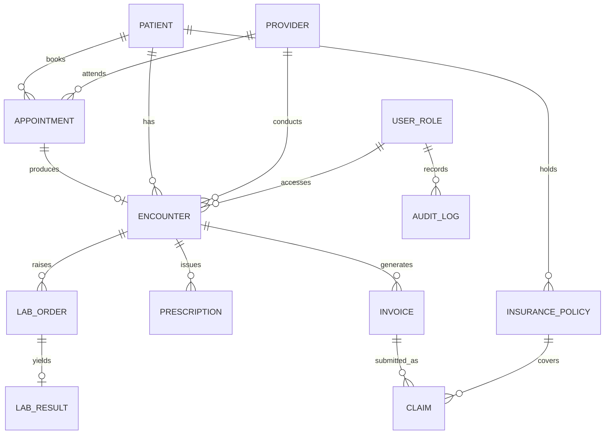

# Assignment 1 — CSE3102

**Source:** `raw/sources/Assignment_1.pdf` · 15 questions, all compulsory ·
handwritten, scanned to LMS **04 Sep 2026**, hard copy **07 Sep 2026** · no
extensions.

> [!warning] This is coursework, not a PYQ — it does **not** feed [[weightage]]
> Rule 2: marks distribution comes from the exam papers in `raw/sources/` and
> from nothing else. An assignment is not a sitting of the exam, so no
> `pyq_marks` field on any topic page changes because of this page. What it *is*
> is the best evidence yet of **what your instructor thinks is important**, and
> that is recorded below.

> [!tip] Rule 8, confirmed hard — three questions are deck questions with the numbers changed
> This assignment is the strongest validation the vault has produced of the rule
> that deck worked-examples become assessment questions:
> - **Q1** is the Agile deck's release-planning numerical with the numbers
>   changed (velocity 15-22 → 14-20, cost $50k → $48k, scope 58 → 53 ideal days).
> - **Q4** is the Agile deck's sprint-capacity question **verbatim** — same nine
>   stories, same task hours, same four team members, same day/hour figures.
> - **Q6** is COCOMO deck **Example 4.5 verbatim** — 400 KLOC, all three modes,
>   identical coefficients.
>
> All three are already worked in this vault, on [[Agile Development]] and
> [[Effort Estimation & COCOMO]]. **If you learn the deck's worked examples, you
> have already done a fifth of this assignment.**

## How to use this page

You said you want to learn by doing this. So every question below is laid out in
the same four parts, and **the third is the one to cover up**:

1. **Where it's from** — the source, and the topic page to revise first.
2. **Method** — how to attack it, before any numbers. Read this, then close the
   page and try it.
3. **Worked solution** — full steps, for checking yourself against afterwards.
4. **Watch for** — the specific trap this question sets.

*(No solution key exists for this assignment, so nothing here carries a `✓`. All
arithmetic has been independently recomputed; where a question is a deck example,
the answer is cross-checked against the deck's own printed figure.)*

## Notes — defects and scope flags

- **Q5(b) is incomplete as printed.** It reads *"Provide a Level 1 DFD by
  decomposing the following major processes:"* and then lists **nothing**. The
  colon dangles. This page assumes the six processes implied by the scenario's own
  wording (appointments, EMR encounters, lab orders/results, pharmacy dispensing,
  billing/insurance claims, reporting). **State that assumption in your answer** —
  an examiner cannot mark you down for a decomposition you justified from the
  prompt.
- **Q2 and Q3 ask for User Story Maps, which are out of the syllabus.** A sweep of
  all 24 decks finds no story mapping, and [[syllabus]] never names it — lectures
  9-11 give user stories only as an XP planning artifact. It is assessed
  coursework, so answer it; but **do not expect it in the MTE or End Term**, and
  do not spend revision time on it. Rule 1 governs scope; this is a rule-1 miss by
  the assignment, not a rule-5 gap in the vault.
- **Q12 goes beyond the vault's CMMI coverage.** [[SDLC & CMMI]] carries the five
  maturity levels; process areas and appraisal method are not in any deck. That
  part of the answer is standard CMMI material and is labelled unsourced.
- **Q10 gives four salaries for five people.** The two senior developers share the
  ₹70,000 figure. Say so in your answer.
- **No marks are printed** on any question, so this page has no marks
  reconciliation.

## Question map

| Q | What it asks | Topic | Source |
|---|---|---|---|
| 1 | Release duration and cost from velocity | [[Agile Development]] | **deck, numbers changed** |
| 2 | User story map — mobile banking | [[Agile Development]] | **out of syllabus** |
| 3 | User story map — e-commerce | [[Agile Development]] | **out of syllabus** |
| 4 | Sprint commitment from capacity | [[Agile Development]] | **deck, verbatim** |
| 5 | Context DFD, Level-1 DFD, ERD — clinic | [[Flow-Oriented Modeling & DFD]] · [[Data Modeling & ERD]] | scenario, new |
| 6 | Basic COCOMO, 400 KLOC, three modes | [[Effort Estimation & COCOMO]] | **deck Ex 4.5 verbatim** |
| 7 | Functional vs non-functional; sprint's value | [[Requirements Engineering]] · [[Agile Development]] | scenario, new |
| 8 | Waterfall vs Agile, and recommend one | [[Conventional Process Models]] · [[Agile Development]] | scenario, new |
| 9 | Basic COCOMO embedded + cost + manpower | [[Effort Estimation & COCOMO]] | deck Ex 4.6 form |
| 10 | FP → effort → project cost | [[Software Size Estimation]] | deck cost-question form |
| 11 | (i) organic COCOMO duration (ii) L1/L2 break-even | [[Effort Estimation & COCOMO]] · [[Software Size Estimation]] | (ii) is a classic GATE item |
| 12 | Conduct a CMMI assessment | [[SDLC & CMMI]] | partly beyond vault |
| 13 | Halstead metrics, full derivation | [[Software Size Estimation]] | textbook-standard |
| 14 | Unadjusted Function Points | [[Software Size Estimation]] | deck Ex 4.1-4.3 form |
| 15 | Context + Level-1 DFD — library | [[Flow-Oriented Modeling & DFD]] | scenario, new |

**Concentration:** 6 of 15 questions are [[Software Size Estimation]] or
[[Effort Estimation & COCOMO]]; 5 are [[Agile Development]]. Those three pages
carry 11 of the 15.

---

## Q1 · Release planning — duration and cost

> **Question 1.** A team is doing release planning, and they decide the next
> release will include all stories from Story 1 to Story 11 listed below.
> - The velocity range to be used for release planning is **14–20 ideal days per
>   iteration**.
> - The team works in a **2-week iteration**.
> - It costs **$48,000 per iteration** to fund the entire team.
>
> **Calculate the estimated duration for the next release (in iterations and
> weeks). Additionally, how much will this release cost?**
>
> Prioritized Product Backlog (estimates in ideal days):
>
> | Story Title | S1 | S2 | S3 | S4 | S5 | S6 | S7 | S8 | S9 | S10 | S11 |
> |---|---|---|---|---|---|---|---|---|---|---|---|
> | **Estimate (in ideal days)** | 4 | 6 | 5 | 3 | 7 | 2 | 5 | 6 | 4 | 8 | 3 |

**Where it's from.** `raw/sources/ppts/2025/L4 Print Questions Agile.pdf`, Q1,
with the numbers changed. Revise [[Agile Development]] subtopic 5; the original is
worked in that page's Question Bank as Deck Q1.

**Method.**
- Sum the story estimates to get total scope *P*.
- **Velocity is a range, so you compute twice** — once at each bound.
- *N* = ⌈*P* / *V*⌉. **Round up.** A partial iteration still occupies a whole one.
- Duration = *N* × iteration length. Cost = *N* × cost per iteration.
- **Report both bounds as a range.** The range is the question.

**Worked solution.**

**Given**

| Quantity | Symbol | Value |
|---|---|---|
| Story estimates S1-S11 | — | 4, 6, 5, 3, 7, 2, 5, 6, 4, 8, 3 ideal days |
| Velocity range | *V* | 14 to 20 ideal days per iteration |
| Iteration length | *L* | 2 weeks |
| Cost per iteration | *C* | $48,000 |
| **Find** | | duration in iterations and weeks, and total cost |

**Step 1 — total the release scope.**

4 + 6 + 5 + 3 + 7 + 2 + 5 + 6 + 4 + 8 + 3 = **53 ideal days**

**Step 2 — iterations at the optimistic (high) velocity, V = 20.**

*N* = ⌈53 / 20⌉ = ⌈2.65⌉ = **3 iterations**

**Step 3 — iterations at the pessimistic (low) velocity, V = 14.**

*N* = ⌈53 / 14⌉ = ⌈3.79⌉ = **4 iterations**

**Step 4 — duration.** 3 × 2 = **6 weeks** · 4 × 2 = **8 weeks**

**Step 5 — cost.** 3 × $48,000 = **$144,000** · 4 × $48,000 = **$192,000**

> **Answer: 3 to 4 iterations — 6 to 8 weeks — costing $144,000 to $192,000.**

**Watch for.**
- **Rounding down.** 2.65 → 3, not 2.
- **Giving one number.** Two velocities, two answers, every time.
- Reporting iterations but forgetting to convert to weeks — the question asks for
  both explicitly.

---

## Q2 · User story map — mobile banking

> **Question 2.** Consider the following mobile banking application requirements:
> - Login using portal account
> - View account balance
> - Deposit cheques
> - Check offers and promotions
> - Take pictures of cheques
> - Enter cheque details
> - Select account
> - Verify image with details
> - Print receipt
>
> **Create a User Story Map by organizing these requirements into:**
> - User Activities
> - User Tasks
> - User Stories
> - Priorities
> - Release 1 and Release 2.

**Where it's from.** The scenario is new. **The technique is out of syllabus** —
see the scope flag above. Nearest vault content: user stories on
[[Agile Development]] subtopic 3 (XP planning), and requirement types on
[[Requirements Engineering]].

**Method.**
- A story map is a **grid, not a list**. Two axes:
  - **Horizontal — the backbone:** user *activities* in the order a user does
    them, left to right. Under each, the *tasks* that make it up.
  - **Vertical — priority:** the most essential story sits at the top of each
    column; less essential ones hang below.
- **Slice horizontally to get releases.** Release 1 is the top slice all the way
  across — the thinnest thing that still works end to end (a *walking skeleton*).
- **Test your Release 1:** can a user complete a whole journey with only those
  stories? If not, the slice is wrong.
- Classify each of the nine given requirements as an activity or a task before
  drawing anything.

**Worked solution.**

**Step 1 — sort the nine requirements.** Four are user-level activities; five are
tasks belonging to the *Deposit cheques* activity.

| Backbone → | **Access Account** | **View Finances** | **Deposit Cheque** | **Explore Offers** |
|---|---|---|---|---|
| **Tasks** | Login using portal account | View account balance | Select account · Take pictures of cheques · Enter cheque details · Verify image with details · Print receipt | Check offers and promotions |

**Step 2 — write each task as a user story, priority ordered top to bottom.**

| Priority | Access Account | View Finances | Deposit Cheque | Explore Offers |
|---|---|---|---|---|
| **1 (must)** | As a customer, I want to **log in with my portal account** so that I can access my banking securely. | As a customer, I want to **view my account balance** so that I know my available funds. | As a customer, I want to **select an account** so that the cheque is credited to the right one. | — |
| **2 (must)** | — | — | As a customer, I want to **take a picture of the cheque** so that I can deposit without visiting a branch. | — |
| **3 (must)** | — | — | As a customer, I want to **enter cheque details** so that the deposit is recorded accurately. | — |
| **4 (should)** | — | — | As a customer, I want the app to **verify the image against the details** so that errors are caught before submission. | — |
| **5 (could)** | — | — | As a customer, I want to **print a receipt** so that I have proof of deposit. | As a customer, I want to **check offers and promotions** so that I can benefit from new products. |

**Step 3 — slice into releases.**

| Release | Stories | Why this slice |
|---|---|---|
| **Release 1 — walking skeleton** | Login · View balance · Select account · Take picture · Enter cheque details | The thinnest end-to-end journey: a customer can log in, see their money, and **complete a deposit**. Every activity in the backbone except Offers is represented. |
| **Release 2** | Verify image with details · Print receipt · Check offers and promotions | Enhancements. Verification hardens an already-working deposit; receipt and offers add convenience and cross-sell. Removing any of them still leaves a usable product. |

**Watch for.**
- **Drawing a flat backlog list.** The marks are for the *two-dimensional*
  structure — activities across, priority down, releases as horizontal slices.
- **Putting a whole activity in Release 2.** A release slice should cut across
  the backbone, not lop a column off it.
- **Stories without the "so that" clause.** The template is *As a &lt;role&gt;, I
  want &lt;goal&gt; so that &lt;benefit&gt;.* The benefit clause is what makes it
  a story rather than a task.

---

## Q3 · User story map — e-commerce

> **Question 3: E-Commerce / Online Shopping App.**
>
> **User Activities**
> 1. User Registration & Login
> 2. Search Products
> 3. Product Selection
> 4. Shopping Cart
> 5. Payment
> 6. Order Tracking
>
> **User Tasks**
>
> | Activity | User Tasks |
> |---|---|
> | Registration & Login | Register, Login, Forgot Password |
> | Search Products | Search, Filter, Sort |
> | Product Selection | View Product, View Reviews, Select Size/Color |
> | Shopping Cart | Add to Cart, Change Quantity, Remove Item |
> | Payment | Select Payment Method, Enter Details, Confirm Payment |
> | Order Tracking | View Order, Track Shipment, Cancel Order |
>
> **User Stories**
> - As a customer, I want to **register an account** so that I can place orders.
> - As a customer, I want to **search for products** so that I can find what I need.
> - As a customer, I want to **add products to my cart** so that I can purchase them later.
> - As a customer, I want to **make online payment** so that I can complete my purchase.
> - As a customer, I want to **track my order** so that I know its delivery status.
>
> **Releases**
> **Release 1 – MVP:** Registration/Login · Search products · Product details ·
> Add to cart · Payment
> **Release 2:** Reviews · Wishlist · Advanced filters · Order tracking
>
> **Create a User Story Map by organizing these requirements.**

**Where it's from.** The scenario is new and **the question hands you the
answer's raw material** — activities, tasks, stories and both releases are all
printed. The only work is *organising* them into the map. Same scope flag as Q2.

**Method.**
- Nothing to invent. Take the six given activities as the backbone, drop the given
  tasks under them, place the given stories, then draw the two given release
  slices as horizontal lines.
- The one judgement call: the printed release lists mention items (Reviews,
  Wishlist, Advanced filters) that are **tasks, not activities** — put them under
  the right column.

**Worked solution.**

**The map** — backbone across the top, tasks and stories beneath, release
boundary as a horizontal cut:

| Backbone → | **Registration & Login** | **Search Products** | **Product Selection** | **Shopping Cart** | **Payment** | **Order Tracking** |
|---|---|---|---|---|---|---|
| **Tasks** | Register · Login · Forgot Password | Search · Filter · Sort | View Product · View Reviews · Select Size/Color | Add to Cart · Change Quantity · Remove Item | Select Payment Method · Enter Details · Confirm Payment | View Order · Track Shipment · Cancel Order |
| **RELEASE 1 — MVP** | Register · Login | Search | View Product · Select Size/Color | Add to Cart · Change Quantity | Select Payment Method · Enter Details · Confirm Payment | — |
| **RELEASE 2** | Forgot Password | Filter · Sort (advanced filters) | View Reviews · Wishlist | Remove Item | — | View Order · Track Shipment · Cancel Order |

**The five given user stories, mapped to columns:**

| Story | Column | Release |
|---|---|---|
| As a customer, I want to **register an account** so that I can place orders. | Registration & Login | 1 |
| As a customer, I want to **search for products** so that I can find what I need. | Search Products | 1 |
| As a customer, I want to **add products to my cart** so that I can purchase them later. | Shopping Cart | 1 |
| As a customer, I want to **make online payment** so that I can complete my purchase. | Payment | 1 |
| As a customer, I want to **track my order** so that I know its delivery status. | Order Tracking | 2 |

**Reading the map.** Release 1 spans five of the six activities and stops short of
Order Tracking — which is coherent, because a customer can register, find a
product, buy it and pay before any tracking exists. **Release 1 is a complete
purchase journey; Release 2 adds everything that improves it but is not required
to transact.**

**Watch for.**
- **Re-deriving what was given.** The activities, tasks, stories and releases are
  printed. Marks here are for structure and for the *reading* of the slice.
- **Leaving Order Tracking out of the backbone** because it is a Release 2 item.
  The backbone is the whole product; the release line cuts through it.

---

## Q4 · Sprint commitment from capacity

> **Question 4.** Your team is planning out the next sprint. You've chosen to
> fill the sprint by taking stories in priority order from the product backlog and
> **stopping when you reach the first story that won't fit** in the sprint. Based
> on following details, which stories should the team commit to for a sprint?
>
> **Table 1:** Prioritized story with estimated story points and total estimate in
> hrs of tasks for that story.
>
> | Story | Story Points | Total of Tasks Estimates |
> |---|---|---|
> | Story 1 | 5 | 16 hrs |
> | Story 2 | 8 | 16 hrs |
> | Story 3 | 5 | 24 hrs |
> | Story 4 | 3 | 16 hrs |
> | Story 5 | 13 | 32 hrs |
> | Story 6 | 8 | 26 hrs |
> | Story 7 | 5 | 8 hrs |
> | Story 8 | 8 | 15 hrs |
> | Story 9 | 5 | 12 hrs |
>
> **Table 2:** Capacity of Team members for given sprint
>
> | Name | # days available | Hours / day | Capacity (hrs) *You compute this* |
> |---|---|---|---|
> | John | 3 | 4-5 | |
> | Matt | 5 | 2-3 | |
> | Sally | 5 | 4-5 | |
> | Ram | 5 | 2-3 | |

**Where it's from.** `raw/sources/ppts/2025/L4 Print Questions Agile.pdf`, Q2 —
**verbatim, identical numbers**. Worked in [[Agile Development]]'s Question Bank
as Deck Q2. If you do one thing before submitting, do this one from memory.

**Method.**
- **Capacity is in hours; commitment is decided in hours.** Story points are a
  distraction here — they are reported, not used for the stopping rule.
- Per person: capacity = days available × hours per day. Hours/day is a **range**,
  so each person yields a low and a high.
- Sum for team capacity as a range; take the midpoint as your working figure.
- Walk the backlog **in priority order**, accumulating task hours, and **stop at
  the first story that does not fit.**

**Worked solution.**

**Given:** nine prioritised stories with points and task-hour totals; four team
members with days available and an hours/day range. **Find:** team capacity and
the stories to commit to.

**Step 1 — each member's capacity as a range.**

| Member | Days | Hrs/day | Low | High |
|---|---|---|---|---|
| John | 3 | 4-5 | 3 × 4 = 12 | 3 × 5 = 15 |
| Matt | 5 | 2-3 | 5 × 2 = 10 | 5 × 3 = 15 |
| Sally | 5 | 4-5 | 5 × 4 = 20 | 5 × 5 = 25 |
| Ram | 5 | 2-3 | 5 × 2 = 10 | 5 × 3 = 15 |
| **Team total** | | | **52 hrs** | **70 hrs** |

**Midpoint capacity = (52 + 70) / 2 = 61 hrs.**

**Step 2 — accumulate task hours in priority order.**

| After story | Task hrs | Cumulative hrs | Cumulative points |
|---|---|---|---|
| Story 1 | 16 | 16 | 5 |
| Story 2 | 16 | 32 | 13 |
| Story 3 | 24 | **56** | 18 |
| Story 4 | 16 | 72 | 21 |

**Step 3 — apply the stopping rule at each bound.**

- **Conservative, 52 hrs:** Stories 1-2 fit at 32 hrs. Story 3 would reach 56 > 52
  → stop. **Commit Stories 1-2** (32 hrs, 13 points).
- **Midpoint, 61 hrs:** Stories 1-3 fit at 56 hrs. Story 4 would reach 72 > 61
  → stop. **Commit Stories 1-3** (56 hrs, 18 points).
- **Optimistic, 70 hrs:** Stories 1-3 still fit at 56 hrs. Story 4 reaches 72 > 70
  → stop. **Commit Stories 1-3.**

> **Answer: commit to Stories 1, 2 and 3 — 56 hours of tasks against a team
> capacity of 52-70 hours (midpoint 61), totalling 18 story points.** Story 4
> would require 72 hours, exceeding even the optimistic bound. A team planning
> strictly to the conservative 52-hour figure commits only Stories 1 and 2.

**Watch for.**
- **Committing by story points.** The rule compares **task hours** to capacity.
- **Forgetting John has only 3 days.** Every other member has 5. That asymmetry is
  the arithmetic the question is checking.
- **Not stating the range.** Give capacity as 52-70 and say which bound you
  planned to.

---

## Q5 · Clinic Management System — DFDs and ERD

> **Question 5.** Smart Health Clinic is deploying an integrated Clinic
> Management System that must handle appointments, EMR encounters, lab
> orders/results, pharmacy dispensing, billing/insurance claims, and reporting
> while ensuring privacy, role-based access, audit trails, and interoperability.
> Daily visits range from 600–800 with peak walk-ins.
>
> **(a)** Draw a Level 0 Context DFD identifying all external entities
> **(b)** Provide a Level 1 DFD by decomposing the following major processes:
> **(c)** Draft an ERD (entities, keys, relationships) for core concepts such as
> Patient, Provider, Appointment, Encounter, Lab Order, Lab Result, Prescription,
> Invoice, Claim, Insurance Policy, User/Role, Audit Log.

*(Part (b) ends at the colon — nothing is listed. See Notes.)*

**Where it's from.** New scenario. Revise [[Flow-Oriented Modeling & DFD]] for
(a) and (b), [[Data Modeling & ERD]] for (c). **Part (b) is defective as printed**
— see Notes.

**Method.**
- **(a) Context diagram:** exactly **one** process bubble, numbered 0, named for
  the whole system. Every external entity that gives or takes data sits outside
  it. **No data stores appear at level 0** — that is the commonest error.
- **(b) Level 1:** open bubble 0 into numbered processes (1.0, 2.0…), add the data
  stores, and **balance** — every flow crossing the context boundary must also
  cross the level-1 boundary, unchanged in name.
- **(c) ERD:** entity, primary key, then relationships with cardinality **at both
  ends**. Resolve any many-to-many into an associative entity.

**Worked solution.**

### (a) Level 0 — Context diagram

**Legend** (Yourdon/DeMarco, which the deck uses): **circle** = process ·
**rectangle** = external entity · **open-ended pair of lines** = data store (none
at level 0) · **named arrow** = data flow. Every arrow is labelled; unlabelled
arrows score nothing.

```
        Patient                                        Provider
           │  appointment request, demographics            │  clinical notes,
           │  ▲ appointment confirmation, invoice          │  ▼ orders, prescriptions
           ▼  │                                            │  ▲ schedule, patient chart
     ┌─────────────────────────────────────────────────────────────┐
     │                                                             │
     │                          0                                  │
Lab ─┤            CLINIC MANAGEMENT SYSTEM                         ├─ Pharmacy
     │                                                             │
     └─────────────────────────────────────────────────────────────┘
       ▲   │                        ▲   │                    ▲   │
       │   ▼                        │   ▼                    │   ▼
   lab order /                 claim /                  audit query /
   lab result              remittance advice            audit report
                                 │                            │
                          Insurance Payer            Clinic Administrator
```

**External entities — six:** Patient · Provider (clinician) · Laboratory ·
Pharmacy · Insurance Payer · Clinic Administrator.

**Named flows, in and out:**

| Entity | Into the system | Out of the system |
|---|---|---|
| Patient | appointment request, demographics, consent | appointment confirmation, invoice, receipt |
| Provider | clinical notes, lab orders, prescriptions | daily schedule, patient chart, lab results |
| Laboratory | lab result | lab order |
| Pharmacy | dispense confirmation | prescription |
| Insurance Payer | eligibility response, remittance advice | insurance claim |
| Clinic Administrator | report request, role assignment | management report, audit report |

### (b) Level 1 — decomposition

**Assumption stated** (the question lists no processes): decomposed into the six
processes the scenario's own wording names.

| # | Process | Reads / writes |
|---|---|---|
| 1.0 | Manage Appointments | D1 Patient, D2 Appointment |
| 2.0 | Record Encounter (EMR) | D1 Patient, D3 Encounter |
| 3.0 | Process Lab Orders & Results | D3 Encounter, D4 Lab |
| 4.0 | Dispense Pharmacy | D3 Encounter, D5 Prescription |
| 5.0 | Billing & Claims | D6 Invoice/Claim, D1 Patient |
| 6.0 | Reporting & Audit | D7 Audit Log, D8 User/Role, all stores (read only) |

**Data stores — eight:** D1 Patient · D2 Appointment · D3 Encounter/EMR ·
D4 Lab Order & Result · D5 Prescription · D6 Invoice & Claim · D7 Audit Log ·
D8 User/Role.

```
 Patient ──appointment request──►( 1.0 Manage      )──appointment──►[ D2 Appointment ]
                                 ( Appointments    )
                                        │ booked visit
                                        ▼
 Provider ──clinical notes──────►( 2.0 Record      )──encounter record──►[ D3 Encounter ]
           ◄──patient chart──────( Encounter       )
                                    │        │
                     lab order      │        │   prescription
                                    ▼        ▼
                       ( 3.0 Process Lab )  ( 4.0 Dispense )──prescription──► Pharmacy
   Lab ◄──lab order────(  Orders/Results )  ( Pharmacy     )◄─dispense conf.─
       ──lab result───►(                 )         │
                                │ result           │ dispensed item
                                ▼                  ▼
                          [ D4 Lab ]        [ D5 Prescription ]
                                                   │
                        billable items ────────────┘
                                    ▼
 Patient ◄──invoice─────────────( 5.0 Billing  )──claim──► Insurance Payer
                                ( & Claims     )◄─remittance advice──
                                       │
                                       ▼
                             [ D6 Invoice/Claim ]

 Administrator ──report request──►( 6.0 Reporting )──management report──► Administrator
                                  ( & Audit       )──audit report──►
                                        ▲   │
                          [ D8 User/Role ]  ▼
                                     [ D7 Audit Log ]
```

**Reading, and the rule it must satisfy.**
- The diagram asserts that clinical work flows **appointment → encounter → orders
  → billing**, with reporting reading across every store rather than sitting in
  that chain.
- **Balance check:** all twelve context-level flows reappear here — patient's
  request and confirmation on 1.0, provider's notes and chart on 2.0, lab order
  and result on 3.0, prescription and confirmation on 4.0, invoice, claim and
  remittance on 5.0, report request and reports on 6.0. **Nothing new crosses the
  boundary, and nothing has gone missing. That is what makes the pair correct.**
- Privacy, role-based access and audit trails are realised by **D8 User/Role**
  gating access and **D7 Audit Log** written by every process — say this in words;
  a DFD cannot express it as notation.

### (c) ERD

**Legend** (crow's foot): `||` = exactly one · `}o` = zero or many · `}|` = one or
many. Primary keys marked **PK**, foreign keys **FK**.



| Entity | PK | Key attributes | FKs |
|---|---|---|---|
| PATIENT | patient_id | name, DOB, gender, contact, address | — |
| PROVIDER | provider_id | name, specialty, licence_no | — |
| APPOINTMENT | appointment_id | datetime, status, type (booked/walk-in) | patient_id, provider_id |
| ENCOUNTER | encounter_id | datetime, chief_complaint, diagnosis, notes | patient_id, provider_id, appointment_id |
| LAB_ORDER | lab_order_id | test_code, ordered_on, priority | encounter_id |
| LAB_RESULT | lab_result_id | value, unit, reference_range, reported_on | lab_order_id |
| PRESCRIPTION | prescription_id | drug, dose, frequency, duration, dispensed_flag | encounter_id |
| INVOICE | invoice_id | date, line_items, total, balance | encounter_id, patient_id |
| CLAIM | claim_id | submitted_on, status, amount_claimed, amount_paid | invoice_id, policy_id |
| INSURANCE_POLICY | policy_id | payer_name, plan, valid_from, valid_to | patient_id |
| USER_ROLE | user_id | username, role, permissions | — |
| AUDIT_LOG | audit_id | timestamp, action, entity_touched, ip | user_id |

**Reading.** A patient books many appointments; each appointment yields **at most
one** encounter (`||--o|` — a no-show yields none); an encounter raises many lab
orders, each yielding at most one result. The **many-to-many between patient and
provider is resolved** through APPOINTMENT and ENCOUNTER rather than drawn
directly. AUDIT_LOG hangs off USER_ROLE because the audit trail records *who did
what*, satisfying the scenario's audit requirement.

**Watch for.**
- **Data stores in the context diagram.** There are none. Level 0 is one bubble
  and the outside world.
- **Unbalanced levels.** Every context flow must reappear at level 1.
- **Unlabelled arrows or missing cardinality.** [[Data Modeling & ERD]] is graded
  on notation — put a marker at **both** ends of every relationship.
- **Forgetting that 600-800 daily visits is a non-functional requirement**, not a
  DFD element. Mention it as a performance constraint; do not try to draw it.

---

## Q6 · Basic COCOMO — 400 KLOC, three modes

> **Question 6.** A project size of **400000 LOC** is to be developed. Analyze
> and evaluate the effort and development time for organic, semi-detached &
> embedded modes of development from the provided values.
>
> (Note: **Organic**: a<sub>b</sub> = 2.4, b<sub>b</sub> = 1.05, c<sub>b</sub> =
> 2.5, d<sub>b</sub> = .38; **Semidetached**: a<sub>b</sub> = 3.0, b<sub>b</sub> =
> 1.12, c<sub>b</sub> = 2.5, d<sub>b</sub> = .35; **Embedded**: a<sub>b</sub> =
> 3.6, b<sub>b</sub> = 1.20, c<sub>b</sub> = 2.5, d<sub>b</sub> = .32)

**Where it's from.** `raw/sources/ppts/2025/L7 Software Project planning_6.pdf`
**Example 4.5, verbatim** — same size, same three modes, same coefficients.
Already worked in [[Effort Estimation & COCOMO]]'s Question Bank; the figures
below match the deck's printed answers.

**Method.**
- **Convert LOC to KLOC first.** 400000 LOC = 400 KLOC. Using 400000 inflates the
  answer by roughly 4000×.
- *E* = *a* × KLOC<sup>*b*</sup> in person-months.
- *D* = *c* × *E*<sup>*d*</sup> in months — note **duration is a function of
  effort, not of size**.
- Run all three modes with their own coefficient pairs, then **compare**.

**Worked solution.**

**Given**

| Quantity | Symbol | Value |
|---|---|---|
| Size | KLOC | 400000 LOC = **400 KLOC** |
| Organic | *a*, *b*, *c*, *d* | 2.4, 1.05, 2.5, 0.38 |
| Semi-detached | *a*, *b*, *c*, *d* | 3.0, 1.12, 2.5, 0.35 |
| Embedded | *a*, *b*, *c*, *d* | 3.6, 1.20, 2.5, 0.32 |
| **Find** | | effort and development time in each mode |

> **How to raise to a fractional power by hand.** log₁₀(400) = 2.60206.
> Multiply by the exponent, then take the antilog. Show this working — it is
> method marks.

**Step 1 — Organic** (*a* = 2.4, *b* = 1.05, *c* = 2.5, *d* = 0.38).

*Effort.*
(400)<sup>1.05</sup> : 2.60206 × 1.05 = 2.732163 → antilog = **539.71**
*E* = 2.4 × 539.71 = **1295.31 PM**

*Duration.*
(1295.31)<sup>0.38</sup> : log₁₀(1295.31) = 3.11237 → 3.11237 × 0.38 = 1.182702
→ antilog = **15.23**
*D* = 2.5 × 15.23 = **38.08 months**

**Step 2 — Semi-detached** (*a* = 3.0, *b* = 1.12, *c* = 2.5, *d* = 0.35).

*Effort.*
(400)<sup>1.12</sup> : 2.60206 × 1.12 = 2.914307 → antilog = **820.93**
*E* = 3.0 × 820.93 = **2462.80 PM**

*Duration.*
(2462.80)<sup>0.35</sup> : log₁₀(2462.80) = 3.39143 → 3.39143 × 0.35 = 1.187000
→ antilog = **15.38**
*D* = 2.5 × 15.38 = **38.45 months**

**Step 3 — Embedded** (*a* = 3.6, *b* = 1.20, *c* = 2.5, *d* = 0.32).

*Effort.*
(400)<sup>1.20</sup> : 2.60206 × 1.20 = 3.122472 → antilog = **1325.78**
*E* = 3.6 × 1325.78 = **4772.81 PM**

*Duration.*
(4772.81)<sup>0.32</sup> : log₁₀(4772.81) = 3.67877 → 3.67877 × 0.32 = 1.177208
→ antilog = **15.04**
*D* = 2.5 × 15.04 = **37.60 months**

**Step 4 — compare, because the question says *analyze and evaluate*.**

| Mode | Effort (PM) | Time (months) | Avg staff = E/D |
|---|---|---|---|
| Organic | 1295.31 | 38.08 | ≈ 34 persons |
| Semi-detached | 2462.80 | 38.45 | ≈ 64 persons |
| Embedded | 4772.81 | 37.60 | ≈ 127 persons |

> **Answer.** Effort rises from 1295 to 4773 PM — a factor of **3.7** — while
> **development time stays near 38 months in all three modes**. The mode changes
> how many *people* you need far more than how *long* the project takes. Say this
> explicitly; it is the insight the question's "evaluate" is asking for.

**Watch for.**
- **Not dividing by 1000.** The single most expensive error available here.
- **Computing D from KLOC instead of from E.** *D* takes **effort** as its input.
- **Answering with three numbers and no comparison.** "Analyze and evaluate"
  wants the staffing conclusion.

---

## Q7 · Loan system — requirements and sprints

> **Question 7.** A bank's online loan system must allow applications, verify
> credit scores, approve loans within 24 hour, and ensure 99.9 % uptime.
>
> **a.** List one functional and one non-functional requirement.
> **b.** How Sprint contributes to the success of the Agile project?

**Where it's from.** New scenario. (a) is [[Requirements Engineering]] subtopic 2;
(b) is [[Agile Development]] subtopic 2, and is answered almost word for word by
the newly-read Pressman Chapter 4 deck (`L3 Agile Development models.pdf`, p. 118).

**Method.**
- **(a)** Functional = *what the system does*, phrased as input → process →
  output. Non-functional = *how well*, and is **measurable**. The scenario hands
  you both: pick one of each and quote its number.
- **(b)** Answer through the sprint's defining property — it is a **fixed time
  box with frozen scope**. Every benefit follows from that.

**Worked solution.**

### (a) One functional, one non-functional

| Type | Requirement | Why it is this type |
|---|---|---|
| **Functional** | "The system shall allow a customer to **submit a loan application** and shall **verify the applicant's credit score** before approval." | Describes a **behaviour** — input (application), process (credit verification), output (decision). Its absence means a feature is missing. |
| **Non-functional** | "The system shall **approve loans within 24 hours** and shall maintain **99.9% uptime**." | Describes a **quality attribute** — performance and availability. The feature can be fully present and this can still fail. It is **measurable**, which is what makes it verifiable. |

**Add one line for the marks:** miss the functional requirement and a capability
is absent; miss the non-functional one and every capability is present but the
system is still rejected at acceptance.

### (b) How the sprint contributes to Agile success

- **It time-boxes the work.** A sprint is a fixed period, typically 30 days, and
  **the date never moves** — when work does not fit, *scope* gives. That single
  rule is what makes an adaptive process plannable.
- **Backlog items are frozen for its duration.** The deck's own phrasing: during
  the sprint "the backlog items that the sprint work units address are frozen,"
  which "allows team members to work in a short-term, but stable environment."
  **Agile absorbs change between sprints, not inside them** — that is how it stays
  adaptive without becoming chaotic.
- **It forces a working increment.** Each sprint ends in a demonstrable
  increment, so progress is measured in software rather than in reports.
- **It creates a feedback loop.** The customer sees and evaluates real output
  every cycle, so a misunderstanding costs one sprint rather than the project.
- **It yields velocity.** Completed points per sprint are measured, not promised,
  which is what makes the release forecasting in Q1 possible at all.
- **It builds in inspection and adaptation** — daily scrum, sprint review and
  retrospective all hang off the sprint boundary.

**Watch for.**
- **Giving two functional requirements.** Uptime and the 24-hour limit are the
  non-functional ones; the application and credit-check behaviour is the
  functional one.
- **Writing an unverifiable requirement.** "The system should be fast" earns
  nothing — "within 24 hours" is the version that can be tested.
- **Answering (b) with a description of Scrum.** The question asks what the
  *sprint* contributes. Lead with the time box and the frozen scope.

---

## Q8 · Waterfall vs Agile for an Online Banking System

> **Question 8.** A bank has decided to launch a new Online Banking System that
> will allow customers to manage their accounts, transfer funds, check balances,
> and more. The system must be highly secure, user-friendly, and scalable. The
> project needs to be completed in 12 months. The project team must choose between
> two SDLC methodologies: Waterfall and Agile. Both methods have their strengths,
> and stakeholders are uncertain about which approach would work best for this
> high-priority system.
>
> **(i)** Compare and contrast the Waterfall and Agile methodologies in the
> context of developing the Online Banking System.
> **(ii)** Which methodology would you recommend for this project? Justify your
> answer with reasons, considering factors like timeline, customer feedback, and
> regulatory changes.

**Where it's from.** New scenario, classic form. Revise
[[Conventional Process Models]] subtopic 1 and [[Agile Development]] subtopic 1;
the selection logic is the comparison table on [[Evolutionary Process Models]].

**Method.**
- **(i) Compare in the context given** — not in the abstract. Every row of your
  table should mention banking: security, regulation, 12 months, scalability.
- **(ii) Recommend one and commit.** A fence-sitting answer loses marks. Justify
  against the three factors the question names — **timeline, customer feedback,
  regulatory changes** — and then concede what your choice costs.

**Worked solution.**

### (i) Comparison in context

| Dimension | Waterfall | Agile | For this bank |
|---|---|---|---|
| Requirements | frozen up front; change is costly | expected to evolve each sprint | Balance/transfer rules are stable, but UX and compliance rules are not |
| Delivery | single big-bang at ~month 12 | working increment every 2-4 weeks | Agile gives a usable product long before month 12 |
| Customer feedback | at the start and at acceptance only | continuous, every sprint | "User-friendly" cannot be validated without users seeing it |
| Regulatory change | a change mid-project forces rework of every downstream phase | absorbed into the next sprint's backlog | Banking regulation shifts within a 12-month window |
| Documentation | comprehensive; a contract and an audit trail | lighter; working software preferred | Banking **needs** the audit trail — Agile's weak point here |
| Risk of being wrong | discovered late, at acceptance | discovered each sprint | Late discovery on a high-priority system is the expensive failure |
| Security & scalability | designed once, up front | must be engineered continuously, not "sprinted later" | Neither model does this for free |

### (ii) Recommendation — **Agile**, with a disciplined documentation overlay

**Justify against the three named factors:**

1. **Timeline (12 months).** Waterfall delivers nothing until near the end, so a
   slip anywhere leaves the bank with no product at all. Agile delivers a working
   increment every few weeks, so at month 12 there is *certainly* a usable system
   — the only question is how much of the backlog it covers. **Agile converts
   schedule risk into scope risk**, which is the safer trade for a fixed date.
2. **Customer feedback.** "User-friendly" is a non-functional requirement that
   **cannot be specified accurately in advance** — it can only be validated by
   users touching the product. Waterfall's single feedback point at acceptance is
   exactly the wrong shape for it.
3. **Regulatory changes.** Compliance rules will move inside a 12-month window. In
   Waterfall a late regulatory change forces rework of requirements, design, code
   and tests. In Agile it is a backlog item for the next sprint. **This factor
   alone is decisive.**

**Concede the cost, and mitigate it.** Agile's thin documentation is a genuine
problem for a regulated bank that needs auditability. So recommend Agile **with**:
maintained architecture and security documentation as a *definition of done*, a
security review as an umbrella activity in every sprint, and compliance
acceptance criteria attached to each story. That is the hybrid a real bank runs,
and saying so demonstrates you understand the trade rather than reciting a
preference.

**Watch for.**
- **Comparing in the abstract.** Every claim should touch this bank.
- **Refusing to choose.** Part (ii) says *recommend*.
- **Claiming Agile has no documentation.** It has less, by priority — "working
  software **over** comprehensive documentation" is a preference, not a
  prohibition. Getting this wrong is the classic error on
  [[Agile Development]].

---

## Q9 · Basic COCOMO — embedded, 4000 LOC, with cost and manpower

> **Question 9.** A company is developing digital signal processing software for
> one of its latest inventions. The estimated size of the software is **4000 lines
> of code (LOC)**. The company plans to use the **Basic COCOMO** model for cost
> estimation, and the project falls under the **embedded** category. The model
> parameters are given as: **a = 3.6, b = 1.20, c = 2.5, and d = 0.32**, the
> average cost per person-month is **₹50,000**. Using this information, calculate
> the following:
>
> **(i)** Effort Estimation  **(iii)** Time Estimation
> **(ii)** Cost Estimation  **(iv)** Manpower Estimation

**Where it's from.** New numbers, same four-part form as deck Example 4.6 on
[[Effort Estimation & COCOMO]] (which asks effort, time, staff size and
productivity). This one swaps productivity for cost.

**Method.**
- 4000 LOC = **4 KLOC**.
- *E* = *a* KLOC<sup>*b*</sup> → *D* = *c E*<sup>*d*</sup> → cost = *E* × rate per
  PM → manpower = *E* / *D*.
- **The four parts chain.** Get *E* wrong and all four are wrong, so check it.

**Worked solution.**

**Given**

| Quantity | Symbol | Value |
|---|---|---|
| Size | KLOC | 4000 LOC = **4 KLOC** |
| Mode | — | embedded (stated) |
| Coefficients | *a*, *b*, *c*, *d* | 3.6, 1.20, 2.5, 0.32 |
| Cost per person-month | — | ₹50,000 |
| **Find** | | effort, cost, time, manpower |

**(i) Effort.**

*E* = *a* × (KLOC)<sup>*b*</sup> = 3.6 × (4)<sup>1.20</sup>

(4)<sup>1.20</sup> : log₁₀4 = 0.60206 → 0.60206 × 1.20 = 0.722472
→ antilog = **5.278**

*E* = 3.6 × 5.278 = **19.00 person-months**

**(ii) Cost.**

Cost = *E* × ₹50,000 = 19.00 × 50,000 = **₹9,50,000**

**(iii) Time.**

*D* = *c* × *E*<sup>*d*</sup> = 2.5 × (19.00)<sup>0.32</sup>

(19.00)<sup>0.32</sup> : log₁₀19 = 1.27875 → 1.27875 × 0.32 = 0.409201
→ antilog = **2.566**

*D* = 2.5 × 2.566 = **6.41 months**

**(iv) Manpower** — average staff size.

*N* = *E* / *D* = 19.00 / 6.41 = 2.96 ≈ **3 persons**

> **Answer: E = 19 PM · Cost = ₹9,50,000 · D = 6.41 months · Manpower ≈ 3 people.**

**Watch for.**
- **Person-months vs months.** 19 and 6.41 are different quantities with different
  units. A 19-month answer is the classic wrong one.
- **Manpower must be a plausible whole team.** 2.96 → 3 people. If your answer is
  0.4 or 300, your *E* or *D* is wrong.
- Cost uses **effort**, not duration.

---

## Q10 · Function points to project cost

> **Question 10.** A software project is estimated at **400 FP**. A team of five
> members (one project manager, two senior developers, one junior developer, and
> one tester) is assigned. Their monthly salaries are **₹90,000, ₹70,000, ₹50,000,
> and ₹45,000** respectively. The average productivity is **10 FP per
> person-month**. Calculate the total cost of the project.

**Where it's from.** New numbers; same form as the deck's FP-to-cost question
worked in [[Software Size Estimation]]'s Question Bank.

**Method.**
- **Effort comes from productivity:** effort (PM) = FP ÷ (FP per person-month).
- Then cost needs a **rate per person-month**. With five people on different
  salaries, compute the team's monthly cost and divide by five for the average.
- **Two routes reach the same answer** — use the second as your check.

**Worked solution.**

**Given**

| Quantity | Value |
|---|---|
| Size | 400 FP |
| Productivity | 10 FP per person-month |
| Team | 1 project manager, 2 senior developers, 1 junior developer, 1 tester |
| Salaries/month | ₹90,000 (PM) · ₹70,000 (**each** senior) · ₹50,000 (junior) · ₹45,000 (tester) |
| **Find** | total project cost |

> **Note the ambiguity, and resolve it in your answer:** four salary figures are
> given for five people. The two senior developers share the ₹70,000 rate.

**Step 1 — effort.**

Effort = 400 FP ÷ 10 FP/PM = **40 person-months**

**Step 2 — team cost per month.**

= 90,000 + (2 × 70,000) + 50,000 + 45,000
= 90,000 + 140,000 + 50,000 + 45,000 = **₹3,25,000 per month**

**Step 3 — average cost per person-month.**

= ₹3,25,000 ÷ 5 = **₹65,000 per PM**

**Step 4 — total cost.**

= 40 PM × ₹65,000 = **₹26,00,000**

**Cross-check by the other route.** Duration = 40 PM ÷ 5 people = 8 months.
Cost = 8 months × ₹3,25,000/month = **₹26,00,000**. ✔ Both routes agree, which is
what tells you the average-rate step was legitimate.

> **Answer: ₹26,00,000 (₹26 lakh), over an 8-month schedule with 40 person-months
> of effort.**

**Watch for.**
- **Counting ₹70,000 once.** There are **two** senior developers.
- **Multiplying 40 PM by the full team monthly cost.** That double-counts the team
  — ₹1.3 crore instead of ₹26 lakh. Person-months already account for headcount.
- Stating the answer without the ambiguity note.

---

## Q11 · Organic duration, and the L1/L2 break-even

> **Question 11.**
>
> **(i)** A simple stand-alone software utility is to be developed in 'C'
> programming by a team of software experts for a computer running Linux and the
> overall size of this software is estimated to be **20,000 lines of code**.
> Considering **(a, b) = (2.4, 1.05)** as multiplicative and exponential factor
> for the basic COCOMO effort estimation equation and **(c, d) = (2.5, 0.38)** as
> multiplicative and exponential factor for the basic COCOMO development time
> estimation equation, approximately how long does the software project take to
> complete?
>
> **(ii)** A company needs to develop a strategy for software product development
> for which it has a choice of two programming languages **L1** and **L2**. The
> number of lines of code (LOC) developed using **L2 is estimated to be twice** the
> LOC developed with L1. The product will have to be maintained for **five years**.
> Various parameters for the company are given in the table below.
>
> | Parameter | Language L1 | Language L2 |
> |---|---|---|
> | Man years needed for development | LOC/10000 | LOC/10000 |
> | Development cost per man year | Rs. 10,00,000 | Rs. 7,50,000 |
> | Maintenance time | 5 years | 5 years |
> | Cost of maintenance per year | Rs. 1,00,000 | Rs. 50,000 |
>
> Total cost of the project includes cost of development and maintenance. **What
> is the LOC for L1 for which the cost of the project using L1 is equal to the cost
> of the project using L2?**

**Where it's from.** (i) is standard basic COCOMO — [[Effort Estimation & COCOMO]]
subtopic 2. (ii) is a **classic GATE-style question**, not from any deck; its
machinery is the cost side of [[Software Size Estimation]].

### (i) How long does the utility take?

**Method.**
- **Identify the mode from the words**, since the question does not name it: "a
  simple stand-alone utility", "team of software experts", familiar environment →
  **organic**. The given (2.4, 1.05) confirms it.
- Effort first, then duration from effort. The question asks only for **how long**,
  so *D* is the answer — but show *E*, because *D* depends on it.

**Worked solution.**

**Given:** 20,000 LOC = **20 KLOC**; organic; (*a*, *b*) = (2.4, 1.05);
(*c*, *d*) = (2.5, 0.38). **Find:** development time.

**Step 1 — effort.**

*E* = 2.4 × (20)<sup>1.05</sup>

(20)<sup>1.05</sup> : log₁₀20 = 1.30103 → 1.30103 × 1.05 = 1.366081
→ antilog = **23.23**

*E* = 2.4 × 23.23 = **55.76 person-months**

**Step 2 — duration.**

*D* = 2.5 × (55.76)<sup>0.38</sup>

(55.76)<sup>0.38</sup> : log₁₀55.76 = 1.74629 → 1.74629 × 0.38 = 0.663591
→ antilog = **4.609**

*D* = 2.5 × 4.609 = **11.52 months**

> **Answer: approximately 11.5 months — call it about 12 months.**

**Watch for.** Reporting 55.76 as the answer. That is **effort**, not time. The
question says "how long", which is *D*.

### (ii) LOC for L1 at which the two languages cost the same

**Method.**
- **Let *L* = LOC for L1.** Then LOC for L2 = **2*L*** (given).
- Total cost = development + maintenance, for each language.
- Development cost = (LOC ÷ 10000) man-years × cost per man-year.
- Maintenance = 5 years × annual maintenance cost.
- **Set the two totals equal and solve for *L*.**

**Worked solution.**

**Given**

| Parameter | L1 | L2 |
|---|---|---|
| LOC | *L* | 2*L* |
| Man-years | *L*/10000 | 2*L*/10000 |
| Development cost per man-year | ₹10,00,000 | ₹7,50,000 |
| Maintenance | 5 years × ₹1,00,000 | 5 years × ₹50,000 |
| **Find** | | *L* such that total cost is equal |

**Step 1 — total cost using L1.**

Development = (*L*/10000) × 10,00,000 = **100*L***
Maintenance = 5 × 1,00,000 = **5,00,000**
Total<sub>L1</sub> = 100*L* + 5,00,000

**Step 2 — total cost using L2.**

Development = (2*L*/10000) × 7,50,000 = **150*L***
Maintenance = 5 × 50,000 = **2,50,000**
Total<sub>L2</sub> = 150*L* + 2,50,000

**Step 3 — set equal.**

100*L* + 5,00,000 = 150*L* + 2,50,000
5,00,000 − 2,50,000 = 150*L* − 100*L*
2,50,000 = 50*L*
*L* = **5,000 LOC**

**Step 4 — verify.**

L1: 100(5000) + 5,00,000 = 5,00,000 + 5,00,000 = **₹10,00,000**
L2: 150(5000) + 2,50,000 = 7,50,000 + 2,50,000 = **₹10,00,000** ✔

> **Answer: L = 5,000 LOC.** Below 5,000 LOC, L2's cheaper maintenance dominates
> and L2 wins; above it, L2's doubled code volume dominates and L1 wins.

**Watch for.**
- **Forgetting to double L2's LOC.** It is the whole point of the question.
- **Dropping maintenance.** Total cost is explicitly development **plus**
  maintenance over 5 years.
- Not verifying. Substituting back takes ten seconds and catches sign errors.

---

## Q12 · Conducting a CMMI assessment

> **Question 12.** A software organization is experiencing **frequent project
> delays, cost overruns, inconsistent development processes, and poor defect
> management**. Management decides to conduct a CMMI assessment.
>
> **As a CMMI assessment team member, explain how you would conduct the
> assessment.** Identify the process areas that should be investigated, the
> evidence that should be collected, and how the assessment results could be used
> to improve the organization's processes.

**Where it's from.** New scenario. The five maturity levels are on
[[SDLC & CMMI]] subtopic 3 — and note that the End Term's Q A2 was a CMMI
scenario too, so this is proven examinable territory.

> [!warning] Process areas and appraisal method are beyond the vault
> [[SDLC & CMMI]] carries the five levels only. No deck teaches CMMI process
> areas or the SCAMPI appraisal method, and Pressman 8e is not in
> `raw/sources/`. What follows is standard CMMI material, **labelled unsourced**.

**Method.**
- Answer in **four blocks, in the order the question asks:** how you conduct it ·
  which process areas · what evidence · how results are used.
- **Anchor every process area to a symptom in the scenario.** The scenario names
  four: delays, cost overruns, inconsistent processes, poor defect management.
  Marks come from that mapping, not from a recited list.
- Diagnose the current level and name the target.

**Worked solution.**

### Block 1 — How the assessment is conducted

1. **Define scope and objectives** — which projects, which units, and whether this
   is a benchmark appraisal or an internal gap analysis.
2. **Select the model and method** — CMMI for Development, staged representation
   (it yields a maturity level, which is what management is asking for); appraisal
   by the **SCAMPI** method.
3. **Train the team and prepare** — an appraisal team of trained members plus
   organisational representatives; issue questionnaires in advance.
4. **Collect data by three channels** — documents, interviews, and instruments
   (surveys). **Corroboration across at least two channels is required** before a
   practice is rated.
5. **Rate practices, then goals, then process areas**, bottom-up. A maturity level
   is achieved only when **every** process area at that level and all levels below
   is satisfied.
6. **Deliver findings** — strengths, weaknesses, the rated maturity level, and a
   prioritised improvement plan.

### Block 2 — Process areas to investigate, mapped to the symptoms

| Symptom in the scenario | Process area | Level |
|---|---|---|
| Frequent project delays | **Project Planning (PP)** — are estimates and schedules derived from data? | 2 |
| Frequent project delays | **Project Monitoring and Control (PMC)** — is actual progress tracked against plan, with corrective action? | 2 |
| Cost overruns | **PP** and **Measurement and Analysis (MA)** — is effort measured at all? | 2 |
| Inconsistent development processes | **Organizational Process Definition (OPD)** and **Organizational Process Focus (OPF)** — does a standard process exist above project level? | 3 |
| Poor defect management | **Process and Product Quality Assurance (PPQA)**, **Verification (VER)**, **Validation (VAL)** | 2-3 |
| Underlying all of it | **Requirements Management (REQM)** and **Configuration Management (CM)** — uncontrolled requirements and baselines cause all four symptoms | 2 |

**The diagnosis to state explicitly:** these symptoms are the signature of an
organisation at **Level 1 (Initial)**, attempting to reach **Level 2 (Managed)**.
Inconsistency *across* projects is the level 2→3 gap; the absence of measurement
is what keeps level 4 out of reach entirely.

### Block 3 — Evidence to collect

| Channel | Evidence |
|---|---|
| **Documents** | project plans and estimates, schedules and actuals, requirements documents and change logs, configuration management records, test plans and defect logs, review and QA records, process definitions and training records |
| **Interviews** | project managers, developers, testers, QA staff, and senior management — asking what they *actually* do, not what the manual says |
| **Instruments** | maturity questionnaires and surveys issued before the on-site period |
| **Objective measures** | schedule variance, effort/cost variance, defect density, defect leakage to production, rework percentage |

**The rule:** a practice is rated *implemented* only when evidence corroborates it
from **two independent channels** — a documented process nobody follows is not an
implemented practice, and that gap is exactly what an appraisal exists to find.

### Block 4 — How the results are used

- **Establish a baseline** — the rated maturity level and a strengths/weaknesses
  list per process area.
- **Prioritise by business pain.** Delays and overruns point at PP, PMC and MA
  first; defect management at PPQA, VER and VAL next.
- **Build an improvement roadmap.** Institutionalise level 2 project management
  practices, then standardise them organisation-wide for level 3 (which is the fix
  for "inconsistent processes"), then add measurement for level 4.
- **Establish a measurement programme** so improvement is demonstrable rather than
  asserted — this is also the precondition for ever reaching level 4.
- **Re-appraise** after the improvement cycle to confirm the level has moved.

**Watch for.**
- **Reciting the five levels and stopping.** The question asks *how you would
  conduct the assessment*. The levels are context, not the answer.
- **Not mapping process areas to the four named symptoms.** That mapping is where
  the marks concentrate.
- **Claiming levels can be skipped.** Each level's capability is built on the one
  below.

---

## Q13 · Halstead software metrics

> **Question 13.** Explain Halstead Software Metrics as a technique for software
> size and complexity estimation.
>
> A development team is analyzing a banking application module containing **25
> distinct operators, 40 distinct operands, 150 total operators, and 250 total
> operands**. Using Halstead Software Metrics:
>
> **a)** Estimate the **program vocabulary and program length**.
> **b)** Calculate the **estimated program length**.
> **c)** Calculate the **program volume**.
> **d)** Calculate the **program difficulty**.
> **e)** Calculate the **programming effort**.
> **f)** Estimate the **development time and delivered defects**.
> **g)** Interpret the results from a software engineering perspective.

**Where it's from.** Handout lecture 16, taught on [[Software Size Estimation]]
subtopic 5 — which carries the vocabulary, length, volume, difficulty and effort
formulas. **Time and delivered-defects are not on that page**; they are standard
Halstead and are added here.

> [!warning] Halstead is unsourced in this vault
> Across all 24 decks "Halstead" appears only as multiple-choice options in the
> Aggarwal & Singh chapter, never as taught content. Standard textbook material.

**Method.**
- **Lower-case *n* counts distinct symbols; upper-case *N* counts total
  occurrences.** Confusing them makes every derived quantity wrong. Write the four
  inputs down first, labelled.
- Everything else is substitution, in order: *n*, *N* → *N̂* → *V* → *D* → *E* →
  *T*, *B*.
- Keep log base **2** throughout.

**Worked solution.**

### The explanation the question opens with

**Halstead Software Metrics** (Maurice Halstead, 1977 — "software science") treat
a program as a stream of **tokens**, each of which is either an **operator** or an
**operand**, and derive size, complexity and effort from nothing but counting
them.

- **Operators** — anything that acts: `+`, `=`, `if`, `while`, function names,
  punctuation, brackets.
- **Operands** — anything acted upon: variables, constants, literals.
- **The claim:** a program's properties are determined by its **vocabulary** (how
  many *distinct* tokens it uses) and its **length** (how many tokens *in total*).
  From four counts, everything else follows by formula.

**Why it exists — what it fixes about LOC and function points:**
- **LOC can be inflated by formatting** — the same logic written across more lines
  scores higher. Halstead counts tokens, so layout is irrelevant.
- **Function points depend on subjective complexity ratings**; two counters can
  disagree. Halstead's counts are **objective and mechanically extractable** from
  source.
- It is **language-independent in principle** — volume measures information
  content, not line count.
- **Its limitation, worth one line:** it needs the code to exist, so unlike
  function points it **cannot be used before implementation**. It is a measure of
  what was built, not an estimator of what will be.

**The four primitive counts, and everything derived from them:**

| Symbol | Meaning |
|---|---|
| *n*₁ | number of **distinct** operators |
| *n*₂ | number of **distinct** operands |
| *N*₁ | **total** occurrences of operators |
| *N*₂ | **total** occurrences of operands |

| Quantity | Formula | What it means |
|---|---|---|
| Vocabulary | *n* = *n*₁ + *n*₂ | how many different tokens exist |
| Length | *N* = *N*₁ + *N*₂ | how many tokens in total |
| Estimated length | *N̂* = *n*₁log₂*n*₁ + *n*₂log₂*n*₂ | predicted length from vocabulary alone |
| Volume | *V* = *N* log₂ *n* | information content, in **bits** |
| Difficulty | *D* = (*n*₁/2) × (*N*₂/*n*₂) | how hard to write or understand |
| Level | *L* = 1/*D* | the inverse — higher is simpler |
| Effort | *E* = *D* × *V* | elementary mental discriminations |
| Time | *T* = *E*/18 | seconds (18 = Stroud number) |
| Delivered defects | *B* = *V*/3000 | predicted bugs at delivery |

### The numerical

**Given**

| Quantity | Symbol | Value |
|---|---|---|
| Distinct operators | *n*₁ | 25 |
| Distinct operands | *n*₂ | 40 |
| Total operators | *N*₁ | 150 |
| Total operands | *N*₂ | 250 |
| **Find** | | vocabulary, length, estimated length, volume, difficulty, effort, time, defects |

**(a) Vocabulary and length.**

*n* = *n*₁ + *n*₂ = 25 + 40 = **65**
*N* = *N*₁ + *N*₂ = 150 + 250 = **400**

**(b) Estimated program length.**

*N̂* = *n*₁ log₂ *n*₁ + *n*₂ log₂ *n*₂

log₂25 = ln 25 / ln 2 = 3.2189 / 0.6931 = **4.6439**
log₂40 = ln 40 / ln 2 = 3.6889 / 0.6931 = **5.3219**

*N̂* = 25 × 4.6439 + 40 × 5.3219
= 116.10 + 212.88 = **328.97**

*Compare with the actual N = 400:* the estimate is about 18% low, which is normal
— *N̂* predicts length from vocabulary alone and cannot see repetition.

**(c) Volume.**

log₂65 = ln 65 / ln 2 = 4.1744 / 0.6931 = **6.0224**

*V* = *N* × log₂ *n* = 400 × 6.0224 = **2408.95 bits**

**(d) Difficulty.**

*D* = (*n*₁ / 2) × (*N*₂ / *n*₂) = (25 / 2) × (250 / 40) = 12.5 × 6.25 = **78.125**

**(e) Effort.**

*E* = *D* × *V* = 78.125 × 2408.95 = **1,88,199 elementary mental discriminations**

*(Also worth stating: program level L = 1/D = 1/78.125 = **0.0128** — very low,
confirming a dense implementation.)*

**(f) Time and delivered defects.**

*T* = *E* / 18 seconds = 1,88,199 / 18 = **10,455.5 seconds ≈ 2.9 hours**
(18 is the Stroud number — discriminations per second.)

*B* = *V* / 3000 = 2408.95 / 3000 = **0.80 ≈ 1 delivered defect**

*(An alternative formula, B = E^(2/3)/3000, gives 1.09 — also about 1 defect.
State which formula you used.)*

**(g) Interpretation.**

- **Volume ≈ 2409 bits** — a small-to-moderate module. Volume measures the
  information content of the implementation, so it is comparable **across
  languages** in a way LOC is not.
- **Difficulty ≈ 78 is high.** It is driven by *N*₂/*n*₂ = 6.25 — each operand is
  reused on average 6.25 times — and by 25 distinct operators. **High operand
  reuse in a small vocabulary signals dense, tightly-coupled logic**, which is
  error-prone and hard to read.
- **Effort ≈ 1.88 × 10⁵** and **time ≈ 2.9 hours** to comprehend or re-implement
  the module. That is a *mental* effort figure, not a project schedule — do not
  confuse it with COCOMO person-months.
- **≈ 1 delivered defect** predicted. For a **banking** module that is not
  acceptable: it argues for splitting the module to reduce difficulty, and for
  targeted review and testing before release.
- **The engineering recommendation:** reduce difficulty by decomposing the module
  and introducing more, better-named operands — which is the
  [[Coupling & Cohesion]] argument reached from a metric instead of by inspection.

**Watch for.**
- **Swapping *n* and *N*.** The single error that ruins the whole question.
- **Using log₁₀.** Halstead is base 2 throughout.
- **Skipping (g).** It is a whole part, and it is the one asking whether you
  understand what the numbers mean.

---

## Q14 · Unadjusted Function Points

> **Question 14.** A software company has received a project to develop an
> Online Hospital Management System. The client requirements are well defined, but
> the management wants to estimate the project size before development.
>
> **a)** Calculate the Unadjusted Function Point (UFP) for the following data:
> External Inputs (EI) = 18, External Outputs (EO) = 15, External Inquiries (EQ) =
> 10, Internal Logical Files (ILF) = 8 and External Interface Files (EIF) = 4.
> Use the weights: **EI=4, EO=5, EQ=4, ILF=10, EIF=7**.
> **b)** Explain how Function Point Analysis assists in software project
> estimation.

**Where it's from.** Same form as deck Examples 4.1-4.3 on
[[Software Size Estimation]] subtopic 3. **The weights are supplied here** —
which is unusual; the deck's own examples expect you to know the table, so
memorise it anyway.

**Method.**
- UFP = Σ (count × weight) over the five functional units. That is all part (a)
  is.
- **Do not apply a CAF.** The question asks for the *Unadjusted* figure, so stop
  before the adjustment. (FP = UFP × CAF is the *adjusted* count.)
- Lay it out as a table — it earns the method marks and prevents arithmetic slips.

**Worked solution.**

### (a) UFP

**Given**

| Functional unit | Count | Weight |
|---|---|---|
| External Inputs (EI) | 18 | 4 |
| External Outputs (EO) | 15 | 5 |
| External Inquiries (EQ) | 10 | 4 |
| Internal Logical Files (ILF) | 8 | 10 |
| External Interface Files (EIF) | 4 | 7 |
| **Find** | | UFP |

| Unit | Calculation | FP |
|---|---|---|
| EI | 18 × 4 | 72 |
| EO | 15 × 5 | 75 |
| EQ | 10 × 4 | 40 |
| ILF | 8 × 10 | 80 |
| EIF | 4 × 7 | 28 |
| **UFP** | | **295** |

> **Answer: UFP = 295 function points.**

*(If the question had asked for adjusted FP with all factors average:
CAF = 0.65 + 0.01 × 42 = 1.07, so FP = 295 × 1.07 = 315.65 ≈ **316**. Not asked —
do not volunteer it as the answer, but knowing it protects you if the wording
changes.)*

### (b) How FPA assists estimation

- **It sizes the system before any code exists.** All five counts are read off the
  requirements, so estimation can happen at the point where a decision is actually
  needed. **LOC cannot do this** — you cannot count lines of a program that has
  not been written.
- **It is language-independent.** The same functionality is more "lines" in C than
  in Python, but the same number of function points. That makes FP comparable
  across projects, teams and technologies in a way LOC never is.
- **It measures what the *user* gets, not what the *developer* writes** — so the
  customer can review and validate the count, and it aligns with delivered value.
- **It feeds effort, cost and schedule.** With an organisational productivity
  figure (FP per person-month, as in Q10), FP converts directly into effort, then
  into cost and duration.
- **It supports comparison and benchmarking** — defect density per FP, cost per
  FP, productivity per FP become meaningful organisational metrics.
- **It converts to KLOC** via a language-dependent factor, so it can be fed into
  COCOMO — which is the bridge between this question and Q6, Q9 and Q11.
- **Its limitation, worth one honest line:** the complexity ratings and the 14
  adjustment factors are **subjective**, so two counters can differ. Consistency
  requires trained counters and a standard (IFPUG).

**Watch for.**
- **Applying the CAF.** "Unadjusted" is in the question.
- **Mixing up ILF and EIF.** ILF is maintained **inside** the system; EIF is
  referenced but maintained **elsewhere**. Same data can be one for one system and
  the other for another.
- **Answering (b) with the definition of FP.** The question asks how it *assists
  estimation* — lead with "you can count it before the code exists".

---

## Q15 · Online Library Management System — DFDs

> **Question 15.** A university plans to develop an Online Library Management
> System where students can search books, issue books, return books and librarians
> manage the inventory.
>
> **a)** Develop the Level-0 (Context Diagram) for the system.
> **b)** Construct the Level-1 Data Flow Diagram (DFD) showing processes, external
> entities, data stores and data flows.

**Where it's from.** New scenario, and the standard textbook DFD exercise. Revise
[[Flow-Oriented Modeling & DFD]] subtopics 1-3.

> [!note] Do not go looking in `Flowdiagram Ques.pdf` for this
> Despite the name, that file is **Aggarwal & Singh chapter 8, *Software
> Testing*** — control-flow graphs and DD-paths, not data-flow diagrams. It
> belongs to [[White-Box Testing]]. **The vault has no printed DFD question**, so
> Q5 and Q15 are the only DFD drill you have.

**Method.**
- **(a)** One bubble, numbered 0. Externals only. **No data stores.**
- **(b)** Open bubble 0 into numbered processes 1.0-4.0, add data stores, and
  **balance against the context diagram.**
- Name every flow. Use verb-phrases for processes, noun-phrases for flows.

**Worked solution.**

### (a) Level 0 — Context diagram

**Legend** (Yourdon/DeMarco): circle = process · rectangle = external entity ·
named arrow = data flow. **No data stores at this level.**

```
                    search query, issue request, return request
      ┌─────────┐  ──────────────────────────────────────────►  ┌──────────────┐
      │ STUDENT │                                                │              │
      └─────────┘  ◄──────────────────────────────────────────   │      0       │
                    search results, issue confirmation,          │              │
                    due date, fine notice                        │   ONLINE     │
                                                                 │   LIBRARY    │
      ┌───────────┐ ──────────────────────────────────────────►  │  MANAGEMENT  │
      │ LIBRARIAN │  book add/update/delete, inventory query     │    SYSTEM    │
      └───────────┘ ◄──────────────────────────────────────────  │              │
                     inventory report, overdue report            └──────────────┘
```

**External entities — two:** Student · Librarian.

| Entity | Into the system | Out of the system |
|---|---|---|
| Student | search query, issue request, return request, member ID | search results, issue confirmation, due date, fine notice |
| Librarian | book add/update/delete, inventory query | inventory report, overdue report, availability status |

### (b) Level 1 — decomposition

**Processes — four**, one per function the scenario names:

| # | Process | Reads / writes |
|---|---|---|
| 1.0 | Search Books | reads D1 |
| 2.0 | Issue Book | reads D1, D2; writes D1, D3 |
| 3.0 | Return Book | reads D3; writes D1, D3, D4 |
| 4.0 | Manage Inventory | reads/writes D1 |

**Data stores — four:** D1 Book Catalogue · D2 Member · D3 Loan/Transaction ·
D4 Fine.

```
             search query          ┌──────────────────┐   book details
 STUDENT ───────────────────────►(  1.0 Search Books  )◄──────────────── [ D1 Book Catalogue ]
         ◄───search results───────(                    )

             issue request         ┌──────────────────┐   availability
 STUDENT ───────────────────────►(  2.0 Issue Book    )◄──────────────── [ D1 Book Catalogue ]
         ◄──issue confirmation,───(                    )───updated copies──►
            due date              (                    )◄──member status── [ D2 Member ]
                                  (                    )───loan record────► [ D3 Loan ]

             return request        ┌──────────────────┐   loan record
 STUDENT ───────────────────────►(  3.0 Return Book   )◄──────────────── [ D3 Loan ]
         ◄────fine notice─────────(                    )───closed loan────►
                                  (                    )───updated copies─► [ D1 Book Catalogue ]
                                  (                    )───fine record───► [ D4 Fine ]

           book add/update/delete  ┌──────────────────┐
 LIBRARIAN ─────────────────────►( 4.0 Manage         )◄──►[ D1 Book Catalogue ]
           ◄──inventory report────( Inventory          )
           ◄──overdue report──────(                    )◄─── [ D3 Loan ]
```

**Reading, and the rule it must satisfy.**
- The diagram asserts that **only 2.0 and 3.0 change the loan state**, and that
  both must also update the catalogue's available-copy count — the invariant that
  keeps availability honest.
- **Fines are generated only on return** (3.0), because a fine cannot be computed
  until the actual return date is known.
- **Balance check:** every context flow reappears — the student's four inbound and
  four outbound flows are distributed across 1.0, 2.0 and 3.0; the librarian's
  flows all attach to 4.0, with the overdue report reading D3. **Nothing crosses
  the level-1 boundary that did not cross the context boundary.**

**Watch for.**
- **Drawing data stores at level 0.** The most-penalised DFD error.
- **Drawing a flowchart.** No decision diamonds, no loops, no sequence — a DFD
  says *what data goes where*, never *in what order*.
- **Unlabelled arrows.** An unlabelled DFD is worth close to zero.
- **Unbalanced levels.** Check flow-by-flow before you hand it in.

---

## Study order

If you are working through this rather than reading it, this order minimises
prerequisite pain — each block reuses what the one before established:

| Order | Questions | Why here |
|---|---|---|
| 1 | **Q6, Q9, Q11(i)** | Same formula three times, increasing subtlety. Q6 is a deck example you can check against the vault. |
| 2 | **Q14, Q10, Q11(ii)** | Function points, then FP → effort → cost, then a pure cost-algebra problem. |
| 3 | **Q13** | Standalone arithmetic, seven parts, no dependencies. |
| 4 | **Q1, Q4** | Both deck questions — do them from memory first, then check. |
| 5 | **Q15, then Q5** | Library DFD is small; do it before the clinic, which is the same technique at four times the scale plus an ERD. |
| 6 | **Q7, Q8, Q12** | The written answers. Q7 and Q8 are quick; Q12 is the long one. |
| 7 | **Q2, Q3** | Out of syllabus — do them last, and do not over-invest. Q3 is nearly free. |

**The three worth doing twice: Q6, Q4 and Q1** — because they are deck questions,
and the deck is where this course's exam questions come from.

## Related

[[weightage]] · [[syllabus]] · [[story]] · [[MTE Roadmap]] · [[index]] ·
the End Term paper [[se-ete-2025-26]]

**Topics this assignment touches:** [[Agile Development]] ·
[[Effort Estimation & COCOMO]] · [[Software Size Estimation]] ·
[[Flow-Oriented Modeling & DFD]] · [[Data Modeling & ERD]] ·
[[Requirements Engineering]] · [[Conventional Process Models]] ·
[[Evolutionary Process Models]] · [[SDLC & CMMI]] · [[Coupling & Cohesion]]
