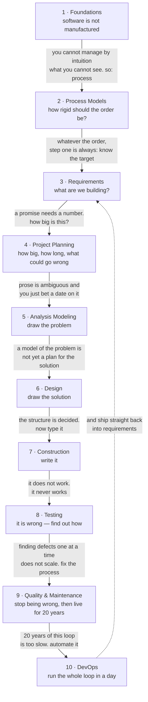

# Story

**Why any of this exists.** [[syllabus]] answers *what is in scope*,
[[weightage]] answers *what it is worth*, and this page answers *why the subject
is shaped the way it is*. It is the one of the three you cannot memorize, and
the one that lets you reconstruct the rest.

## The subject as one question

> Software is the only thing we build that never wears out, cannot be seen, and
> can be changed at any moment for almost nothing. **So how do you engineer it?**

Every module in this course is part of one answer. Hold that question and the
53 lectures stop being a list.

The trap is in the third clause. Because software is infinitely malleable, it
*feels* like it should be easy to change late — and that feeling is what
destroys projects. Cheap to *edit* is not cheap to *get right*: a requirement
misunderstood in week one and discovered in month nine costs orders of
magnitude more than one caught on the day. Every practice in this course is
purchased against that curve.

## The spine

The dotted edge is the point of the last module: DevOps closes the loop that the
first nine open.

## 1 · Foundations — software is not manufactured

**Hardware wears out. Software deteriorates.** A bridge decays because steel
fatigues; software decays because every change to it adds entropy that nobody
paid to remove. Draw the two failure curves side by side and the whole subject
follows: hardware's bathtub curve ends in wear-out, software's *idealised* curve
should flatten forever — but the real curve ratchets upward with every
maintenance change, because each fix introduces new faults.

That gap between the ideal curve and the real one is the software crisis, and it
is what the discipline exists to close. The myths — *"we can add programmers to
catch up"*, *"a general statement of objectives is enough to start"*, *"once it
works, we're done"* — are the specific beliefs that widen it.

> **If you remember one thing:** software fails from change, not from age. Every
> practice downstream is a tax paid to make change survivable.

## 2 · Process Models — how rigid should the order be?

Given that change is the enemy, you have exactly one real decision: **how much
do you commit up front?**

Waterfall makes the maximum bet — settle everything before building, and win big
if requirements hold still. Prototyping and RAD hedge it. The evolutionary
models (incremental, spiral) refuse the bet outright and deliver in slices, each
one a chance to be corrected. Spiral adds the insight that the thing you should
schedule first is not the easiest piece but the **riskiest** one.

Agile takes the argument to its end: if requirements will change anyway, stop
treating change as failure and build the process to absorb it — short
iterations, working software over documentation, the customer in the room.

Every model in this module is an answer to the same question, and their
comparison table is really a table of *what each one assumes about requirement
stability*. CMMI then asks a different question: not which model you use, but
whether your organisation follows **any** process repeatably enough to predict
its own results.

> **If you remember one thing:** every process model is a bet on how much
> requirements will change. Waterfall bets they won't; agile bets they will.

## 3 · Requirements — what are we building?

Whatever the model, the first real work is finding out what the customer
actually needs — which is never what they first say. Elicitation, analysis,
documentation, validation and management is a pipeline for converting vague want
into a checkable statement, and the SRS is its output.

The reason the SRS matters is the cost curve from the opening: **this is the
cheapest place in the entire lifecycle to be wrong**. It is also why the
requirements phase is where agile and traditional practice diverge most visibly
— agile does not skip requirements, it refuses to *freeze* them.

> **If you remember one thing:** a requirement error caught here costs one unit;
> the same error caught in maintenance costs a hundred.

## 4 · Project Planning — how big, how long, what could go wrong

Someone will ask for a date. To answer honestly you need **size** first (LOC,
function points, Halstead), because size is the only thing that can be estimated
from requirements alone. Size then converts into **effort** — COCOMO's whole
job — and effort into **duration** and staffing.

The critical, counter-intuitive result lives here: effort and time are **not
interchangeable**. You cannot halve a schedule by doubling the team, because
communication paths grow quadratically while output grows linearly. That is
Brooks's Law — *adding manpower to a late software project makes it later* — and
it is the formal refutation of the software myth from module 1.

Then **risk**: the disciplined admission that the estimate is a guess. Identify
what could go wrong, project its probability and impact, and plan the mitigation
before it happens rather than after.

> **If you remember one thing:** size drives effort, effort drives time, and the
> last conversion is not linear. Nine women cannot deliver a baby in a month.

## 5 · Analysis Modeling — draw the problem

You have committed to a date on the strength of a prose document, and prose is
ambiguous. So you re-express the requirements as **pictures with rules**, where
ambiguity becomes visible as a missing arrow.

Three lenses on the same system, and the course teaches all three because none
is sufficient alone:

| Lens | Question it answers | Diagram |
|---|---|---|
| Data | what does the system remember? | ER diagram |
| Function | what does the system do to data? | data flow diagram |
| Object | what things exist and how do they collaborate? | UML class, sequence, use case |

DFDs bring their own discipline — **levelling balance** means a child diagram
must consume and produce exactly what its parent bubble does, so the model
cannot quietly invent data. The data dictionary pins down every flow's meaning
so two readers cannot interpret the same label differently.

> **If you remember one thing:** modeling does not add information, it makes
> missing information impossible to hide.

## 6 · Design — draw the solution

A model of the problem is not a plan for the solution, and this module is the
crossing. It moves from *what* to *how*.

The concepts are all one idea in different clothes: **abstraction** lets you
ignore detail, **refinement** adds it back in controlled steps, **modularity**
splits the system so you can hold one piece in your head, and **information
hiding** makes that split hold by denying modules access to each other's
internals.

Then the module makes "good design" measurable rather than aesthetic.
**Cohesion** asks whether a module does one job; **coupling** asks how much it
depends on others. High cohesion, low coupling — and both are ranked scales, so
you can name exactly how bad a design is instead of just disliking it.

**Transform mapping is the literal bridge** and the reason the analysis module
had to come first: it takes a DFD and mechanically derives a program structure
chart from it. It is the one place in the course where one diagram becomes
another by procedure.

> **If you remember one thing:** design is the point where you stop describing
> the problem and start committing to a structure — and cohesion and coupling
> are how you tell a good commitment from a bad one.

## 7 · Construction — write it

The shortest module, and deliberately so: by this point the hard decisions are
made and coding is execution. What the course does teach here is that code is
**read** far more often than written — hence standards, conventions and style —
and that the cheapest defect-removal technique known is other people reading it.
Inspections, reviews and walkthroughs catch defects before a single test runs.

> **If you remember one thing:** reading code finds defects cheaper than running
> it.

## 8 · Testing — it is wrong, find out how

Testing is not a search for correctness. It is a search for **failure**, and the
distinction sets up everything: *error* is the human mistake, *fault* is what it
left in the code, *failure* is what the user sees. And **verification** asks
"are we building the product right?" while **validation** asks "are we building
the right product?"

Two complementary strategies, and their complementarity is the point:

- **Black box** — ignore the code, test the specification. Bugs cluster at
  boundaries, so boundary value analysis probes exactly there; equivalence
  partitioning gets coverage without testing every value.
- **White box** — use the code's own structure. Draw the control flow graph,
  compute cyclomatic complexity, and it tells you the *number of independent
  paths* — which is both a complexity metric and a test-count target. That dual
  meaning is why V(G) is examined so reliably.

Then levels: unit, integration, system, validation — each catching a class of
defect the level below structurally cannot see. And **debugging** is the
separate skill that starts where testing ends: testing tells you *that* it
failed, debugging finds *why*.

> **If you remember one thing:** black box tests what it should do, white box
> tests how it does it, and cyclomatic complexity is where the two meet.

## 9 · Quality & Maintenance — then it lives for twenty years

Finding defects one at a time does not scale, so **SQA** shifts the target from
the product to the process that produced it: reviews, audits, measurement and
formal technical reviews, plus ISO 9000 as the external standard that says the
process exists and is followed. Statistical SQA closes the loop by tracing
defects back to their causes so the same class stops recurring. Reliability
turns "is it good?" into numbers — MTBF, MTTF, availability.

And then the part students consistently underrate: **most of a system's life,
and most of its cost, is after delivery.** Corrective, adaptive, perfective and
preventive maintenance — and only the first is fixing bugs. Which returns
exactly to the deterioration curve from module 1, now with a name for each
ratchet on it.

**Re-engineering** is the recovery path when the ratchet has gone too far:
reverse-engineer a design out of code nobody understands, restructure it,
forward-engineer a replacement.

> **If you remember one thing:** quality is a property of the process, not of
> the product — and maintenance is not the epilogue, it is most of the story.

## 10 · DevOps — run the whole loop in a day

The final module's premise is that the loop the previous nine describe is too
slow. If change is inevitable, the winning move is to make the path from idea to
production so short and so automated that shipping stops being an event.
Continuous integration and delivery, infrastructure as code, cloud and
virtualization for environments on demand — and, hardest of all, the cultural
change that stops development and operations optimising against each other.

> **If you remember one thing:** DevOps is not a toolchain, it is the deletion
> of the wall between building software and running it.

## The whole thing, recitable

> Software is invisible and never wears out, so it decays through change rather
> than age — and the cost of a mistake grows enormously the later you find it.
> Everything else is a response. **Process models** decide how much you commit
> before you know enough. **Requirements** pin down the target, because that is
> the cheapest place to be wrong. **Estimation** converts requirements into a
> size, a size into effort, and effort into a date that adding people cannot
> shorten. **Modeling** redraws the ambiguous prose as diagrams where gaps show.
> **Design** turns the model of the problem into a structure for the solution,
> judged by cohesion and coupling. **Construction** types it, and reviews catch
> what typing got wrong. **Testing** hunts failures from outside the code and
> from inside it. **Quality** stops fixing defects one at a time and fixes the
> process instead. **Maintenance** is where the system spends most of its life
> and most of its money. And **DevOps** compresses that entire loop until it can
> run in an afternoon.

Ten sentences, one per phase, in causal order. If you can say that, you can
rebuild the syllabus from it — which is the whole point of this page.

**Related:** [[syllabus]] (scope) · [[weightage]] (marks) · [[answer-patterns]] (answer shape) · [[index]]
