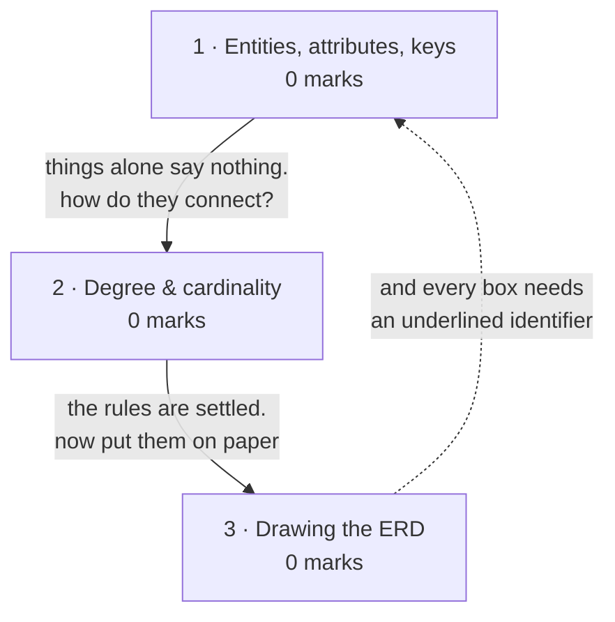
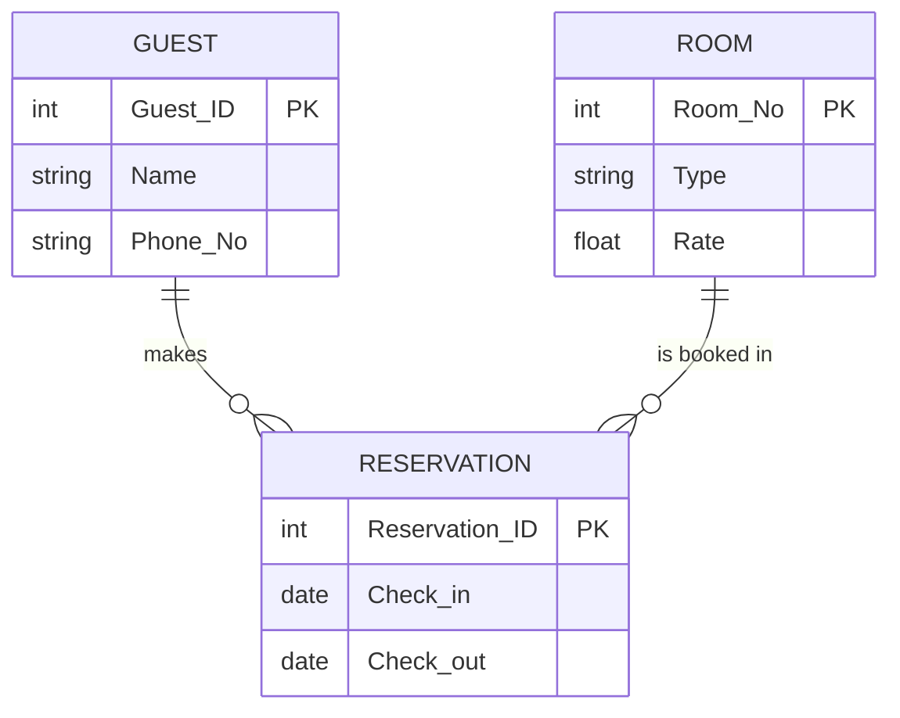

# Data Modeling & ERD

**Prerequisites:** [[Software Engineering Practice]]

## Overview

> [!warning] 0 of 80 in [[se-ete-2025-26]] — not asked once, on one paper
> A single paper cannot show a topic is unexamined. In syllabus, taught across
> two lectures, and **it is a drawing topic on a paper that put 20 of 80 marks
> on drawings**. Lectures 19-20 is *syllabus depth*; rule 3 forbids reading it
> as marks.

The first of three modeling lenses. Requirements written in prose are ambiguous;
redrawn as a diagram with rules, the ambiguity becomes a missing arrow. This one
asks **what does the system remember?** — entities, their attributes, and the
relationships between them. [[Flow-Oriented Modeling & DFD]] asks what the system
*does*; [[UML & Use Case Modeling]] asks what *objects* exist.

## Quick Reference

> [!abstract] The three that carry this topic
> - **Degree = how many entity types take part.** Unary (1), binary (2),
>   ternary (3). Not the same as cardinality.
> - **Cardinality = how many instances of B relate to each instance of A.**
>   One-to-one, one-to-many, many-to-many.
> - **Minimum cardinality zero means optional participation.** That is the
>   difference between "may have" and "must have", and it is the detail most
>   answers drop.

**Data object / entity** — something the system needs to store information about.
**Attribute** — a property or characteristic of an entity that is of interest to
the organisation. **Relationship** — an association between entity types.

### Degree of relationship

The **number of entity types that participate** in the relationship.

| Degree | Entity types | Deck's example |
|---|---|---|
| **Unary** (recursive) | 1 | PERSON *is married to* PERSON — one-to-one; EMPLOYEE *manages* EMPLOYEE — one-to-many |
| **Binary** | 2 | the ordinary case — see below |
| **Ternary** | 3 | VENDOR *ships* PART *to* WAREHOUSE |

### Binary relationships by cardinality — the deck's three examples

| Cardinality | Example | Reading |
|---|---|---|
| **One-to-one** | EMPLOYEE *is assigned* PARKING PLACE | each employee has one place, each place has one employee |
| **One-to-many** | PRODUCT LINE *contains* PRODUCT | a line has many products, a product belongs to one line |
| **Many-to-many** | STUDENT *registers for* COURSE | a student takes many courses, a course has many students |

A fourth, from the training example: EMPLOYEE *completes* COURSE — many-to-many,
because each employee may complete more than one course and each course may be
completed by more than one employee.

### Cardinality and optionality

**Cardinality** of a relationship is *the number of instances of entity B that can
be associated with each instance of entity A*.

**Minimum cardinality** is the *minimum* number of instances of B that may be
associated with each instance of A. If it is **zero**, B is an **optional
participant**.

> Deck example: MOVIE *is stocked as* VIDEO TAPE. The minimum number of tapes
> available for a movie is zero, so **VIDEO TAPE is an optional participant** in
> the *is-stocked-as* relationship.

### Keys

| Term | Definition |
|---|---|
| **Candidate key** | an attribute, or combination of attributes, that uniquely identifies each instance of an entity type |
| **Identifier** | the candidate key chosen to be *the* unique characteristic for that entity type |

Deck example: STUDENT has attributes Student_ID, Name, Address, Phone_No.
**Student_ID is the candidate key**, and is chosen as the identifier.

### Notation legend

Read this before drawing anything — an unlabelled ER diagram scores near zero.

| Symbol | Means |
|---|---|
| Rectangle | entity type |
| Diamond | relationship |
| Ellipse | attribute |
| Underlined attribute | identifier / key |
| Line | participation in the relationship |
| **1** / **M** / **N** on a line | cardinality at that end |

**Label both ends of every relationship.** Cardinality is a property of each
direction separately, and a one-to-many drawn without the 1 and the M is
indistinguishable from a many-to-many.

## Subtopic map

| # | Subtopic | Marks | Why it's here |
|---|---|---|---|
| 1 | Entities, attributes and keys | 0 | the building blocks; candidate key vs identifier |
| 2 | Relationships — degree and cardinality | 0 | the pair students merge; where all the marks would be |
| 3 | Drawing the ER diagram | 0 | notation and worked examples |

## Mindmap

**1 · Entities, attributes and keys — 0 marks**
- **What:** entities are what the system stores; attributes are their properties;
  a candidate key identifies an instance uniquely.
- **Why:** without an identifier you cannot tell two instances apart, and the
  model cannot become a database.
- **Important:** never examined. **Candidate key vs identifier**: several
  attributes may be candidates; the identifier is the one chosen. Underline it.

**2 · Relationships — degree and cardinality — 0 marks**
- **What:** degree counts participating **entity types**; cardinality counts
  **instances** on each side.
- **Why:** they are two different questions about the same line, and confusing
  them makes the diagram wrong rather than merely untidy.
- **Important:** never examined, but this is where any question here would land.
  Unary/binary/ternary vs 1:1, 1:M, M:N. **Minimum cardinality zero = optional
  participation.**

**3 · Drawing the ER diagram — 0 marks**
- **What:** rendering entities, relationships, attributes and cardinalities in
  standard notation.
- **Why:** the paper puts 20 of 80 marks on drawings, and drawn answers are
  graded on notation.
- **Important:** never examined *on this paper*. Label both ends of every
  relationship and underline every identifier.

## 1 · Entities, attributes and keys

**Intuition.** Start by asking what the system has to remember. A university
remembers students and courses; a hotel remembers rooms and reservations. Each of
those is an **entity type**, and the facts you keep about each — a name, an
address, a phone number — are its **attributes**. One attribute (or a combination)
has to be capable of telling two instances apart, or the system cannot refer to
anything reliably; that is the key.

**Definitions & distinctions.** An **attribute** is a property or characteristic
of an entity that is *of interest to the organisation* — the qualifier matters,
because it is what stops the model growing without limit.

A **candidate key** uniquely identifies each instance. When there are several, one
is chosen as the **identifier**. In the deck's STUDENT example, Student_ID is the
candidate key and becomes the identifier, with Name, Address and Phone_No as
ordinary attributes.

**What gets asked.** Never examined on the one paper here. The candidate
key/identifier distinction is the plausible 2-marker.

## 2 · Relationships — degree and cardinality

**Intuition.** Two different questions get asked about the same line on a
diagram, and students routinely answer one when asked the other. **Degree** asks
how many *entity types* the relationship connects — one, two or three boxes.
**Cardinality** asks, for a given relationship, how many *instances* of one side
attach to each instance of the other. A unary relationship (one entity type,
related to itself) can still be one-to-many: an employee manages many employees.
So degree and cardinality vary independently, which is exactly why they need
separate names.

**Definitions & distinctions.** The degree table, the three binary cardinality
examples, and the cardinality/optionality definitions are all in Quick Reference.

The subtlety worth carrying is **minimum cardinality**. Ordinary cardinality says
how many *can* be associated; minimum cardinality says how few *may* be. When the
minimum is zero the participation is **optional** — a movie may be stocked as zero
tapes, so VIDEO TAPE optionally participates. In an exam this is the difference
between drawing "must have exactly one" and "may have none", and it is the detail
that separates a careful diagram from an approximate one.

**Solved questions.** The deck works several small ones:

> **Deck** — "A training department is interested in tracking which training
> courses each of its employees has completed."

EMPLOYEE —*completes*— COURSE, **many-to-many**: each employee may complete more
than one course, and each course may be completed by more than one employee.

> **Deck** — "Vendors quote prices for several parts along with quantity of
> parts. Draw an E-R diagram."

VENDOR —*quote-price*— PARTS, with **quantity** as an attribute of the
relationship (it belongs to the pairing, not to either entity alone). Cardinality
is many-to-many: a vendor quotes for several parts, and a part may be quoted by
several vendors.

**What gets asked.** Never examined on this paper. If it appears, it will be
either "differentiate degree and cardinality" as a 2-marker, or a small scenario
to be drawn.

## 3 · Drawing the ER diagram

**Intuition.** The diagram is the deliverable, and in this subject it is graded on
notation as much as on content. Get the shapes right, underline the identifier,
and put a cardinality marker at **both** ends of every relationship line.

**Legend.** The symbol table is in Quick Reference — rectangle for entity, diamond
for relationship, ellipse for attribute, underline for identifier, 1/M/N for
cardinality. State which convention you are using if there is any doubt.

**The diagram.** Mermaid's `erDiagram` renders the structure faithfully, though
exam answers are drawn in the classic rectangle-diamond-ellipse notation. The
deck's hotel example, reconstructed:

**Reading.** A GUEST makes zero or more RESERVATIONs; a ROOM is booked in zero or
more RESERVATIONs. Each reservation belongs to exactly one guest and one room —
so RESERVATION resolves what would otherwise be a many-to-many between GUEST and
ROOM. **The rule it must satisfy:** every relationship carries a cardinality at
both ends, and every entity carries exactly one underlined identifier.

> [!note] Source honesty
> The deck's ER example is captioned *"ER Diagram → Hotel Reservation System"*
> but **the diagram itself is an image** with no extractable text. The structure
> above is a faithful reconstruction of a standard hotel reservation ERD, **not a
> transcription of your instructor's slide.** Open
> `L6 Requirement Analysis Diagrams.pdf` by eye to compare before relying on the
> specific entities and attributes.

**What gets asked.** Never examined on this paper. But
[[UML & Use Case Modeling]] carries a 10-mark **drawing** question, which
establishes that this instructor asks for diagrams in Section D — so the drawing
skill transfers even though this notation was not the one tested.

## Question Bank

**PYQ questions — none.** No question on [[se-ete-2025-26]] tests this topic.

**Deck questions — 2 small ones**, both from
`raw/sources/ppts/2025/L5 Chapter 3 Software Requirements_2.pdf`, both worked in
subtopic 2:

1. Training department tracking which courses each employee has completed →
   EMPLOYEE *completes* COURSE, many-to-many.
2. "Vendors quote prices for several parts along with quantity of parts. Draw an
   E-R diagram." → VENDOR *quote-price* PARTS, many-to-many, quantity as a
   relationship attribute.

Neither carries a printed solution beyond the diagram itself, so neither is
`✓`-checked.

**Textbook questions — unavailable for this topic.** Pressman 8e is not in
`raw/sources/`. The two Aggarwal & Singh chapters present in the vault cover
project planning and design.

> [!warning] The obvious question source turned out to be something else
> `Flowdiagram Ques.pdf` was catalogued at ingest as a DFD/ER question sheet on
> the strength of its filename. **It is not.** Read by eye on 2026-09-02, it is
> Aggarwal & Singh chapter 8, *Software Testing*, pages 416-422 — two worked
> control-flow-graph problems. Its content belongs to [[White-Box Testing]] and
> [[Cyclomatic Complexity & Graph Matrices]]. **This topic has no question sheet.**

## Mistakes & Traps

- **Confusing degree with cardinality.** Degree counts entity *types*;
  cardinality counts *instances*. A unary relationship can be one-to-many.
- **Labelling only one end of a relationship.** Cardinality is per direction.
- **Forgetting optional participation.** Minimum cardinality zero is a real and
  examinable distinction, not a detail.
- **Not underlining the identifier.** It is how the diagram says which attribute
  is the key.
- **Attaching a relationship's attribute to an entity.** *Quantity* in the vendor
  example belongs to the *quote-price* relationship, not to VENDOR or PARTS.
- **Leaving a many-to-many unresolved when the model needs data about the
  pairing.** If the association itself has attributes, it needs its own box.

## Course Material

- `raw/sources/ppts/2025/L5 Chapter 3 Software Requirements_2.pdf` — the main
  source. Degree of relationship with unary, binary and ternary examples; the
  three binary cardinality cases; cardinality, minimum cardinality and optional
  participation with the MOVIE / VIDEO TAPE example; attributes; candidate keys
  and identifiers with the STUDENT example; and the vendor/parts exercise.
- `raw/sources/ppts/2025/L6 Requirement Analysis Diagrams.pdf` — captions an ER
  diagram for a **Hotel Reservation System**, plus data dictionary, decision
  table and state transition diagram material. **Image-heavy: the diagrams
  themselves have no extractable text.** Worth opening by eye.

**Related:** [[story]] · [[syllabus]] · [[weightage]] · [[MTE Roadmap]] ·
previous [[Risk Analysis & Estimation]] · next [[Flow-Oriented Modeling & DFD]]
