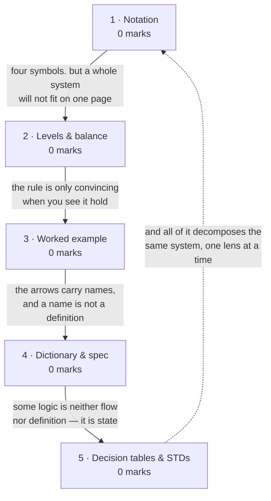
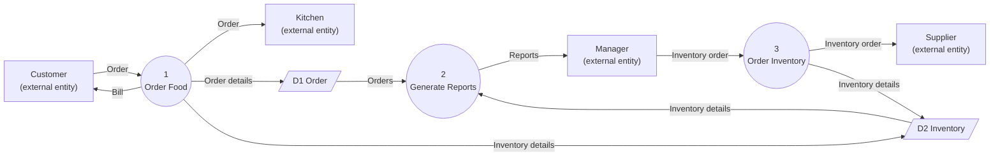
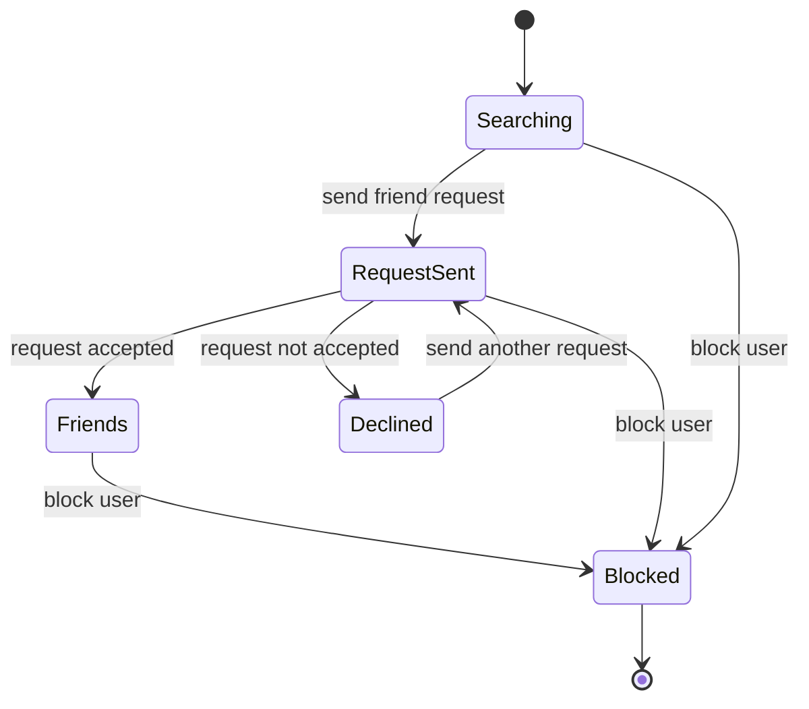

# Flow-Oriented Modeling & DFD

**Prerequisites:** [[Data Modeling & ERD]]

## Overview

> [!warning] 0 of 80 in [[se-ete-2025-26]] — but treat this zero with suspicion
> Two full lectures, a dedicated deck, and it is a **drawing** topic on a paper
> that put 20 of 80 marks on drawings. On a single paper, "scored zero" and "not
> asked that day" are the same observation — and [[MTE Roadmap]] flags this
> specific topic as the one whose zero is least trustworthy. Lectures 19 and 21
> is *syllabus depth*; rule 3 forbids reading it as marks.

- **The second modeling lens.** [[Data Modeling & ERD]] asked what the system
  remembers; this asks **what the system does to data** — where information
  enters, which processes transform it, where it is stored, where it leaves.
- **The one topic whose output feeds a later topic mechanically:**
  [[Transform & Transaction Mapping]] turns a DFD into a program structure chart
  by procedure.

## Quick Reference

> [!abstract] The three that carry this topic
> - **A context diagram has exactly ONE process** — the whole system — plus its
>   external entities. It is Level 0.
> - **Levelling balance:** a child diagram must consume and produce exactly the
>   flows its parent bubble does. This is the rule that makes a DFD checkable.
> - **A DFD shows data flow, not control flow.** No decisions, no loops, no
>   sequence. That is the single most common misconception.

**Definition.** A Data Flow Diagram provides a visual representation of the flow
of information within a system — what information is provided by and delivered to
each participant, what is needed to complete each process, and what needs to be
stored and accessed.

### Notation legend — state this before you draw

| Element | Yourdon / DeMarco | Gane-Sarson | Means |
|---|---|---|---|
| **Process** | circle (bubble) | rounded rectangle | transforms input data into output data |
| **External entity** | rectangle | rectangle | a source or sink outside the system boundary |
| **Data store** | **two parallel lines**, open-ended | open-ended rectangle | where data rests between processes |
| **Data flow** | named arrow | named arrow | data in motion |

The deck uses the **circle-for-process** convention. Two rules of the notation
that mark answers:

- **Every flow is named.** An unlabelled arrow carries no information and earns
  no marks.
- **A data store is drawn open-ended** (two parallel lines, or a rectangle
  missing its right edge) — not as a closed box, which would make it look like an
  entity.

### The levels

| Level | Also called | Contains |
|---|---|---|
| **0** | **context diagram** | **exactly one process** (the whole system) + all external entities + the flows between them. No data stores. |
| **1** | | the context process decomposed into its major processes, now with data stores |
| **2+** | | any level-1 process decomposed further |

**Benefits of a context diagram**, from the deck: it shows the boundaries of the
system at a glance · needs no technical knowledge to read, because the notation
is so limited · is simple to draw, amend and elaborate.

### Levelling balance

> A child diagram must have **exactly the same** net inputs and outputs as the
> parent bubble it decomposes.

If the context diagram shows an `Order` entering the system and a `Bill` leaving,
the level-1 diagram must show the same `Order` entering and the same `Bill`
leaving — no more, no fewer. This is what stops a model quietly inventing data,
and it is the property a marker checks first.

### Process numbering

Context process is **0**. Its children are **1, 2, 3…**. Children of process 2 are
**2.1, 2.2, 2.3…**. The number says which level a bubble belongs to.

### Companion notations

| Notation | Purpose |
|---|---|
| **Data dictionary** | a repository storing information about **all data items defined in the DFD** — metadata, i.e. data about the data. It is what stops two readers interpreting the same flow name differently. |
| **Process specification** (P-spec) | describes the logic inside a bubble that is not decomposed further |
| **Control flow model** | the counterpart showing events and control rather than data |
| **Decision table** | represents complex processing logic in matrix form: upper rows are **conditions**, lower rows are **actions**, and each **column is a rule** — if the condition holds, the corresponding action executes |
| **State transition diagram** | shows how an object changes state as actions are performed on it |

## How it's asked

Generic skeleton on [[answer-patterns]] §4. **Zero marks on the paper — three
assignment questions ([[se-assign-1-2026]] Q5(a), Q5(b), Q15).**

> [!warning] DFD deserves specific suspicion for the Mid-Term
> It scored zero on an End Term whose drawing question went to UML instead — but
> it has **two full lectures, a dedicated deck, and three of the assignment's
> fifteen questions**. A 30-mark paper drawn from 32 lectures is exactly where a
> DFD question fits. Rule 2 says it earned nothing; rule 1 and the coursework say
> prepare it. Both are stated, per rule 7.

### Draw & label — the archetype to prepare

- **Spot it:** *"Develop the Level-0 (Context Diagram)"* · *"Construct the Level-1
  DFD showing processes, external entities, data stores and data flows."* The
  question usually asks for **both levels**, and the pair is the point.
- **Skeleton:**
  1. **Legend** — circle = process, rectangle = external entity, open-ended pair
     of lines = data store, named arrow = flow. **State the convention** (Yourdon
     vs Gane-Sarson); the deck's wins.
  2. **Context diagram:** exactly **one** bubble numbered 0, the external entities
     around it, **and no data stores** — that omission is the most-penalised DFD
     error.
  3. **Level 1:** numbered processes 1.0, 2.0…, the data stores added, every flow
     named.
  4. **Reading**, including the validity rule: **levelling balance** — every flow
     crossing the parent's boundary crosses the child's, unchanged in name.
- **Earns the marks:** labelled arrows and the balance check. **Say in words that
  you checked balance** — it demonstrates you know the rule exists.
- **Trap:** drawing a flowchart with DFD symbols. **A DFD has no decisions, no
  loops and no sequence** — it says what data goes where, never in what order.

**Never asked as:** `numerical`, `compare`, `scenario`. An `explain` on the data
dictionary or decision tables is plausible and unasked.

## Contents

| # | Section | Type | Archetype | Marks | Why it's here |
|---|---|---|---|---|---|
| 1 | What a DFD is, and its notation | notational | **draw** | 0 | the four symbols and the two conventions |
| 2 | Levels and levelling balance | notational | **draw** | 0 | context vs level 1; the rule that makes a DFD checkable |
| 3 | The Food Ordering System worked example | notational | **draw** | 0 | the deck's own running example, drawn out |
| 4 | Data dictionary, process spec and control flow | definitional | — | 0 | what accompanies the diagram |
| 5 | Decision tables and state transition diagrams | notational | — | 0 | the other two analysis notations the deck teaches |

## Mindmap



## 1 · What a DFD is, and its notation

**Intuition.**
- **Draw the system as plumbing.** Data enters from outside, passes through
  processes that transform it, sometimes rests in a store, and eventually leaves.
- **Four symbols, no more** — which is why the deck notes no technical knowledge
  is needed to read one.
- **The discipline is in what a DFD deliberately cannot express:** no decisions,
  no loops, no sequence. It answers *what data goes where*, never *in what order*
  or *under what condition*.
- **Drawing a flowchart with DFD symbols is the standard mistake.**

**Legend.** The full symbol table, with both the Yourdon and Gane-Sarson
conventions, is in Quick Reference. The deck uses **circles for processes**.

**Definitions & distinctions.**

| | Process | External entity | Data store |
|---|---|---|---|
| Represents | a transformation | a source or sink **outside** the boundary | data at rest |
| Inside the system? | yes | **no** | yes |
| Drawn as | circle | rectangle | open-ended parallel lines |

**What gets asked.** Never examined on the one paper here. If asked, the notation
legend earns marks on its own — state it before drawing.

## 2 · Levels and levelling balance

**Intuition.**
- **You cannot show a whole system at useful detail on one page, so you zoom.**
- **The context diagram is maximum zoom-out:** one bubble for the entire system,
  surrounded by the outside world it talks to. It answers one question — *where
  does the system stop and the world begin?*
- Each level down opens one bubble into the processes inside it.
- **The rule that makes this trustworthy is balance:** whatever crossed the
  parent's boundary must cross the child's. If a level-1 diagram produces a report
  the context diagram never showed leaving the system, one of the two is wrong.
- **That check is why DFDs are worth drawing at all.**

**Definitions & distinctions.** The level table, the balance rule, the numbering
scheme and the context-diagram benefits are all in Quick Reference.

The context diagram's defining properties, worth stating exactly: **exactly one
process node**, representing the functions of the complete system in terms of how
it interacts with external entities; **all** external entities; the data flows
between them; and **no data stores**, because stores are internal and the context
diagram does not open the system up.

**What gets asked.** Never examined on this paper. The plausible forms are "what
is a context diagram" as a 2-marker, or "draw the level-0 and level-1 DFD for X"
as a long question — which is exactly what subtopic 3 rehearses.

## 3 · The Food Ordering System worked example

**Intuition.** The deck runs one example at both levels, and it is the right
template for any DFD you are asked to draw: small enough to fit on a page, big
enough to need every symbol.

**The context diagram (Level 0).**

One process — *Food Ordering System* — and four external entities: **Customer,
Kitchen, Manager, Supplier**. Flows run between the system and each entity. No
data stores appear.

```
        Customer ──── Order ────►┌─────────────────────┐
        Customer ◄─── Bill ──────│                     │
                                 │        0            │
        Kitchen  ◄─── Order ─────│  Food Ordering      │
                                 │      System         │
        Manager  ──── Inventory ►│                     │
                      order      │                     │
        Manager  ◄─── Reports ───│                     │
                                 │                     │
        Supplier ◄─── Inventory ─└─────────────────────┘
                      order
```

*(Processes are circles in the deck's convention; boxes are used here only
because the vault renders in plain text. Draw them as circles.)*

**The Level 1 DFD.** The single bubble opens into **three processes**, keeping the
same four external entities and adding **two data stores**:

| Process | Reads from | Writes to | Talks to |
|---|---|---|---|
| **1 Order Food** | — | Order store, Inventory store | receives `Order` from Customer; forwards it to Kitchen; delivers `Bill` to Customer |
| **2 Generate Reports** | Inventory store, Order store | — | delivers `Reports` to Manager |
| **3 Order Inventory** | — | Inventory store | receives `Inventory order` from Manager; forwards it to Supplier |

Data stores: **D1 Order**, **D2 Inventory**.



**Reading.** A Customer places an `Order`; *Order Food* receives it, forwards it
to the Kitchen, stores it in the Order store, updates the Inventory store, and
returns a `Bill` to the Customer. The Manager receives `Reports` from *Generate
Reports*, which reads from both stores. The Manager also initiates *Order
Inventory* by supplying an `Inventory order`, which is forwarded to the Supplier
and recorded in the Inventory store.

**The rule it must satisfy:** the level-1 diagram's net external flows —
`Order` and `Inventory order` in, `Bill`, `Order`-to-Kitchen and `Reports` out —
are exactly those on the context diagram. **Balanced.**

> [!note] Source honesty
> The deck's own diagrams are **images with no extractable text**. The structure
> above is reconstructed from the deck's written descriptions, which are unusually
> complete — they name all three processes, all four entities, both data stores
> and every flow. It is faithful to that text, but **it is not a transcription of
> the slide's picture.** Compare against `DFD (2).pptx` and
> `L6 Requirement Analysis Diagrams.pdf` by eye if the exact layout matters.

**What gets asked.** Never examined on the one paper here. Treated as the
template for a "draw the DFD for this system" question, which is the form a
30-mark Mid-Term drawn from 32 lectures could plausibly use.

## 4 · Data dictionary, process specification and control flow

**Intuition.**
- **A DFD's arrows carry names, and a name is not a definition.** If one arrow
  says `Order details`, two readers imagine different things unless something pins
  it down.
- **The data dictionary is that something** — a repository of every data item in
  the diagram, holding metadata: *data about the data*.
- **The process specification does the same job for bubbles:** when a process is
  not decomposed further, its logic has to be written down somewhere.

**Definitions & distinctions.** The companion-notation table is in Quick
Reference. The **control flow model** is the DFD's counterpart for systems where
events and control matter as much as data — the deck names it alongside the data
flow model and the process specification as the contents of lecture 21.

**What gets asked.** Never examined. One line each is the right depth. "A data
dictionary contains metadata, i.e. data about the data" is quotable as-is.

## 5 · Decision tables and state transition diagrams

**Intuition.**
- **Not all logic is flow-shaped.** Some is a lookup: *given these conditions, do
  that*.
- **A decision table** lays that out as a matrix — conditions in the upper rows,
  actions in the lower rows, and **each column a rule**.
- **Some behaviour is neither flow nor lookup but state:** an object behaves
  differently depending on what has happened to it, and a **state transition
  diagram** shows those states and the events that move between them.

**Definitions & distinctions.**

**Decision table** — the upper rows specify the variables or conditions to be
evaluated; the lower rows specify the actions to be taken when the corresponding
conditions are satisfied. A **column is a rule**: if its condition combination
holds, the corresponding action executes. The deck's example is a Library
Management System: *if the valid-selection condition is false, the action is
'display error message'.*

**State transition diagram** — objects change state as functions are performed on
them. The deck's case study: a web application where a user can search for other
users, send a friend request, have it accepted (both users added to each other's
friend lists) or declined (the second user may send another request), and where
users can block each other. Each of those is a state, and each action is a
transition.



**Reading.** A user begins by searching, sends a request, and the request either
succeeds (Friends) or fails (Declined) — and from Declined a further request may
be sent, which is the loop the case study specifies. Blocking is reachable from
any state. **The rule it must satisfy:** every transition is labelled with the
event that causes it, and every state is reachable.

**What gets asked.** Never examined on this topic. But **decision-table-based
testing is examined machinery** on [[Black-Box Testing]] (lecture 37), so the
table notation is worth learning here and reusing there.

## Question Bank

**PYQ questions — none.** No question on [[se-ete-2025-26]] tests this topic.

**Deck questions — none, but one complete worked example.** The Food Ordering
System is worked at both levels in subtopic 3, from
`raw/sources/ppts/2025/DFD (2).pptx` and
`raw/sources/ppts/2025/L6 Requirement Analysis Diagrams.pdf`. It is an
*illustration*, not a posed question, so no `✓`.

**Textbook questions — unavailable for this topic.** Pressman 8e is not in
`raw/sources/`.

> [!warning] The file that looked like this topic's question bank is not
> `Flowdiagram Ques.pdf` was catalogued at ingest as a DFD question sheet on the
> strength of its filename. **Read by eye on 2026-09-02, it is not.** It is
> Aggarwal & Singh chapter 8, *Software Testing*, pages 416-422: two fully worked
> **control flow graph / DD path graph / independent path** problems — the
> quadratic-equation program and the triangle-classification program. Both belong
> to [[White-Box Testing]] and [[Cyclomatic Complexity & Graph Matrices]], where
> they are worked in full. *Control flow graph* and *data flow diagram* are
> different things, and the filename conflated them.
>
> **Consequence: this topic has no drill at all beyond the Food Ordering
> example.** That is stated rather than papered over with invented questions.

**Assignment questions — [[se-assign-1-2026]].** **Q5(a)(b)** clinic context + Level-1 DFD (part (b) is defective as printed) · **Q15** library context + Level-1 DFD

Worked in full on that page, with method and traps. **Coursework, so it does not
change [[weightage]]** — but it is direct evidence of what the instructor
considers important.

## Mistakes & Traps

- **Drawing control flow in a DFD.** No decisions, no loops, no sequence. A DFD
  shows *what data goes where*, never *when* or *under what condition*.
- **Putting more than one process on a context diagram.** Level 0 has exactly
  **one** bubble.
- **Putting data stores on a context diagram.** Stores are internal; the context
  diagram does not open the system.
- **Unbalanced levels.** The child's net inputs and outputs must equal the
  parent's. Markers check this first.
- **Unnamed data flows.** An unlabelled arrow earns nothing.
- **Drawing a data store as a closed box.** It is open-ended; a closed rectangle
  reads as an external entity.
- **Confusing a data flow diagram with a control flow graph.** The first models a
  system's data; the second models one program's execution paths and lives on
  [[Cyclomatic Complexity & Graph Matrices]]. The vault's own source filenames
  got this wrong — do not repeat it in an exam.

## Course Material

- `raw/sources/ppts/2025/DFD (2).pptx` — the DFD definition, the context diagram
  with its three stated benefits, and the **Food Ordering System** at context and
  level 1, described in full text across slides 15-20. **The diagrams themselves
  are images.**
- `raw/sources/ppts/2025/L6 Requirement Analysis Diagrams.pdf` — the same Food
  Ordering example at level 0 and level 1, plus the **data dictionary**
  definition, an **ER diagram** for a Hotel Reservation System, a **decision
  table** for a Library Management System, a **state transition diagram** with
  the friend-request case study, and a use-case template. **Image-heavy** (10 pp)
  — the diagrams have no extractable text.
- `raw/sources/ppts/2025/L5 Chapter 3 Software Requirements_2.pdf` — supporting
  analysis-modeling material.

**Filename correction recorded:** `Flowdiagram Ques.pdf` is testing content, not
flow-diagram content. See the warning in the Question Bank and the entry in
[[index]].

**Related:** [[story]] · [[syllabus]] · [[weightage]] · [[MTE Roadmap]] ·
previous [[Data Modeling & ERD]] · next [[UML & Use Case Modeling]] ·
feeds [[Transform & Transaction Mapping]]
