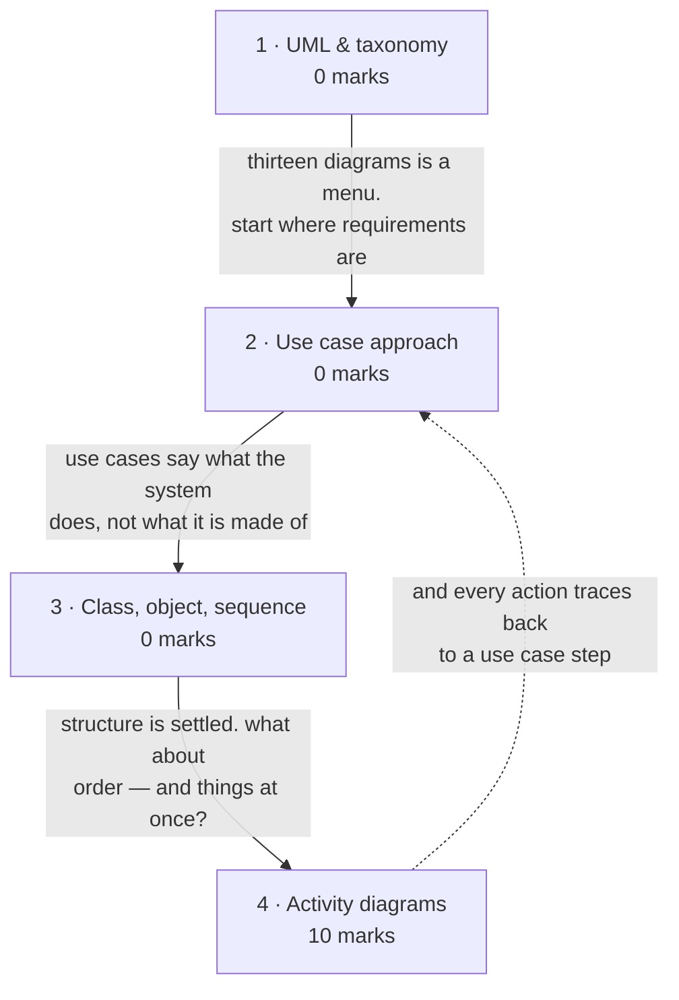
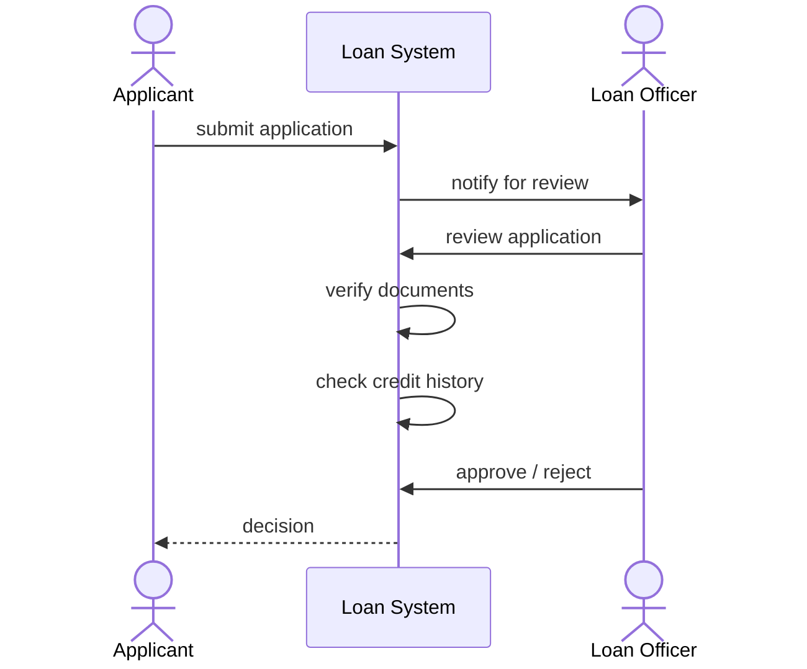
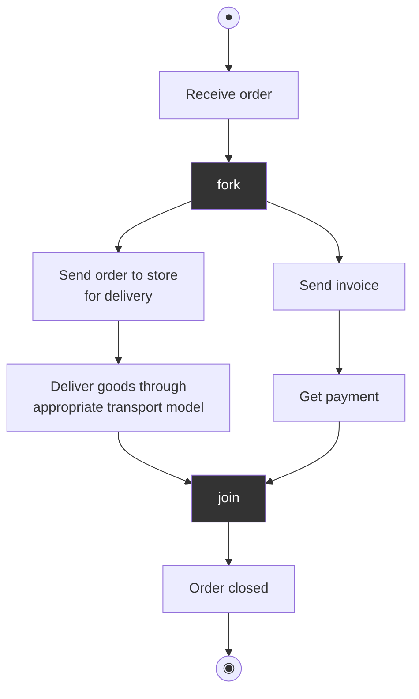
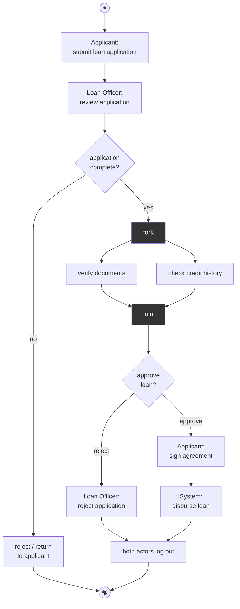

# UML & Use Case Modeling

**Prerequisites:** [[Flow-Oriented Modeling & DFD]]

## Overview

> [!info] 10 of 80 in [[se-ete-2025-26]] — question D2
> **The second-heaviest topic in the MTE window, and the paper's biggest
> drawing.** D2 is a 10-mark Section D question: a Bank Loan Processing System
> described in six bullets, ending *"Task: Draw an Activity Diagram for given
> case study."* One paper only; see [[weightage]].

> [!tip] The deck gives you the exact template for D2
> `L8 Chapter 5 Software Design_3.pdf` Fig. 26 is an activity diagram for
> *processing an order to deliver some goods* — **initial node → action → fork
> into two parallel branches → join → final action → end**. That is D2's
> structure exactly, with different labels. Rule 8 again: the deck's figure is
> the exam question with the content changed. It is reproduced in subtopic 4.

The third and last modeling lens. [[Data Modeling & ERD]] asked what the system
remembers, [[Flow-Oriented Modeling & DFD]] what it does to data; UML asks **what
objects exist and how they collaborate** — and, in the activity diagram, **in what
order and in parallel**.

> [!note] This is the only topic with a deck from this year's session
> `ppts/2026-27/UML & UseCase Diagram.pdf` is the sole 2026-27 file in the vault.
> It is **33 pages and almost entirely images** — only slides 1 and 30-33 yield
> text. Where it disagrees with the 2025 decks, it wins. **Worth opening by eye
> before the exam**; see Course Material.

## Quick Reference

> [!abstract] The three that carry this topic
> - **Activity diagram notation: filled circle = start · rounded rectangle =
>   action · diamond = decision · solid bar = fork or join · circle-in-circle =
>   end.** That is D2.
> - **A fork splits into parallel flows; a join waits for all of them.** Both are
>   drawn as a solid bar. Every fork needs a matching join.
> - **Use case = who (actor) does what (interaction).** Actors lie *outside* the
>   system boundary.

**UML** was developed jointly by **Grady Booch, Ivar Jacobson and Jim Rumbaugh**.
It provides the modeling language for: process modeling / requirement analysis
with use cases · static design with class and object modeling · dynamic design
with sequence, collaboration and activity diagrams · real-time systems design ·
distribution and deployment modeling.

### The diagram taxonomy

The deck gives two counts, from different UML versions — say which you are using:

| Count | Diagrams |
|---|---|
| **9** (older) | use case, sequence, collaboration, activity, state-chart, deployment, class, object, component |
| **13** (current standard) | class, activity, object, use case, sequence, package, state, component, communication, composite structure, interaction overview, timing, deployment |

Organised into two groups:

| Structural | Behavioral / interaction |
|---|---|
| class · package · object · component · composite structure · deployment | activity · sequence · use case · state · communication · interaction overview · timing |

### Activity diagram notation — the D2 legend

| Symbol | Means |
|---|---|
| **Filled circle** ● | initial node — where the flow starts |
| **Rounded rectangle** | action / activity |
| **Diamond** ◇ | decision (branch) or merge |
| **Solid horizontal bar** ▬ | **fork** (one flow in, many out) or **join** (many in, one out) |
| **Arrow** | control flow |
| **Circle containing a filled dot** ◉ | final node — where the flow ends |
| **Swimlane / partition** | which actor performs the actions in that column |

**An activity diagram illustrates the dynamic nature of a system by modeling the
flow of control from activity to activity. An activity represents an operation on
some class in the system that results in a change in the state of the system.**

**Fork vs decision — the distinction that carries D2:**

| | Fork (bar) | Decision (diamond) |
|---|---|---|
| Branches taken | **all of them, in parallel** | **exactly one**, by condition |
| Drawn as | solid bar | diamond |
| Closed by | a **join** bar — waits for **every** branch | a merge diamond |
| Words that signal it | "two parallel activities start", "simultaneously", "at the same time" | "if", "either", "depending on" |

### Use case approach

Introduced by **Ivar Jacobson**. It gives the **functional view** of the system.

| Term | Definition |
|---|---|
| **Use case** | a structured outline or template describing the sequence of interactions between actors and the system; initiated by a user with a particular goal |
| **Use case scenario** | an *unstructured* description of a user interaction |
| **Use case diagram** | the graphical representation |
| **Actor** | an external agent that **lies outside the system model** but interacts with it — a person, machine, or information system |

> **A use case captures who (actor) does what (interaction).**

**Use case template**, from the deck: Introduction (background) · Actors ·
Pre-conditions · Post-conditions (the state after execution) · **Primary events**
(what occurs when the use case executes) · **Alternative flows** (subsidiary
events; a use case may have many).

The deck's worked template example: *Number A.132.4 · Name: Buy book online ·
Author · Event: Customer requests one or more books · System: Amazon.com ·
Overview · Related use cases · typical process description with exceptions
handled.*

**Realizing use cases:** validation is done up front — as soon as the model is
ready it is presented to customers. Use cases are **implementation-independent**
descriptions of functionality, and are realized in later stages using, say, a
class diagram.

## How it's asked

Generic skeleton on [[answer-patterns]] §4. **Tied heaviest topic in the MTE
window at 10 of 80, and the paper's largest single block — one drawing.**

### Draw & label — D2, 10 marks

- **Spot it:** a described workflow with two roles and, critically, **two things
  happening at once** — "document verification **and** credit check". The word
  *and* over two simultaneous activities is the question's whole point.
- **Skeleton:**
  1. **Legend first** — filled circle = initial node · rounded rectangle =
     action · diamond = decision · **solid bar = fork/join** · bullseye = final
     node · vertical partitions = swimlanes, one per role.
  2. **Swimlanes labelled with the actors** named in the stem (Loan Officer,
     Applicant). Put every action in the lane of whoever performs it.
  3. **The diagram**, every action and every guard labelled.
  4. **Reading** — two or three lines saying what it asserts, and the validity
     rule: **every fork has a matching join**, and flow resumes only when all
     parallel branches complete.
- **Earns the marks:** the fork/join bar. **Drawing a decision diamond where the
  question describes parallel work is the error the question exists to catch** —
  a diamond means *choose one path*, a bar means *do both*.
- **Trap:** omitting swimlanes when the stem names roles; leaving guards off
  decision branches; forgetting the join.

**A 10-mark drawing is worth planning on scrap first.** Identify actors → list
actions in order → find the parallelism → place fork and join → then draw once.

**Never asked as:** `numerical`, `compare`. A `scenario` or `explain` question on
use cases is plausible but has never appeared — that is a prediction, not
evidence (rule 7).

## Contents

| # | Section | Type | Archetype | Marks | Why it's here |
|---|---|---|---|---|---|
| 1 | What UML is, and the diagram taxonomy | definitional | — | 0 | the three authors, the two groups, the 9-vs-13 count |
| 2 | The use case approach | procedural | — | 0 | actors, use cases, the template — lecture 22's other half |
| 3 | Class, object and sequence diagrams | notational | — | 0 | named by the handout; thin deck coverage |
| 4 | Activity diagrams | notational | **draw** | **10** | **carries D2** — the paper's biggest drawing |

## Mindmap

## 1 · What UML is, and the diagram taxonomy

**Intuition.**
- **Before UML, every methodologist had their own notation**, so a diagram meant
  one thing to its author and something else to everyone else.
- **UML is the agreed vocabulary** — Booch, Jacobson and Rumbaugh combined their
  notations so that a class diagram means the same thing everywhere.
- **The practical consequence: the notation is the content.** Marks go to using
  the right symbol, not to drawing neatly.

**Definitions & distinctions.** The five modeling roles, the two diagram counts
and the structural/behavioral split are all in Quick Reference.

The grouping is worth understanding rather than memorising: **structural**
diagrams show what the system *is* — the parts and their arrangement, frozen in
time. **Behavioral** diagrams show what the system *does* — how it changes,
responds and sequences. A class diagram is structural; an activity diagram is
behavioral.

**What gets asked.** Never examined on this paper. "How many UML diagrams are
there" is the classic 2-marker, and the honest answer names both counts.

## 2 · The use case approach

**Intuition.**
- **A use case is a story about someone trying to get something done with your
  system:** who they are, what they want, what happens step by step, and what
  happens when it goes wrong.
- **Its value is that the customer can read it** — unlike a DFD or a class
  diagram, a use case needs no technical training to validate.
- Hence the deck's stress on validating **up front**, with the model presented and
  discussed with customers as soon as it is ready.

**Definitions & distinctions.** The term table, the actor definition and the use
case template are all in Quick Reference. Three points worth precision:

- **An actor lies outside the system model** but interacts with it — and may be a
  person, a machine, or another information system. Drawing an actor inside the
  boundary is a notation error.
- **Use case vs use case scenario.** The use case is the *structured* template;
  the scenario is an *unstructured* description of one interaction. Students use
  the terms interchangeably; the deck does not.
- **Use cases are implementation-independent.** They say what the system does,
  never how — which is what lets them be realized later by a class diagram.

**Solved questions.**

> **Deck exercise** — "Carry out a use-case analysis of the operations performed
> by a parking ticket vending machine. Consider end-user (motorist), maintenance
> technician, auditor, and coin (money) collector."

**Approach.** Four actors are given, which is the hint that the answer is
organised by actor:

| Actor | Use cases |
|---|---|
| **Motorist** (end user) | buy ticket · pay by coin · collect change · collect ticket |
| **Maintenance technician** | run diagnostics · replace paper roll · repair machine |
| **Auditor** | print transaction report · reconcile takings |
| **Coin collector** | unlock cash box · empty coins · confirm collection |

Each actor sits outside the system boundary; each use case is an ellipse inside
it; lines join an actor to every use case they initiate. *(Deck exercise with no
printed solution — this is a worked approach, not a transcription, so no `✓`.)*

**What gets asked.** Never examined on the one paper here — **but this is the
entire subject of the only 2026-27 deck in the vault**, which under rule 8 is the
strongest available signal about what is currently being taught. Do not skip it
on the strength of one paper's silence.

## 3 · Class, object and sequence diagrams

> [!warning] Thin deck coverage
> The handout names class, object, sequence and use case diagrams at lecture 22.
> The decks cover **use case** thoroughly and the other three mostly by *naming*
> them in taxonomy lists. `UML.pdf` shows small unlabelled thumbnails; the
> 2026-27 deck's middle 28 pages are images. Pressman 8e is not in the vault.
> What follows is standard UML, held to definition depth.

**Intuition.**
- **Class diagram — the blueprint:** what types of thing exist, what each knows
  and can do, and how they relate.
- **Object diagram — a snapshot:** one specific set of instances at one moment,
  useful for showing a tricky structure is actually realisable.
- **Sequence diagram — a timeline:** which object sends which message to which
  other object, in what order, read top to bottom.

**Definitions & distinctions.**

| Diagram | Shows | Group |
|---|---|---|
| **Class** | classes with attributes and operations, and their associations | structural |
| **Object** | specific instances and their links at one instant | structural |
| **Sequence** | messages between objects ordered in time, on vertical lifelines | behavioral |

Class diagram notation: a box in three compartments — **name / attributes /
operations** — with **multiplicity at both ends** of every association (1, 0..1,
1..\*, \*).

Sequence diagram notation: each participant gets a **lifeline** (dashed vertical
line); an **activation bar** shows when it is doing work; arrows are messages,
read **top to bottom** as time.

**Reading.** Time runs downward; each arrow is one message. **The rule it must
satisfy:** every message leaves one lifeline and arrives at another (or returns
to itself), and a reply is drawn as a dashed arrow. *(Constructed from D2's
scenario to illustrate the notation — not a deck figure.)*

**What gets asked.** Never examined on this paper. Definition depth is the right
stopping point given the deck gap — know what each diagram is for and its core
notation, and spend the time on subtopic 4 instead.

## 4 · Activity diagrams

**Intuition.**
- **A flowchart shows one thread of control:** do this, then that, branch here.
- **Real processes are not like that** — a bank verifying your documents *and*
  checking your credit history does both at once, and only proceeds when both
  finish.
- **The activity diagram's contribution over a flowchart is exactly this:** the
  **fork** bar splits one flow into several running in parallel, and the **join**
  bar waits for all of them before continuing. Everything else — start, actions,
  decisions, end — is familiar.
- **If a question says "two parallel activities start", it is asking for a fork.**
  Drawing a decision diamond instead is the error the question exists to catch.

**Legend.** The full symbol table is in Quick Reference: ● initial · rounded
rectangle action · ◇ decision · **solid bar fork/join** · ◉ final · swimlanes for
actors. State it before drawing; notation is where the marks are.

**The deck's own figure — the template for D2.**

`L8 Chapter 5 Software Design_3.pdf`, **Fig. 26**, *"activity diagram processing
an order to deliver some goods"*:

*(The dark bars are forks and joins — drawn as solid horizontal bars in real UML,
not as boxes. Mermaid has no fork glyph.)*

**Reading.** After *Receive order*, the flow **forks**: delivery and invoicing
proceed simultaneously and independently. The **join** waits for both — the order
cannot close until the goods are delivered *and* the payment received. **The rule
it must satisfy:** every fork has a matching join, and the join has as many
incoming flows as the fork had outgoing.

**Solved questions.**

> **[[se-ete-2025-26]] Q D2 (10 marks, CO2)** — "A Bank Loan Processing System
> involves two actors: *Loan Officer* and *Applicant*.
> • The Applicant submits a loan application.
> • The Loan Officer reviews the application.
> • If the application is complete, two parallel activities start: verification
> of documents and credit history check.
> • After both are complete, a decision is made: approve or reject the loan.
> • If approved, the Applicant signs the agreement, and the system disburses the
> loan.
> • The process ends when both the Loan Officer and Applicant log out.
> **Task: Draw an Activity Diagram for given case study.**"

**Step 1 — read the bullets for notation, not just content.** Each phrase maps to
a symbol, and this mapping *is* the answer:

| Phrase in the question | Symbol required |
|---|---|
| "submits a loan application" | initial node ● then an action |
| "**If** the application is complete" | **decision diamond** — two branches, one taken |
| "two **parallel** activities start" | **fork bar** — both branches taken |
| "After **both** are complete" | **join bar** — waits for all |
| "a decision is made: approve **or** reject" | **decision diamond** |
| "the process ends" | final node ◉ |

Two actors are named, so **swimlanes** are appropriate: one partition for
Applicant, one for Loan Officer.

**Step 2 — draw it.**

**Step 3 — state the reading.** The flow starts when the Applicant submits an
application. The Loan Officer reviews it, and a **decision** tests completeness —
an incomplete application leaves the flow. A complete one hits a **fork**, and
document verification and the credit history check run **in parallel**. The
**join** waits for both before the approval **decision**. On approval the
Applicant signs and the system disburses; on rejection the flow skips those two
actions. Both paths converge on logout and the **final node**.

**The rules it must satisfy**, which are what a marker checks:

1. **The fork has a matching join** — two out, two in.
2. **Decisions are diamonds with labelled guards** (`[complete]` / `[incomplete]`,
   `[approved]` / `[rejected]`). An unlabelled branch earns nothing.
3. **Exactly one initial node**, and every path reaches a final node.
4. **Fork ≠ decision.** Both branches of a fork execute; exactly one branch of a
   decision executes.

**Answer:** the diagram above, drawn with swimlanes for *Applicant* and *Loan
Officer*, a decision after review, a **fork/join pair** around the two parallel
checks, a second decision for approve/reject, and a single final node after
logout.

*(No printed solution key exists for this paper, so this answer is unchecked —
no `✓`. Mermaid cannot draw fork/join bars or swimlanes; **on paper, draw the
bars as solid horizontal lines and the swimlanes as two labelled columns.**)*

**What gets asked.** This subtopic carries the whole topic's marks. One form so
far, and it is a big one:

- **Spot it** — a numbered or bulleted case study naming two or more **actors**,
  ending in *"draw an activity diagram"*. The giveaway phrase is "parallel" or
  "at the same time".
- **Method** — map each bullet to a symbol **before** drawing (step 1 above), then
  draw. Use swimlanes when actors are named. Label every guard. Finish by writing
  two lines saying what the diagram asserts.
- **Trap** — four. Drawing a **decision diamond where a fork belongs** — the
  single error this question is designed to catch. Forgetting the **join**, so
  the parallel branches never reconverge. Leaving guards unlabelled. And drawing
  a plain flowchart with no start or end nodes: an activity diagram without ● and
  ◉ is incomplete notation, and this subject grades notation.

## Question Bank

**PYQ questions — 1.**

> **[[se-ete-2025-26]] Q D2 (10 marks, CO2)** — Bank Loan Processing System,
> draw an activity diagram.

Worked in full in subtopic 4, with the phrase→symbol mapping table and the four
rules a marker checks. *(Unchecked.)*

**Deck questions — 2.**

1. **`L8 Chapter 5 Software Design_3.pdf` Fig. 26** — the order-delivery activity
   diagram. Not a posed question but a complete worked figure, and structurally
   identical to D2. Reproduced in subtopic 4.
2. **`ppts/2026-27/UML & UseCase Diagram.pdf` slide 31** — "Carry out a use-case
   analysis of the operations performed by a parking ticket vending machine.
   Consider end-user (motorist), maintenance technician, auditor, and coin
   (money) collector." Worked by actor in subtopic 2. **From this year's deck.**

Neither carries a printed solution, so neither is `✓`-checked.

**Textbook questions — unavailable for this topic.** Pressman 8e is not in
`raw/sources/`. The Aggarwal & Singh design chapter supplies Fig. 26 but no
end-of-chapter UML exercises within the extracted range.

## Mistakes & Traps

- **Using a decision diamond where a fork belongs.** "Two parallel activities
  start" means **both** run — that is a fork bar, not a branch. This is D2's
  central trap.
- **Forking without joining.** Every fork needs a matching join, with as many
  inputs as the fork had outputs.
- **Unlabelled decision guards.** `[complete]` / `[incomplete]` — without them a
  diamond says nothing.
- **Omitting the initial or final node.** ● and ◉ are part of the notation.
- **Drawing actors inside the system boundary** in a use case diagram. Actors are
  external by definition.
- **Confusing use case with use case scenario.** The use case is the structured
  template; the scenario is an unstructured description.
- **Ignoring named actors.** If a question names two actors, swimlanes are the
  expected structure.

## Course Material

- `raw/sources/ppts/2026-27/UML & UseCase Diagram.pdf` — **this year's session,
  the only 2026-27 file in the vault.** Text yields the UML authorship and the
  five modeling roles (slide 1), the use case template example for *Buy book
  online* (slide 30), the parking-ticket-machine exercise (slide 31), realizing
  use cases (slide 32) and the summary (slide 33). **Slides 2-29 are images with
  no extractable text** and have not been read by eye. Given this is the current
  deck and the topic is worth 10 marks, **opening it yourself is the single
  highest-value thing available for this page.**
- `raw/sources/ppts/2025/L8 Chapter 5 Software Design_3.pdf` — the activity
  diagram definition and **Fig. 26** (read by eye, page 75-76), which is D2's
  structural template.
- `raw/sources/ppts/2025/L5 Chapter 3 Software Requirements_2.pdf` — the use case
  approach in depth: Jacobson's introduction, use case / scenario / diagram, the
  actor definition, and the full use case template with primary events and
  alternative flows.
- `raw/sources/ppts/2025/UML.pdf` — the diagram taxonomy: the older 9 and the
  current 13, split into structural and behavioral groups.

**Deck gap:** the words **fork**, **join** and **swimlane** appear in **no deck's
extractable text**. The notation is present only as images (Fig. 26). The fork/join
semantics on this page are standard UML, corroborated by that figure but not
quoted from any slide.

**Related:** [[story]] · [[syllabus]] · [[weightage]] · [[MTE Roadmap]] ·
previous [[Flow-Oriented Modeling & DFD]] · next [[Design Concepts & Principles]]
