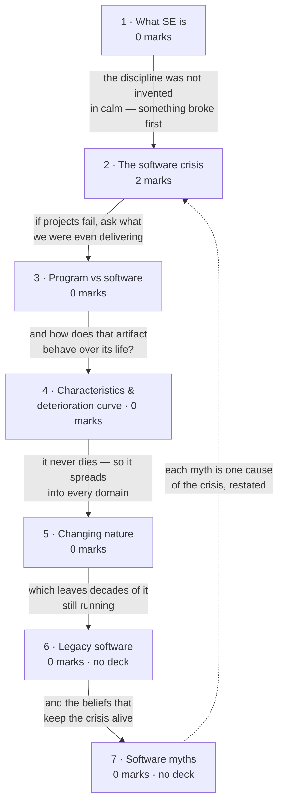

# Introduction to Software Engineering

**Prerequisites:** none — this is the entry point of the course.

## Overview

> [!info] 2 of 80 in [[se-ete-2025-26]] — question A5
> A5 asks whether a late project can be rescued by adding people. The deck plants
> that answer in its **software crisis** slide, and the paper tags it **CO1**
> (lectures 1-12) — so it is examined here, not on [[Effort Estimation & COCOMO]]
> where the person-month arithmetic lives. One paper only; see [[weightage]].

- **The course justifies its own existence here:** what software is · what went
  wrong when industry treated it like manufacturing · which beliefs still make
  projects fail.
- Everything in [[story]] hangs off this page.

> [!warning] Two subtopics have no source in this vault
> **Legacy software** and **software myths** are named in the handout (lecture 3)
> and appear in **no deck** — zero hits for "myth" across all 24 decks, no
> lecture-3 treatment of "legacy". Pressman 8e is not in `raw/sources/`, so rule
> 6's fallback is unavailable. Subtopics 6-7 are standard Pressman material,
> **labelled unsourced** — indicative, not your instructor's wording.

## Quick Reference

> [!abstract] The three facts that carry this topic
> - **Software = Program + Documentation + Operating Procedures.** A program is
>   one third of a software product.
> - **Hardware wears out; software deteriorates.** Hardware fails from physical
>   decay, software from accumulated change — the curve ratchets up at every
>   maintenance release and never returns to its old baseline.
> - **Adding people to a late project makes it later.** The crisis-era finding,
>   and the whole of A5.

**Definition.** Software engineering is an engineering discipline concerned with
all aspects of software production — aiming at **fault-free software, meeting
user needs, on time and within budget**. (The deck's fuller phrasing adds:
*adopt a systematic and organised approach, using appropriate tools and
techniques depending on the problem, the development constraints and the
resources available.*)

| Term | It means |
|---|---|
| Program | executable code alone |
| Software | program **+** documentation **+** operating procedures |
| Software crisis | the late-1960s realisation that software development does not behave like manufacturing |
| Legacy software | older systems still in service, business-critical, poorly documented, expensive to change |

| | Computer science | Software engineering |
|---|---|---|
| Supplies | theories, computer function and methods | tools and techniques to solve the problem |
| Faces | the machine | the customer and their problem |

**Six causes of the software crisis:** lack of communication between developer
and user · cost of software rising relative to hardware · growth in software size
· project management problems · inadequate training in software engineering ·
skill shortage.

**The three canonical failures:**

| Failure | Year | Cause |
|---|---|---|
| Ariane 5 | 1996 | destroyed 39 s after launch; 10 years and $7 bn of development, four satellites lost |
| Patriot missile | 1991 | clock timing error accumulating over 100 h of operation; 28 US soldiers killed at Dhahran |
| Y2K | 2000 | two-digit year fields — an assumption, not a coding bug |

**Documentation, by phase** (the deck's table) — and **operating procedures**:
user manuals (system overview, beginner's guide, tutorial, reference guide) and
operational manuals (installation guide, system administration guide).

| Phase | Documents |
|---|---|
| Analysis / specification | formal specification, context diagram, DFDs |
| Design | flow charts, ER diagram |
| Implementation | source code listings, cross-reference listing |
| Testing | test data, test results |

**Five software characteristics:** does not wear out · engineered, not
manufactured · components are reusable · highly flexible · logical rather than
physical.

**The two failure curves** — draw both, labelled:

| | Hardware | Software |
|---|---|---|
| Curve shape | bathtub: burn-in, useful life, wear-out | falling, then a ratchet upward at each change |
| Failure cause | physical decay — dust, vibration, temperature | change: each fix introduces new faults |
| End of life | wears out | retired for environmental change, new requirements, new expectations |

**Eight application domains:** system · real-time · embedded · engineering and
scientific · business · web-based · personal computer · artificial intelligence.

**Legacy software — the four responses, increasing cost:** leave alone if stable
and isolated · re-engineer for maintainability · adapt to interoperate · replace.

**The four maintenance types** — introduced here inside waterfall, examined on
[[Software Maintenance]]:

| Type | Purpose |
|---|---|
| Corrective | fix defects missed during development |
| Adaptive | port to a new platform or environment |
| Perfective | add or enhance functionality on request |
| Preventive | pre-empt future problems |

**Software myths** — each is one cause of the crisis restated as something a real
person sincerely believes:

| Myth | Held by | The reality |
|---|---|---|
| "A book of standards exists, so my people have all they need" | management | it may be unread, out of date, or quietly ignored |
| "We can add programmers to catch up" | management | adding people to a late project makes it later |
| "Outsourcing lets me relax" | management | outsourced projects fail for the same reasons in-house ones do |
| "A general statement of objectives is enough to start" | customer | ambiguous requirements are the largest single cause of failure |
| "Requirements change is easy to absorb — software is flexible" | customer | the cost of change rises steeply the later it lands |
| "Once the program works, we're done" | practitioner | 60%+ of total effort is spent *after* first delivery |
| "Until the program runs, quality can't be assessed" | practitioner | reviews and inspections find defects earlier and cheaper |
| "The only deliverable is the working program" | practitioner | software = program + documentation + operating procedures |

## How it's asked

Generic skeleton on [[answer-patterns]] §1. **2 of 80, all of it in one 2-marker.**

### Scenario → identify & justify — A5, 2 marks

- **Spot it:** a project behind schedule, asking whether adding people can rescue
  it. Any phrasing of "add more developers / employees / programmers".
- **Skeleton:** answer **no in the first line** → give two of the three mechanisms
  (training diverts your best people · communication paths grow as *n(n−1)/2*
  against at-best-linear output · sequential work cannot be parallelised) → close
  by naming the real remedies: reduce scope, extend the schedule, re-plan.
- **Earns the marks:** the mechanism. A 2-marker wants the *reason*.
- **Trap:** "yes, if they are added early" — the question says the project is
  *already* late. Second trap: naming Brooks's Law and stopping. **The eponym
  earns nothing on its own.**

**Never asked as:** `numerical`, `draw`, `compare`, `explain`. The six crisis
causes and three named failures are plausible Section A material and have not been
asked — a prediction, not evidence (rule 7).

## Contents

| # | Section | Type | Archetype | Marks | Why it's here |
|---|---|---|---|---|---|
| 1 | What software engineering is | definitional | — | 0 | the definition every other page assumes |
| 2 | The software crisis | definitional | **scenario** | **2** | the only examined part — carries A5 |
| 3 | Program vs software | definitional | — | 0 | the distinction the whole course rests on |
| 4 | Software characteristics and the deterioration curve | notational | — | 0 | the diagram that explains why maintenance dominates |
| 5 | The changing nature of software | definitional | — | 0 | the eight application domains, a listing answer |
| 6 | Legacy software | definitional | — | 0 | **no deck covers this** |
| 7 | Software myths | definitional | — | 0 | **no deck covers this** |

## Mindmap

## 1 · What software engineering is

- **The gap it fills:** CS says what a machine *can compute*; it does not say how
  five people build a payroll system in nine months for a customer who keeps
  changing their mind.
- Definition and the CS-vs-SE split are in Quick Reference.
- **Never examined.** Know the definition well enough to open a longer answer.

## 2 · The software crisis

**Intuition.**
- By the late 1960s: **software behaves like nothing else engineers build**.
- Projects ran late, and the obvious fix — more programmers — made them *later*.
- Hardware got cheaper as software got bigger and costlier, so the thing **least
  under control became the thing that mattered most**.
- It is the **problem statement the remaining 50 lectures answer**.

**Definitions & distinctions.**
- Six causes and three named failures: Quick Reference.
- **The deck's wording:** adding programmers late "does not always help speed up
  the development process. Instead, sometimes it may have negative impacts like
  delay in achieving the scheduled targets, degradation of software quality."
- **Three mechanisms:**
  1. **Training cost** — newcomers are brought up to speed by the people who are
     already the bottleneck, so throughput drops before it rises.
  2. **Communication overhead** — *n* people have *n(n−1)/2* pairwise channels;
     doubling a team roughly quadruples coordination cost.
  3. **Partitioning limits** — some tasks cannot be subdivided. The formal version
     is on [[Effort Estimation & COCOMO]], where effort in person-months and
     duration in months are shown not to be interchangeable.

**Solved questions.**

> **[[se-ete-2025-26]] Q A5 (2 marks, CO1)** — "A software development process is
> delayed from its scheduled time. Is it possible to develop the software on time
> by adding more employees? Justify your answer."

**Answer: no.** Any two of the three mechanisms earn the marks — training diverts
the staff you can least spare · communication paths grow as *n(n−1)/2* against
at-best-linear output · sequential work cannot be compressed by parallelism.
**Close with the real remedies:** reduce scope · extend the schedule · re-plan
with the time remaining. *(No solution key for this paper — unchecked, no `✓`.)*

**What gets asked.** A 2-marker, the whole topic's marks. One form:
- **Spot it** — a project behind schedule, asking whether resources can fix it.
  Any phrasing of "add more developers / employees / programmers".
- **Method** — say **no** in the first line, justify with the mechanisms, close
  with the remedies.
- **Trap** — "yes, if added early" and stop; the project is *already* delayed.
  Second trap: naming Brooks's Law alone — a 2-marker wants the reason, not the
  eponym.
- Six causes and three failures are plausible Section A material, not yet asked.

## 3 · Program vs software

- **Software = Program + Documentation + Operating Procedures.** Both tables in
  Quick Reference.
- **Why it matters:** the difference shows the moment somebody *else* must run,
  understand or change the thing. Both are deliverables — so a "finished" program
  is roughly a third of a finished product.
- **Never examined**, but exactly the one-line definition Section A likes.

## 4 · Software characteristics and the deterioration curve

- **The point:** software has no steel to fatigue, so ideally its failure rate
  falls then stays flat forever. It does not — **every post-release change fixes
  one thing and disturbs another**, so the curve jumps at each release and settles
  *higher*. Software does not wear out, it **deteriorates**, and the agent is
  change itself.
- **The pairing that matters:** *engineered, not manufactured* means cost sits in
  **development**, not reproduction. Copying is free — which is why every cost is
  a design cost.
- Both curves and the five characteristics: Quick Reference.
- **Never examined, but be able to draw both curves, labelled.** Cheap insurance
  in any maintenance or quality answer — this course puts 20 of 80 marks on
  drawings.

## 5 · The changing nature of software

- Eight domains: Quick Reference.
- **Why the list exists:** software never wears out and can be reshaped endlessly,
  so it spread everywhere — which is what makes a single universal process
  impossible. That is the argument [[Conventional Process Models]] picks up.
- **Never examined.** A listing answer — name the eight, one example each if
  pushed, stop.

## 6 · Legacy software

> [!warning] Unsourced — no deck covers this
> The handout names it in lecture 3; no deck treats it (the two hits for "legacy"
> are incidental, in the DevOps and re-engineering decks), and Pressman 8e is not
> in this vault. Standard textbook material, not your instructor's slides.

- **Definition and the four responses:** Quick Reference.
- **Why it is a category, not just old code:** it cannot be switched off (the
  business depends on it) and cannot easily be changed (nobody fully understands
  it; documentation is wrong or missing). Business-critical *and* unmaintainable.
- **Typical symptoms:** poor quality from years of unstructured patching · absent
  or outdated documentation · brittle design · obsolete hardware, languages or
  platforms.
- **Never examined *here*.** [[se-ete-2025-26]] Q A1 is a legacy scenario — a
  15-year-old COBOL system with outdated documentation — but asked as
  re-engineering, so its 2 marks sit on [[Re-engineering & Reverse Engineering]].
  Definition here; method there.

## 7 · Software myths

> [!warning] Unsourced — no deck covers this
> Zero hits for "myth" across all 24 decks. The handout names software myths in
> lecture 3 and the syllabus paragraph names them again — a rule-5 gap: absence
> from the decks is not evidence the topic is out of scope. Standard Pressman.

- The eight myths, by category, with the reality refuting each: Quick Reference.
- **Never examined.** Know two or three per category. The management myth about
  adding programmers deserves extra attention — same content as A5, so it is the
  one already proven examinable.

## Question Bank

**PYQ — 1.**

> **[[se-ete-2025-26]] Q A5 (2 marks, CO1)** — "A software development process is
> delayed from its scheduled time. Is it possible to develop the software on time
> by adding more employees? Justify your answer."

Worked in full in subtopic 2. Short form: **No.** Training diverts existing staff;
communication paths grow as *n(n−1)/2* against linear output; some tasks are not
partitionable. Remedies: scope reduction, schedule extension, re-planning.
*(Unchecked — no solution key exists.)*

- **Deck — none.** `L1 PPT from 1 to 8.pdf` is expository throughout: no worked
  examples, MCQs or practice bank.
- **Textbook — unavailable.** Pressman 8e is prescribed by
  [[se-handout-2026-muj]] and is not in `raw/sources/`.
- **Total drill supply: one question, one paper.** Stated rather than padded out
  with invented questions.

## Mistakes & Traps

- **Answering A5 "yes, if added early enough."** The project is already delayed.
  Answer no, then justify.
- **Naming Brooks's Law instead of explaining it.** The eponym earns nothing.
- **Confusing the two curves.** Bathtub = *hardware*. Software's ideal curve
  flattens; its real curve ratchets upward. Label which is which.
- **Saying software "wears out".** It deteriorates — the wrong verb signals you
  missed the point of the diagram.
- **Treating documentation as optional.** It is one of the three components of
  software by definition.

## Course Material

- `raw/sources/ppts/2025/L1 PPT from 1 to 8.pdf` — covers lectures 1-8. For this
  topic: the definition, SE vs CS, the crisis with its six causes and three
  failures, program vs software with both documentation tables, the five
  characteristics, the two failure curves, the eight application domains.

**Deck gaps**, confirmed by keyword sweep across all 24 decks:

| Handout content | Lecture | Deck coverage |
|---|---|---|
| Software myths | 3 | **none — zero hits for "myth" in any deck** |
| Legacy software | 3 | **none as lecture content** |
| Evolving role of software | 2 | **none under that name** |

- Rule 5: absence from the decks is **not** evidence these are out of scope.
- Rule 6's fallback is unavailable — Pressman 8e is not in the vault.

**Related:** [[story]] · [[syllabus]] · [[weightage]] · [[MTE Roadmap]] · next
topic [[Software Engineering as a Layered Technology]]
