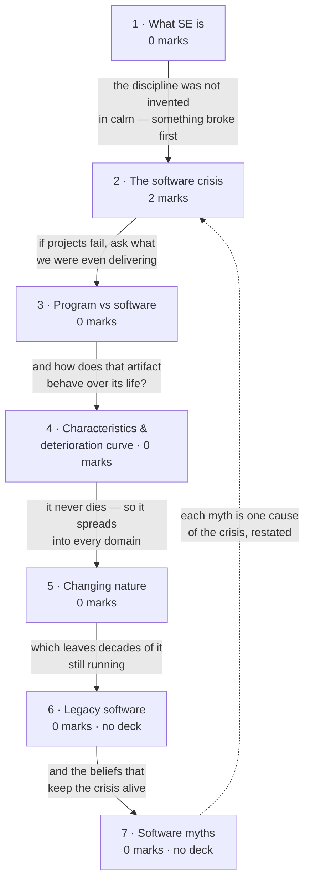

# Introduction to Software Engineering

**Prerequisites:** none — this is the entry point of the course.

## Overview

> [!info] 2 of 80 in [[se-ete-2025-26]] — question A5
> A5 asks whether a late project can be rescued by adding people. The deck plants
> that answer in its **software crisis** slide, and the paper tags the question
> **CO1** (lectures 1-12) — so it is examined here, not on
> [[Effort Estimation & COCOMO]] where the person-month arithmetic lives.
> One paper only; see [[weightage]].

The course opens by justifying its own existence. Software is the one thing we
build that never wears out, cannot be seen, and can be changed at any moment for
almost nothing — and that last property is a trap, not a gift. These three
lectures establish what software actually is, what went wrong when the industry
treated it like manufacturing, and which comfortable beliefs still make projects
fail. Everything in [[story]] hangs off this.

> [!warning] Two subtopics have no source in this vault
> **Legacy software** and **software myths** are named in the handout (lecture 3)
> and appear in **no deck at all** — a keyword sweep of all 24 decks returns zero
> hits for "myth" and no lecture-3 treatment of "legacy". Pressman 8e is not in
> `raw/sources/` either, so rule 6's fallback is unavailable. Subtopics 6 and 7
> are written from standard Pressman material and are **labelled as unsourced**.
> Treat their specifics as indicative, not as your instructor's wording.

## Quick Reference

> [!abstract] The three facts that carry this topic
> - **Software = Program + Documentation + Operating Procedures.** A program is
>   one third of a software product.
> - **Hardware wears out; software deteriorates.** Hardware fails from physical
>   decay, software from accumulated change. The curve ratchets up at every
>   maintenance release and never returns to its old baseline.
> - **Adding people to a late project makes it later.** The crisis-era finding,
>   and the whole of A5.

**Definition.** Software engineering is an engineering discipline concerned with
all aspects of software production — aiming at fault-free software that meets
user needs, on time and within budget.

| Term | It means |
|---|---|
| Program | executable code alone |
| Software | program **+** documentation **+** operating procedures |
| Software crisis | the late-1960s realisation that software development does not behave like manufacturing |
| Legacy software | older systems still in service, business-critical, poorly documented, expensive to change |

**The three canonical failures** — one per cause, worth naming precisely:

| Failure | Year | Cause |
|---|---|---|
| Ariane 5 | 1996 | destroyed 39 s after launch; 10 years and $7 bn of development, four satellites lost |
| Patriot missile | 1991 | clock timing error accumulating over 100 h of operation; 28 US soldiers killed at Dhahran |
| Y2K | 2000 | two-digit year fields — an assumption, not a coding bug |

**Six causes of the software crisis:** lack of communication between developer
and user · cost of software rising relative to hardware · growth in software size
· project management problems · inadequate training in software engineering ·
skill shortage.

**Documentation, by phase** (the deck's own table):

| Phase | Documents |
|---|---|
| Analysis / specification | formal specification, context diagram, DFDs |
| Design | flow charts, ER diagram |
| Implementation | source code listings, cross-reference listing |
| Testing | test data, test results |

**Operating procedures:** user manuals (system overview, beginner's guide,
tutorial, reference guide) and operational manuals (installation guide, system
administration guide).

**Five software characteristics:** does not wear out · engineered, not
manufactured · components are reusable · highly flexible · logical rather than
physical.

**Eight application domains:** system · real-time · embedded · engineering and
scientific · business · web-based · personal computer · artificial intelligence.

**The four maintenance types** — the deck introduces them here, inside waterfall;
they are examined on [[Software Maintenance]]:

| Type | Purpose |
|---|---|
| Corrective | fix defects missed during development |
| Adaptive | port to a new platform or environment |
| Perfective | add or enhance functionality on request |
| Preventive | pre-empt future problems |

## Subtopic map

| # | Subtopic | Marks | Why it's here |
|---|---|---|---|
| 1 | What software engineering is | 0 | the definition every other page assumes |
| 2 | The software crisis | **2** | the only examined part — carries A5 |
| 3 | Program vs software | 0 | the distinction the whole course rests on |
| 4 | Software characteristics and the deterioration curve | 0 | the diagram that explains why maintenance dominates |
| 5 | The changing nature of software | 0 | the eight application domains, a listing answer |
| 6 | Legacy software | 0 | **no deck covers this** |
| 7 | Software myths | 0 | **no deck covers this** |

## Mindmap

**1 · What software engineering is — 0 marks**
- **What:** an engineering discipline covering all aspects of software
  production, using systematic method and appropriate tools.
- **Why:** without it software is craft — unrepeatable, unestimable, and
  unaccountable when it fails.
- **Important:** never examined. Know the one-line definition, and that computer
  science supplies the theory while software engineering supplies the tools and
  techniques to solve a customer's problem.

**2 · The software crisis — 2 marks**
- **What:** the late-1960s recognition that software development does not scale
  like manufacturing.
- **Why:** it is the historical event that created the discipline, and its
  central finding still governs project management.
- **Important:** **adding manpower to a late project delays it further** — that
  is A5, worth 2 marks. Plus six causes and three named failures.

**3 · Program vs software — 0 marks**
- **What:** software = program + documentation + operating procedures.
- **Why:** it explains why a working program is nowhere near a delivered
  product, and why documentation is a deliverable rather than a courtesy.
- **Important:** never examined, but assumed everywhere. Memorise the three-part
  equation and the phase→document table in Quick Reference.

**4 · Software characteristics and the deterioration curve — 0 marks**
- **What:** five properties of software, and the failure-rate curve that
  contrasts it with hardware.
- **Why:** the curve is the most explanatory diagram in the module — maintenance
  cost, regression testing and re-engineering all follow from it.
- **Important:** never examined, but **be able to draw both curves**. Hardware:
  bathtub, ending in wear-out. Software: should flatten forever, actually
  ratchets upward at each change.

**5 · The changing nature of software — 0 marks**
- **What:** the eight application domains software has spread into.
- **Why:** it shows that one process cannot fit all software — the argument
  [[Conventional Process Models]] picks up.
- **Important:** never examined. A listing answer; know the eight names and stop
  there.

**6 · Legacy software — 0 marks**
- **What:** older systems still in business-critical service, poorly documented
  and costly to change.
- **Why:** it is why [[Re-engineering & Reverse Engineering]] exists as a topic.
- **Important:** never examined, **and no deck covers it**. Know the definition
  and the four pressures. Note that A1 on the paper is a legacy scenario, but its
  marks sit on the re-engineering page.

**7 · Software myths — 0 marks**
- **What:** widely held false beliefs about software, grouped as management,
  customer and practitioner myths.
- **Why:** each myth is one cause of the crisis, restated as something a real
  person sincerely believes.
- **Important:** never examined, **and no deck covers it**. Know two or three per
  category and the reality that refutes each.

## 1 · What software engineering is

**Intuition.** Computer science tells you what a machine can compute. It does not
tell you how five people build a payroll system in nine months for a customer who
keeps changing their mind. Software engineering is the discipline between the
theory and the customer's problem, supplying tools, techniques and — above all —
a *systematic* approach chosen to fit the problem, the constraints and the
resources available.

**Definitions & distinctions.**

> Software engineering is an engineering discipline concerned with all aspects of
> software production. Software engineers should adopt a systematic and organised
> approach to their work and use appropriate tools and techniques depending on
> the problem to be solved, the development constraints and the resources
> available.

The deck's second phrasing is the one to quote, because it names the three
success criteria: *fault-free software, that satisfies the user's needs,
delivered on time and within budget.*

| | Computer science | Software engineering |
|---|---|---|
| Supplies | theories, computer function and methods | tools and techniques to solve the problem |
| Faces | the machine | the customer and their problem |

**What gets asked.** Never examined on the one paper in this vault. Know the
definition well enough to open an answer with it — several longer questions
reward a crisp opening line.

## 2 · The software crisis

**Intuition.** By the late 1960s the industry had learned something painful:
software does not behave like anything else engineers build. Projects ran late,
and the obvious fix — put more programmers on it — made them *later*, because a
newcomer must be trained by someone already working flat out, and every added
person multiplies the communication paths. Meanwhile hardware kept getting
cheaper as software got bigger and more expensive, so the thing least under
control became the thing that mattered most. The crisis is not a historical
curiosity; it is the problem statement that the remaining 50 lectures answer.

**Definitions & distinctions.**

**The six causes**, in the deck's order: lack of communication between software
developer and user · increase in the cost of software compared to hardware ·
increase in the size of software · project management problems · lack of adequate
training in software engineering · increasing skill shortage.

**Why more people does not mean faster.** Adding programmers late in development
"does not always help speed up the development process. Instead, sometimes it may
have negative impacts like delay in achieving the scheduled targets, degradation
of software quality." Three mechanisms:

1. **Training cost** — newcomers must be brought up to speed by the people who
   are already the bottleneck, so throughput drops before it rises.
2. **Communication overhead** — *n* people have *n(n−1)/2* pairwise channels.
   Doubling a team roughly quadruples the coordination cost.
3. **Partitioning limits** — some tasks cannot be subdivided at all. The formal
   version is on [[Effort Estimation & COCOMO]], where effort in person-months
   and duration in months are shown not to be interchangeable.

**Solved questions.**

> **[[se-ete-2025-26]] Q A5 (2 marks, CO1)** — "A software development process is
> delayed from its scheduled time. Is it possible to develop the software on time
> by adding more employees? Justify your answer."

**Answer.** No — and in general, adding people to a late project makes it later.

Three reasons, any two of which earn the marks:

1. New members must be trained by existing team members, who are diverted from
   productive work exactly when the schedule is tightest. Output falls before it
   recovers.
2. Communication paths grow as *n(n−1)/2* while productive output grows at best
   linearly with *n*, so past a point each extra person adds more coordination
   cost than capacity.
3. Not all tasks are partitionable — work with sequential dependencies cannot be
   compressed by parallelism however many people are available.

The correct responses instead are to **reduce scope**, **extend the schedule**, or
**re-plan with the time remaining**. *(No printed solution key exists for this
paper, so this answer is unchecked — no `✓`.)*

**What gets asked.** This is a 2-marker and it is the whole subtopic's marks. One
question form so far:

- **Spot it** — a scenario in which a project is behind schedule, asking whether
  resources can fix it. Any phrasing of "add more developers / employees /
  programmers".
- **Method** — answer **no** in the first line, then justify with training cost,
  communication overhead and non-partitionable work. Close by naming the real
  remedies.
- **Trap** — answering "yes, if they are added early" and stopping. The question
  says the project is *already* delayed; hedging without naming a mechanism earns
  half marks at best. Second trap: asserting the law by name only. A 2-marker
  wants the reason, not the eponym.

The six causes and the three named failures are also plausible Section A material
and have not yet been asked.

## 3 · Program vs software

**Intuition.** Students arrive at this course believing they have written
software. They have written programs. The difference shows the moment somebody
*else* must run, understand or change the thing: without documentation nobody can
modify it safely, and without operating procedures nobody can install or
administer it. Both are deliverables — which is why a "finished" program is
roughly a third of a finished product.

**Definitions & distinctions.**

> **Software = Program + Documentation + Operating Procedures**

What each part contains is in Quick Reference — the phase→document table and the
two manual families. Not repeated here.

**What gets asked.** Never examined. But the equation is exactly the kind of
one-line definition Section A likes, and it costs nothing to memorise.

## 4 · Software characteristics and the deterioration curve

**Intuition.** A bridge fails because steel fatigues. Software has no steel, so
in an ideal world its failure rate would fall as early defects were found and
then stay flat forever. It does not. Every change made after release fixes one
thing and disturbs another, so the curve jumps at each maintenance release and
settles *higher* than before. Software does not wear out — it **deteriorates** —
and the agent of deterioration is change itself. Draw the two curves side by side
and you have the argument for every practice in this course.

**Definitions & distinctions.**

| | Hardware | Software |
|---|---|---|
| Curve shape | bathtub: burn-in, useful life, wear-out | falling, then a ratchet upward at each change |
| Failure cause | physical decay — dust, vibration, temperature extremes | change: each fix introduces new faults |
| End of life | wears out | retired for environmental change, new requirements, new expectations |

**The five characteristics.** Software does not wear out · it is developed or
engineered, not manufactured in the classical sense · its components are reusable
· it is highly flexible · it is a logical rather than a physical system element.

The pairing that matters: *engineered, not manufactured* means the cost sits in
**development**, not in reproduction. Copying software is free — which is exactly
why every cost is a design cost.

**What gets asked.** Never examined. Keep it to the definitions — but **be able
to draw both curves, labelled**. A drawn diagram is cheap insurance in any longer
answer about maintenance or quality, and this course puts 20 of 80 marks on
drawings.

## 5 · The changing nature of software

**Intuition.** Because software never wears out and can be reshaped endlessly, it
has spread into every domain that will have it — from firmware in a washing
machine to a recommendation engine. That spread is what makes a single universal
process impossible, and it sets up the next topic's argument.

**Definitions & distinctions.** The eight domains: **system · real-time ·
embedded · engineering and scientific · business · web-based · personal computer
· artificial intelligence** software.

**What gets asked.** Never examined. A listing answer — name the eight, give one
example each if asked, and spend no longer on it.

## 6 · Legacy software

> [!warning] Unsourced — no deck covers this
> The handout names legacy software in lecture 3. No deck in `raw/sources/ppts/`
> treats it (the only two hits for "legacy" are incidental mentions in the DevOps
> and re-engineering decks), and Pressman 8e is not in this vault. What follows is
> standard textbook material, not your instructor's slides.

**Intuition.** Somewhere a bank is still running a system written before its
current developers were born. It cannot be switched off, because the business
depends on it; it cannot easily be changed, because nobody fully understands it
and the documentation is wrong or missing. That combination — business-critical
*and* unmaintainable — is what makes legacy software a category rather than just
old code.

**Definitions & distinctions.** Legacy software is an older system still in
service, typically showing some of: poor quality from years of unstructured
patching · absent or outdated documentation · a brittle design that resists
change · dependence on obsolete hardware, languages or platforms · and, despite
all of it, **business criticality**.

The four responses, in increasing cost: leave it alone if it is stable and
isolated · re-engineer it to improve maintainability · adapt it to interoperate
with newer systems · replace it. The machinery for re-engineering is on
[[Re-engineering & Reverse Engineering]].

**What gets asked.** Never examined *on this page*. Note though that
[[se-ete-2025-26]] Q A1 is a legacy scenario — a 15-year-old COBOL system with
outdated documentation — asked as a re-engineering question, so its 2 marks sit
on [[Re-engineering & Reverse Engineering]]. Know the definition here; the method
is there.

## 7 · Software myths

> [!warning] Unsourced — no deck covers this
> A keyword sweep of all 24 decks returns **zero** hits for "myth". The handout
> names software myths in lecture 3, and the syllabus paragraph names them again.
> This is a rule-5 gap: absence from the decks is not evidence the topic is out of
> scope. Written from standard Pressman material.

**Intuition.** Each myth is one of the crisis's causes restated as something a
real person sincerely believes. That is what makes them dangerous — they are not
stupid, they are plausible, and each comes with an obvious-sounding
justification. Naming them is how the course inoculates you.

**Definitions & distinctions.**

| Myth | Held by | The reality |
|---|---|---|
| "A book of standards exists, so my people have all they need" | management | it may be unread, out of date, or quietly ignored |
| "We can add programmers to catch up" | management | adding people to a late project makes it later — subtopic 2 |
| "Outsourcing lets me relax" | management | outsourced projects fail for the same reasons in-house ones do |
| "A general statement of objectives is enough to start; details come later" | customer | ambiguous requirements are the largest single cause of failure |
| "Requirements change is easy to absorb because software is flexible" | customer | the cost of change rises steeply the later it lands |
| "Once the program works, we're done" | practitioner | 60% or more of total effort is spent *after* first delivery |
| "Until the program runs, there's no way to assess quality" | practitioner | reviews and inspections find defects earlier and cheaper than execution does |
| "The only deliverable is the working program" | practitioner | software = program + documentation + operating procedures |

**What gets asked.** Never examined. Know two or three per category with the
reality that refutes each. The management myth about adding programmers deserves
extra attention because it is the same content as A5 — if myths are ever asked,
that is the one already proven examinable.

## Question Bank

**PYQ questions — 1.**

> **[[se-ete-2025-26]] Q A5 (2 marks, CO1)** — "A software development process is
> delayed from its scheduled time. Is it possible to develop the software on time
> by adding more employees? Justify your answer."

Worked in full in subtopic 2. Short form: **No.** Training diverts existing staff;
communication paths grow as *n(n−1)/2* against linear output; some tasks are not
partitionable. Remedies are scope reduction, schedule extension or re-planning.
*(Unchecked — no solution key exists for this paper.)*

**Deck questions — none.** `L1 PPT from 1 to 8.pdf` is expository throughout and
carries no worked examples, MCQs or practice bank.

**Textbook questions — unavailable.** Pressman 8e is prescribed by
[[se-handout-2026-muj]] and is not in `raw/sources/`.

So: **one question, from one paper.** That is the entire drill supply for this
topic, stated rather than padded out with invented questions.

## Mistakes & Traps

- **Answering A5 "yes, if added early enough."** The question stipulates the
  project is already delayed. Answer no, then justify.
- **Naming Brooks's Law instead of explaining it.** A 2-marker wants the
  mechanism; the eponym earns nothing on its own.
- **Confusing the two curves.** The bathtub curve is *hardware*. Software's ideal
  curve flattens; its real curve ratchets upward. Label which is which whenever
  you draw them.
- **Saying software "wears out".** It deteriorates. Using the wrong verb signals
  you missed the point of the entire diagram.
- **Treating documentation as optional.** It is one of the three components of
  software by definition.

## Course Material

- `raw/sources/ppts/2025/L1 PPT from 1 to 8.pdf` — covers lectures 1-8. For this
  topic: the definition, SE vs computer science, the software crisis with its six
  causes and three failures, program vs software with both documentation tables,
  the five characteristics, the two failure curves, and the eight application
  domains.

**Deck gaps for this topic**, confirmed by keyword sweep across all 24 decks:

| Handout content | Lecture | Deck coverage |
|---|---|---|
| Software myths | 3 | **none — zero hits for "myth" in any deck** |
| Legacy software | 3 | **none as lecture content** |
| Evolving role of software | 2 | **none under that name** |

Rule 5: absence from the decks is not evidence these are out of scope — the
handout names all three. Rule 6's fallback is unavailable because Pressman 8e is
not in the vault. Subtopics 6 and 7 are flagged inline as unsourced.

**Related:** [[story]] · [[syllabus]] · [[weightage]] · [[MTE Roadmap]] · next
topic [[Software Engineering as a Layered Technology]]
