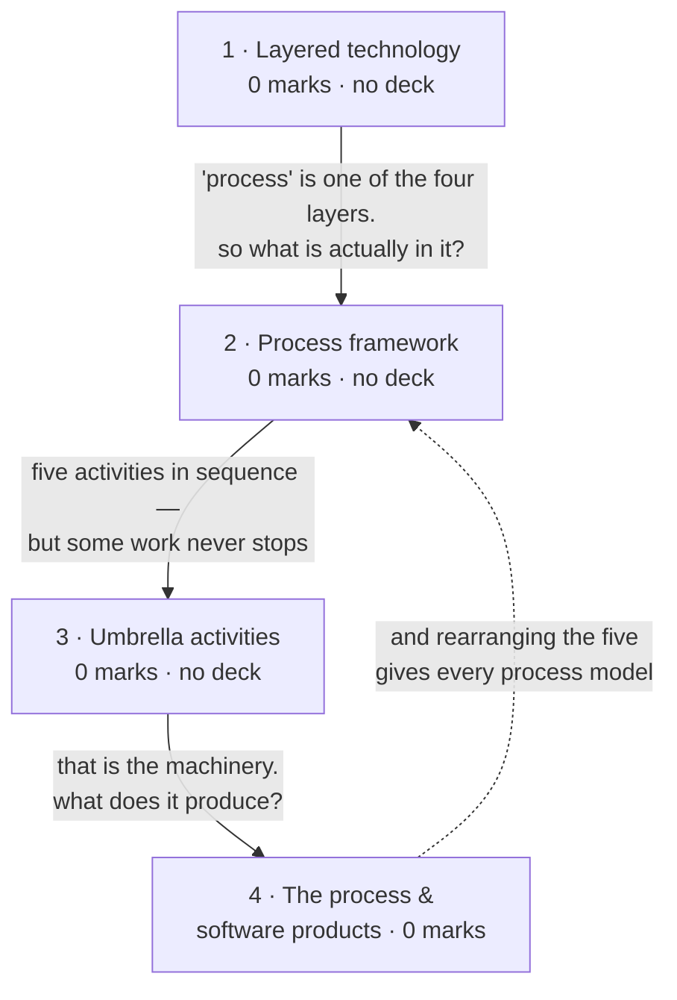

# Software Engineering as a Layered Technology

**Prerequisites:** [[Introduction to Software Engineering]]

## Overview

> [!warning] 0 of 80 in [[se-ete-2025-26]] — not asked once, on one paper
> A single paper cannot show a topic is unexamined, only that it was not asked
> that day. In syllabus and taught, so fully examinable. Lectures 4-5 is
> *syllabus depth* and rule 3 forbids reading it as marks.

If [[Introduction to Software Engineering]] argued that software needs
engineering, this topic supplies the shape of it: four layers, each resting on
the one below, and a **process framework** of five activities that every project
performs regardless of which model it follows. It is the vocabulary the rest of
the course speaks in — "framework activity", "umbrella activity" and "process
model" all get their meanings here.

> [!warning] This page is almost entirely unsourced
> A keyword sweep of all 24 decks returns **zero hits** for "layered",
> "umbrella", "generic process" and "process framework" as lecture content. The
> handout names all of them in lecture 4, and again in Module 1 and in the
> syllabus paragraph. Pressman 8e is not in `raw/sources/`, so rule 6's fallback
> is unavailable too.
>
> Everything below except subtopic 4 is **standard Pressman material, not your
> instructor's slides**. Rule 5: absence from the decks is not evidence of being
> out of scope. **This is the page to fix first if you can get the lecture 4-5
> slides or the textbook.**

## Quick Reference

> [!abstract] The two structures that carry this topic
> - **The four layers, bottom-up: quality focus → process → methods → tools.**
>   Each rests on the one beneath. Quality focus is the bedrock, not the top.
> - **Five framework activities: communication, planning, modeling,
>   construction, deployment.** Every project does all five. What changes between
>   process models is *how often and in what order*, never *whether*.

**The layered technology**

| Layer | What it is | If it is missing |
|---|---|---|
| **Tools** | automated or semi-automated support (CASE tools) | methods must be applied by hand |
| **Methods** | the technical "how to": requirements analysis, design, coding, testing | the process has activities but no technique to perform them |
| **Process** | the glue — holds methods and tools together, defines order and deliverables | methods are applied ad hoc; results are unrepeatable |
| **Quality focus** | the organisational commitment to continuous improvement | there is no reason for any of the above to exist |

Read it bottom-up: **quality focus is the foundation**, tools are the top.
Drawing it upside down is the classic error.

**The five framework activities**

| Activity | What happens |
|---|---|
| Communication | talk to the customer; gather requirements |
| Planning | define the work — tasks, risks, resources, schedule |
| Modeling | build the analysis and design models |
| Construction | code it and test it |
| Deployment | deliver, get feedback, support |

**Umbrella activities** run *across* all five, throughout the project — they are
not a phase:

project tracking and control · risk management · quality assurance · technical
reviews · measurement · configuration management · reusability management · work
product preparation and production.

**Two distinctions that get confused**

| | Process framework | Process model |
|---|---|---|
| What it is | the set of activities every project performs | a specific arrangement of those activities |
| Example | communication, planning, modeling, construction, deployment | waterfall, spiral, incremental |
| Varies by project? | no | yes — this is the choice you make |

| | Framework activity | Umbrella activity |
|---|---|---|
| When | happens in sequence, as a phase | runs continuously, across all phases |
| Example | modeling | risk management |

**Software products**

| Product type | Built for | Requirements come from |
|---|---|---|
| Generic | the open market, sold to many customers | the developing organisation |
| Customised (bespoke) | one specific customer | that customer |

Software = program + documentation + operating procedures; the five
characteristics; the eight application domains — all on
[[Introduction to Software Engineering]], not repeated here. The handout assigns
them to lecture 5; the deck teaches them alongside lecture 1-3 material, so this
vault keeps them on the earlier page.

## Subtopic map

| # | Subtopic | Marks | Why it's here |
|---|---|---|---|
| 1 | Software engineering as a layered technology | 0 | the four-layer stack — **no deck** |
| 2 | The generic process framework | 0 | the five activities every model rearranges — **no deck** |
| 3 | Umbrella activities | 0 | what runs across all phases — **no deck** |
| 4 | The process, and software products | 0 | generic vs customised; points back to topic 1 |

## Mindmap

**1 · Software engineering as a layered technology — 0 marks**
- **What:** SE rests on four layers — quality focus, process, methods, tools —
  each supported by the one below.
- **Why:** it explains why buying tools does not make an organisation good at
  software: tools sit on top of three layers that must already exist.
- **Important:** never examined, **no deck covers it**. Know the four names in
  bottom-up order. Quality focus is the base.

**2 · The generic process framework — 0 marks**
- **What:** the five framework activities every project performs —
  communication, planning, modeling, construction, deployment.
- **Why:** it is what makes process *models* comparable. Every model in the next
  two topics is these five, reordered or repeated.
- **Important:** never examined, **no deck covers it**. Know the five in order.
  They are the vocabulary [[Conventional Process Models]] uses.

**3 · Umbrella activities — 0 marks**
- **What:** activities that run across the whole project rather than occupying a
  phase — risk management, quality assurance, configuration management and the
  rest.
- **Why:** some work cannot be scheduled as a stage, because stopping it at any
  point degrades the project silently.
- **Important:** never examined, **no deck covers it**. The examinable point is
  the *distinction* from framework activities, not the full list of eight.

**4 · The process, and software products — 0 marks**
- **What:** what a process is, and the generic-vs-customised product split.
- **Why:** who the requirements come from changes everything downstream —
  including whether there is a single customer to consult at all.
- **Important:** never examined. Software characteristics and application domains
  belong to this lecture in the handout but are taught on
  [[Introduction to Software Engineering]]; revise them there.

## 1 · Software engineering as a layered technology

> [!warning] Unsourced — no deck covers this
> Zero hits for "layered" across all 24 decks. Standard Pressman material.

**Intuition.** Organisations buy tools and expect to become good at software. It
does not work, and the layer diagram says why: tools sit at the *top* of a stack.
Underneath them are the **methods** that say what to actually do, under that the
**process** that decides when and in what order, and at the very bottom a
**quality focus** — the organisational commitment that gives any of it a reason
to exist. Remove a lower layer and everything above has nothing to stand on. A
team with tools but no process just makes mistakes faster.

**Definitions & distinctions.** The four layers and their failure modes are
tabulated in Quick Reference. The one thing to internalise is the direction:
**quality focus is the bedrock, tools are the top**, so the stack is drawn with
quality at the bottom.

**What gets asked.** Never examined on the one paper here. If it appears it is
most likely a Section A "explain software engineering as a layered technology"
worth 2 marks — answer with the four names bottom-up plus one line each, and draw
the stack. It costs ten seconds and makes the ordering unambiguous.

## 2 · The generic process framework

> [!warning] Unsourced — no deck covers this
> Zero hits for "process framework" as lecture content. Standard Pressman
> material.

**Intuition.** Strip any process model down and the same five things are
happening: someone talks to the customer, someone plans the work, someone models
it, someone builds it, someone ships it. Waterfall does each once, in order.
Spiral does all five per loop. Agile does all five per sprint. **What differs
between models is the arrangement, never the ingredients** — which is exactly why
the comparison table on [[Evolutionary Process Models]] is possible at all.

**Definitions & distinctions.** The five activities are tabulated in Quick
Reference. The framework-vs-model distinction is the part worth being precise
about: the *framework* is fixed and universal, the *model* is the choice you make
for a given project.

**What gets asked.** Never examined. Know the five names in order — they recur as
the vocabulary of every process-model answer, and using them makes those answers
noticeably more precise.

## 3 · Umbrella activities

> [!warning] Unsourced — no deck covers this
> Zero hits for "umbrella" across all 24 decks. Standard Pressman material.

**Intuition.** You cannot schedule risk management as week six. You cannot do
configuration management on Tuesday and then stop. Some work has to run
continuously alongside everything else, because the moment it stops the project
begins degrading without anyone noticing. Those are the umbrella activities —
drawn as a band across the whole timeline rather than as a box within it.

**Definitions & distinctions.** The eight are listed in Quick Reference. The
examinable content is the contrast with framework activities: **framework
activities are phases, umbrella activities are continuous.** Two of them get whole
topics later — risk management on [[Risk Analysis & Estimation]], quality
assurance and technical reviews on [[Software Quality Assurance]].

**What gets asked.** Never examined. If asked, the distinction earns the marks;
reciting all eight without it does not.

## 4 · The process, and software products

**Intuition.** A process is a set of activities with an order and a set of
deliverables — the thing that turns "we built something" into "we can build
another one the same way". And what you are building shapes it: a product sold to
thousands of customers has no single customer to consult, so the developing
organisation invents the requirements itself. A bespoke system has exactly one
customer who is the sole authority. That difference propagates all the way into
which process model is even viable.

**Definitions & distinctions.** The generic-vs-customised split is in Quick
Reference.

The handout assigns *software products, characteristics and applications* to
lecture 5, but the deck teaches all three in its opening run alongside lecture 1-3
material. Following rule 8 — the deck sets the teaching structure — they live on
[[Introduction to Software Engineering]]. Revise them there; they are not
duplicated here.

**What gets asked.** Never examined.

## Question Bank

**PYQ questions — none.** No question on [[se-ete-2025-26]] tests this topic.

**Deck questions — none, because no deck covers the topic.** See the warning at
the top of this page.

**Textbook questions — unavailable.** Pressman 8e is prescribed by
[[se-handout-2026-muj]] and is not in `raw/sources/`.

**This topic has no questions in any of the three tiers.** Stated rather than
filled with invented drill. If the lecture 4-5 slides or the textbook are added
to the vault, this section is the first thing to rebuild.

## Mistakes & Traps

- **Drawing the layer stack upside down.** Quality focus is the *bottom*. Putting
  tools at the base inverts the argument the diagram exists to make.
- **Confusing framework activities with umbrella activities.** Phases versus
  continuous. This is the distinction any question here would target.
- **Confusing the process framework with a process model.** The framework is what
  every project does; the model is how one project arranges it.
- **Listing the five framework activities out of order.** Communication →
  planning → modeling → construction → deployment. The order is the content.

## Course Material

**No deck covers this topic.** Confirmed by keyword sweep of all 24 files in
`raw/sources/ppts/`:

| Handout content | Lecture | Hits across all decks |
|---|---|---|
| Layered approach | 4 | **0** for "layered" |
| Generic approach | 4 | **0** for "generic process" |
| Process framework | 4 | **0** as lecture content |
| Umbrella activities | 4 | **0** for "umbrella" |
| The process, software products | 5 | partial — taught on the earlier page |
| Software characteristics, applications | 5 | covered, on [[Introduction to Software Engineering]] |

Rule 5 governs: the handout names this material three separate times, so it is in
scope regardless of the decks' silence. Rule 6's fallback is unavailable because
Pressman 8e is not in the vault.

**Highest-value fix available to this vault:** the lecture 4-5 slides, or
Pressman 8e chapters 1-2.

**Related:** [[story]] · [[syllabus]] · [[weightage]] · [[MTE Roadmap]] ·
previous [[Introduction to Software Engineering]] · next
[[Conventional Process Models]]
