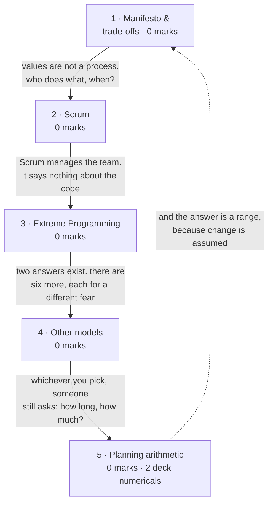

# Agile Development

**Prerequisites:** [[Evolutionary Process Models]]

## Overview

> [!warning] 0 of 80 in [[se-ete-2025-26]] — not asked once, on one paper
> A single paper cannot show a topic is unexamined. In syllabus, taught across
> **three lectures**, and the module's longest deck treatment. Lectures 9-11 is
> *syllabus depth* and rule 3 forbids reading it as marks.

> [!tip] Zero marks, but the richest question supply on any page in this vault
> The deck carries **two full numericals** — release planning and sprint capacity
> — and rule 8 rates deck questions as drill of the highest value even when a
> form has never been examined. Both are worked in the Question Bank. If this
> topic is ever examined numerically, that is what it will look like.

- **The argument:** if requirements will change anyway, stop treating change as
  failure and build the process to absorb it — short iterations, working software
  over documents, the customer in the room.
- **Three lectures:** the manifesto, then the model zoo — Scrum, XP, ASD, DSDM,
  FDD, Crystal, Agile Modeling, Kanban.

## Quick Reference

> [!abstract] The four values, which are the whole thing
> Each is "**A over B**" — B still has value, A has *more*.
> - **People over processes**
> - **Working solutions over detailed documentation**
> - **Customer collaboration over rigid contracts**
> - **Adapting to change over following a strict plan**

**Benefits:** faster time to market · better stakeholder involvement · increased
team productivity.

**Disadvantages** — the deck's own table, and the likelier exam target because
students only revise the benefits:

| Challenge | Impact |
|---|---|
| Unclear scope and timelines | hard to predict deadlines and costs |
| High stakeholder involvement | burnout and decision fatigue |
| Risk of lost details | less documentation may lose information |
| Harder to scale for large teams | coordination becomes complex |
| Team discipline needed | self-managing teams may lack focus |

**Agile vs traditional:** waterfall is strict and sequential and suits **stable
requirements**; agile breaks work into repeatable phases, involves the customer
throughout, and suits **fast-changing** projects where adaptability and speed
matter.

**The eight models the deck names:** Scrum · FDD · ASD · DSDM · XP · Crystal ·
Agile Modeling (AM) · Kanban.

### Scrum

| | |
|---|---|
| Created by | Jeff Sutherland and Ken Schwaber |
| Principles | transparency · reflection · adaptation |
| Values (5) | commitment · courage · focus · openness · respect |
| Sprint length | a time-boxed period, typically **30 days** |
| Team size | the **two-pizza rule** — small enough to share two pizzas |

| Artifact | What it is |
|---|---|
| Product Backlog | dynamic prioritised list of **everything** needed; owned and reprioritised by the Product Owner |
| Sprint Backlog | the slice chosen for the current sprint; may evolve during it |
| Increment | the **usable** end product of a sprint — not a demo, not a branch |

| Role | Responsible for |
|---|---|
| Product Owner | defines stories, prioritises the backlog, decides release timing |
| Scrum leader / Master | sets up the team and sprint meetings, removes obstacles — **not a manager** |
| Development Team | self-organising, cross-functional; plans and estimates its own sprint work |

**Events:** Sprint Planning · Sprint (the work period) · Daily Scrum / stand-up ·
Sprint Review · Sprint Retrospective. Deliberately short — the deck notes
stand-ups are "sometimes conducted without chairs".

### Extreme Programming (XP)

The most specific agile framework on engineering practice. Four activities:

| Activity | Practices |
|---|---|
| Planning | **user stories** on index cards, written by the customer; team assigns a cost to each; stories grouped into a deliverable increment; **project velocity** sets later delivery dates |
| Design | KIS (keep it simple) · **CRC cards** (Class-Responsibility-Collaborator) · **spike solutions** for hard problems · **refactoring** |
| Coding | write the **unit test before the code** · **pair programming** |
| Testing | all unit tests run daily · **acceptance tests** defined by the customer |

- **User story** — a simple, informal statement of a needed function, written by
  the customer on an index card. Similar to a use case.
- **Spike** — a very simple program built to explore whether a proposed solution
  is suitable. Similar to a prototype.
- **Project velocity** — measured after the first increment, then used to set
  delivery dates for the rest. The link into the planning arithmetic below.

### The other models

| Model | Proposed by | Distinguishing feature |
|---|---|---|
| **ASD** — Adaptive Software Development | Jim Highsmith | three phases: **speculation → collaboration → learning**; mission-driven planning, time-boxing, explicit risk consideration |
| **DSDM** — Dynamic Systems Development Method | — | **timeboxing** with firm deadlines; deliver business benefit early and often |
| **FDD** — Feature Driven Development | — | five iterative activities, organised around **features** |
| **Crystal** | Cockburn and Highsmith | **colour-coded by risk to human life** (Crystal Clear → Crystal Sapphire); six aspects — people, interaction, community, communication, skills, talents; process is secondary |
| **Agile Modeling (AM)** | — | values, principles and practices for effective modeling |
| **Kanban** | — | named by the deck, not developed |

- **"Speculation" rather than "planning"** in ASD is deliberate — it admits the
  plan is a guess. Adaptive cycle planning uses the mission statement, project
  constraints and basic requirements to produce a time-boxed release plan.
- **Crystal Clear** = a six-developer project in one room; **Crystal Sapphire** =
  where lives are at stake.

### Planning arithmetic

| Symbol | Meaning | Units |
|---|---|---|
| *P* | total story points (or ideal days) in the release | points |
| *V* | velocity — points completed per iteration | points/iteration |
| *N* | number of iterations | iterations, **always rounded up** |
| *L* | iteration length | weeks |
| *C* | cost per iteration | currency |

$$N = \lceil P / V \rceil \qquad \text{Duration} = N \times L \qquad \text{Cost} = N \times C$$

**Sprint capacity**, per team member: **capacity = days available × hours per
day**, summed across the team. Where hours/day is a range, team capacity is a
range too.

## Subtopic map

| # | Subtopic | Marks | Why it's here |
|---|---|---|---|
| 1 | The Agile manifesto and its trade-offs | 0 | the four values, and the disadvantages students skip |
| 2 | Scrum | 0 | the most detailed model in the deck |
| 3 | Extreme Programming | 0 | the engineering-practice model — pair programming, TDD, refactoring |
| 4 | The other agile models | 0 | ASD, DSDM, FDD, Crystal, AM, Kanban |
| 5 | Agile planning arithmetic | 0 | **two deck numericals** — the page's real drill |

## Mindmap

## 1 · The Agile manifesto and its trade-offs

- **Agile is not "less process".** It is a bet that where requirements change,
  the cost of *predicting* exceeds the cost of *adapting*. It inverts four
  priorities — not abolishing the right-hand side of each pair, but demoting it.
- **The classic misreading:** "working solutions over detailed documentation"
  does *not* mean no documentation. It means documentation that does not help
  ship working software is waste.
- Four values, benefits, disadvantages, agile-vs-traditional: Quick Reference.
- **The framing worth carrying:** waterfall suits **stable** requirements, agile
  suits **fast-changing** ones — the same requirement-stability question that
  decides every model on [[Conventional Process Models]] and
  [[Evolutionary Process Models]].
- **Never examined here.** [[se-ete-2025-26]] Q A3 asks why an SRS is required in
  large projects but often avoided in Agile — the *answer* is agile's second
  value, but the marks sit on [[Requirements Engineering]].

## 2 · Scrum

- **What it adds:** agile's values do not tell anyone what to do on Monday. Scrum
  does — a small self-organising team pulls a slice from a prioritised list,
  commits to finishing it inside a fixed time box, meets briefly daily, shows the
  result at the end.
- **The time box is the trick.** It is never extended, so when work does not fit,
  **scope gives rather than the date**. That single rule is what makes agile
  plannable.
- Artifacts, roles, events, principles, values: Quick Reference. The
  Product-vs-Sprint Backlog distinction and "the Increment is usable" are the two
  points that make an answer look informed.
- **Never examined.** Most plausible form: a 2-marker on roles or artifacts — the
  3-and-3 grid answers both. Sprint ≈ 30 days; Sutherland and Schwaber.

## 3 · Extreme Programming

- **The contrast with Scrum:** Scrum organises people and says nothing about the
  code. XP is opinionated about engineering practice, and takes each practice to
  an "extreme" — if code review is good, review continuously (**pair
  programming**); if testing is good, test before there is anything to test
  (**unit test first**); if simple design is good, never build for a future you
  cannot see and restructure continuously (**refactoring**).
- Four activities, their practices, and the definitions of *user story*, *spike*,
  *CRC card* and *project velocity*: Quick Reference.
- **Never examined.** If it appears, **pair programming** and **test-before-code**
  are the practices worth naming first.

## 4 · The other agile models

- **Each answers a different worry:** ASD worries about risk and learning · DSDM
  about deadlines, and fixes them absolutely · FDD about losing track of what the
  product does, so it organises around features · Crystal about **people**, and
  uniquely grades its own ceremony by how much harm failure would cause.
- Picking between them is picking which of those worries is yours.
- The comparison table, plus the ASD and Crystal details: Quick Reference.
- **Never examined.** One distinguishing feature each is the right depth — do not
  learn these to the depth of Scrum or XP. **Crystal's colour-coding by risk to
  human life** is the most memorable single fact here.

## 5 · Agile planning arithmetic

- **The objection agile always faces** is "so when will it be done?" The answer is
  velocity: measure how many story points the team actually completed last
  iteration, divide the remaining work by it, get a number of iterations.
- **Because velocity is measured rather than promised, it is honest** — and
  because it is a range, the answer is a range. Multiply iterations by burn rate
  and you have a cost.
- Formulas, variables and capacity: Quick Reference.
- **Solved questions:** both worked in full in the Question Bank — they are the
  drill for this page.

**What gets asked.** Never examined on the one paper here. But these are **deck
questions**, which rule 8 rates as the highest-value drill available. Two forms:
- **Spot it** — a backlog table with estimates plus a velocity (or velocity range)
  and an iteration length; or a capacity table with days and hours per day.
- **Method** — sum the points, divide by velocity, **round up**, multiply out for
  duration and cost. For capacity: compute per person, sum, then take stories in
  priority order until the next one does not fit.
- **Trap** — rounding iterations *down*, or reporting a single number when
  velocity is a range; both lose the marks the range was there to test. Second
  trap: sprint commitment is decided by **task hours against capacity**, not by
  story points.

## Question Bank

**PYQ — none.** No question on [[se-ete-2025-26]] tests this topic. A3 mentions
Agile but tests the SRS; its marks are on [[Requirements Engineering]].

**Deck — 2**, both from `raw/sources/ppts/2025/L4 Print Questions Agile.pdf`.

### Deck Q1 — release planning duration and cost

> A team was doing release planning and they decided that the next release will
> include all stories from Story 1 to Story 11. The velocity range to be used for
> the release planning is **15-22**. The team works in a **2 week iteration**. It
> costs about **$50,000 per iteration** to fund the entire team.
> **Calculate the estimated duration for the next release. Additionally, how much
> will this release cost?**

**Given**

| Quantity | Symbol | Value |
|---|---|---|
| Story estimates, Stories 1-11 | — | 5, 5, 8, 3, 5, 5, 3, 5, 8, 8, 3 ideal days |
| Velocity range | *V* | 15 to 22 points per iteration |
| Iteration length | *L* | 2 weeks |
| Cost per iteration | *C* | $50,000 |
| **Find** | | duration and cost of the release |

**Step 1 — total the release scope.**

5 + 5 + 8 + 3 + 5 + 5 + 3 + 5 + 8 + 8 + 3 = **58 ideal days**

**Step 2 — iterations at the optimistic (high) velocity.**

*N* = ⌈58 / 22⌉ = ⌈2.64⌉ = **3 iterations**

**Step 3 — iterations at the pessimistic (low) velocity.**

*N* = ⌈58 / 15⌉ = ⌈3.87⌉ = **4 iterations**

Rounding **up** in both cases: a release needing 2.64 iterations of capacity
still occupies three iterations, because iterations are not divisible.

**Step 4 — convert to duration.** 3 × 2 = 6 weeks · 4 × 2 = 8 weeks

**Step 5 — convert to cost.** 3 × $50,000 = $150,000 · 4 × $50,000 = $200,000

**Answer: 6 to 8 weeks (3 to 4 iterations), costing $150,000 to $200,000.**

*(Deck question with no printed solution — arithmetic independently verified, but
unchecked against a key, so no `✓`.)*

### Deck Q2 — sprint commitment from capacity

> Your team is planning out the next sprint. You've chosen to fill the sprint by
> taking stories in priority order from the product backlog and **stopping when
> you reach the first story that won't fit** in the sprint. Based on the following
> details, which stories should the team commit to for a sprint?

**Given**

| Story | Story points | Task estimate (hrs) |
|---|---|---|
| 1 | 5 | 16 |
| 2 | 8 | 16 |
| 3 | 5 | 24 |
| 4 | 3 | 16 |
| 5 | 13 | 32 |
| 6 | 8 | 26 |
| 7 | 5 | 8 |
| 8 | 8 | 15 |
| 9 | 5 | 12 |

| Member | Days available | Hours/day |
|---|---|---|
| John | 3 | 4-5 |
| Matt | 5 | 2-3 |
| Sally | 5 | 4-5 |
| Ram | 5 | 2-3 |

**Find:** team capacity, and the stories to commit to.

**Step 1 — each member's capacity as a range.**

| Member | Low | High |
|---|---|---|
| John | 3 × 4 = 12 | 3 × 5 = 15 |
| Matt | 5 × 2 = 10 | 5 × 3 = 15 |
| Sally | 5 × 4 = 20 | 5 × 5 = 25 |
| Ram | 5 × 2 = 10 | 5 × 3 = 15 |
| **Total** | **52 hrs** | **70 hrs** |

Midpoint capacity = **61 hrs**.

**Step 2 — accumulate task hours in priority order.**

| After story | Cumulative hrs | Cumulative points |
|---|---|---|
| 1 | 16 | 5 |
| 2 | 32 | 13 |
| 3 | 56 | 18 |
| 4 | 72 | 21 |

**Step 3 — apply the stopping rule at each capacity bound.**

- **Conservative 52 hrs:** stories 1-2 fit (32 hrs); story 3 would reach 56 > 52,
  so stop. **Commit 1-2** — 32 hrs, 13 points.
- **Midpoint 61 hrs:** stories 1-3 fit (56 hrs); story 4 would reach 72 > 61, so
  stop. **Commit 1-3** — 56 hrs, 18 points.
- **Optimistic 70 hrs:** same as midpoint — 1-3 fit at 56 hrs; story 4 reaches
  72 > 70. **Commit 1-3.**

**Answer: commit to Stories 1, 2 and 3 — 56 hours of task estimates against a
team capacity of 52-70 hours (midpoint 61).** Story 4 would need 72 hours,
exceeding even the optimistic capacity. If the team plans strictly against the
conservative 52-hour bound, commit only Stories 1 and 2.

*(Deck question with no printed solution — arithmetic independently verified,
unchecked against a key, so no `✓`.)*

**Textbook — unavailable for this topic.** Pressman 8e is not in `raw/sources/`.
The two Aggarwal & Singh chapters that *are* in the vault cover project planning
and design, not agile.

## Mistakes & Traps

- **Reading the manifesto as "B has no value".** Every value is *A over B*, not
  *A instead of B*. Agile teams do document — just not for its own sake.
- **Rounding iterations down.** ⌈58/22⌉ = 3, not 2. A partial iteration still
  costs a whole iteration.
- **Giving one number when velocity is a range.** The range is the question — two
  bounds, two durations, two costs.
- **Committing a sprint by story points instead of task hours.** Capacity is in
  hours; the stopping rule compares task estimates against it.
- **Confusing Product Backlog with Sprint Backlog.** Everything versus this
  sprint's slice.
- **Calling the Scrum leader a project manager.** They remove obstacles; the team
  self-organises.

## Course Material

- `raw/sources/ppts/2025/L2 Lec (9 - 14).pdf` — the main source. Manifesto, four
  values, benefits, the disadvantages table, agile vs traditional, the eight
  models, and Scrum in depth (principles, five values, three artifacts, three
  roles, all five events). Also XP, DSDM, FDD, Crystal and Agile Modeling.
- `raw/sources/ppts/2025/L1 PPT from 1 to 8.pdf` — a second treatment of XP
  (planning/design/coding/testing with user stories, spikes, CRC cards, pair
  programming), ASD with its three phases, Scrum, and Crystal.
- `raw/sources/ppts/2025/L4 Print Questions Agile.pdf` — **the two numericals**,
  worked above.

> [!warning] One deck for this topic has not been read
> `raw/sources/ppts/2025/L3 Agile Development models.pdf` is **17 pages of images
> with zero extractable text**. It is named for this topic and has not been opened
> visually. Nothing on this page is cited to it. It may hold additional models,
> diagrams or worked examples — worth a look by eye before the exam, and worth
> asking me to read if you want it folded in.

**Related:** [[story]] · [[syllabus]] · [[weightage]] · [[MTE Roadmap]] ·
previous [[Evolutionary Process Models]] · next [[SDLC & CMMI]]
