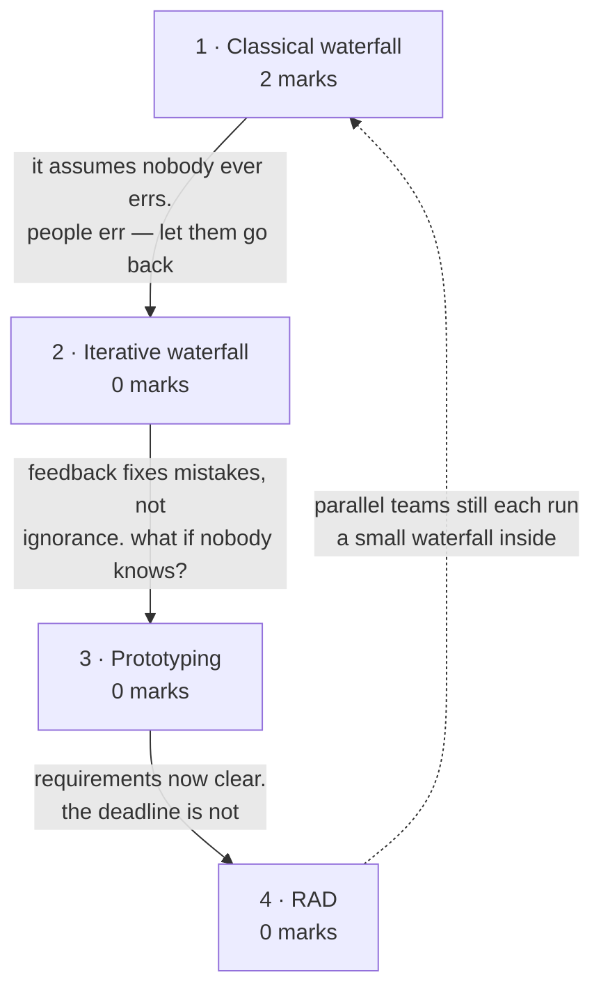

# Conventional Process Models

**Prerequisites:** [[Software Engineering as a Layered Technology]]

## Overview

> [!info] 2 of 80 in [[se-ete-2025-26]] — question B1, case 1
> B1 gives three scenarios and asks you to name the process model and justify.
> Case 1 — a family hires an architect, all requirements collected first, plans
> drawn, construction step by step with inspections at each stage — is
> **waterfall**, worth 2. The other two cases are on
> [[Evolutionary Process Models]]. One paper only; see [[weightage]].

- **The prescriptive models:** waterfall · iterative waterfall · prototyping · RAD.
- **They all answer one question:** *how much do you commit before you start
  building?* Waterfall makes the maximum bet and wins big when requirements hold
  still; the rest are hedges against that bet failing.

> [!warning] The deck and the handout group these differently
> The handout puts **prototype** and **RAD** in "conventional process models"
> (lectures 6-7). The deck files **Prototyping under *Evolutionary*** and **RAD
> under *Incremental***. This vault follows the **handout** (frontmatter lecture
> numbers come from the lecture plan), but answer B1-style questions by **naming
> the model, not its category** — the category is exactly where your two sources
> disagree. If a question forces a category, the deck's grouping is the one
> taught in your class.

## Quick Reference

> [!abstract] The one thing that decides everything
> **How stable are the requirements?** Stable and well understood → waterfall.
> Unclear to the customer → prototyping. Clear, and decomposable into modules
> with a tight deadline → RAD. Every advantage and drawback below follows from
> that single question.

**Waterfall phases, in order** — the deck's own list:

| # | Phase | Aim |
|---|---|---|
| 1 | Feasibility study | is it financially and technically feasible? |
| 2 | Requirements analysis and specification | gather, analyse, then specify |
| 3 | Design | transform the SRS into an implementable structure |
| 4 | Coding and unit testing | translate design into code; test each module |
| 5 | Integration and system testing | combine incrementally, then test the whole |
| 6 | Maintenance | **60% of total effort — the largest phase** |

**The three system tests** — who performs each is the examinable part:

| Test | Performed by |
|---|---|
| Alpha | the development team |
| Beta | a friendly set of customers |
| Acceptance | the customer, after delivery, to accept or reject |

**Waterfall shortcomings** — six, and the phrasing matters: assumes no error is
ever committed · requirements hard to define fully at the start · cannot
accommodate change · unsuitable for large projects · no working version until
late · **big-bang** delivery carrying heavy risk · document-driven, formal
sign-off at each phase.

**Classical vs iterative waterfall** — the single difference:

| | Classical | Iterative |
|---|---|---|
| Feedback paths | **none** | from every phase to its predecessor |
| Error correction | impossible within the model | rework the phase where the error was made |
| Exception | — | **no feedback path to feasibility study** — a project once taken up is not abandoned lightly |

**Iterative waterfall drawbacks:** change requests still hard to incorporate · no
incremental delivery · phases cannot overlap · no risk handling · limited
customer interaction (start and end only).

**Prototyping cycle:** interview the customer → incomplete high-level paper model
→ initial prototype with basic functionality only → customer identifies problems
→ refine → repeat until satisfactory → *then* build the real product using the
approved prototype as the specification. The system is **partially implemented
before or during analysis**, which is what lets the customer see it early.

**RAD:** proposed by **IBM in the 1980s**. Decompose into modules assignable
independently to separate teams; each team runs the waterfall steps (analyse,
design, code, test) in parallel; combine.

**The four maintenance types** (deck teaches them here; examined on
[[Software Maintenance]]): corrective — fix defects · adaptive — port to a new
environment · perfective — enhance on request · preventive — pre-empt problems.

**Model selection at a glance:**

| Model | Use when | Key risk |
|---|---|---|
| Waterfall | requirements stable and fully understood | any late change is catastrophic |
| Iterative waterfall | as above, but errors are expected | still no incremental delivery |
| Prototyping | customer cannot state requirements up front | throwaway prototype mistaken for the product |
| RAD | modular project, tight deadline, skilled teams available | needs enough people to staff parallel teams |

## Subtopic map

| # | Subtopic | Marks | Why it's here |
|---|---|---|---|
| 1 | The classical waterfall model | **2** | carries B1 case 1; the baseline all models are compared to |
| 2 | The iterative waterfall model | 0 | one change — feedback paths — and why it matters |
| 3 | The prototyping model | 0 | the answer when the customer cannot say what they want |
| 4 | Rapid Application Development (RAD) | 0 | parallel modular teams under a deadline |

## Mindmap

## 1 · The classical waterfall model

**Intuition.**
- Introduced by **Winston Royce, 1970**, named for the way the diagram cascades:
  each phase's output flows into the next, and no phase begins until the one
  above is complete.
- **Plan-driven** — every activity planned and scheduled before work starts.
- That makes it the **most disciplined and the most brittle** model: beautiful
  when you know exactly what you are building, expensive the moment you do not,
  because the model has no mechanism for discovering you were wrong.

**Definitions & distinctions.** Six phases and three system tests: Quick
Reference. Two points the deck stresses:
- **Maintenance is 60% of total effort** — more than everything else combined.
- **The model is idealistic.** The deck's words: it "assumes that no development
  error is ever committed by the engineers during any of the life cycle phases".
  A design defect may go unnoticed until coding or testing, at which point you
  return to the phase where it originated and redo everything after it.

**Solved questions.**

> **[[se-ete-2025-26]] Q B1, case 1 (2 marks, CO1)** — "A family hires an
> architect to build a house. All requirements are collected first. Blueprints
> and structural plans are prepared, and then construction proceeds step by step:
> foundation, walls, roof, interiors, finishing. Quality inspections are done at
> each stage, and finally the house is handed over. **Identify the software
> process model. Provide a brief justification explaining why that model is
> appropriate.**"

**Answer — the Waterfall model.** Three signals from the scenario:

1. **"All requirements are collected first"** — requirements fully known and
   frozen before design begins, waterfall's defining precondition.
2. **Strictly sequential stages** — foundation → walls → roof → interiors →
   finishing, each completed before the next, no overlap and no return. That is
   the cascade the model is named for.
3. **"Quality inspections at each stage"** plus a single handover — phase-end
   verification with big-bang delivery.

**Why appropriate:** house construction has **stable, well-understood
requirements** and a **physically irreversible order** — you cannot roof before
walling. Both are exactly what waterfall assumes. *(No solution key exists for
this paper — unchecked, no `✓`.)*

**What gets asked.** This subtopic carries the topic's only marks, one form:
- **Spot it** — a real-world, deliberately non-software scenario described through
  the model's behaviour rather than named. Waterfall's tells: "all requirements
  collected first", strict stage order, single final handover.
- **Method** — name the model in the first line, then justify with **two or three
  phrases quoted from the scenario**. Marks are for the mapping, not for a general
  description.
- **Trap** — describing the model instead of justifying the match. A generic
  waterfall essay earns little; "all requirements are collected first, therefore
  requirements are frozen, which is what waterfall assumes" earns the marks.

## 2 · The iterative waterfall model

- **The fix it makes:** the classical model assumes nobody makes mistakes.
  Everybody does, and a design defect typically surfaces phases later, during
  coding or testing. Iterative waterfall adds **feedback paths from every phase
  back to its predecessor** — the same model with permission to go backwards, and
  one of the most widely used in practice.
- **The detail that makes a good answer:** there is **no feedback path to the
  feasibility study**. Once an organisation commits to a project it does not
  readily abandon it, so that one arrow is deliberately absent.
- **The deck's principle:** detect errors **in the same phase in which they are
  committed** — that minimises correction effort and time. This is the
  cost-of-change curve from [[story]] restated as a process rule.
- Comparison table and drawbacks: Quick Reference.
- **Never examined.** If it appears, a "differentiate classical and iterative
  waterfall" 2-marker — answer with feedback paths and the feasibility exception.

## 3 · The prototyping model

- **The situation it solves:** some customers cannot tell you what they want, but
  can tell you instantly what is wrong with what you show them. The obstacle is
  not disagreement but **ignorance** — nobody yet knows what the product should be.
- **Definition:** "the process of developing a working replication of a product
  or system that has to be engineered." Cycle: Quick Reference.
- **Never examined.** Know the cycle and the trigger condition — customer cannot
  state requirements up front.

> [!note] Deck placement
> The deck lists Prototyping as **Evolutionary Process Model #1**, alongside
> Spiral; the handout puts it in the conventional group at lectures 6-7. Both are
> defensible — prototyping evolves the *prototype* iteratively but is
> prescriptive about the final build. See the warning at the top of this page.

## 4 · Rapid Application Development (RAD)

- **The bet:** if a project genuinely breaks into independent modules, build them
  in parallel rather than in sequence. RAD **buys calendar time by spending
  people**.
- **It works precisely when the work is partitionable** — and fails for the same
  reason A5 on [[Introduction to Software Engineering]] fails when it is not.
  That tension is worth naming in an answer.
- **The deck's precondition:** the project "can be broken down into small modules
  wherein each module can be assigned independently to separate teams", and each
  module's development "involves the various basic steps as in waterfall model,
  i.e. analyzing, designing, coding and then testing". Origin: Quick Reference.
- **Never examined here.** Relevant to B1 though: case 2 ("a working system using
  reusable components, quickly") is a plausible RAD reading, and this vault
  assigns it to component-based development instead — the disagreement is recorded
  on [[se-ete-2025-26]] and [[Evolutionary Process Models]].

> [!note] Deck placement
> The deck lists RAD as **Incremental Process Model #2**, next to the Incremental
> model. The handout groups it with the conventional models at lectures 6-7.

## Question Bank

**PYQ — 1.**

> **[[se-ete-2025-26]] Q B1, case 1 (2 marks, CO1)** — "A family hires an
> architect to build a house. All requirements are collected first. Blueprints and
> structural plans are prepared, and then construction proceeds step by step:
> foundation, walls, roof, interiors, finishing. Quality inspections are done at
> each stage, and finally the house is handed over. Identify the software process
> model. Provide a brief justification."

Worked in full in subtopic 1. Short form: **Waterfall** — requirements frozen up
front, strictly sequential irreversible stages, phase-end inspections, single
final handover. *(Unchecked — no solution key.)* Cases 2 and 3 are worked on
[[Evolutionary Process Models]].

- **Deck — none.** `L1 PPT from 1 to 8.pdf` is expository, no worked examples or
  practice bank for these models.
- **Textbook — unavailable.** Pressman 8e is not in `raw/sources/`.

**Assignment questions — [[se-assign-1-2026]].** **Q8** Waterfall vs Agile for an Online Banking System — compare, then recommend

Worked in full on that page, with method and traps. **Coursework, so it does not
change [[weightage]]** — but it is direct evidence of what the instructor
considers important.

## Mistakes & Traps

- **Describing the model instead of justifying the match.** B1 gives 2 marks per
  case for *identify + justify*. Quote the scenario back.
- **Forgetting the feasibility-study exception** in iterative waterfall — the one
  detail that shows you looked at the diagram rather than the summary.
- **Calling the iterative waterfall "incremental".** It has feedback paths but
  still delivers everything at once. That is one of its listed drawbacks.
- **Mixing up alpha and beta testing.** Alpha = *development team*, beta =
  *friendly customers*, acceptance = *the customer after delivery*.
- **Assuming RAD always applies under a deadline.** It needs the project to
  decompose into independent modules *and* enough people to staff parallel teams.
- **Answering with a category ("conventional") when the deck uses a different
  one.** Name the model.

## Course Material

- `raw/sources/ppts/2025/L1 PPT from 1 to 8.pdf` — covers lectures 1-8. For this
  topic: the full SDLC model list, waterfall with all six phases and the three
  system tests, the shortcomings list, iterative waterfall with its advantages and
  five drawbacks, prototyping, and RAD.
- **Taxonomy conflict recorded:** the deck groups Prototyping under *Evolutionary*
  and RAD under *Incremental*; the handout groups both as *conventional* at
  lectures 6-7. The vault follows the handout for page structure and flags the
  difference on both affected pages.

**Related:** [[story]] · [[syllabus]] · [[weightage]] · [[MTE Roadmap]] ·
previous [[Software Engineering as a Layered Technology]] · next
[[Evolutionary Process Models]]
