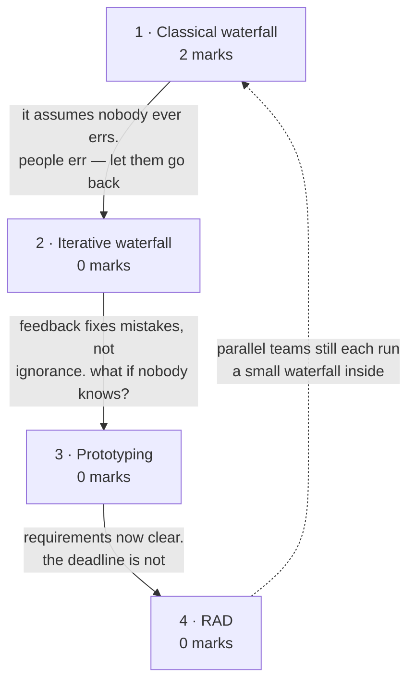

# Conventional Process Models

**Prerequisites:** [[Software Engineering as a Layered Technology]]

## Overview

> [!info] 2 of 80 in [[se-ete-2025-26]] — question B1, case 1
> B1 gives three scenarios and asks you to name the process model and justify.
> Case 1 — a family hires an architect, all requirements collected first, plans
> drawn, construction proceeds step by step with inspections at each stage — is
> **waterfall**, worth 2. The other two cases are on
> [[Evolutionary Process Models]]. One paper only; see [[weightage]].

The prescriptive models: **waterfall**, its **iterative** repair, **prototyping**
and **RAD**. Every one of them is an answer to the same question —
*how much do you commit before you start building?* Waterfall makes the maximum
bet and wins big when requirements hold still. The rest are hedges against that
bet failing.

> [!warning] The deck and the handout group these differently
> The handout puts **prototype** and **RAD** in "conventional process models"
> (lectures 6-7). The deck does not: it files **Prototyping under *Evolutionary
> Process Models*** and **RAD under *Incremental Process Model***.
>
> This vault follows the **handout's** grouping, because the lecture numbers in
> every page's frontmatter come from the lecture plan. But answer B1-style
> questions by **naming the model**, not its category — the category is exactly
> where your two sources disagree. If a question does force a category, the
> deck's grouping is the one taught in your class.

## Quick Reference

> [!abstract] The one thing that decides everything
> **How stable are the requirements?** Stable and well understood → waterfall.
> Unclear to the customer → prototyping. Clear, and decomposable into modules
> with a tight deadline → RAD. Every advantage and drawback below follows from
> that single question.

**Waterfall phases, in order** — the deck's own list:

| # | Phase | Aim |
|---|---|---|
| 1 | Feasibility study | is it financially and technically feasible? |
| 2 | Requirements analysis and specification | gather, analyse, then specify |
| 3 | Design | transform the SRS into an implementable structure |
| 4 | Coding and unit testing | translate design into code; test each module |
| 5 | Integration and system testing | combine incrementally, then test the whole |
| 6 | Maintenance | 60% of total effort — the largest phase |

**The three system tests** — who performs each is the examinable part:

| Test | Performed by |
|---|---|
| Alpha | the development team |
| Beta | a friendly set of customers |
| Acceptance | the customer, after delivery, to accept or reject |

**Waterfall shortcomings** — six, and the phrasing matters: it assumes no error
is ever committed · requirements are hard to define fully at the start · it
cannot accommodate change · unsuitable for large projects · no working version is
seen until late · it is a **big-bang** delivery carrying heavy risk · it is
document-driven, requiring formal sign-off at each phase.

**Classical vs iterative waterfall** — the single difference:

| | Classical | Iterative |
|---|---|---|
| Feedback paths | **none** | from every phase to its predecessor |
| Error correction | impossible within the model | rework the phase where the error was made |
| Exception | — | **no feedback path to feasibility study** — once a project is taken up it is not abandoned lightly |

**Iterative waterfall drawbacks:** change requests still hard to incorporate ·
no incremental delivery · phases cannot overlap · no risk handling · limited
customer interaction (only at start and end).

**The four maintenance types** (deck teaches them here; examined on
[[Software Maintenance]]): corrective — fix defects · adaptive — port to a new
environment · perfective — enhance on request · preventive — pre-empt future
problems.

**Model selection at a glance**

| Model | Use when | Key risk |
|---|---|---|
| Waterfall | requirements stable and fully understood | any late change is catastrophic |
| Iterative waterfall | as above, but errors are expected | still no incremental delivery |
| Prototyping | customer cannot state requirements up front | throwaway prototype mistaken for the product |
| RAD | modular project, tight deadline, skilled teams available | needs enough people to staff parallel teams |

## Subtopic map

| # | Subtopic | Marks | Why it's here |
|---|---|---|---|
| 1 | The classical waterfall model | **2** | carries B1 case 1; the baseline all models are compared to |
| 2 | The iterative waterfall model | 0 | one change — feedback paths — and why it matters |
| 3 | The prototyping model | 0 | the answer when the customer cannot say what they want |
| 4 | Rapid Application Development (RAD) | 0 | parallel modular teams under a deadline |

## Mindmap

**1 · The classical waterfall model — 2 marks**
- **What:** six phases executed once each, in strict order, each completed
  entirely before the next begins.
- **Why:** it is the disciplined ideal — and studying where it breaks generates
  every other model in the course.
- **Important:** **B1 case 1 is waterfall** — spot it by "all requirements
  collected first", sequential stages, and inspections at each stage. Know the
  six phases and at least three shortcomings.

**2 · The iterative waterfall model — 0 marks**
- **What:** classical waterfall plus feedback paths from every phase to its
  predecessor.
- **Why:** the classical model assumes engineers never make mistakes; they do,
  and defects surface phases later.
- **Important:** never examined. The one exam-worthy fact: **there is no feedback
  path to the feasibility study**, because a project once accepted is not
  abandoned lightly.

**3 · The prototyping model — 0 marks**
- **What:** build a working replica, show it, refine on feedback, repeat until
  approved, then build the real product.
- **Why:** customers often cannot state requirements in the abstract but can
  react to something in front of them.
- **Important:** never examined. **The deck files this under evolutionary
  models**, the handout under conventional — see the warning above.

**4 · Rapid Application Development (RAD) — 0 marks**
- **What:** decompose into modules, assign each to a separate team working in
  parallel, each running the waterfall steps, then combine.
- **Why:** it buys calendar time by spending people, when the project genuinely
  decomposes.
- **Important:** never examined. Proposed by IBM in the 1980s. **The deck files
  it under incremental models.** Note the tension with A5 on
  [[Introduction to Software Engineering]] — RAD works only if the work is
  genuinely partitionable, which is exactly Brooks's caveat.

## 1 · The classical waterfall model

**Intuition.** Introduced by Winston Royce in 1970 and named for the way its
diagram cascades: each phase's output flows down into the next, and no phase
begins until the one above is complete. It is a **plan-driven** process — you
plan and schedule every activity before work starts. That makes it the most
disciplined model available and the most brittle: it works beautifully when you
know exactly what you are building, and fails expensively the moment you do not,
because there is no mechanism in the model for finding out you were wrong.

**Definitions & distinctions.** The six phases and the three system tests are in
Quick Reference. Two points the deck stresses:

- **Maintenance is 60% of total effort.** More than everything else combined.
- **The model is idealistic.** In the deck's own words, it "assumes that no
  development error is ever committed by the engineers during any of the life
  cycle phases" — and a design defect may go unnoticed until coding or testing,
  at which point you must return to the phase where it originated and redo
  everything after it.

**Solved questions.**

> **[[se-ete-2025-26]] Q B1, case 1 (2 marks, CO1)** — "A family hires an
> architect to build a house. All requirements are collected first. Blueprints
> and structural plans are prepared, and then construction proceeds step by step:
> foundation, walls, roof, interiors, finishing. Quality inspections are done at
> each stage, and finally the house is handed over. **Identify the software
> process model. Provide a brief justification explaining why that model is
> appropriate.**"

**Answer — the Waterfall model.**

Justification, three signals from the scenario:

1. **"All requirements are collected first"** — requirements are fully known and
   frozen before design begins, which is waterfall's defining precondition.
2. **Strictly sequential stages** — foundation → walls → roof → interiors →
   finishing, each completed before the next starts, with no overlap and no
   return. That is the cascade the model is named for.
3. **"Quality inspections at each stage"** and a single handover at the end —
   phase-end verification with big-bang delivery.

It is appropriate here because house construction has **stable, well-understood
requirements** and a physically irreversible order — you cannot roof a house
before walling it. Both conditions are exactly what waterfall assumes.

*(No printed solution key exists for this paper, so this answer is unchecked —
no `✓`.)*

**What gets asked.** This subtopic carries the topic's only marks, in one form:

- **Spot it** — a real-world scenario, deliberately non-software, described
  through the model's behaviour rather than named. Waterfall's tells are "all
  requirements collected first", strict stage order, and a single final handover.
- **Method** — name the model in the first line, then justify with **two or three
  specific phrases quoted from the scenario**. Marks are for the mapping, not for
  a general description of waterfall.
- **Trap** — describing the model instead of justifying the match. A generic
  waterfall essay earns little; "all requirements are collected first, therefore
  requirements are frozen, which is what waterfall assumes" earns the marks.

## 2 · The iterative waterfall model

**Intuition.** The classical model's fatal assumption is that nobody makes
mistakes. Everybody makes mistakes, and the expensive part is that a design
defect typically surfaces during coding or testing — phases later. The iterative
waterfall adds **feedback paths from every phase back to its predecessor**, so
when an error is detected you return to the phase that caused it, fix it, and
propagate the correction forward. It is the same model with permission to go
backwards, and it is one of the most widely used models in practice.

**Definitions & distinctions.** The comparison table and the drawback list are in
Quick Reference. The detail that makes a good exam answer: **there is no feedback
path back to the feasibility study.** Once an organisation has committed to a
project, it does not readily abandon it — so that one arrow is deliberately
absent from the diagram.

The deck's own principle: it is best to detect errors **in the same phase in
which they are committed**, because that minimises the effort and time to correct
them. This is the cost-of-change curve from [[story]] restated as a process rule.

**What gets asked.** Never examined. If it appears, it will be as a
"differentiate classical and iterative waterfall" 2-marker — answer with feedback
paths and the feasibility-study exception.

## 3 · The prototyping model

**Intuition.** Some customers cannot tell you what they want, but they can tell
you instantly what is wrong with what you show them. Prototyping exploits that:
interview the customer, build a rough working replica of the product, let them
use it, collect complaints, refine, repeat — until they approve. Only then do you
build the real thing, using the approved prototype as the specification. It is
the model for the case where the obstacle is not disagreement but **ignorance**:
nobody yet knows what the product should be.

**Definitions & distinctions.** Prototyping is "the process of developing a
working replication of a product or system that has to be engineered". The system
is **partially implemented before or during the analysis phase**, which is what
lets the customer see the product early in the life cycle.

The cycle: interview the customer → develop an incomplete high-level paper model
→ build an initial prototype supporting only basic functionality → customer
identifies problems → refine → repeat until the working model is satisfactory.

> [!note] Deck placement
> The deck lists Prototyping as **Evolutionary Process Model #1**, alongside
> Spiral. The handout puts it in the conventional group at lectures 6-7. Both
> classifications are defensible — prototyping evolves the *prototype*
> iteratively but is prescriptive about the final build. See the warning at the
> top of this page.

**What gets asked.** Never examined. Know the cycle and the trigger condition —
customer cannot state requirements up front.

## 4 · Rapid Application Development (RAD)

**Intuition.** If a project genuinely breaks into independent modules, you do not
have to build them one after another. Assign each module to its own team, have
every team run the ordinary analyse-design-code-test steps in parallel, then
combine the results into the final product. RAD buys calendar time by spending
people — which works precisely when the work is partitionable, and fails for the
same reason A5 on [[Introduction to Software Engineering]] fails when it is not.

**Definitions & distinctions.** First proposed by **IBM in the 1980s**. The
precondition the deck states: the project "can be broken down into small modules
wherein each module can be assigned independently to separate teams", and each
module's development "involves the various basic steps as in waterfall model,
i.e. analyzing, designing, coding and then testing".

> [!note] Deck placement
> The deck lists RAD as **Incremental Process Model #2**, next to the Incremental
> model. The handout groups it with the conventional models at lectures 6-7.

**What gets asked.** Never examined here. Relevant to B1 though: case 2 on that
question ("a working system using reusable components, quickly") is a plausible
RAD reading, and this vault assigns it to component-based development instead —
the disagreement is recorded on [[se-ete-2025-26]] and on
[[Evolutionary Process Models]].

## Question Bank

**PYQ questions — 1.**

> **[[se-ete-2025-26]] Q B1, case 1 (2 marks, CO1)** — "A family hires an
> architect to build a house. All requirements are collected first. Blueprints and
> structural plans are prepared, and then construction proceeds step by step:
> foundation, walls, roof, interiors, finishing. Quality inspections are done at
> each stage, and finally the house is handed over. Identify the software process
> model. Provide a brief justification."

Worked in full in subtopic 1. Short form: **Waterfall** — requirements frozen up
front, strictly sequential irreversible stages, phase-end inspections, single
final handover. *(Unchecked — no solution key exists for this paper.)*

Cases 2 and 3 of the same question are worked on [[Evolutionary Process Models]].

**Deck questions — none.** `L1 PPT from 1 to 8.pdf` is expository and carries no
worked examples or practice bank for these models.

**Textbook questions — unavailable.** Pressman 8e is not in `raw/sources/`.

## Mistakes & Traps

- **Describing the model instead of justifying the match.** B1 gives 2 marks per
  case for *identify + justify*. Quote the scenario back.
- **Forgetting the feasibility-study exception** in iterative waterfall. It is the
  one detail that shows you looked at the diagram rather than the summary.
- **Calling the iterative waterfall "incremental".** It has feedback paths but
  still delivers everything at once — no intermediate delivery. That is one of
  its listed drawbacks.
- **Mixing up alpha and beta testing.** Alpha is the *development team*, beta is
  *friendly customers*, acceptance is *the customer after delivery*.
- **Assuming RAD always applies under a deadline.** It requires the project to
  decompose into independent modules *and* enough people to staff parallel teams.
- **Answering with a category ("conventional") when the deck uses a different
  one.** Name the model.

## Course Material

- `raw/sources/ppts/2025/L1 PPT from 1 to 8.pdf` — covers lectures 1-8. For this
  topic: the full SDLC model list, waterfall with all six phases and the three
  system tests, the shortcomings list, iterative waterfall with its advantages and
  five drawbacks, prototyping, and RAD.

**Taxonomy conflict recorded:** the deck groups Prototyping under *Evolutionary*
and RAD under *Incremental*; the handout groups both as *conventional* at
lectures 6-7. The vault follows the handout for page structure and flags the
difference on both affected pages.

**Related:** [[story]] · [[syllabus]] · [[weightage]] · [[MTE Roadmap]] ·
previous [[Software Engineering as a Layered Technology]] · next
[[Evolutionary Process Models]]
