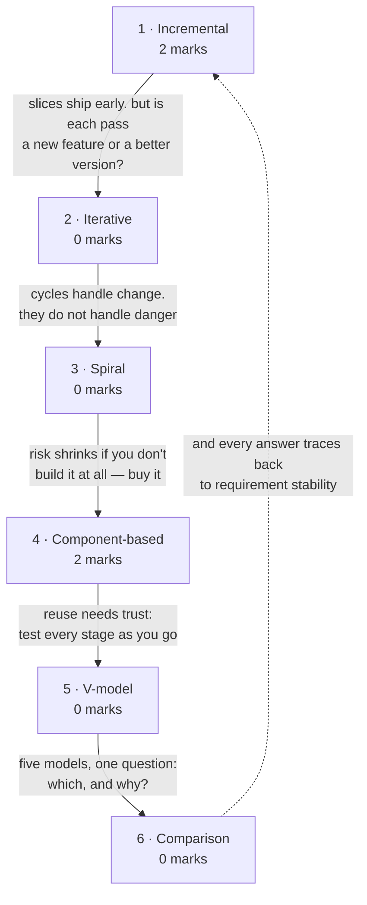

# Evolutionary Process Models

- **Where conventional models commit up front, these refuse to.** Incremental
  delivers in slices · Spiral schedules the riskiest thing first · Component-based
  buys rather than builds · V-model pairs a test with every development stage.
- **The comparison across all of them is the most reusable table in the module** —
  it is what a "which model and why" question is really testing.

**Prerequisites:** [[Conventional Process Models]]
**Asked as:** scenario — **4 of 80** in [[se-ete-2025-26]] · **1** in [[se-assign-1-2026]]

> [!info] What it asked — question B1, cases 2 and 3
> Case 2 (retail inventory built quickly from **reusable components**, user
> feedback during development) and case 3 (e-learning platform released as a
> **basic version**, then updated in multiple cycles) are both here, 2 marks
> each. Case 1 is on [[Conventional Process Models]]. One paper; see
> [[weightage]].

> [!warning] The deck and the handout group these differently
> Handout lecture 8: evolutionary = **incremental, spiral, component-based,
> unified process**. The deck instead uses *Evolutionary* = {prototyping,
> spiral}; *Incremental* = {incremental, RAD}; *Specialized* = {component-based};
> plus a standalone **V-model** the handout never mentions, and **no** treatment
> of the **Unified Process** the handout does. This vault follows the handout for
> page structure. Practical consequence: **answer by naming the model, not its
> category** — that is precisely where your two sources disagree.

## How it's asked

Generic skeleton on [[answer-patterns]] §1. **4 of 80 — two cases of the same
question.**

### Scenario → identify & justify — B1 cases 2 and 3, 2 marks each

- **Spot it:** the same B1 form as [[Conventional Process Models]] — a scenario
  described by behaviour, "identify the model and justify".
  - **Incremental's tells:** "releases a basic version", "core features first",
    then cycles that **add** functionality.
  - **CBD's tell:** the phrase **"reusable components"**, which names a mechanism
    no other model in the course is characterised by.
- **Skeleton:** name → quote two or three phrases → map each → state the general
  condition.
- **Earns the marks:** the mapping, again.
- **Trap:** answering "iterative" for an incremental scenario. **If each cycle
  adds new features it is incremental; if each refines the same whole it is
  iterative.** "Until all features are complete" settles it.
- **The contested one:** case 2 fits **RAD** too. This vault answers CBD because
  "reusable components" names a mechanism while "quickly" only names an outcome —
  but **a well-justified RAD answer should score**. Justify from the scenario's
  own words and the choice is defensible either way.

### Compare — likeliest unasked form

*Incremental vs iterative* is the most confusable pair on this page and the most
plausible 2-mark `compare` question. Table it: **adds** versus **refines**, one
example each. See [[answer-patterns]] §5.

**Never asked as:** `numerical`, `draw`.

## Quick Reference

> [!abstract] The three that carry this topic
> - **Incremental delivers working software early and repeatedly.** Requirements
>   prioritised; highest priority ships first; once an increment starts, its
>   requirements freeze.
> - **Spiral is the risk model.** Four sectors per loop — planning, risk
>   analysis, development, evaluation — prototype at the end of the risk sector,
>   go/no-go each turn.
> - **Verification: "are we building the product right?" Validation: "are we
>   building the right product?"** From the V-model, examined all through
>   [[Testing Fundamentals]].

**Spiral — the four sectors of every loop:**

| Sector | Activity |
|---|---|
| Planning | determine objectives, alternatives, constraints |
| Risk analysis | analyse alternatives; identify and resolve risks; **prototype produced here** |
| Development | build and test the product |
| Evaluation | customer evaluates output before the next spiral |

- **Boehm, 1988.** Combines prototyping with waterfall.
- **Each loop is one *phase*;** the number of loops is not fixed, varying by
  project.
- Favoured for **large, expensive, complicated** projects. Distinguishing feature:
  **explicit risk handling** — the thing every other model lacks.
- **A go/no-go decision** is taken each loop, after evaluation.

**Incremental vs iterative** — the distinction most often got wrong:

| | Incremental | Iterative |
|---|---|---|
| Divides | requirements into stand-alone modules | the *work* into repeated cycles |
| Each pass | **adds a new feature** to the previous release | **refines** the existing whole |
| Analogy | building a house room by room | sketching the whole house, then adding detail each pass |

**Incremental — key points:** development and delivery broken into increments,
each delivering part of the functionality · requirements **prioritised**, highest
priority in early increments · **once an increment starts, its requirements are
frozen** (later increments' may keep evolving) · a "multi-waterfall" life cycle —
each increment passes through requirements, design, implementation and testing.

**Iterative — the deck's framing:** "the same phases as the waterfall model, but
with fewer restrictions" — same order, conducted over several cycles, a reusable
product released at the end of each. **Use when:** requirements clearly defined
and easy to understand · the application is large · changes expected in future.

**Component-Based Development (CBD)** — building from **reusable components**,
with object-oriented technology as the technical framework. The deck's process:
identify candidate classes → search the class library → if the class exists,
**extract and reuse** it → if not, engineer it with OO methods. The benefit is
measurable **reuse**.

**V-model** — an extension of waterfall where "for each development activity,
there is a testing activity corresponding to it": development stages descend the
left arm, test stages ascend the right, joined at coding.

| | Verification | Validation |
|---|---|---|
| Question | **Are we building the product right?** | **Are we building the right product?** |
| Type | static testing — reviews, inspections | dynamic testing — executing code |
| When | during each development phase | after development completes |

**Model selection at a glance** — every "identify the model" question is this
table applied backwards:

| Model | Choose it when | Distinguishing feature |
|---|---|---|
| Waterfall | requirements stable, complete, well understood | strict sequence |
| Iterative waterfall | as waterfall, but errors expected and must be correctable | feedback paths |
| Prototyping | the customer cannot state requirements without seeing something | throwaway replica |
| RAD | the project decomposes into modules and the deadline is tight | parallel teams |
| Incremental | working software needed early; features can be prioritised | delivery in slices |
| Iterative | requirements clear, system large, change expected | refinement each cycle |
| Spiral | the project is large, expensive and risky | explicit risk analysis, go/no-go per loop |
| Component-based | a component library exists and the domain is well understood | reuse |
| V-model | requirements stable and testing rigour required | a test stage per development stage |

**How the sections connect:**

## 1 · The incremental model

- Waterfall promises "wait nine months and get everything". Incremental promises
  "wait three weeks and get something that works".
- No full specification up front: build a simple working system with a few basic
  features, deliver, then add successive versions until the desired system exists.
- **A multi-waterfall cycle** — each increment runs its own requirements, design,
  implementation and testing.
- The customer gets value early and, just as importantly, gets to **correct you
  early**, while correcting is still cheap.

**Terms and distinctions.** Key points and the incremental-vs-iterative table:
Quick Reference. The easily-missed rule: **requirements are prioritised, and once
an increment's development starts its requirements freeze** — that freeze is what
stops the model degenerating into endless churn.

**Worked example.**

> **[[se-ete-2025-26]] Q B1, case 3 (2 marks, CO1)** — "A company releases a
> basic version of an e-learning platform. Users test it and request changes. The
> team updates the system in multiple cycles until all features are complete.
> **Identify the software process model. Provide a brief justification.**"

**Answer — the Incremental model.** Three signals:

1. **"Releases a basic version"** — a partial but *working* system delivered
   first, incremental's defining move. Waterfall would deliver nothing until the
   end.
2. **"Users test it and request changes"** — real users exercise a real
   deliverable, and their feedback shapes the following increments.
3. **"Multiple cycles until all features are complete"** — successive versions,
   each adding functionality, converging on the full system.

**Why appropriate:** an e-learning platform has a clear core (courses, enrolment)
that can ship first, with secondary features prioritised and added later — exactly
the condition incremental delivery requires. *(No solution key — unchecked, no
`✓`.)*

## 2 · The iterative model, and incremental vs iterative

- **Why they get merged:** both repeat. The difference is *what* repeats.
  Incremental splits the **product** — the first release genuinely lacks features
  later ones add. Iterative splits the **work** — every pass covers the whole
  product at greater fidelity, like a sketch redrawn with more detail.
- **The test:** after increment one you have a *part* of the system; after
  iteration one you have a *rough version of all* of it.
- Comparison table, the deck's framing and the when-to-use list: Quick Reference.
- **Never examined directly** — but this is the likeliest 2-mark "differentiate"
  question on the page. Answer with *adds* versus *refines*, one example each.

## 3 · The spiral model

- **What makes it different:** every other model treats risk as something you cope
  with. Spiral **schedules** it — an entire sector per loop identifying what could
  sink the project and resolving it *before* building anything that depends on the
  answer, then asking the customer whether to continue at all.
- **The consequence:** the most dangerous unknown is always attacked first, while
  abandoning is still cheap. Hence large, expensive, complicated projects — and
  unnecessary overhead for small ones.
- Four sectors, Boehm 1988, loop count, prototype placement, go/no-go: Quick
  Reference.
- **Never examined.** Most plausible form: "explain the spiral model with a
  diagram" — draw the four labelled sectors and name Boehm. **Risk** is the word
  that earns the marks.

## 4 · Component-Based Development

- **The bet:** the fastest way to build something is not to build it. CBD assumes
  a library of tested, prepackaged components exists, so development becomes
  search, evaluate and integrate — new code only for what the library lacks.
- OO technology supplies the framework, because **classes are the natural unit of
  packaging**. Payoff: measurable reuse. Precondition: a library worth searching.
- The deck's process: Quick Reference. The deck files CBD under **Specialized
  Process Models**; the handout lists it at lecture 8 among the evolutionary ones.

**Worked example.**

> **[[se-ete-2025-26]] Q B1, case 2 (2 marks, CO1)** — "A retail company needs an
> online inventory system quickly. Developers build a working system using
> reusable components, and users provide feedback during development. Iterations
> continue until the system meets all business needs. **Identify the software
> process model. Provide a brief justification.**"

**Answer — Component-Based Development.**

1. **"Using reusable components"** — names CBD's defining mechanism. No other
   model in the course is characterised by component reuse.
2. **"Quickly"** — reuse is precisely how CBD compresses schedule: components are
   extracted rather than engineered.
3. **"Iterations continue until the system meets all business needs"** — CBD is
   evolutionary in nature, composing and refining across iterations.

> [!warning] This one is genuinely contested — know both readings
> **RAD is a defensible alternative answer.** The scenario's "quickly" and its
> iterative user feedback fit RAD too, and RAD is what the *handout* teaches at
> lectures 6-7 as the speed-under-deadline model. This vault answers **CBD**
> because "reusable components" is a stronger, more specific signal than
> "quickly" — it names a mechanism, not just an outcome. If a solution key says
> RAD that is not a marking error; the safe exam move is to **name your model and
> justify from the scenario's own words**, and a well-justified RAD answer should
> score. Recorded also on [[se-ete-2025-26]] and [[Conventional Process Models]].

*(No solution key — unchecked, no `✓`.)*

## 5 · The V-model

- **The defect it fixes:** in waterfall all testing happens at the end, so a
  requirements misunderstanding surfaces months after it was made.
- **The shape:** development descends the left arm, testing ascends the right,
  coding at the vertex, and each test stage is planned *while* its matching
  development stage is done.
- **What it does not fix:** it is as sequential as waterfall — you still cannot
  start late stages early. What you can no longer do is defer thinking about
  verification.
- The definition and the verification/validation table: Quick Reference. **Learn
  both questions verbatim.**
- **Never examined *here*** — but verification vs validation is examined
  repeatedly across [[Testing Fundamentals]] and [[Levels of Testing & Tools]],
  and this is where the course introduces it. Note the handout does not list the
  V-model at lecture 8; the deck adds it.

## 6 · Comparison of models

- **Why it exists:** the handout's lecture 8 ends with "comparison of various
  models", and it is the practical payload of the module. No exam asks you to
  recite the spiral model in isolation, but B1 asked three times in one question
  to *pick* a model and defend the pick.
- **Every selection traces to one question** from [[story]]: **how stable are the
  requirements, and how much does being wrong cost?**
- The nine-model selection table is in Quick Reference — not repeated here.
- **Never examined as a table**, but B1's 6 marks are it used in reverse, and that
  is the single most likely form for this module to reappear in. Learn the
  *selection criterion* per model, not its full description.

## Practice

**PYQ — 2** (both parts of B1).

> **[[se-ete-2025-26]] Q B1, case 2 (2 marks, CO1)** — "A retail company needs an
> online inventory system quickly. Developers build a working system using
> reusable components, and users provide feedback during development. Iterations
> continue until the system meets all business needs."

**Component-Based Development** — "reusable components" names the mechanism;
reuse delivers the speed; iterations refine to fit business needs. **RAD is a
defensible alternative**; see subtopic 4. *(Unchecked.)*

> **[[se-ete-2025-26]] Q B1, case 3 (2 marks, CO1)** — "A company releases a basic
> version of an e-learning platform. Users test it and request changes. The team
> updates the system in multiple cycles until all features are complete."

**Incremental model** — a working partial system first, user feedback on a real
deliverable, successive cycles adding features. *(Unchecked.)*

- Case 1 of the same question is worked on [[Conventional Process Models]].
- **Deck — none.** `L1 PPT from 1 to 8.pdf` is expository throughout.
- **Textbook — unavailable.** Pressman 8e is not in `raw/sources/`.

**Assignment questions — [[se-assign-1-2026]].** **Q8** supplies the selection logic for the Waterfall-vs-Agile recommendation

Worked in full on that page, with method and traps. **Coursework, so it does not
change [[weightage]]** — but it is direct evidence of what the instructor
considers important.

## Traps

- **Incremental vs iterative.** Adds features versus refines the whole — the most
  confusable pair in the module and the likeliest 2-marker.
- **Placing the spiral prototype at the end of development.** It is produced at
  the end of the **risk analysis** sector.
- **Giving the spiral a fixed number of loops.** It varies by project.
- **Reversing verification and validation.** *Right product* = validation;
  *product right* = verification. Backwards costs marks repeatedly in testing.
- **Answering B1 with a category instead of a model name.** Your two sources group
  these differently — name the model.
- **Describing rather than justifying.** Every mark in B1 is for mapping the
  scenario's own words onto the model's properties.

## Sources

- `raw/sources/ppts/2025/L1 PPT from 1 to 8.pdf` — covers lectures 1-8. For this
  topic: the full model list, spiral with its four sectors and Boehm attribution,
  incremental with key points and diagram, the iterative model with its
  when-to-use list, the incremental-vs-iterative comparison, component-based
  development, and the V-model with the verification/validation definitions.

**Two conflicts with the handout, both recorded:**

| | Handout, lecture 8 | Deck |
|---|---|---|
| Grouping | evolutionary = incremental, spiral, CBD, unified process | evolutionary = prototyping, spiral; incremental = incremental, RAD; specialized = CBD |
| V-model | **not mentioned** | taught, with verification/validation |
| Unified Process | **named** | **not covered** |

- The **Unified Process is a rule-5 gap**: the handout names it at lecture 8, no
  deck teaches it, and Pressman 8e is not in the vault either.

**Related:** [[story]] · [[syllabus]] · [[weightage]] · [[MTE Roadmap]] ·
previous [[Conventional Process Models]] · next [[Agile Development]]
