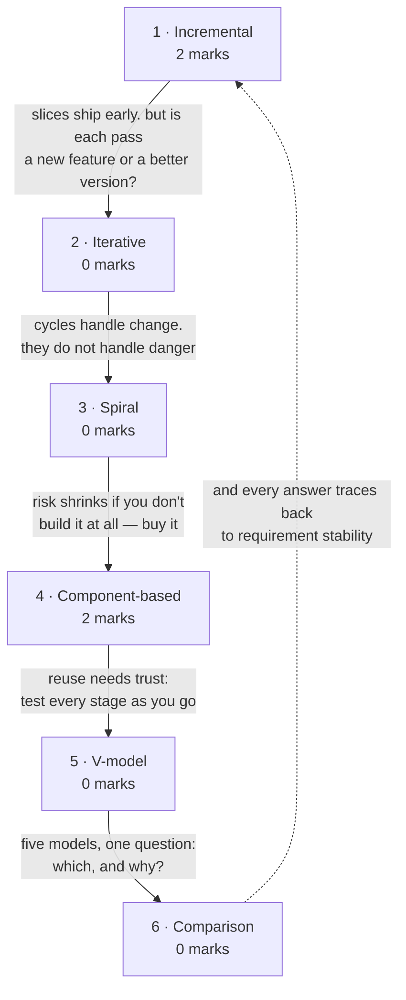

# Evolutionary Process Models

**Prerequisites:** [[Conventional Process Models]]

## Overview

> [!info] 4 of 80 in [[se-ete-2025-26]] — question B1, cases 2 and 3
> B1 gives three scenarios and asks you to name the process model and justify
> each. Case 2 (retail inventory built quickly from **reusable components**, with
> user feedback during development) and case 3 (e-learning platform released as a
> **basic version**, then updated in multiple cycles) are both here, 2 marks each.
> Case 1 is on [[Conventional Process Models]]. One paper only; see [[weightage]].

Where [[Conventional Process Models]] commits up front, these models refuse to.
**Incremental** delivers in slices. **Spiral** schedules the riskiest thing first.
**Component-based** buys rather than builds. **V-model** pairs a test with every
development stage. And the comparison across all of them is the single most
reusable table in the module — it is what a "which model and why" question is
really testing.

> [!warning] The deck and the handout group these differently
> The handout's lecture 8 lists evolutionary models as **incremental, spiral,
> component-based and unified process**. The deck uses four different headings:
> *Evolutionary* = {prototyping, spiral}; *Incremental* = {incremental, RAD};
> *Specialized* = {component-based}; plus a standalone **V-model** the handout
> never mentions, and no treatment of the **Unified Process** the handout does.
>
> This vault follows the handout for page structure. Practical consequence:
> **answer by naming the model, not its category** — that is precisely where your
> two sources disagree.

## Quick Reference

> [!abstract] The three that carry this topic
> - **Incremental delivers working software early and repeatedly.** Requirements
>   are prioritised; highest priority ships first; once an increment starts, its
>   requirements freeze.
> - **Spiral is the risk model.** Four sectors per loop — planning, risk
>   analysis, development, evaluation — with a prototype at the end of the risk
>   sector and a go/no-go decision each turn.
> - **Verification: "are we building the product right?" Validation: "are we
>   building the right product?"** From the V-model, and examined all through
>   [[Testing Fundamentals]].

**Spiral — the four sectors of every loop**

| Sector | Activity |
|---|---|
| Planning | determine objectives, alternatives, constraints |
| Risk analysis | analyse alternatives; identify and resolve risks; **prototype produced here** |
| Development | build and test the product |
| Evaluation | customer evaluates output before the next spiral |

Proposed by **Boehm, 1988**. Combines prototyping with waterfall. Each loop is
one *phase*; the number of loops is not fixed. Favoured for **large, expensive,
complicated** projects. Its distinguishing feature is **explicit risk handling** —
the thing every other model lacks.

**Incremental vs iterative** — the distinction most often got wrong:

| | Incremental | Iterative |
|---|---|---|
| Divides | requirements into stand-alone modules | the *work* into repeated cycles |
| Each pass | **adds a new feature** to the previous release | **refines** the existing whole |
| Analogy | building a house room by room | sketching the whole house, then adding detail each pass |

**Incremental — key points:** development and delivery are broken into increments,
each delivering part of the functionality · requirements are **prioritised**,
highest priority in early increments · **once an increment starts, its
requirements are frozen**; later increments' requirements may continue to evolve
· the life cycle is a "multi-waterfall" — each increment passes through
requirements, design, implementation and testing.

**When to use the iterative model:** requirements clearly defined and easy to
understand · the application is large · changes are expected in future.

**Component-Based Development (CBD)** — building software from **reusable
components**. Object-oriented technologies supply the technical framework. The
process: identify candidate classes → search the class library → if the class
exists, **extract and reuse** it → if not, engineer it with OO methods. The
benefit is measurable **reuse**.

**V-model** — an extension of waterfall in which every development stage is paired
with a corresponding testing stage, executed in a V shape, joined at coding.

| | Verification | Validation |
|---|---|---|
| Question | **Are we building the product right?** | **Are we building the right product?** |
| Type | static testing — reviews, inspections | dynamic testing — executing code |
| When | during each development phase | after development completes |

**Model selection at a glance**

| Model | Use when | Distinguishing feature |
|---|---|---|
| Incremental | you need working software early; requirements can be prioritised | delivery in slices |
| Iterative | requirements clear, project large, change expected | refinement each cycle |
| Spiral | large, expensive, high-risk projects | explicit risk analysis, go/no-go per loop |
| Component-based | a component library exists and the domain is well understood | reuse |
| V-model | requirements stable and testing rigour is required | a test stage per development stage |

## Subtopic map

| # | Subtopic | Marks | Why it's here |
|---|---|---|---|
| 1 | The incremental model | **2** | carries B1 case 3; delivery in slices |
| 2 | The iterative model, and incremental vs iterative | 0 | the distinction that gets confused |
| 3 | The spiral model | 0 | the only model with explicit risk handling |
| 4 | Component-Based Development | **2** | carries B1 case 2 (contested — see below) |
| 5 | The V-model | 0 | verification vs validation, used all through testing |
| 6 | Comparison of models | 0 | the table a "which model and why" question wants |

## Mindmap

**1 · The incremental model — 2 marks**
- **What:** build and deliver a simple working system first, then successive
  versions until the full system exists.
- **Why:** the customer gets value early and can steer, instead of waiting for a
  big-bang delivery that may be wrong.
- **Important:** **B1 case 3 is incremental** — spot it by "releases a basic
  version" plus "multiple cycles until all features are complete". Requirements
  are prioritised; an increment's requirements freeze once it starts.

**2 · The iterative model, and incremental vs iterative — 0 marks**
- **What:** develop a first version, then produce new versions by repeating the
  cycle, each in a fixed-length iteration.
- **Why:** it separates two ideas students merge — *adding* functionality versus
  *refining* the whole.
- **Important:** never examined directly, but the distinction is the likeliest
  2-marker on this page. Incremental **adds**; iterative **refines**.

**3 · The spiral model — 0 marks**
- **What:** repeated loops, each with four sectors — planning, risk analysis,
  development, evaluation.
- **Why:** it is the only model in the course that treats **risk** as a
  first-class scheduled activity rather than an afterthought.
- **Important:** never examined. Know Boehm 1988, the four sectors in order, the
  prototype at the end of risk analysis, and that it suits large expensive
  projects.

**4 · Component-Based Development — 2 marks**
- **What:** compose the application from prepackaged, reusable components rather
  than writing everything new.
- **Why:** the cheapest code is code you do not write; reuse converts development
  effort into search-and-integrate effort.
- **Important:** **this vault assigns B1 case 2 here** on the strength of
  "reusable components" — but RAD is a defensible alternative reading. See
  subtopic 4 for the full disagreement.

**5 · The V-model — 0 marks**
- **What:** waterfall bent into a V, pairing every development stage with a
  matching test stage.
- **Why:** in waterfall all testing is crowded at the end; the V-model forces you
  to plan each test while designing the thing it tests.
- **Important:** never examined *here*, but **verification vs validation is
  examined repeatedly** in the testing module. Learn the two questions verbatim.
  The handout does not list the V-model at lecture 8 — the deck adds it.

**6 · Comparison of models — 0 marks**
- **What:** the cross-model table of when to use each and what each risks.
- **Why:** every "identify the model and justify" question is this table applied
  backwards.
- **Important:** never examined as a table, but it is the machinery behind B1's
  6 marks. Learn the *selection criterion* for each model, not its full
  description.

## 1 · The incremental model

**Intuition.** Waterfall's promise is "wait nine months and you will get
everything". The incremental model's is "wait three weeks and you will get
something that works". It does not attempt a full specification up front. It
builds a simple working system with a few basic features, delivers it, and then
adds successive versions until the desired system exists — a **multi-waterfall**
cycle, since each increment runs its own requirements, design, implementation and
testing. The customer gets value early, and just as importantly gets to *correct
you* early, while correcting is still cheap.

**Definitions & distinctions.** The key points and the incremental-vs-iterative
table are in Quick Reference. The one easily-missed rule: **requirements are
prioritised, and once an increment's development starts its requirements are
frozen** — later increments' requirements may keep evolving. That freeze is what
stops the model degenerating into endless churn.

**Solved questions.**

> **[[se-ete-2025-26]] Q B1, case 3 (2 marks, CO1)** — "A company releases a
> basic version of an e-learning platform. Users test it and request changes. The
> team updates the system in multiple cycles until all features are complete.
> **Identify the software process model. Provide a brief justification.**"

**Answer — the Incremental model.**

Justification, three signals:

1. **"Releases a basic version"** — a partial but *working* system delivered
   first, which is incremental's defining move. Waterfall would deliver nothing
   until the end.
2. **"Users test it and request changes"** — real users exercise a real
   deliverable, and their feedback shapes the following increments.
3. **"Multiple cycles until all features are complete"** — successive versions,
   each adding functionality, converging on the full system.

Appropriate here because an e-learning platform has a clear core (courses,
enrolment) that can ship first, while secondary features can be prioritised and
added later — exactly the condition incremental delivery requires.

*(No printed solution key exists for this paper, so this answer is unchecked —
no `✓`.)*

**What gets asked.** Carries 2 of this topic's 4 marks, in the B1 form:

- **Spot it** — "basic version" / "first release" / "core features first",
  followed by repeated cycles that *add* functionality.
- **Method** — name it, then quote two or three scenario phrases and map each to
  a property of the model.
- **Trap** — answering "iterative" instead. If each cycle **adds new features**,
  it is incremental; if each cycle **refines the same whole**, it is iterative.
  The phrase "until all features are complete" settles it — features are being
  added.

## 2 · The iterative model, and incremental vs iterative

**Intuition.** Both models repeat, so students merge them. The difference is
*what* repeats. Incremental splits the **product**: the first release genuinely
lacks features that later releases add. Iterative splits the **work**: every pass
covers the whole product but at greater fidelity, like a sketch redrawn with more
detail each time. A useful test — after increment one of an incremental project
you have a *part* of the system; after iteration one of an iterative project you
have a *rough version of all* of it.

**Definitions & distinctions.** The comparison table is in Quick Reference. The
deck's own framing: the iterative model "consists of the same phases as the
waterfall model, but with fewer restrictions" — the phases occur in the same
order but may be conducted over several cycles, with a reusable product released
at the end of each cycle.

**When to use it** (the deck's list): requirements are clearly defined and easy to
understand · the application is large · changes are required in future.

**What gets asked.** Never examined directly. But this is the most likely 2-mark
"differentiate" question on the page — answer with *adds* versus *refines* and
one example each.

## 3 · The spiral model

**Intuition.** Every other model treats risk as something you cope with. Spiral
schedules it. Each loop devotes an entire sector to identifying what could sink
the project and resolving it *before* building anything that depends on the
answer — and ends the loop by asking the customer whether to continue at all. The
consequence is that the most dangerous unknown is always attacked first, when
abandoning is still cheap. That is why it is the model for large, expensive,
complicated projects, and why it is unnecessary overhead for small ones.

**Definitions & distinctions.** The four sectors are in Quick Reference. Points
worth having exactly right:

- **Boehm, 1988.** It combines the features of prototyping and waterfall.
- **Each loop is one phase.** The number of loops is unknown in advance and
  varies by project.
- **A prototype is produced at the end of the risk analysis sector** — not at the
  end of development.
- **A go/no-go decision** is taken each loop, after evaluation.

**What gets asked.** Never examined on the one paper here. Most plausible form is
"explain the spiral model with a diagram" — draw the four labelled sectors and
name Boehm. Risk is the word that earns the marks.

## 4 · Component-Based Development

**Intuition.** The fastest way to build something is not to build it. CBD assumes
a library of tested, prepackaged components already exists, so development becomes
mostly search, evaluate and integrate — write new code only for what the library
lacks. Object-oriented technology supplies the framework, because classes are the
natural unit of packaging. The payoff is measurable reuse; the precondition is a
library worth searching.

**Definitions & distinctions.** The deck's process: identify candidate classes →
search the class library → if they already exist, **extract and reuse** them → if
a candidate class does not reside in the library, engineer it using
object-oriented methods.

The deck files CBD under **Specialized Process Models**; the handout lists it at
lecture 8 among the evolutionary models.

**Solved questions.**

> **[[se-ete-2025-26]] Q B1, case 2 (2 marks, CO1)** — "A retail company needs an
> online inventory system quickly. Developers build a working system using
> reusable components, and users provide feedback during development. Iterations
> continue until the system meets all business needs. **Identify the software
> process model. Provide a brief justification.**"

**Answer — Component-Based Development.**

Justification:

1. **"Using reusable components"** — the phrase names CBD's defining mechanism.
   No other model in the course is characterised by component reuse.
2. **"Quickly"** — reuse is precisely how CBD compresses schedule: existing
   components are extracted rather than engineered.
3. **"Iterations continue until the system meets all business needs"** — CBD is
   evolutionary in nature, composing and refining across iterations.

> [!warning] This one is genuinely contested — know both readings
> **RAD is a defensible alternative answer.** The scenario's "quickly" and its
> iterative user feedback fit RAD too, and RAD is what the *handout* teaches at
> lectures 6-7 as the speed-under-deadline model.
>
> This vault answers **CBD** because "reusable components" is a stronger and more
> specific signal than "quickly" — it names a mechanism, not just an outcome. But
> if a solution key says RAD, that is not a marking error, and the safe exam move
> is to **name your model and justify from the scenario's own words**; a
> well-justified RAD answer should score.
>
> Recorded also on [[se-ete-2025-26]] and [[Conventional Process Models]].

*(No printed solution key exists for this paper, so this answer is unchecked —
no `✓`.)*

**What gets asked.** Carries 2 of this topic's 4 marks, via the contested B1 case
2. The transferable lesson: **when two models fit, pick the one whose defining
mechanism the scenario actually names, and justify from the scenario's wording.**
Examiners award the justification.

## 5 · The V-model

**Intuition.** Waterfall's real defect is that all the testing happens at the end,
so a requirements misunderstanding is discovered months after it was made. The
V-model bends the waterfall into a V: development stages descend the left arm,
testing stages ascend the right, and each test stage is planned *while* its
matching development stage is being done. Coding sits at the vertex. You still
cannot start late stages early — it is as sequential as waterfall — but you can
no longer defer thinking about how anything will be verified.

**Definitions & distinctions.** The deck describes it as an extension of the
waterfall model where "for each development activity, there is a testing activity
corresponding to it", with verification phases on one side and validation on the
other, joined by coding.

The pair to memorise verbatim, because it recurs throughout the testing module:

> **Verification** — *Are we building the product right?* Static testing.
> **Validation** — *Are we building the right product?* Dynamic testing, by
> executing code, after development completes.

**What gets asked.** Never examined on this page. But **verification vs
validation is examined behaviour** across [[Testing Fundamentals]] and
[[Levels of Testing & Tools]] — this is where the course introduces it, so learn
it here. Note that the handout does not list the V-model at lecture 8; the deck
adds it.

## 6 · Comparison of models

**Intuition.** The handout's lecture 8 ends with "comparison of various models",
and it is the practical payload of the whole module: no exam asks you to recite
the spiral model in isolation, but B1 asked three times in one question to *pick*
a model and defend the pick. Every selection ultimately traces to one question
from [[story]] — **how stable are the requirements, and how much does being wrong
cost?**

**Definitions & distinctions.** The selection tables are in Quick Reference, on
this page and on [[Conventional Process Models]] — not repeated here. Compressed
to one line each:

| Model | Choose it when |
|---|---|
| Waterfall | requirements are stable, complete and well understood |
| Iterative waterfall | as waterfall, but errors are expected and must be correctable |
| Prototyping | the customer cannot state requirements without seeing something |
| RAD | the project decomposes into modules and the deadline is tight |
| Incremental | working software is needed early and features can be prioritised |
| Iterative | requirements are clear, the system is large, change is expected |
| Spiral | the project is large, expensive and risky |
| Component-based | a component library exists and the domain is well understood |
| V-model | requirements are stable and testing rigour is required |

**What gets asked.** Never as a standalone question on this paper. But B1's 6
marks are this table used in reverse, and that is the single most likely form for
this whole module to reappear in.

## Question Bank

**PYQ questions — 2** (both parts of B1).

> **[[se-ete-2025-26]] Q B1, case 2 (2 marks, CO1)** — "A retail company needs an
> online inventory system quickly. Developers build a working system using
> reusable components, and users provide feedback during development. Iterations
> continue until the system meets all business needs."

**Component-Based Development** — "reusable components" names the mechanism;
reuse delivers the speed; iterations refine to fit business needs. **RAD is a
defensible alternative**; see subtopic 4. *(Unchecked.)*

> **[[se-ete-2025-26]] Q B1, case 3 (2 marks, CO1)** — "A company releases a basic
> version of an e-learning platform. Users test it and request changes. The team
> updates the system in multiple cycles until all features are complete."

**Incremental model** — a working partial system first, user feedback on a real
deliverable, successive cycles adding features. *(Unchecked.)*

Case 1 of the same question is worked on [[Conventional Process Models]].

**Deck questions — none.** `L1 PPT from 1 to 8.pdf` is expository throughout.

**Textbook questions — unavailable.** Pressman 8e is not in `raw/sources/`.

## Mistakes & Traps

- **Incremental vs iterative.** Adds features versus refines the whole. This is
  the most confusable pair in the module and the likeliest 2-marker.
- **Placing the spiral prototype at the end of development.** It is produced at
  the end of the **risk analysis** sector.
- **Giving the spiral a fixed number of loops.** It varies by project.
- **Reversing verification and validation.** *Right product* is validation;
  *product right* is verification. Getting this backwards costs marks repeatedly
  in the testing module.
- **Answering B1 with a category instead of a model name.** Your two sources
  group these differently — name the model.
- **Describing rather than justifying.** Every mark in B1 is for mapping the
  scenario's own words onto the model's properties.

## Course Material

- `raw/sources/ppts/2025/L1 PPT from 1 to 8.pdf` — covers lectures 1-8. For this
  topic: the full model list, spiral with its four sectors and Boehm attribution,
  incremental with its key points and diagram, the iterative model with its
  when-to-use list, the incremental-vs-iterative comparison, component-based
  development, and the V-model with the verification/validation definitions.

**Two conflicts with the handout, both recorded:**

| | Handout, lecture 8 | Deck |
|---|---|---|
| Grouping | evolutionary = incremental, spiral, CBD, unified process | evolutionary = prototyping, spiral; incremental = incremental, RAD; specialized = CBD |
| V-model | **not mentioned** | taught, with verification/validation |
| Unified Process | **named** | **not covered** |

The Unified Process is a **rule-5 gap**: the handout names it at lecture 8 and no
deck teaches it. Pressman 8e is not in the vault either.

**Related:** [[story]] · [[syllabus]] · [[weightage]] · [[MTE Roadmap]] ·
previous [[Conventional Process Models]] · next [[Agile Development]]
