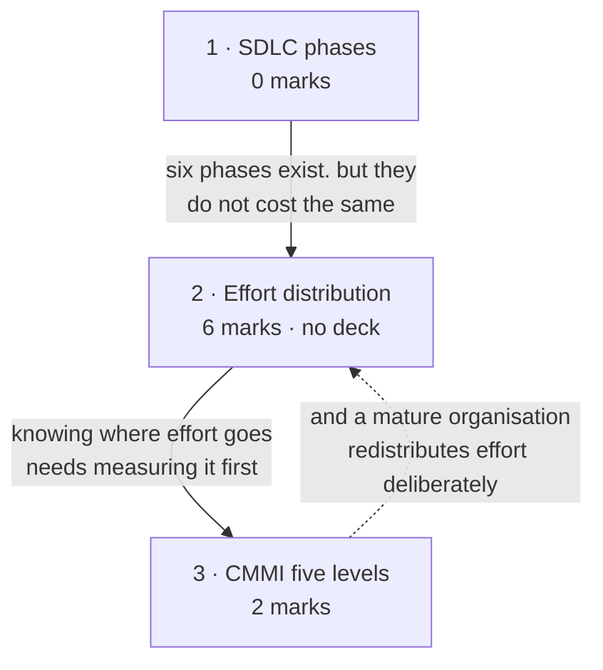

# SDLC & CMMI

**Prerequisites:** [[Software Engineering as a Layered Technology]]

## Overview

> [!info] 8 of 80 in [[se-ete-2025-26]] — questions A2 and B3
> The **third-heaviest topic in the MTE window**, and the heaviest that is not a
> 10-marker. A2 (2 marks) gives a scenario and asks for the CMMI maturity level
> plus justification. B3 (6 marks) asks for the distribution of effort across
> SDLC phases, related to traditional, structured and CASE environments.
> One paper only; see [[weightage]].

- **The question this lecture asks is different from the ten before it.** Those
  asked *which model should this project use?* This one asks *is your
  organisation capable of following any model at all?* — CMMI's subject.
- **Alongside it:** the SDLC itself — the phase sequence every model rearranges,
  and how project effort actually distributes across those phases.

> [!warning] B3's content is not in any deck — 6 marks unsourced
> A keyword sweep of all 24 files finds **no treatment of effort distribution
> across "traditional, structured and CASE" environments**. Zero hits for
> "40-20-40"; "traditional" appears only in the testing, SQA and agile decks in
> unrelated senses. The phrase *phase-wise distribution of effort* does appear —
> but in the **COCOMO** chapter of the Aggarwal & Singh text
> (`Chapter 4 Software Project planning.pdf`, exercise 4.15), which is lecture 17
> material, not lecture 12. Subtopic 2 is therefore **written from standard
> textbook material and labelled unsourced**. It is the largest unsourced block
> anywhere in the Mid-Term window, and the highest-value gap in this vault.

## Quick Reference

> [!abstract] The two things this topic is examined on
> - **CMMI's five levels: Initial → Managed → Defined → Quantitatively Managed →
>   Optimizing.** The keyword identifying level 4 is **predictable**; level 5 is
>   **improving**.
> - **The 40-20-40 rule.** ~40% of effort before coding, ~20% coding, ~40%
>   testing and after. Coding is the smallest phase — that is the whole point.

### CMMI — the five maturity levels

**CMMI** is a **process improvement framework that assesses the maturity of an
organisation's software development process**: it measures how well an
organisation develops software and suggests improvements.

| Level | Name | Characteristic | Deck's analogy |
|---|---|---|---|
| **1** | Initial | ad-hoc, undocumented; success depends on individuals; no consistency | cooking with no recipe |
| **2** | Managed | basic project management; requirements recorded and tracked; schedules, budgets, responsibilities; **still project-level** | writing the recipe down and following it |
| **3** | Defined | **organisation-wide** standard processes, documented and shared; training; reuse of templates and best practice | a restaurant chain with one standard recipe book |
| **4** | Quantitatively Managed | processes **measured and controlled with metrics**; decisions from data; variation tracked; focus = **predictability** | chefs measuring every ingredient precisely |
| **5** | Optimizing | **continuous improvement**; innovation, feedback, lessons learned; problems addressed proactively | the chain experimenting with new dishes and techniques |

**The three shifts to remember:**

| Between | The shift |
|---|---|
| 2 → 3 | **project**-level process becomes **organisation**-level |
| 3 → 4 | processes are followed → processes are **measured** |
| 4 → 5 | measured and predictable → **continuously improved** |

**The deck's level-1 example:** a startup building a Hospital Management System
with no requirements documents or design blueprints; programmers code what they
think the hospital wants; no testing standards, each developer testing on their
own machine; each programmer's own coding style; no schedule. The result depends
entirely on whether the individuals happen to be good.

### SDLC phases and deliverables

| # | Phase | Deliverable |
|---|---|---|
| 1 | Requirement analysis | **SRS** |
| 2 | System design | design documents (ER diagrams, schema, UI) |
| 3 | Implementation (coding) | source code |
| 4 | Testing | test reports (unit, integration, system, UAT) |
| 5 | Deployment | delivered/deployed system |
| 6 | Maintenance | updates, fixes, new features |

### Effort distribution

**The 40-20-40 rule:**

| Group | Share |
|---|---|
| Analysis and design (everything before coding) | ~40% |
| Coding | ~20% |
| Testing and debugging (everything after coding) | ~40% |

- **Finer split**, often quoted for an organic project: planning 2-3% ·
  requirements 10-25% · design 20-25% · coding 15-20% · testing 30-40%.
- **Lifetime vs development:** maintenance alone is ~60% of *lifetime* effort;
  40-20-40 describes *development* effort. Say which you mean.

**Across development environments** *(unsourced — see the warning above)*:

| Phase | Traditional | Structured | CASE |
|---|---|---|---|
| Analysis | low | higher | **highest** |
| Design | low | higher | **highest** |
| Coding | **highest** | lower | **lowest** |
| Testing | high | lower | lower |
| Maintenance | **highest** | lower | **lowest** |

**The trend is the answer:** as environments become more sophisticated, effort
shifts **earlier** — out of coding and maintenance, into analysis and design.
Because a defect costs more the later it is found, front-loading reduces total
effort.

## Subtopic map

| # | Subtopic | Marks | Why it's here |
|---|---|---|---|
| 1 | The SDLC and its phases | 0 | the phase sequence and its deliverables |
| 2 | Effort distribution across phases | **6** | carries B3 — **no deck covers this** |
| 3 | CMMI and the five maturity levels | **2** | carries A2 |

## Mindmap

## 1 · The SDLC and its phases

- **What it is:** the systematic process for planning, creating, testing,
  deploying and maintaining software — six phases, each with a deliverable the
  next phase consumes. Table: Quick Reference.
- **Why it comes first:** it is the skeleton every process model rearranges.
  Waterfall runs the phases once, incremental per increment, agile per sprint.
  **The phases do not change; only their scheduling does.**
- **The deliverables are the examinable part.** A phase without a named output is
  a phase you cannot verify has finished — exactly what
  [[Conventional Process Models]] relies on for its phase-end sign-offs.
- **The deck's worked example** runs a Hospital Management System through all six:
  understand what the hospital wants (SRS) → design ER diagrams and schema →
  implement patient registration in Java and MySQL → test that patient details
  store correctly → deploy to the hospital's local server → add online appointment
  booking later as maintenance.
- **Never examined alone**, but B3 asks about effort *across these phases*, so the
  sequence is assumed. Naming the deliverables in a B3 answer costs nothing and
  shows the phases are understood rather than recited.

## 2 · Effort distribution across phases

> [!warning] Unsourced — no deck covers this, and it is worth 6 marks
> No deck treats effort distribution across traditional, structured and CASE
> environments. Zero hits for "40-20-40" across all 24 files. Written from
> standard textbook material. **If you can get the lecture 12 slides, this is the
> single most valuable thing to add to this vault.**

**Intuition.**
- Ask anyone outside software where the effort goes and they say coding. **They
  are wrong by a factor of four** — coding is roughly a fifth of the work.
- ~40% goes into understanding and designing before a line is written, another
  ~40% into testing and fixing afterwards.
- That is the empirical shape of the cost-of-change curve from [[story]]: effort
  concentrates where mistakes are cheapest to catch.
- **The environment then shifts the split** — traditional codes early and pays in
  testing and maintenance; structured invests in analysis and design methods,
  moving effort forward; CASE adds automation, pushing effort earlier still and
  cutting coding and maintenance hardest, because generated code is consistent and
  models stay in step with it.

**Formulas & variables.** The 40-20-40 split, the finer percentages and the
three-environment table: Quick Reference. The relationship that carries the marks:

> **The more sophisticated the environment, the more effort moves into analysis
> and design, and the less remains in coding and maintenance.** Total effort falls
> because defects are caught when they are cheap.

**Solved questions.**

> **[[se-ete-2025-26]] Q B3 (6 marks, CO1)** — "Explain the distribution of effort
> in different phases of a SDLC model by relating them to traditional,
> structured, and CASE development environments."

**Answer — three components.**

**Part 1 — the baseline (40-20-40).** Effort is not dominated by coding:
analysis and design ~40% · coding ~20% · testing and debugging ~40%. Finer:
planning 2-3%, requirements 10-25%, design 20-25%, coding 15-20%, testing 30-40%.
Maintenance over the product's whole life exceeds all development phases combined
— around 60% of lifetime effort.

**Part 2 — the three environments.**
- **Traditional.** Little formal method, minimal tooling. Analysis and design are
  cursory, so coding starts early and absorbs the largest share. Defects escape
  into testing and maintenance, which are correspondingly heavy. **Highest total
  effort.**
- **Structured.** Structured analysis and design methods (DFDs, structure charts,
  ER models) are applied. Effort moves **forward** into analysis and design.
  Because the design is worked out before coding, coding is faster and testing and
  maintenance shrink. Total effort falls.
- **CASE.** Tools automate diagramming, consistency checking and code generation.
  Analysis and design take the largest share of all — but coding drops sharply
  because much is generated, and maintenance drops furthest because models and
  code stay synchronised and documentation is current. **Lowest total effort.**

**Part 3 — why the trend exists.** **The cost of correcting a defect rises steeply
with the phase in which it is found.** A requirements error caught during analysis
is cheap; the same error found in maintenance costs orders of magnitude more,
since the design, code, tests and documentation built on it must all change.
Effort spent early is not *additional* effort — it is effort **relocated** from a
later phase where it would have bought much less.

**Draw the three columns side by side, phases as rows** — the shift is visible in
one glance, and 20 of this paper's 80 marks are on drawings.

*(No solution key exists for this paper — unchecked, no `✓`. Also unsourced by any
deck; see the warning.)*

**What gets asked.** The topic's largest block, one form so far:
- **Spot it** — any question naming effort, phases and environments together:
  "distribution of effort", "phase-wise effort", "traditional / structured / CASE".
- **Method** — three parts: state the baseline split with numbers, compare the
  three environments phase by phase, explain the trend by the cost-of-change
  argument. A table plus one paragraph of reasoning is the right shape for 6 marks.
- **Trap** — giving 40-20-40 and stopping. Half the question is the *environment
  comparison*, and the closing reasoning separates a recited answer from an
  understood one. Second trap: conflating lifetime with development effort.

> [!note] Where this content really lives
> The vault files B3 here because the paper tags it **CO1** (lectures 1-12) and
> its subject noun is "SDLC model". Its machinery, though, is estimation content —
> Aggarwal & Singh put "phase-wise distribution of effort" in the COCOMO chapter.
> Cross-reference [[Effort Estimation & COCOMO]], which computes phase effort
> numerically. The disagreement is recorded on [[se-ete-2025-26]].

## 3 · CMMI and the five maturity levels

**Intuition.**
- Every earlier lecture asked which process to use. **CMMI asks whether the
  organisation can follow *any* process reliably**, and grades it on five levels.
- **The progression is a story:** no process (1) → each project writes one down
  (2) → the organisation standardises one across all projects (3) → it measures
  that process with real numbers so outcomes become predictable (4) → it uses
  those numbers to improve the process itself (5).
- Each level's capability is built from the one below, **which is why they cannot
  be skipped**.

**Definitions & distinctions.** Five levels, characteristics, analogies, the three
shift points and the deck's level-1 example: Quick Reference. The analogies are
the instructor's own and worth keeping — they make the levels hard to confuse:

> No recipe → write the recipe down → one recipe book for the whole chain →
> measure every ingredient precisely → keep inventing better dishes.

**Solved questions.**

> **[[se-ete-2025-26]] Q A2 (2 marks, CO5)** — "A company faces missed deadlines
> and inconsistent quality. They document all processes and collect metrics like
> defect rates and effort. Processes are adjusted based on data, resulting in more
> predictable, high-quality project delivery. **Identify the CMMI maturity level
> and justify your answer.**"

**Answer — Level 4, Quantitatively Managed.** Mapping each phrase:

1. **"Document all processes"** — documented, standardised processes are the
   level 3 (Defined) capability, so the organisation is at least level 3.
2. **"Collect metrics like defect rates and effort"** — quantitative measurement
   of process performance is exactly what level 4 adds. The deck names defects
   found, time taken and cost overruns as the measured variations.
3. **"Processes are adjusted based on data"** — decisions from facts and
   statistics rather than experience: level 4's defining behaviour.
4. **"Resulting in more predictable... delivery"** — the deck states level 4's
   focus verbatim as **predictability**. The decisive phrase.

**Not level 5**, which requires *continuous process improvement* driven by
innovation, new technologies and lessons learned across projects, addressing
problems proactively. The scenario describes measuring and controlling an existing
process to make it predictable — not innovating beyond it.

> [!note] The level 5 reading, and why it loses
> "Processes are adjusted based on data" can be read as improvement, pointing at
> level 5. The tiebreaker is **"more predictable"** — level 4's stated focus,
> where level 5's is *continuous improvement* and *proactive* problem-solving.
> Neither innovation nor new technology appears in the scenario. Write level 4 and
> justify with the predictability phrase and the answer is defensible even against
> a key that says 5.

*(No solution key — unchecked, no `✓`.)*

**What gets asked.** 2 marks, in a form that is clearly this instructor's habit —
five of the paper's fifteen questions are scenario-plus-justify:
- **Spot it** — a short organisational scenario describing how a company works,
  ending in "identify the CMMI maturity level and justify".
- **Method** — find the **highest** capability the scenario demonstrates, name that
  level, justify by mapping two or three of the scenario's own phrases onto the
  level's characteristics, and say explicitly why the adjacent level is wrong.
- **Trap** — matching a single keyword. "Documented" alone suggests 3, "metrics"
  alone suggests 4, "improvement" alone suggests 5 — and scenarios are written to
  contain several. Read for the **highest** capability demonstrated, and let the
  outcome phrase ("predictable", "consistent", "continuously improving") break the
  tie.

## Question Bank

**PYQ — 2.**

> **[[se-ete-2025-26]] Q A2 (2 marks, CO5)** — "A company faces missed deadlines
> and inconsistent quality. They document all processes and collect metrics like
> defect rates and effort. Processes are adjusted based on data, resulting in more
> predictable, high-quality project delivery. Identify the CMMI maturity level and
> justify your answer."

**Level 4 — Quantitatively Managed.** Documented processes put it at ≥3; metrics
on defect rates and effort plus data-driven adjustment are level 4's addition;
"more predictable" is level 4's stated focus. Not level 5, which requires
continuous improvement through innovation. Worked in full in subtopic 3.
*(Unchecked.)*

> **[[se-ete-2025-26]] Q B3 (6 marks, CO1)** — "Explain the distribution of effort
> in different phases of a SDLC model by relating them to traditional, structured,
> and CASE development environments."

Three parts: the 40-20-40 baseline with finer percentages; the three environments
compared phase by phase, showing effort shifting earlier as sophistication rises;
and the cost-of-change reason for the trend. Worked in full in subtopic 2.
*(Unchecked, and unsourced by any deck.)*

- **Deck — none.** `L2 Lec (9 - 14).pdf` is expository for the SDLC and CMMI
  sections. The level-1 Hospital Management System illustration is the deck's
  example, not a question.
- **Textbook — partially available.** Pressman 8e is not in `raw/sources/`.
  `Chapter 4 Software Project planning.pdf` is a chapter of **Aggarwal & Singh,
  *Software Engineering* (3rd ed.), New Age International, 2007** — not the
  prescribed text — and its exercise 4.15 asks: *"Discuss various types of COCOMO
  mode. Explain the phase wise distribution of effort."* That is the closest thing
  in the vault to B3 drill, and it sits on [[Effort Estimation & COCOMO]].

## Mistakes & Traps

- **Answering A2 on one keyword.** Scenarios contain signals for several levels.
  Identify the **highest** capability demonstrated; use the outcome phrase as
  tiebreaker.
- **Confusing levels 4 and 5.** *Predictable* is 4, *continuously improving* is 5.
  Measuring is not innovating.
- **Confusing levels 2 and 3.** Level 2 is per-project; level 3 is
  organisation-wide. That is the entire difference.
- **Answering B3 with only the 40-20-40 rule.** The environment comparison is half
  the marks; the reasoning earns the rest.
- **Conflating development effort with lifetime effort.** 40-20-40 is development;
  maintenance alone is ~60% of lifetime. State which you mean.
- **Assuming coding dominates.** It is roughly 20% — the most counter-intuitive
  number in the module.

## Course Material

- `raw/sources/ppts/2025/L2 Lec (9 - 14).pdf` — CMMI in full: the framework
  definition, all five levels with characteristics, the cooking analogies, and the
  level-1 Hospital Management System illustration. Also the SDLC with six phases,
  deliverables and a worked hospital example.

**Deck gap**, confirmed by keyword sweep of all 24 files:

| Handout / question content | Hits across all decks |
|---|---|
| Effort distribution across phases | **0** as lecture-12 content |
| "40-20-40" | **0** |
| Traditional / structured / CASE environments | **0** |

- `Chapter 4 Software Project planning.pdf` mentions *phase wise distribution of
  effort* once, in an exercise, in the **COCOMO** context — lecture 17 material.
- **Two files previously catalogued as decks are textbook chapters**, both
  carrying exercise sets usable as the textbook question tier:
  `Chapter 4 Software Project planning.pdf` and `L8 Chapter 5 Software Design_3.pdf`
  are from **K.K. Aggarwal & Yogesh Singh, *Software Engineering* (3rd ed.), New
  Age International, 2007**. Not the prescribed textbook (Pressman 8e), so rule 6
  applies with extra care — use it to explain syllabus topics, never to expand
  scope.

**Related:** [[story]] · [[syllabus]] · [[weightage]] · [[MTE Roadmap]] ·
previous [[Agile Development]] · next [[Requirements Engineering]] ·
cross-reference [[Effort Estimation & COCOMO]]
