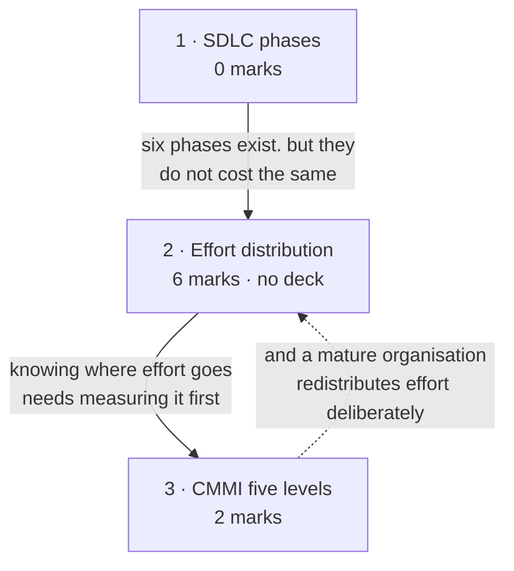

# SDLC & CMMI

**Prerequisites:** [[Software Engineering as a Layered Technology]]

## Overview

> [!info] 8 of 80 in [[se-ete-2025-26]] — questions A2 and B3
> The **third-heaviest topic in the MTE window**, and the heaviest that is not a
> 10-marker. A2 (2 marks) gives a scenario and asks for the CMMI maturity level
> plus justification. B3 (6 marks) asks for the distribution of effort across
> SDLC phases, related to traditional, structured and CASE environments.
> One paper only; see [[weightage]].

Lecture 12 closes the process module by asking a different question from the ten
lectures before it. Those asked *which model should this project use?* This one
asks *is your organisation capable of following any model at all?* — which is
CMMI's subject. Alongside it sits the SDLC itself: the phase sequence every model
rearranges, and how project effort actually distributes across those phases.

> [!warning] B3's content is not in any deck — 6 marks unsourced
> A keyword sweep of all 24 files finds **no treatment of effort distribution
> across "traditional, structured and CASE" environments**. Zero hits for
> "40-20-40"; "traditional" appears only in the testing, SQA and agile decks in
> unrelated senses. The phrase *phase-wise distribution of effort* does appear —
> but in the **COCOMO** chapter of the Aggarwal & Singh text
> (`Chapter 4 Software Project planning.pdf`, exercise 4.15), which is lecture 17
> material, not lecture 12.
>
> Subtopic 2 is therefore **written from standard textbook material and labelled
> unsourced**. It is the largest unsourced block anywhere in the Mid-Term window,
> and the highest-value gap in this vault to close.

## Quick Reference

> [!abstract] The two things this topic is examined on
> - **CMMI's five levels: Initial → Managed → Defined → Quantitatively Managed →
>   Optimizing.** The keyword that identifies level 4 is **predictable**; the one
>   that identifies level 5 is **improving**.
> - **The 40-20-40 rule.** Roughly 40% of effort before coding, ~20% coding, ~40%
>   testing and after. Coding is the smallest phase — that is the whole point.

### CMMI — the five maturity levels

CMMI is a **process improvement framework that assesses the maturity of an
organisation's software development process**: it measures how well an
organisation develops software and suggests improvements.

| Level | Name | Characteristic | Deck's analogy |
|---|---|---|---|
| **1** | Initial | ad-hoc, undocumented; success depends on individuals; no consistency | cooking with no recipe |
| **2** | Managed | basic project management; requirements recorded and tracked; schedules, budgets, responsibilities; **still project-level** | writing the recipe down and following it |
| **3** | Defined | **organisation-wide** standard processes, documented and shared; training; reuse of templates and best practice | a restaurant chain with one standard recipe book |
| **4** | Quantitatively Managed | processes **measured and controlled with metrics**; decisions from data; variation tracked; focus = **predictability** | chefs measuring every ingredient precisely |
| **5** | Optimizing | **continuous improvement**; innovation, feedback, lessons learned; problems addressed proactively | the chain experimenting with new dishes and techniques |

**The two shifts to remember:**

| Between | The shift |
|---|---|
| 2 → 3 | **project**-level process becomes **organisation**-level |
| 3 → 4 | processes are followed → processes are **measured** |
| 4 → 5 | measured and predictable → **continuously improved** |

### SDLC phases and deliverables

| # | Phase | Deliverable |
|---|---|---|
| 1 | Requirement analysis | **SRS** |
| 2 | System design | design documents (ER diagrams, schema, UI) |
| 3 | Implementation (coding) | source code |
| 4 | Testing | test reports (unit, integration, system, UAT) |
| 5 | Deployment | delivered/deployed system |
| 6 | Maintenance | updates, fixes, new features |

### Effort distribution

**The 40-20-40 rule** — approximate effort split across a project:

| Group | Share |
|---|---|
| Analysis and design (everything before coding) | ~40% |
| Coding | ~20% |
| Testing and debugging (everything after coding) | ~40% |

A finer split often quoted for an organic project: planning 2-3% · requirements
10-25% · design 20-25% · coding 15-20% · testing 30-40%.

**Across development environments** *(unsourced — see the warning above)*:

| Phase | Traditional | Structured | CASE |
|---|---|---|---|
| Analysis | low | higher | **highest** |
| Design | low | higher | **highest** |
| Coding | **highest** | lower | **lowest** |
| Testing | high | lower | lower |
| Maintenance | **highest** | lower | **lowest** |

The trend is the answer: **as environments become more sophisticated, effort
shifts earlier** — out of coding and maintenance, into analysis and design.
Because a defect costs more the later it is found, front-loading effort reduces
total effort.

## Subtopic map

| # | Subtopic | Marks | Why it's here |
|---|---|---|---|
| 1 | The SDLC and its phases | 0 | the phase sequence and its deliverables |
| 2 | Effort distribution across phases | **6** | carries B3 — **no deck covers this** |
| 3 | CMMI and the five maturity levels | **2** | carries A2 |

## Mindmap

**1 · The SDLC and its phases — 0 marks**
- **What:** the six-phase sequence — requirements, design, implementation,
  testing, deployment, maintenance — each with a named deliverable.
- **Why:** it is the skeleton every process model in this course rearranges.
- **Important:** never examined alone. Know the six phases **with their
  deliverables** — SRS, design documents, code, test reports. B3 assumes them.

**2 · Effort distribution across phases — 6 marks**
- **What:** how total project effort splits across the phases, and how that split
  changes between traditional, structured and CASE environments.
- **Why:** it refutes the intuition that a project is mostly coding. Coding is the
  smallest block.
- **Important:** **B3, 6 marks — the biggest single block on this page.**
  40-20-40. The trend: better environments push effort **earlier**. **No deck
  covers this** — see the warning.

**3 · CMMI and the five maturity levels — 2 marks**
- **What:** a five-level scale for how mature an organisation's process is.
- **Why:** it separates "we used a good model" from "we can do this again next
  time".
- **Important:** **A2, 2 marks.** Level 4's keyword is **predictable**, level 5's
  is **improving**. The 2→3 shift is project → organisation; 3→4 is following →
  measuring.

## 1 · The SDLC and its phases

**Intuition.** Before comparing process models you need the thing they are models
*of*. The SDLC is the systematic process for planning, creating, testing,
deploying and maintaining software — six phases, each with a deliverable that the
next phase consumes. Waterfall runs them once; incremental runs them per
increment; agile runs them per sprint. The phases do not change. Only their
scheduling does.

**Definitions & distinctions.** The phase table with deliverables is in Quick
Reference. The deck runs a single worked example through all six — a Hospital
Management System: understand what the hospital wants (SRS), design ER diagrams
and schema, implement patient registration in Java and MySQL, test that patient
details store correctly, deploy to the hospital's local server, then add online
appointment booking later as maintenance.

The deliverables are the examinable part. A phase without a named output is a
phase you cannot verify has finished — which is exactly what
[[Conventional Process Models]] relies on for its phase-end sign-offs.

**What gets asked.** Not examined on its own. But B3 asks about effort *across
these phases*, so the sequence is assumed knowledge — and naming the deliverables
in a B3 answer costs nothing and demonstrates the phases are understood rather
than recited.

## 2 · Effort distribution across phases

> [!warning] Unsourced — no deck covers this, and it is worth 6 marks
> No deck treats effort distribution across traditional, structured and CASE
> environments. Zero hits for "40-20-40" across all 24 files. Written from
> standard textbook material. **If you can get the lecture 12 slides, this is the
> single most valuable thing to add to this vault.**

**Intuition.** Ask anyone outside software where the effort goes and they will say
coding. They are wrong by a factor of four: coding is roughly a fifth of the
work. Around 40% goes into understanding and designing the thing before a line is
written, and another 40% into testing and fixing it afterwards. That is the
**40-20-40 rule**, and it is the empirical shape of the cost-of-change curve from
[[story]] — effort concentrates where mistakes are cheapest to catch and where
they are most expensive to have missed.

The environment then shifts the split. A **traditional** environment, with little
method and no tooling, codes early and pays for it in testing and maintenance. A
**structured** environment invests in analysis and design methods, moving effort
forward and shrinking the later phases. A **CASE** environment adds automation —
diagram tools, code generation, consistency checking — which pushes effort
earlier still and cuts coding and maintenance hardest, because generated code is
consistent and the models stay in step with it.

**Formulas & variables.** The 40-20-40 split, the finer per-phase percentages and
the three-environment table are all in Quick Reference. The relationship that
carries the marks:

> **The more sophisticated the environment, the more effort moves into analysis
> and design, and the less remains in coding and maintenance.** Total effort falls
> because defects are caught when they are cheap.

**Solved questions.**

> **[[se-ete-2025-26]] Q B3 (6 marks, CO1)** — "Explain the distribution of effort
> in different phases of a SDLC model by relating them to traditional,
> structured, and CASE development environments."

**Answer.** A six-mark answer wants three components: the baseline split, the
three environments compared, and the reason the trend exists.

**Part 1 — the baseline distribution (the 40-20-40 rule).**

Effort across a software project is not dominated by coding:

| Group of phases | Share of effort |
|---|---|
| Analysis and design | ~40% |
| Coding | ~20% |
| Testing and debugging | ~40% |

Finer: planning 2-3%, requirements 10-25%, design 20-25%, coding 15-20%, testing
30-40%. Maintenance, taken over the product's whole life, exceeds all development
phases combined — around 60% of total lifetime effort.

**Part 2 — the three environments.**

- **Traditional.** Little formal method, minimal tooling. Analysis and design are
  cursory, so coding starts early and absorbs the largest share. Defects escape
  into testing and maintenance, which are correspondingly heavy. Highest total
  effort.
- **Structured.** Structured analysis and design methods (DFDs, structure charts,
  ER models) are applied. Effort moves **forward** into analysis and design.
  Because the design is worked out before coding, coding is faster and testing
  and maintenance shrink. Total effort falls.
- **CASE.** Computer-Aided Software Engineering tools automate diagramming,
  consistency checking and code generation. Analysis and design take the largest
  share of all — but coding drops sharply because much of it is generated, and
  maintenance drops furthest because models and code stay synchronised and the
  documentation is current. Lowest total effort.

**Part 3 — why the trend exists.**

Front-loading works because **the cost of correcting a defect rises steeply with
the phase in which it is found**. A requirements error caught during analysis is
cheap; the same error found in maintenance costs orders of magnitude more, since
the design, code, tests and documentation built on it must all change. Effort
spent early is therefore not additional effort — it is effort *relocated* from a
later phase where it would have bought much less.

Draw the three columns side by side, with phases as rows, and the shift is
visible in one glance — worth doing, since 20 of this paper's 80 marks are on
drawings.

*(No printed solution key exists for this paper, so this answer is unchecked —
no `✓`. It is also unsourced by any deck; see the warning above.)*

**What gets asked.** The topic's largest block, in one form so far:

- **Spot it** — any question naming effort, phases and environments together.
  "Distribution of effort", "phase-wise effort", "traditional / structured /
  CASE".
- **Method** — three parts: state the baseline split with numbers, compare the
  three environments phase by phase, then explain the trend by the cost-of-change
  argument. A table plus one paragraph of reasoning is the right shape for 6
  marks.
- **Trap** — giving the 40-20-40 rule and stopping. Half the question is the
  *environment comparison*, and the reasoning at the end is what separates a
  recited answer from an understood one. Second trap: forgetting that maintenance
  dominates *lifetime* effort while the 40-20-40 rule describes *development*
  effort — say which you mean.

> [!note] Where this content really lives
> The vault files B3 here because the paper tags it **CO1** (lectures 1-12) and
> its subject noun is "SDLC model". Its machinery, though, is estimation content
> — Aggarwal & Singh put "phase-wise distribution of effort" in the COCOMO
> chapter. Cross-reference [[Effort Estimation & COCOMO]], which computes phase
> effort numerically. The disagreement is recorded on [[se-ete-2025-26]].

## 3 · CMMI and the five maturity levels

**Intuition.** Every earlier lecture asked which process to use. CMMI asks whether
the organisation can follow *any* process reliably — and grades it on five levels.
The progression is a story: first there is no process (level 1), then each project
writes one down (2), then the organisation standardises one across all projects
(3), then it measures that process with real numbers so outcomes become
predictable (4), and finally it uses those numbers to improve the process itself
(5). Each level's capability is built from the one below, which is why they cannot
be skipped.

**Definitions & distinctions.** The five levels with characteristics and the
deck's cooking analogies are in Quick Reference, along with the three shift
points. The analogies are the instructor's own and are worth keeping, because
they make the levels hard to confuse:

> No recipe → write the recipe down → one recipe book for the whole chain →
> measure every ingredient precisely → keep inventing better dishes.

The deck's level-1 worked example: a startup building a Hospital Management
System with no requirements documents or design blueprints; programmers code what
they think the hospital wants; no testing standards, each developer testing only
on their own machine; each programmer's own coding style; no schedule. The result
depends entirely on whether the individuals happen to be good.

**Solved questions.**

> **[[se-ete-2025-26]] Q A2 (2 marks, CO5)** — "A company faces missed deadlines
> and inconsistent quality. They document all processes and collect metrics like
> defect rates and effort. Processes are adjusted based on data, resulting in more
> predictable, high-quality project delivery. **Identify the CMMI maturity level
> and justify your answer.**"

**Answer — Level 4, Quantitatively Managed.**

Justification, mapping each phrase in the scenario:

1. **"Document all processes"** — documented, standardised processes are the
   level 3 (Defined) capability, so the organisation is at least level 3.
2. **"Collect metrics like defect rates and effort"** — quantitative measurement
   of process performance is exactly what level 4 adds on top of level 3. The
   deck names defects found, time taken and cost overruns as the measured
   variations.
3. **"Processes are adjusted based on data"** — decisions taken from facts and
   statistics rather than experience, which is level 4's defining behaviour.
4. **"Resulting in more predictable... delivery"** — the deck states level 4's
   focus verbatim as **predictability**. This is the decisive phrase.

It is **not level 5**, because level 5 (Optimizing) requires *continuous process
improvement* driven by innovation, new technologies and lessons learned across
projects, addressing problems proactively. The scenario describes measuring and
controlling an existing process to make it predictable — not innovating beyond
it.

> [!note] The level 5 reading, and why it loses
> "Processes are adjusted based on data" can be read as improvement, which points
> at level 5. The tiebreaker is **"more predictable"**: predictability is the deck's
> stated focus for level 4, while level 5's stated focus is *continuous
> improvement* and *proactive* problem-solving. Neither innovation nor new
> technology appears in the scenario. If you write level 4 and justify with the
> predictability phrase, the answer is defensible even against a key that says 5.

*(No printed solution key exists for this paper, so this answer is unchecked —
no `✓`.)*

**What gets asked.** 2 marks, in a form that is clearly this instructor's habit —
five of the paper's fifteen questions are scenario-plus-justify:

- **Spot it** — a short organisational scenario describing how a company works,
  ending in "identify the CMMI maturity level and justify".
- **Method** — find the **highest** capability the scenario demonstrates, name
  that level, then justify by mapping two or three of the scenario's own phrases
  onto the level's characteristics. Say explicitly why the adjacent level is
  wrong.
- **Trap** — matching a single keyword. "Documented" alone suggests 3,
  "metrics" alone suggests 4, "improvement" alone suggests 5 — and scenarios are
  written to contain several. Read for the **highest** capability demonstrated,
  and let the outcome phrase ("predictable", "consistent", "continuously
  improving") break the tie.

## Question Bank

**PYQ questions — 2.**

> **[[se-ete-2025-26]] Q A2 (2 marks, CO5)** — "A company faces missed deadlines
> and inconsistent quality. They document all processes and collect metrics like
> defect rates and effort. Processes are adjusted based on data, resulting in more
> predictable, high-quality project delivery. Identify the CMMI maturity level and
> justify your answer."

**Level 4 — Quantitatively Managed.** Documented processes put it at ≥3; metrics
on defect rates and effort, plus data-driven adjustment, are level 4's addition;
"more predictable" is level 4's stated focus. Not level 5, which requires
continuous improvement through innovation. Worked in full in subtopic 3.
*(Unchecked.)*

> **[[se-ete-2025-26]] Q B3 (6 marks, CO1)** — "Explain the distribution of effort
> in different phases of a SDLC model by relating them to traditional, structured,
> and CASE development environments."

Three parts: the 40-20-40 baseline with finer percentages; the three environments
compared phase by phase, showing effort shifting earlier as sophistication rises;
and the cost-of-change reason for the trend. Worked in full in subtopic 2.
*(Unchecked, and unsourced by any deck.)*

**Deck questions — none.** `L2 Lec (9 - 14).pdf` is expository for the SDLC and
CMMI sections and carries no worked examples or practice bank. The level-1
Hospital Management System illustration is used in subtopic 3 as the deck's
example, not as a question.

**Textbook questions — partially available.** Pressman 8e is not in
`raw/sources/`. `Chapter 4 Software Project planning.pdf` is a chapter of
**Aggarwal & Singh, *Software Engineering* (3rd ed.), New Age International,
2007** — not the prescribed text — and its exercise 4.15 asks: *"Discuss various
types of COCOMO mode. Explain the phase wise distribution of effort."* That is the
closest thing in the vault to B3 drill, and it sits on
[[Effort Estimation & COCOMO]].

## Mistakes & Traps

- **Answering A2 on one keyword.** Scenarios contain signals for several levels.
  Identify the **highest** capability demonstrated and use the outcome phrase as
  the tiebreaker.
- **Confusing levels 4 and 5.** *Predictable* is 4. *Continuously improving* is 5.
  Measuring is not the same as innovating.
- **Confusing levels 2 and 3.** Level 2 is per-project; level 3 is
  organisation-wide. That is the entire difference.
- **Answering B3 with only the 40-20-40 rule.** The environment comparison is
  half the marks and the reasoning is what earns the rest.
- **Conflating development effort with lifetime effort.** 40-20-40 describes
  development; maintenance alone is ~60% of lifetime effort. State which you mean.
- **Assuming coding dominates.** It is roughly 20% — the single most
  counter-intuitive number in the module.

## Course Material

- `raw/sources/ppts/2025/L2 Lec (9 - 14).pdf` — CMMI in full: the framework
  definition, all five levels with characteristics, the cooking analogies, and the
  level-1 Hospital Management System worked illustration. Also the SDLC with six
  phases, deliverables and a worked hospital example.

**Deck gap for this topic**, confirmed by keyword sweep of all 24 files:

| Handout / question content | Hits across all decks |
|---|---|
| Effort distribution across phases | **0** as lecture-12 content |
| "40-20-40" | **0** |
| Traditional / structured / CASE environments | **0** |

`Chapter 4 Software Project planning.pdf` mentions *phase wise distribution of
effort* once, in an exercise, in the **COCOMO** context — lecture 17 material, not
lecture 12.

**Two files previously catalogued as decks are textbook chapters**, and both carry
exercise sets usable as the textbook question tier:
`Chapter 4 Software Project planning.pdf` and `L8 Chapter 5 Software Design_3.pdf`
are from **K.K. Aggarwal & Yogesh Singh, *Software Engineering* (3rd ed.), New Age
International, 2007**. That is not the prescribed textbook (Pressman 8e), so
rule 6 applies to it with extra care — use it to explain syllabus topics, never
to expand scope.

**Related:** [[story]] · [[syllabus]] · [[weightage]] · [[MTE Roadmap]] ·
previous [[Agile Development]] · next [[Requirements Engineering]] ·
cross-reference [[Effort Estimation & COCOMO]]
