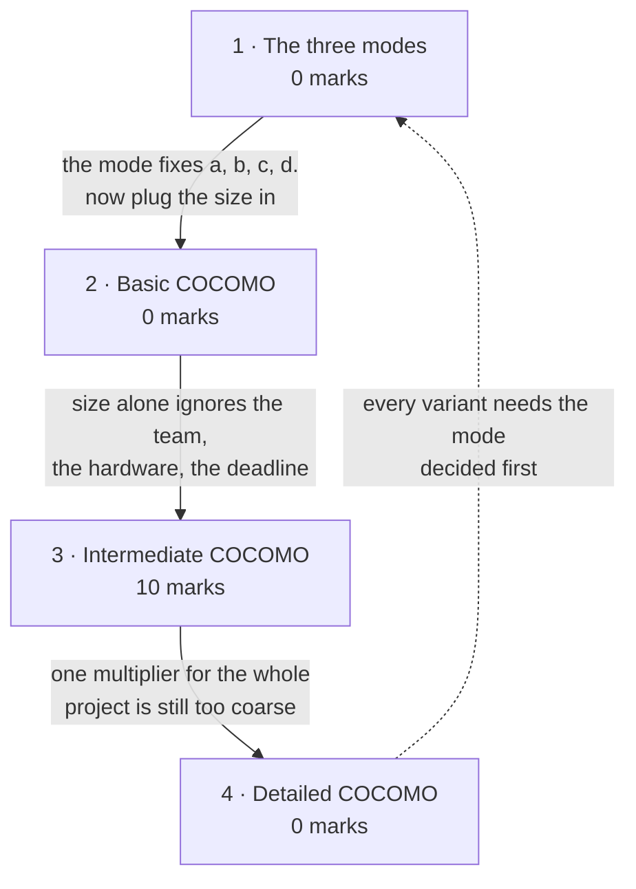

# Effort Estimation & COCOMO

**Prerequisites:** [[Software Size Estimation]]

## Overview

> [!info] 10 of 80 in [[se-ete-2025-26]] — question D1
> **The heaviest topic in the MTE window, and the only numerical on the entire
> paper.** D1 is a 10-mark Section D question: 100000 LOC embedded system,
> compare effort and duration under two staffing scenarios, then find the effort
> and time variation. 4 + 4 + 2. One paper only; see [[weightage]].

> [!tip] D1 is the deck's Example 4.7 with the numbers changed
> The deck asks the **same question** — an embedded project, two pools of
> developers (highly capable but inexperienced in the language, versus low
> capability but experienced), what is the impact of hiring from one or the
> other — at 400 KLOC instead of 100 KLOC. This is exactly the rule-8 pattern:
> **work the deck's example and you have worked the exam question.** It is
> reproduced in full in the Question Bank, along with **an error it contains**.

Size becomes a schedule here. COCOMO — Boehm's **CO**nstructive **CO**st
**MO**del — takes KLOC and returns effort in person-months and duration in
months, in three escalating variants. It is the densest arithmetic in the course
and the most reliably examinable thing in the Mid-Term window.

## Quick Reference

> [!abstract] The two equations, and the one thing that decides everything
> $$E = a\,(\text{KLOC})^{b} \times \text{EAF} \qquad D = c\,(E)^{d}$$
> **Identify the mode first** — organic, semi-detached or embedded — because it
> selects every coefficient. Then read: is this Basic (no EAF) or Intermediate
> (EAF from cost drivers)?
> **Duration is computed from effort, never from KLOC.**

### The three modes

| Mode | Size | Nature | Innovation | Deadline | Environment |
|---|---|---|---|---|---|
| **Organic** | 2-50 KLOC | small, experienced developers, familiar environment — payroll, inventory | little | not tight | familiar, in-house |
| **Semi-detached** | 50-300 KLOC | medium team, average prior experience — compilers, DBMS, editors | medium | medium | medium |
| **Embedded** | over 300 KLOC | large, real-time, complex interfaces, little prior experience — ATMs, air traffic control | significant | tight | complex hardware/customer interfaces |

**Mode selection is the first mark.** The size band is a guide, not a rule — the
words *real-time*, *embedded*, *tight deadline* and *complex interfaces* override
it. D1 says "embedded system" outright.

### Coefficients — the two tables differ, and it matters

**Basic COCOMO** — *E* = *a*(KLOC)*b*, *D* = *c*(*E*)*d*

| Mode | *ab* | *bb* | *cb* | *db* |
|---|---|---|---|---|
| Organic | **2.4** | 1.05 | 2.5 | 0.38 |
| Semi-detached | 3.0 | 1.12 | 2.5 | 0.35 |
| Embedded | **3.6** | 1.20 | 2.5 | 0.32 |

**Intermediate COCOMO** — *E* = *a*(KLOC)*b* × EAF

| Mode | *ai* | *bi* | *ci* | *di* |
|---|---|---|---|---|
| Organic | **3.2** | 1.05 | 2.5 | 0.38 |
| Semi-detached | 3.0 | 1.12 | 2.5 | 0.35 |
| Embedded | **2.8** | 1.20 | 2.5 | 0.32 |

> [!warning] Only *a* changes between Basic and Intermediate
> *b*, *c* and *d* are identical in both tables. But *a* moves in **opposite
> directions**: organic rises 2.4 → 3.2, embedded falls 3.6 → **2.8**,
> semi-detached alone stays at 3.0. **Given *a* = 2.8 you are in Intermediate,
> embedded** — which is exactly how D1 identifies itself without saying so.

### Derived quantities

| Quantity | Formula | Units |
|---|---|---|
| Average staff size | SS = *E* / *D* | persons |
| Productivity | *P* = KLOC / *E* | KLOC per person-month |
| EAF | product of all applicable cost-driver multipliers | dimensionless |

### The 15 cost drivers, in four groups

| Group | Drivers |
|---|---|
| **Product** | RELY (required reliability) · DATA (database size) · CPLX (product complexity) |
| **Hardware/Computer** | TIME (runtime performance) · STOR (memory) · VIRT (virtual machine volatility) · TURN (turnaround time) |
| **Personnel** | ACAP (analyst capability) · AEXP (application experience) · **PCAP (programmer capability)** · VEXP (virtual machine experience) · **LEXP (programming language experience)** |
| **Project** | MODP (modern programming practices) · TOOL (software tools) · SCED (required schedule) |

### Multiplier table

| Driver | Very low | Low | Nominal | High | Very high | Extra high |
|---|---|---|---|---|---|---|
| RELY | 0.75 | 0.88 | 1.00 | 1.15 | 1.40 | — |
| DATA | — | 0.94 | 1.00 | 1.08 | 1.16 | — |
| CPLX | 0.70 | 0.85 | 1.00 | 1.15 | 1.30 | 1.65 |
| TIME | — | — | 1.00 | 1.11 | 1.30 | 1.66 |
| STOR | — | — | 1.00 | 1.06 | 1.21 | 1.56 |
| VIRT | — | 0.87 | 1.00 | 1.15 | 1.30 | — |
| TURN | — | 0.87 | 1.00 | 1.07 | 1.15 | — |
| ACAP | 1.46 | 1.19 | 1.00 | 0.86 | 0.71 | — |
| AEXP | 1.29 | 1.13 | 1.00 | 0.91 | 0.82 | — |
| **PCAP** | 1.42 | **1.17** | 1.00 | **0.86** | 0.70 | — |
| VEXP | 1.21 | 1.10 | 1.00 | 0.90 | — | — |
| **LEXP** | **1.14** | 1.07 | 1.00 | **0.95** | — | — |
| MODP | 1.24 | 1.10 | 1.00 | 0.91 | 0.82 | — |
| TOOL | 1.24 | 1.10 | 1.00 | 0.91 | 0.83 | — |
| SCED | 1.23 | 1.08 | 1.00 | 1.04 | 1.10 | — |

**Bold entries are the four D1 uses.** Note the direction: for capability and
experience drivers, **better people give a multiplier below 1** (less effort).
For demand drivers like RELY, CPLX and TIME, **more demanding gives above 1**.
SCED is the odd one — both ends exceed 1.00, because compressing *or* stretching
a schedule costs effort.

### Detailed COCOMO

Adds **phase-sensitive effort multipliers** and a **three-level product
hierarchy** (module / subsystem / system), allocating manpower per phase.
Plan and requirements: **effort 6-8%**, development time **10-40%**, depending on
mode and size.

## How it's asked

Generic skeleton on [[answer-patterns]] §3. **This is the paper's only numerical
long-answer and the heaviest topic in the MTE window — 10 of 80.**

### Numerical — D1, 10 marks (4 + 4 + 2)

- **Spot it:** a size in LOC, a mode named or implied, and a note supplying
  *a, b, c, d*. **An *a* of 2.8 or 3.0/3.2 means Intermediate, not Basic** — the
  coefficient set identifies the model, and the question will not say so.
- **Skeleton, in this exact order:**
  1. **Given block** — convert LOC → KLOC on the first line. State the mode and
     which model the coefficients belong to.
  2. **Nominal effort** *E* = *a* × KLOC*b*, showing the log-antilog
     working for the power.
  3. **EAF** = product of the cost-driver multipliers given.
  4. **Adjusted effort** = nominal × EAF, then **duration** *D* = *c* × *E**d*.
  5. **Repeat for each case**, then compute what was actually asked — usually the
     **variation between cases**, absolute and percentage.
  6. Answer line **with units**: PM for effort, months for duration.
- **Earns the marks:** the variation step. D1 gives 2 marks for it specifically,
  and candidates who compute both cases correctly still lose those 2 by stopping.
- **Trap:** forgetting to divide by 1000; using KLOC where effort belongs in the
  duration formula; reporting person-months as months.

**Also asked as a mode-selection sub-step.** Deck Example 4.6 gives a word problem
with no mode stated ("average experience", "schedule not very tight") and expects
you to pick semi-detached and justify. That is a `scenario` move embedded inside a
`numerical` question — see section 1.

**Never asked as:** `draw`, `compare`. `explain` appears only adjacent — B3's
effort-distribution question is filed on [[SDLC & CMMI]] but its machinery is
here.

## Contents

| # | Section | Type | Archetype | Marks | Why it's here |
|---|---|---|---|---|---|
| 1 | The three development modes | definitional | scenario (embedded) | 0 | picks every coefficient — the first step of any question |
| 2 | Basic COCOMO | numerical | numerical | 0 | two worked deck examples; staff size and productivity |
| 3 | Intermediate COCOMO and the cost drivers | numerical | **numerical** | **10** | **carries D1** — the paper's only numerical |
| 4 | Detailed COCOMO | definitional | — | 0 | phase-sensitive multipliers; definition only |

## Mindmap

## 1 · The three development modes

**Intuition.**
- **A hundred thousand lines of payroll code and a hundred thousand lines of
  air-traffic-control code are not the same project.**
- One is written by people who have done it before, in a familiar environment,
  with a deadline that can slip. The other is real-time, safety-critical,
  interfaces with hardware nobody has used before, and ships on a fixed date.
- **COCOMO's first move is to sort projects into three archetypes**, because the
  coefficients converting size into effort are wholly different for each.

**Definitions & distinctions.** The full comparison table is in Quick Reference.
The examinable skill is **classification from a word problem**:

| Signal in the question | Mode |
|---|---|
| "payroll", "inventory", small, experienced team, in-house | Organic |
| "compiler", "database system", "editor", average experience | Semi-detached |
| **"embedded"**, "real-time", "ATM", "air traffic control", tight deadline, complex interfaces | Embedded |

Size bands (2-50 / 50-300 / over 300 KLOC) are typical values, not definitions.
Deck Example 4.6 makes the point: a 200 KLOC project with an **average-experience
team** and a **schedule that is not very tight** is semi-detached, and the deck
justifies the choice explicitly on those two phrases rather than on the size.

**What gets asked.** Never examined alone, but **every COCOMO question begins
here** and a wrong mode makes every subsequent number wrong. D1 removes the
difficulty by saying "embedded system" and by supplying the coefficients — but do
not count on that.

## 2 · Basic COCOMO

**Intuition.**
- **The simplest useful model:** assume effort depends only on size, fit a power
  law to historical projects, read effort off it.
- **The exponent *b* is slightly greater than 1 in every mode**, which encodes
  something real — **effort grows faster than size**, because bigger systems have
  more interactions to coordinate.
- **Duration then comes from effort, with a much smaller exponent (0.32-0.38)** —
  which is why a project needing four times the effort does not take four times as
  long. **It takes more people instead.**

**Formulas & variables.**

$$E = a_b\,(\text{KLOC})^{b_b} \qquad D = c_b\,(E)^{d_b}$$

| Symbol | Meaning | Units |
|---|---|---|
| KLOC | size | thousands of lines of code |
| *E* | effort | **person-months** |
| *D* | development time | **months** |
| *ab*, *bb* | effort coefficients, by mode | — |
| *cb*, *db* | duration coefficients, by mode | — |

Basic coefficients are in Quick Reference. Two derived quantities defined here:

$$\text{Average staff size} = \frac{E}{D} \text{ persons} \qquad \text{Productivity} = \frac{\text{KLOC}}{E} \text{ KLOC/PM}$$

**Solved questions.** Deck Examples 4.5 and 4.6 are worked in full in the Question
Bank.

**What gets asked.** Never examined on the one paper here. If Basic appears it
will be the three-mode comparison (Example 4.5) or the staff-size-and-productivity
form (Example 4.6).

## 3 · Intermediate COCOMO and the cost drivers

**Intuition.**
- **Basic COCOMO says a 100 KLOC embedded system costs a fixed amount**,
  regardless of who builds it, on what hardware, under what reliability
  requirement. **That is obviously false** — a team of experts and a team of
  novices do not cost the same.
- **Intermediate COCOMO fixes it with 15 cost drivers**, each rated very low to
  extra high, each contributing a multiplier. Their product is the **Effort
  Adjustment Factor**; multiplying nominal effort by it accounts for actual
  project conditions.
- **The direction of each multiplier is the intuitive part.** Anything making the
  job **easier** (capable people, good tools) is **below 1.00** and reduces effort;
  anything making it **harder** (high reliability, tight memory, complex product)
  is **above 1.00**.

**Formulas & variables.**

$$E = a_i\,(\text{KLOC})^{b_i} \times \text{EAF} \qquad D = c_i\,(E)^{d_i}$$

$$\text{EAF} = \prod_{\text{applicable drivers}} (\text{multiplier})$$

| Symbol | Meaning | Units |
|---|---|---|
| EAF | Effort Adjustment Factor — product of the cost-driver multipliers | dimensionless |
| *ai*, *bi*, *ci*, *di* | intermediate coefficients, by mode | — |

**EAF multiplies the effort only.** Duration is then computed from the *adjusted*
effort — so the EAF reaches duration indirectly, through *E*, and never by
multiplying *D*.

The 15 drivers and the full multiplier table are in Quick Reference.

**Solved questions.**

> **[[se-ete-2025-26]] Q D1 (4+4+2 = 10 marks, CO2)** — "For a project of 100000
> LOC embedded system, compare the efforts and time duration and find out the
> effort variation and time variation if:
> • Highly capable programmers but very little experience in programming language
> (PCAP = .86, LEXP = 1.14)
> • Programmers of the low capability but a lot of experience with programming
> language (PCAP = 1.17, LEXP = .95)
> (Note: *ai* = 2.8, *bi* = 1.20, *ci* = 2.5,
> *di* = .32)"

**Given**

| Quantity | Symbol | Value |
|---|---|---|
| Size | KLOC | 100000 LOC = **100 KLOC** |
| Mode | — | embedded (stated) |
| Model | — | **Intermediate** — *a* = 2.8 identifies it |
| Effort coefficients | *ai*, *bi* | 2.8, 1.20 |
| Duration coefficients | *ci*, *di* | 2.5, 0.32 |
| Case (i) | PCAP, LEXP | 0.86 (high), 1.14 (very low) |
| Case (ii) | PCAP, LEXP | 1.17 (low), 0.95 (high) |
| **Find** | | effort and duration for each case, then effort variation and time variation |

**Step 1 — convert the size.** 100000 LOC ÷ 1000 = **100 KLOC**. Every COCOMO
formula takes KLOC; using 100000 here inflates the answer by a factor of
1000001.2/1001.2 ≈ 4000.

**Step 2 — nominal effort, before any adjustment.**

*E*nominal = 2.8 × (100)1.20

(100)1.20 = 102.4 = 251.1886

*E*nominal = 2.8 × 251.1886 = **703.33 PM**

**Step 3 — case (i): highly capable, inexperienced in the language.**

EAF = PCAP × LEXP = 0.86 × 1.14 = **0.9804**

*E*1 = 703.33 × 0.9804 = **689.54 PM**

*D*1 = 2.5 × (689.54)0.32 = 2.5 × 8.0977 = **20.24 months**

**Step 4 — case (ii): low capability, experienced in the language.**

EAF = PCAP × LEXP = 1.17 × 0.95 = **1.1115**

*E*2 = 703.33 × 1.1115 = **781.75 PM**

*D*2 = 2.5 × (781.75)0.32 = 2.5 × 8.4290 = **21.07 months**

**Step 5 — the variations.**

Effort variation = 781.75 − 689.54 = **92.21 person-months** — case (ii) needs
**13.37% more effort**.

Time variation = 21.07 − 20.24 = **0.83 months** — case (ii) takes **4.10%
longer**.

**Answer**

| | Case (i) capable, inexperienced | Case (ii) low capability, experienced |
|---|---|---|
| EAF | 0.9804 | 1.1115 |
| Effort | **689.54 PM** | **781.75 PM** |
| Duration | **20.24 months** | **21.07 months** |

**Effort variation ≈ 92.21 PM (13.37%); time variation ≈ 0.83 months (4.10%),
both in favour of case (i).**

**Conclusion — say this, it is the point of the question.** Hiring **highly
capable programmers who are new to the language** beats hiring **low-capability
programmers who know it well**. Raw programmer capability (PCAP spans 1.42 down
to 0.70) has a far wider range of influence than language experience (LEXP spans
only 1.14 down to 0.95), so capability dominates. Language experience is quickly
acquired; capability is not.

*(No printed solution key exists for this paper, so this answer is unchecked —
no `✓`. All arithmetic independently verified.)*

**What gets asked.** This subtopic carries the whole topic's marks and the whole
paper's numerical content. One dominant form:

- **Spot it** — a size in LOC or KLOC, a stated mode, and either cost-driver
  ratings or explicit multipliers. If *a* = 2.8, 3.0 or 3.2 you are in
  Intermediate; 2.4, 3.0 or 3.6 means Basic.
- **Method** — five steps, in this order: convert to KLOC → compute nominal
  effort → compute EAF as the **product** of the multipliers → adjusted effort →
  duration **from the adjusted effort**. Show every substitution; the marks are
  distributed across the steps, so a wrong final number with correct working
  still scores.
- **Trap** — six, in rough order of frequency. Forgetting to convert LOC to KLOC.
  **Adding** the cost-driver multipliers instead of multiplying. Computing
  duration from KLOC instead of from *E*. Using the Basic *a* (3.6) where
  Intermediate (2.8) is meant. Reporting effort in "months" rather than
  **person-months**. And giving the two cases without the **variation** — that is
  the last 2 marks and it is the easiest part.

## 4 · Detailed COCOMO

**Intuition.**
- **Even the intermediate model applies one EAF across the entire project**, which
  is still too blunt: a demanding reliability requirement affects testing far more
  than preliminary design.
- **Detailed COCOMO makes the multipliers phase-sensitive.**
- **And it decomposes the product into a three-level hierarchy** — module,
  subsystem, system — so effort can be estimated where the work actually differs,
  then summed.

**Definitions & distinctions.** Two additions over Intermediate:

1. **Phase-sensitive effort multipliers** — each cost driver has a different
   multiplier for each development phase, and manpower is allocated per phase.
2. **Three-level product hierarchy** — module, subsystem, system level.

The deck's one concrete figure: for the **plan and requirements** phase, effort
is **6-8%** and development time **10-40%** of the total, varying with mode and
size.

**What gets asked.** Never examined. Definition depth only — name the two
additions and the one figure. This connects to B3's effort-distribution question
on [[SDLC & CMMI]], which asks the same idea non-numerically.

## Question Bank

**PYQ questions — 1.**

> **[[se-ete-2025-26]] Q D1 (10 marks, CO2)** — the 100 KLOC embedded comparison.

Worked in full in subtopic 3. Answer: case (i) 689.54 PM / 20.24 months; case
(ii) 781.75 PM / 21.07 months; effort variation 92.21 PM (13.37%), time variation
0.83 months (4.10%). *(Unchecked.)*

**Deck questions — 3**, all from
`raw/sources/ppts/2025/L7 Software Project planning_6.pdf`. Arithmetic
independently re-verified; Examples 4.5 and 4.6 match the deck exactly, and
Example 4.7 contains an error, diagnosed below.

### Deck Example 4.5 — Basic COCOMO across all three modes

> Suppose a project was estimated to be **400 KLOC**. Calculate the effort and
> development time for each of the three modes.

**Given:** KLOC = 400; Basic coefficients. **Find:** *E* and *D* per mode.

**(i) Organic** — *a* = 2.4, *b* = 1.05, *c* = 2.5, *d* = 0.38

*E* = 2.4 × (400)1.05 = **1295.31 PM**
*D* = 2.5 × (1295.31)0.38 = **38.07 months**

**(ii) Semi-detached** — *a* = 3.0, *b* = 1.12, *c* = 2.5, *d* = 0.35

*E* = 3.0 × (400)1.12 = **2462.79 PM**
*D* = 2.5 × (2462.79)0.35 = **38.45 months**

**(iii) Embedded** — *a* = 3.6, *b* = 1.20, *c* = 2.5, *d* = 0.32

*E* = 3.6 × (400)1.20 = **4772.81 PM**
*D* = 2.5 × (4772.81)0.32 = **38 months** (37.6, deck rounds to 38)

**Answer.** Effort ranges from 1295 to 4773 PM — a factor of **3.7** — while
duration stays near **38 months in all three modes**. That is the lesson: mode
changes how many *people* you need far more than how *long* it takes. Worth
saying explicitly if this form is asked. *(Matches the deck.)*

### Deck Example 4.6 — mode selection, staff size and productivity

> A project size of **200 KLOC** is to be developed. The software development
> team has **average experience on similar types of project**. The project
> schedule is **not very tight**. Calculate the effort, development time, average
> staff size and productivity.

**Step 1 — choose the mode.** 200 KLOC sits in the semi-detached band (50-300),
the team has *average previous experience*, and the schedule is *not very tight*.
All three signals agree: **semi-detached**. The deck justifies it on exactly these
grounds.

**Step 2 — effort.** *E* = 3.0 × (200)1.12 = **1133.12 PM**

**Step 3 — duration.** *D* = 2.5 × (1133.12)0.35 = **29.3 months**

**Step 4 — average staff size.** SS = *E*/*D* = 1133.12 / 29.3 = **38.7 persons**

**Step 5 — productivity.** *P* = KLOC/*E* = 200 / 1133.12 = **0.1765 KLOC/PM**,
i.e. about **177 LOC per person-month**

**Answer: E = 1133.12 PM, D = 29.3 months, SS ≈ 38.7 persons, P ≈ 0.177 KLOC/PM.**
*(Matches the deck.)*

### Deck Example 4.7 — the same question as D1, and it contains an error

> A new project with estimated **400 KLOC embedded system** has to be developed.
> The project manager has a choice of hiring from two pools of developers: **very
> highly capable with very little experience** in the programming language being
> used, **or** developers of **low quality but a lot of experience** with the
> programming language. What is the impact of hiring all developers from one or
> the other pool?

This is **D1 with 400 KLOC instead of 100** and the multipliers not supplied.

> [!warning] The deck's own slide carries the note "EAF is wrong, please check"
> It is right, and here is exactly what is wrong. The deck uses **0.82** for
> "very highly capable" and **1.29** for "low quality". Neither is a **PCAP**
> value:
>
> | Row | Very low | Low | Nominal | High | Very high |
> |---|---|---|---|---|---|
> | PCAP (programmer capability) | 1.42 | 1.17 | 1.00 | 0.86 | **0.70** |
> | AEXP (application experience) | **1.29** | 1.13 | 1.00 | 0.91 | **0.82** |
>
> **0.82 and 1.29 are both from the AEXP row.** The deck read programmer
> capability off the *application experience* line. The correct PCAP values are
> **0.70** (very high) and **1.17** (low).
>
> The exam question sidesteps this entirely by **supplying** PCAP = 0.86 and
> 1.17 — both genuine PCAP entries. Whoever set D1 appears to have known.

**The deck's printed solution** (embedded mode, intermediate model):

*E*nominal = 2.8 × (400)1.20 = 3712 PM

| Case | EAF (as printed) | *E* | *D* |
|---|---|---|---|
| I very highly capable, little language experience | 0.82 × 1.14 = 0.9348 | 3470 PM | 33.9 months |
| II low quality, much language experience | 1.29 × 0.95 = 1.22 | 4528 PM | 36.9 months |

**Corrected, using the real PCAP values:**

| Case | EAF | *E* | *D* |
|---|---|---|---|
| I PCAP very high (0.70) × LEXP very low (1.14) | **0.798** | **2962 PM** | **32.3 months** |
| II PCAP low (1.17) × LEXP high (0.95) | **1.1115** | **4126 PM** | **35.9 months** |

**The conclusion is unchanged and is what the question is really asking:** case II
needs more effort and more time, so **low-quality developers with a lot of
language experience cannot match highly capable developers with little language
experience**. The correction actually *strengthens* it — the gap widens from
1058 PM to 1164 PM.

*(Deck question, printed solution disagreed with and the disagreement recorded, as
rule 8 requires. No `✓`.)*

**Textbook questions — available.**
`raw/sources/ppts/2025/Chapter 4 Software Project planning.pdf` (Aggarwal &
Singh, chapter 4 — **not** the prescribed Pressman) carries a 61-item MCQ and
exercise bank, much of it COCOMO. Directly relevant items, quoted:

- **4.15** "Discuss various types of COCOMO mode. Explain the phase wise
  distribution of effort." — the numerical counterpart of B3 on [[SDLC & CMMI]].
- **4.16** "Explain all the levels of COCOMO model. Assume that the size of an
  organic software product has been estimated to be 32,000 lines of code.
  Determine the effort required and the nominal development time."
- **4.18** "The effort distribution for a 240 KLOC organic mode project is:
  product design 12%, detailed design 24%, code and unit test 36%, integrate and
  test 28%. How would the following changes, from low to high, affect the phase
  distribution of effort and the total effort: analyst capability, use of modern
  programming languages, required reliability, requirements volatility?"
- **4.20** office automation, five modules of 0.5, 1.5, 2.0, 1.0 and 2.0 KLOC,
  high complexity and reliability, low programmer capability and experience —
  overall cost and schedule, plus per-phase estimates.
- **4.21** "Suppose that a project was estimated to be 600 KLOC. Calculate the
  effort and development time for each of the three modes."

**No answer key is included.** Rule 6: drill syllabus topics with these, do not
let them expand scope — COCOMO-II items (4.22-4.25) are **outside** this
syllabus, which names only the empirical estimation models.

**Assignment questions — [[se-assign-1-2026]].** **Q6** basic COCOMO, 400 KLOC, all three modes (**deck Example 4.5, verbatim**) · **Q9** embedded 4 KLOC with cost and manpower · **Q11(i)** organic 20 KLOC duration

Worked in full on that page, with method and traps. **Coursework, so it does not
change [[weightage]]** — but it is direct evidence of what the instructor
considers important.

## Mistakes & Traps

- **Not converting LOC to KLOC.** D1 says 100000 LOC; the formula wants 100.
  This single slip destroys every subsequent number.
- **Adding the cost-driver multipliers.** EAF is a **product**.
- **Computing *D* from KLOC.** *D* = *c*(*E*)*d* — duration comes from
  the **adjusted effort**, always.
- **Using the wrong *a*.** Basic embedded is 3.6; Intermediate embedded is
  **2.8**. They move in opposite directions from Basic to Intermediate, and only
  semi-detached is unchanged at 3.0.
- **Applying the EAF to duration as well.** It adjusts effort only; duration
  inherits the change through *E*.
- **Omitting the variation.** D1's last 2 marks are the differences. Give both
  absolute and percentage.
- **Reading a multiplier off the wrong row.** This is exactly the deck's own
  error — PCAP and AEXP are adjacent lines and 0.82 / 1.29 belong to AEXP.
- **Dropping units.** Effort is **person-months**, duration is **months**, staff
  size is **persons**. Person-months and months are different answers.

## Course Material

- `raw/sources/ppts/2025/L7 Software Project planning_6.pdf` — the main source.
  The three modes with the full comparison table; Basic COCOMO with its
  coefficient table; average staff size and productivity; worked Examples 4.5,
  4.6 and 4.7; the 15 cost drivers in four groups; the complete multiplier table;
  Intermediate COCOMO with its own coefficient table; and Detailed COCOMO with
  the phase-sensitive multipliers and the 6-8% plan/requirements figure.
- `raw/sources/ppts/2025/Chapter 4 Software Project planning.pdf` — **Aggarwal &
  Singh chapter 4**, 61 MCQ and exercise items, no answer key.

**Deck error recorded** (rule 8): Example 4.7 computes its EAF from **AEXP**
multipliers (0.82, 1.29) while the question asks about **programmer capability**,
which should give 0.70 and 1.17. The deck's own slide already carries the note
*"EAF is wrong, please check"*; this page identifies the specific cause and works
the corrected version.

**Related:** [[story]] · [[syllabus]] · [[weightage]] · [[MTE Roadmap]] ·
previous [[Software Size Estimation]] · next [[Risk Analysis & Estimation]] ·
cross-reference [[SDLC & CMMI]] and
[[Introduction to Software Engineering]] for Brooks's Law
