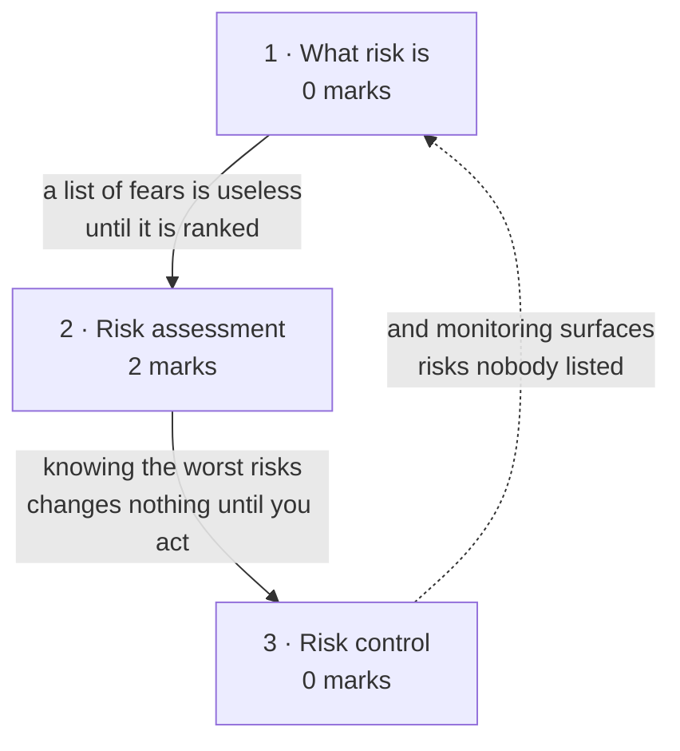

# Risk Analysis & Estimation

**Prerequisites:** [[Effort Estimation & COCOMO]]

## Overview

> [!info] 2 of 80 in [[se-ete-2025-26]] — question A4
> A4: *"List the difference between risk identification and risk assessment."*
> The deck's own activity diagram answers it in a way most students get wrong —
> **identification is a sub-activity of assessment**, not its sibling. One paper
> only; see [[weightage]].

Estimation produces a number and pretends to certainty. Risk management is the
discipline that admits the number is a guess and plans for the ways it could be
wrong. The deck opens with the honest diagnosis: *software developers are extreme
optimists — we assume everything will go exactly as planned.* Risk management
exists to reduce the surprise factor.

## Quick Reference

> [!abstract] The two that carry this topic
> - **The hierarchy.** Risk Management = **Risk Assessment** (identification,
>   analysis, prioritization) + **Risk Control** (management planning,
>   monitoring, resolution). Identification sits *inside* assessment. That is A4.
> - **Risk exposure = probability of loss × magnitude of that loss.** The one
>   formula on this page.

**Definition.** *"Risk is a problem that may cause some loss or threaten the
success of the project, but which has not happened yet."* Or, the deck's memory
hook: **tomorrow's problems are today's risks.**

**Risk management** is the process of identifying, addressing and eliminating
these problems before they can damage the project.

### The six activities, in two groups

```
Risk Management
├── Risk Assessment
│   ├── Risk Identification    — find the risks
│   ├── Risk Analysis          — how do outcomes change as risk variables change?
│   └── Risk Prioritization    — focus on the severe ones
└── Risk Control
    ├── Risk Management Planning — a plan for each significant risk
    ├── Risk Monitoring          — track them as the project runs
    └── Risk Resolution          — execute the plans
```

| Activity | What it does |
|---|---|
| **Identification** | produce the list of what could go wrong |
| **Analysis** | examine how project outcomes change as risk input variables change |
| **Prioritization** | rank by severity so effort goes to the ones that matter |
| **Management planning** | produce a plan for each significant risk; record the decisions |
| **Monitoring** | watch the risks over the project's life |
| **Resolution** | execute the plans |

**Risk exposure** = probability of incurring a loss × potential magnitude of that
loss. It is what prioritization ranks on: a near-certain trivial risk and a
remote catastrophic one can score alike.

**Risk avoidance** — the other handling strategy. *Do not do the risky things.*
Avoid risks by not undertaking certain projects, or by relying on proven rather
than cutting-edge technology.

### Capers Jones's top five risk factors

| # | Category | Examples |
|---|---|---|
| 1 | **Dependencies on outside agencies** | availability of trained people · inter-group dependencies · customer-furnished items · subcontractor relationships |
| 2 | **Requirement issues** | uncertain requirements · no clear product vision · no agreement on requirements · unprioritised requirements · new market with uncertain needs · rapidly changing requirements · inadequate impact analysis of changes |
| 3 | **Management issues** | inadequate planning · poor visibility into actual status · unclear ownership and decision making · staff personality conflicts · unrealistic expectations · poor communication |
| 4 | **Lack of knowledge** | inadequate training · poor understanding of methods and tools · inadequate domain experience · new technologies · poorly documented or neglected processes |
| 5 | **Other** | inadequate testing facilities · turnover of essential personnel · unachievable performance requirements · technical approaches that may not work |

Requirement issues produce one of two outcomes, both bad: **the wrong product, or
the right product built badly.**

> [!note] Why the deck notes that managers write the risk plan
> "Project managers usually write the risk management plans, and most people do
> not wish to air their weaknesses in public." Management issues are therefore
> the category most likely to be under-reported — a nice point to make in any
> longer risk answer.

## Subtopic map

| # | Subtopic | Marks | Why it's here |
|---|---|---|---|
| 1 | What risk is, and typical software risks | 0 | the definition and Capers Jones's five categories |
| 2 | Risk assessment | **2** | carries A4 — identification, analysis, prioritization |
| 3 | Risk control | 0 | planning, monitoring, resolution — the other half |

## Mindmap



## 1 · What risk is, and typical software risks

**Intuition.**
- **The deck's framing is unusually blunt:** software developers are extreme
  optimists who assume everything will go exactly as planned, and **software
  surprises are never good news**.
- **Risk management is the correction** — dealing with a concern *before* it
  becomes a crisis, by quantifying both the probability of failure and its
  consequences.
- **The definition turns on one word: a risk has not happened yet.** Once it has,
  it is not a risk; it is a problem, and you have lost the chance to have planned
  for it.

**Definitions & distinctions.** The definition, the management definition and
Capers Jones's five categories are in Quick Reference. The distinction worth
holding: risk management deals with **potential** problems; project management
deals with **current** ones. The deck draws exactly that contrast.

**What gets asked.** Never examined directly. The definition makes a good opening
line for A4.

## 2 · Risk assessment

**Intuition.**
- **Assessment is everything you do before acting:** **find** the risks,
  **understand** how they would move the project's outcomes, and **rank** them so
  limited attention goes where it does most good.
- **Ranking needs a common currency** — risk exposure, probability × magnitude —
  which lets a likely-but-minor risk and an unlikely-but-catastrophic one be
  compared on one scale.
- **The structural point A4 depends on: identification is not the opposite of
  assessment, it is the first step of it.**

**Formulas & variables.**

$$\text{Risk exposure} = P(\text{loss}) \times \text{magnitude of loss}$$

| Symbol | Meaning | Units |
|---|---|---|
| *P*(loss) | probability of incurring a loss due to the risk | 0 to 1 |
| magnitude | potential size of that loss | money, time, or a severity score |

The three activities are tabulated in Quick Reference.

**Solved questions.**

> **[[se-ete-2025-26]] Q A4 (2 marks, CO5)** — "List the difference between risk
> identification and risk assessment."

**Answer.** They are **not two parallel activities — risk identification is one
of the three activities that make up risk assessment.**

| | Risk identification | Risk assessment |
|---|---|---|
| **Scope** | a single activity | a **group** of three activities: identification, analysis, prioritization |
| **Question** | *what could go wrong?* | *what could go wrong, how badly, and which ones first?* |
| **Output** | a list of candidate risks | a **prioritised** list with exposure values |
| **Relationship** | the **first step** of assessment | **contains** identification |
| **Involves measurement?** | no — purely enumeration | yes — analysis and prioritization use risk exposure |

**In one sentence:** risk identification produces the list of what might go wrong;
risk assessment is the wider stage that takes that list, analyses how each risk
would change project outcomes, and prioritises them by risk exposure so the severe
ones get attention first.

Risk assessment then pairs with **risk control** (planning, monitoring,
resolution) to make up risk management as a whole.

*(No printed solution key exists for this paper, so this answer is unchecked —
no `✓`.)*

**What gets asked.** This subtopic carries the topic's only marks:

- **Spot it** — any question asking to distinguish two risk-management terms, or
  to explain risk management activities.
- **Method** — for a 2-marker, lead with the **containment relationship** (one is
  part of the other), then give one distinguishing property each. Drawing the
  small hierarchy from Quick Reference answers it faster than prose.
- **Trap** — treating them as siblings and inventing a false contrast such as
  "identification finds risks, assessment evaluates them". That is half right and
  misses the structure the deck actually teaches, which is the point of the
  question. Second trap: confusing risk **analysis** (one activity inside
  assessment) with risk **assessment** (the group). The question names
  *assessment*, so answer about the group.

## 3 · Risk control

**Intuition.**
- **Assessment tells you what will hurt and how much. Control is everything
  after:** write a plan for each significant risk and record the decision, watch
  the risks as the project runs, execute the plans when a risk starts to
  materialise.
- **Its most under-rated option is avoidance** — the deck's blunt phrasing is *do
  not do the risky things*, achieved by not undertaking certain projects at all or
  by choosing proven technology over cutting-edge.
- **Avoidance costs opportunity rather than effort**, which is why it is easy to
  forget it is on the menu.

**Definitions & distinctions.** The three activities are in Quick Reference.

**Risk management planning** produces a plan for dealing with each significant
risk, and the decisions are **recorded in the plan** — a documentation
requirement, not just an intention. **Risk resolution** is the execution of those
plans. **Risk monitoring** runs between them, tracking risks over the project's
life, which is also how risks nobody originally listed get caught.

Risk management is an **umbrella activity** in the sense of
[[Software Engineering as a Layered Technology]] — it runs across the whole
project rather than occupying a phase. That is why monitoring exists at all.

**What gets asked.** Never examined. Know the three activities and risk
avoidance.

## Question Bank

**PYQ questions — 1.**

> **[[se-ete-2025-26]] Q A4 (2 marks, CO5)** — "List the difference between risk
> identification and risk assessment."

Worked in full in subtopic 2. Short form: **identification is one of the three
activities inside assessment** (with analysis and prioritization). Identification
enumerates what could go wrong; assessment additionally analyses impact and
prioritises by risk exposure. *(Unchecked.)*

**Deck questions — none.** The risk section of
`L7 Software Project planning_6.pdf` is expository and carries no worked examples
or practice bank.

**Textbook questions — available but not risk-specific.**
`Chapter 4 Software Project planning.pdf` (Aggarwal & Singh) carries a 61-item
MCQ and exercise bank, almost all of it on estimation and COCOMO rather than
risk. No answer key.

> [!note] A risk-exposure numerical is the obvious untested form
> The deck defines risk exposure as probability × magnitude but works no example.
> A risk-table question — several risks with probabilities and loss magnitudes,
> compute exposure for each and rank them — is the natural numerical form for
> this topic and has **never appeared** in this corpus. Worth ten minutes if you
> have them, no more.

## Mistakes & Traps

- **Treating identification and assessment as parallel.** Identification is
  *inside* assessment. This is the whole of A4.
- **Confusing risk analysis with risk assessment.** Analysis is one of the three
  activities; assessment is the group containing it.
- **Defining a risk as a problem.** A risk **has not happened yet**. Once it has,
  it is a problem.
- **Forgetting risk avoidance.** Not doing the risky thing is a legitimate
  strategy, not a failure to plan.
- **Ranking by probability alone.** Exposure is probability **×** magnitude — a
  rare catastrophe can outrank a frequent nuisance.

## Course Material

- `raw/sources/ppts/2025/L7 Software Project planning_6.pdf` — the source for all
  of this topic. The optimism diagnosis; the definition of risk and of risk
  management; Capers Jones's five risk factors with their full sub-lists; the
  risk management activities diagram (assessment and control, three activities
  each); risk exposure; and risk avoidance.

**Related:** [[story]] · [[syllabus]] · [[weightage]] · [[MTE Roadmap]] ·
previous [[Effort Estimation & COCOMO]] · next [[Data Modeling & ERD]] ·
cross-reference [[Software Engineering as a Layered Technology]] for umbrella
activities and [[Evolutionary Process Models]] for the spiral model's risk sector
