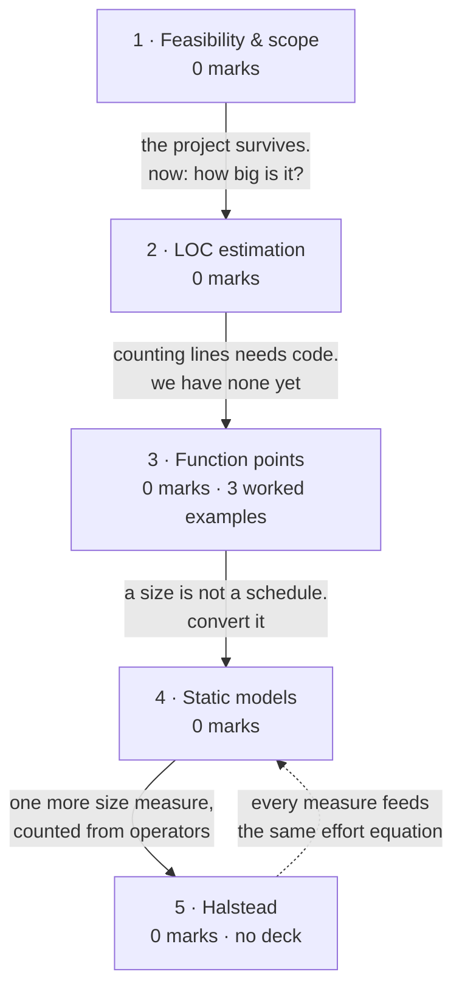

# Software Size Estimation

**Prerequisites:** [[Requirements Engineering]]

## Overview

> [!warning] 0 of 80 in [[se-ete-2025-26]] — not asked once, on one paper
> A single paper cannot show a topic is unexamined. In syllabus, taught across
> two lectures. Lectures 15-16 is *syllabus depth* and rule 3 forbids reading it
> as marks.

> [!tip] Zero marks, but do not skip it — and it is loaded with drill
> Two reasons. First, it is the **prerequisite for
> [[Effort Estimation & COCOMO]]**, the heaviest topic in the MTE window at 10
> marks — COCOMO takes size as its input, and you cannot estimate effort from a
> size you cannot compute. Second, the decks carry **four fully worked
> numericals** plus a 61-item question bank from the Aggarwal & Singh text, which
> rule 8 rates as the highest-value drill available.

Someone will ask for a date. Size is the only thing estimable from requirements
alone, so it comes first: **LOC** counts what you will write, **function points**
count what the user will get, and static models convert either into effort and
duration. Then [[Effort Estimation & COCOMO]] does the same job properly.

## Quick Reference

> [!abstract] The two formulas everything here runs on
> $$\text{UFP} = \sum_{i=1}^{5}\sum_{j=1}^{3} Z_{ij}\,w_{ij} \qquad \text{FP} = \text{UFP} \times \text{CAF}$$
> $$\text{CAF} = 0.65 + 0.01 \sum_{i=1}^{14} F_i$$
> Each *Fi* is rated **0 to 5**, so ΣFi runs 0-70 and **CAF
> runs 0.65 to 1.35**. If your CAF falls outside that, you have made an error.

### Function point weighting factors

| Functional unit | Low | Average | High |
|---|---|---|---|
| External Inputs (EI) | 3 | **4** | 6 |
| External Outputs (EO) | 4 | **5** | 7 |
| External Inquiries (EQ) | 3 | **4** | 6 |
| Internal Logical Files (ILF) | 7 | **10** | 15 |
| External Interface Files (EIF) | 5 | **7** | 10 |

**Memorise this table.** Every function-point question needs it and it is never
supplied. Mnemonic: the three transactional types start at 3, 4, 3; the two file
types are much heavier (7 and 5) because files represent stored data.

**The five functional units, in two categories:**

| Category | Unit | Definition |
|---|---|---|
| **Data** | ILF | user-identifiable group of related data **maintained within** the system |
| **Data** | EIF | related data **referenced by** the system but maintained in **another** system |
| **Transactional** | EI | processes data or control information coming **from outside** |
| **Transactional** | EO | information **leaving** the system |
| **Transactional** | EQ | requests for **instant access** to information |

An EIF for one system may be an ILF in another — the classification depends on
which system you are counting.

### The 14 complexity adjustment factors

Rated **0 = no influence · 1 = incidental · 2 = moderate · 3 = average ·
4 = significant · 5 = essential**.

Reliable backup and recovery · data communication · distributed processing ·
performance critical · heavily utilised operational environment · online data
entry · input built over multiple screens · master files updated online · complex
inputs/outputs/files/inquiries · complex internal processing · reusable code ·
conversion and installation included · multiple installations in different
organisations · designed for change and ease of use.

**Exam shortcut:** "assume all factors are average" means every *Fi* =
3, so ΣFi = 14 × 3 = 42 and **CAF = 0.65 + 0.42 = 1.07**.

### LOC

**Definition:** a line of code includes all lines containing program header,
declaration, and executable and non-executable statements. Comments and blank
lines are counted under this definition — this is the predominant research
definition, and the deck's worked figure counts **17 LOC**.

### Static estimation models

**Static, single-variable** — one predictor, usually size:

$$C = a L^{b}$$

**SEL (Software Engineering Laboratory) model**, *L* in KLOC:

| Quantity | Formula | Units |
|---|---|---|
| Effort | *E* = 1.4 *L*0.93 | person-months |
| Documentation | *DOC* = 30.4 *L*0.90 | pages |
| Duration | *D* = 4.6 *L*0.26 | months |

**Static, multivariable** — several environment variables. **Walston-Felix**:

| Quantity | Formula |
|---|---|
| Effort | *E* = 5.2 *L*0.91 |
| Duration | *D* = 4.1 *L*0.36 |

**Reversing for size:** *L* = (*E* / *a*)1/*b*

**Derived quantities**

| Quantity | Formula |
|---|---|
| Productivity | LOC ÷ effort (per person-month or person-year) |
| **Average manning** | total effort ÷ duration = persons |
| Effort from FP | FP ÷ productivity (FP per person-month) |
| Cost | effort (PM) × average cost per person-month |

**Unit trap:** 1 person-year = **12 person-months**. *L* is in **KLOC** in every
formula above — substituting raw LOC is the single most common error here.

### Feasibility

The IBM figures the deck uses to justify it: **31% of projects are cancelled
before completion**, **53% over-run their cost estimates by an average of 189%**,
and for every 100 projects there are **94 restarts**.

| Type | Asks |
|---|---|
| Technical | can it be built with available technology? |
| Economic | do the benefits exceed the costs? |
| Operational | will it work in the organisation, and will people use it? |

## Subtopic map

| # | Subtopic | Marks | Why it's here |
|---|---|---|---|
| 1 | Feasibility study and software scope | 0 | the cheapest way to cancel a doomed project |
| 2 | LOC estimation | 0 | the simplest size measure, and its problems |
| 3 | Function point analysis | 0 | **three worked deck examples** — the page's real drill |
| 4 | Static estimation models | 0 | SEL and Walston-Felix; one worked comparison |
| 5 | Halstead size estimation | 0 | named by the handout — **no deck covers it** |

## Mindmap

**1 · Feasibility study and software scope — 0 marks**
- **What:** deciding whether the project should exist at all, on technical,
  economic and operational grounds.
- **Why:** 31% of projects are cancelled — the cheapest cancellation is the one
  that happens before the money is spent.
- **Important:** never examined. Know the three feasibility types and one IBM
  statistic. The deck's framing: *how do we cancel a project with the least
  work?*

**2 · LOC estimation — 0 marks**
- **What:** measuring size by counting lines of code, headers, declarations and
  non-executable statements included.
- **Why:** it is the input every static model and COCOMO takes.
- **Important:** never examined alone, but **KLOC is COCOMO's input** — get the
  definition and remember the count is in **thousands**.

**3 · Function point analysis — 0 marks**
- **What:** size measured from the user's view: five functional unit types,
  weighted by complexity, then adjusted by 14 factors.
- **Why:** it can be computed **from the requirements**, before any code exists —
  which is exactly when you are asked for an estimate.
- **Important:** never examined on this paper. **Memorise the 3/4/6, 4/5/7,
  3/4/6, 7/10/15, 5/7/10 weight table** and CAF = 0.65 + 0.01ΣFi.
  Three fully worked deck examples in the Question Bank.

**4 · Static estimation models — 0 marks**
- **What:** power-law equations converting size to effort, duration and
  documentation — SEL and Walston-Felix.
- **Why:** they are COCOMO's simpler ancestors and show the same
  size→effort→duration chain.
- **Important:** never examined. One worked comparison in the Question Bank.
  Remember **1 PY = 12 PM** and that *L* is in **KLOC**.

**5 · Halstead size estimation — 0 marks**
- **What:** size derived from counts of distinct and total operators and
  operands.
- **Why:** it measures the program's vocabulary rather than its line count, so
  formatting cannot inflate it.
- **Important:** never examined, **and no deck teaches it** — it appears in the
  corpus only as MCQ options. Named by the handout at lecture 16, so it is in
  scope. See the warning on the subtopic.

## 1 · Feasibility study and software scope

**Intuition.** The deck opens with an uncomfortable question — *is cancelling a
project bad news?* — and answers it with IBM's numbers: nearly a third of
projects are cancelled anyway, and half of the survivors nearly triple their cost
estimates. Given that, the useful question is not how to avoid cancellation but
**how to cancel with the least work wasted**. That is the feasibility study: a
small, deliberate investigation, run before commitment, whose job is partly to
kill projects cheaply.

**Definitions & distinctions.** The three feasibility types and the IBM figures
are in Quick Reference. The deck's own technical-feasibility examples are
deliberately extreme — *is it technically feasible to provide direct
communication connectivity through space between two points on the globe?*, *is
it feasible to design a programming language using Sanskrit?* — to make the point
that technical feasibility asks whether the thing is possible **with available
technology and skills**, not whether it is imaginable.

**Software scope** bounds what the system will and will not do: the functions and
features delivered, the data in and out, the performance and constraints. It is
the input to every estimate — you cannot size what you have not bounded.

> [!note] Where this is taught
> The **L5 requirements deck** teaches feasibility inside the requirements
> chapter, immediately after requirement types. The **handout** instead names
> *Software Scope and Feasibility* under Module 5, Project Management. This vault
> follows the handout and teaches it here; revising from the L5 deck, you will
> meet it alongside [[Software Engineering Practice]].

**What gets asked.** Never examined on the one paper here. Most plausible form is
a 2-mark "what is a feasibility study / name its types".

## 2 · LOC estimation

**Intuition.** The obvious way to measure a program is to count its lines. It is
simple, automatable and directly comparable across projects in the same language
— which is why every static model and COCOMO takes KLOC as input. The problem is
equally obvious: you cannot count the lines of a program that does not exist yet,
so at estimation time LOC is itself an estimate; and it depends on the language,
so the same functionality is more "lines" in C than in Python. Function points
exist because of exactly that second objection.

**Formulas & variables.** The deck's definition:

> A line of code "includes all lines containing program header, declaration, and
> executable and non-executable statements".

So comments and declarations count. The deck's worked figure is counted at **17
LOC** under this rule.

**KLOC** = LOC ÷ 1000, and **KLOC is what every formula on this page and on
[[Effort Estimation & COCOMO]] takes**. Substituting raw LOC into
*E* = 1.4 *L*0.93 gives an answer wrong by a factor of roughly a
thousand.

**What gets asked.** Never examined alone on this paper. But KLOC is the input to
D1 on [[Effort Estimation & COCOMO]] — the paper's only numerical — so the unit
convention is load-bearing.

## 3 · Function point analysis

**Intuition.** LOC measures what the *developer* writes; function points measure
what the *user* gets. Alan Albrecht at IBM recognised in the 1970s that the first
is unusable at estimation time — there is no code to count — and language-biased
besides. So FPA counts the system's externally visible functionality: what
information goes in, what comes out, what can be asked, what the system stores,
and what it borrows from other systems. Because all five can be read off the
requirements, you can size a system before writing a line of it. Each count is
then weighted by complexity, and the total is adjusted by 14 environmental
factors.

**Formulas & variables.**

$$\text{UFP} = \sum_{i=1}^{5}\sum_{j=1}^{3} Z_{ij}\,w_{ij}$$

| Symbol | Meaning |
|---|---|
| *i* | row of the weight table — the five functional unit types |
| *j* | column — Low, Average, High |
| *wij* | the weight at row *i*, column *j* |
| *Zij* | **count** of type-*i* units classified at complexity *j* |

$$\text{FP} = \text{UFP} \times \text{CAF}, \qquad \text{CAF} = 0.65 + 0.01\sum_{i=1}^{14} F_i$$

Each *Fi* ∈ {0,…,5}, so ΣFi ∈ [0, 70] and **CAF ∈ [0.65,
1.35]**. That range is a free self-check on every answer.

The weight table and the 14 factors are in Quick Reference. **Neither is supplied
in an exam** — both must be memorised.

**Solved questions.** Three worked deck examples, in full in the Question Bank
below. They escalate exactly as an exam would: all-average, mixed with a given
CAF, then fully mixed with the CAF derived from stated conditions.

**What gets asked.** Never examined on this paper — but this is the densest
worked-example cluster in the deck, and rule 8 rates deck examples as the
highest-value drill available. Three forms:

- **Spot it** — counts of inputs, outputs, enquiries, files and interfaces, with
  or without complexity labels.
- **Method** — build the UFP table row by row; sum; compute CAF from the stated
  factors; multiply. **Show the table** — marks are per row.
- **Trap** — three of them. Using the wrong weight column (the default is
  *Average*, not Low). Forgetting that *all factors average* means ΣF = 42, not
  14. And treating "user files" as EI rather than ILF — the file types carry the
  heaviest weights, so misclassifying one costs the most.

## 4 · Static estimation models

**Intuition.** Once you have a size, effort follows from an empirical power law
fitted to past projects: *E* = *aL*b. Different organisations measured
different constants — the Software Engineering Laboratory got *E* =
1.4*L*0.93, Walston and Felix got *E* = 5.2*L*0.91 — and the
gap between them is the honest measure of how uncertain this all is. Because *b*
is close to 1 in both, effort scales nearly linearly with size; duration uses a
much smaller exponent, which is the formal reason schedule cannot be compressed
in proportion to effort. That is Brooks's Law from
[[Introduction to Software Engineering]] appearing as arithmetic.

**Formulas & variables.** All four equations, the reversal
*L* = (*E*/*a*)1/*b*, and the derived quantities are in Quick
Reference.

| Symbol | Meaning | Units |
|---|---|---|
| *L* | size | **KLOC** |
| *E* | effort | person-months |
| *D* | duration | months |
| *DOC* | documentation | pages |
| *a*, *b* | model constants | — |

**Average manning** = total effort ÷ duration, in persons — the average number of
people needed on the project per month.

**Solved questions.** Deck Example 4.4 is worked in full in the Question Bank.

**What gets asked.** Never examined. If it appears it will be the model-comparison
form: given an effort, reverse both models for size, then compute duration,
productivity and manning for each.

## 5 · Halstead size estimation

> [!warning] Unsourced — no deck teaches this
> The handout names *Halstead Size Estimation* at lecture 16. Across all 24 files
> in `raw/sources/ppts/`, "Halstead" appears **only as multiple-choice options**
> in the Aggarwal & Singh chapter — never as taught content. Pressman 8e is not in
> the vault. What follows is standard textbook material. Rule 5: absence from the
> decks is not evidence of being out of scope.

**Intuition.** LOC can be inflated by formatting; function points depend on
subjective complexity ratings. Halstead's software science tries for something
more intrinsic by counting the program's **vocabulary** — how many distinct
operators and operands it uses, and how often. From four counts, everything else
is derived by formula.

**Formulas & variables.**

| Symbol | Meaning |
|---|---|
| *n*1 | number of **distinct operators** |
| *n*2 | number of **distinct operands** |
| *N*1 | **total** occurrences of operators |
| *N*2 | **total** occurrences of operands |

| Quantity | Formula |
|---|---|
| Vocabulary | *n* = *n*1 + *n*2 |
| Length | *N* = *N*1 + *N*2 |
| Estimated length | *N̂* = *n*1 log₂ *n*1 + *n*2 log₂ *n*2 |
| Volume | *V* = *N* log₂ *n* |
| Difficulty | *D* = (*n*1 / 2) × (*N*2 / *n*2) |
| Effort | *E* = *D* × *V* |

The distinction that carries any question here: **lower-case *n* counts distinct
symbols, upper-case *N* counts total occurrences.** Confusing them makes every
derived quantity wrong.

**What gets asked.** Never examined, and unsourced. Know the four counts, the
vocabulary and length definitions, and volume. Do not go deeper until a deck or
the textbook says to.

## Question Bank

**PYQ questions — none.** No question on [[se-ete-2025-26]] tests this topic.

**Deck questions — 4 worked examples**, all from
`raw/sources/ppts/2025/L7 Software Project planning_6.pdf`. Arithmetic
independently re-verified against the deck; all four match exactly.

### Deck Example 4.1 — function points, all factors average

> Consider a project with the following functional units: user inputs = 50,
> user outputs = 40, user enquiries = 35, user files = 06, external interfaces =
> 04. **Assume all complexity adjustment factors and weighting factors are
> average.** Compute the function points (FP).

**Given**

| Functional unit | Count | Complexity | Weight |
|---|---|---|---|
| External Inputs | 50 | average | 4 |
| External Outputs | 40 | average | 5 |
| External Inquiries | 35 | average | 4 |
| Internal Logical Files | 6 | average | 10 |
| External Interface Files | 4 | average | 7 |
| **Find** | | | FP |

**Step 1 — UFP.**

UFP = 50×4 + 40×5 + 35×4 + 6×10 + 4×7
= 200 + 200 + 140 + 60 + 28 = **628**

**Step 2 — CAF.** All 14 factors average, so each *Fi* = 3:

ΣFi = 14 × 3 = 42
CAF = 0.65 + 0.01 × 42 = 0.65 + 0.42 = **1.07**

**Step 3 — FP.**

FP = 628 × 1.07 = 671.96

**Answer: FP = 672.** *(Matches the deck's printed answer.)*

### Deck Example 4.2 — mixed complexities, CAF given

> An application has: 10 low external inputs, 12 high external outputs, 20 low
> internal logical files, 15 high external interface files, 12 average external
> inquiries, and a complexity adjustment factor of **1.10**. What are the
> unadjusted and adjusted function point counts?

**Given**

| Functional unit | Count | Complexity | Weight |
|---|---|---|---|
| External Inputs | 10 | low | 3 |
| External Outputs | 12 | high | 7 |
| Internal Logical Files | 20 | low | 7 |
| External Interface Files | 15 | high | 10 |
| External Inquiries | 12 | average | 4 |
| CAF | | | 1.10 |
| **Find** | | | UFP and FP |

**Step 1 — UFP.**

UFP = 10×3 + 12×7 + 20×7 + 15×10 + 12×4
= 30 + 84 + 140 + 150 + 48 = **452**

**Step 2 — FP.**

FP = 452 × 1.10 = **497.2**

**Answer: UFP = 452, FP = 497.2.** *(Matches the deck.)*

Note the trap this example is built around: the counts are **not** in table order,
and each carries its own complexity. Read the weight off the right row *and* the
right column.

### Deck Example 4.3 — full mixed count, CAF derived

> External Inputs: 10 low, 15 average, 17 high. External Outputs: 6 low, 13 high.
> External Inquiries: 3 low, 4 average, 2 high. Internal logical files: 2 average,
> 1 high. External Interface files: 9 low. In addition the system requires:
> significant data communication; performance is very critical; designed code may
> be moderately reusable; system is not designed for multiple installation in
> different organizations. **Other complexity adjustment factors are treated as
> average.** Compute the function points.

**Given / Find:** the counts above; find FP.

**Step 1 — build the UFP table.**

| Unit | Count × weight | Complexity totals | Unit total |
|---|---|---|---|
| **EI** | 10 × 3 · 15 × 4 · 17 × 6 | 30 · 60 · 102 | **192** |
| **EO** | 6 × 4 · 0 × 5 · 13 × 7 | 24 · 0 · 91 | **115** |
| **EQ** | 3 × 3 · 4 × 4 · 2 × 6 | 9 · 16 · 12 | **37** |
| **ILF** | 0 × 7 · 2 × 10 · 1 × 15 | 0 · 20 · 15 | **35** |
| **EIF** | 9 × 5 · 0 × 7 · 0 × 10 | 45 · 0 · 0 | **45** |
| | | **UFP** | **424** |

**Step 2 — rate the 14 factors.** The four stated conditions override the
default of *average* (3):

| Factor | Rating | From |
|---|---|---|
| F2 data communication | **4** | "significant" |
| F4 performance critical | **5** | "very critical" = essential |
| F11 reusable code | **2** | "moderately" |
| F13 multiple installations | **0** | "not designed for" = no influence |
| all ten others | 3 | "treated as average" |

ΣFi = 3+4+3+5+3+3+3+3+3+3+2+3+0+3 = **41**

**Step 3 — CAF.**

CAF = 0.65 + 0.01 × 41 = **1.06**

**Step 4 — FP.**

FP = 424 × 1.06 = 449.44

**Answer: FP = 449.** *(Matches the deck.)*

This is the exam-shaped version: the CAF must be **derived** by mapping words
onto the 0-5 scale. *Significant* = 4 and *essential* = 5 are the two most
easily confused.

### Deck Example 4.4 — comparing SEL and Walston-Felix

> Compare the Walston-Felix model with the SEL model on a software development
> expected to involve **8 person-years** of effort. (a) Calculate the number of
> lines of source code that can be produced. (b) Calculate the duration of
> development. (c) Calculate the productivity in LOC/PY. (d) Calculate the
> average manning.

**Given**

| Quantity | Symbol | Value |
|---|---|---|
| Effort | *E* | 8 person-years = **96 person-months** |
| SEL | | *E* = 1.4 *L*0.93, *D* = 4.6 *L*0.26 |
| Walston-Felix | | *E* = 5.2 *L*0.91, *D* = 4.1 *L*0.36 |
| **Find** | | LOC, duration, productivity, average manning for each |

**Step 0 — convert units.** 8 PY × 12 = **96 person-months**. Every constant
above is fitted for person-months; using 8 here is the classic error.

**Step (a) — reverse each effort equation for size.** *L* = (*E*/*a*)1/b

*L*(SEL) = (96 / 1.4)1/0.93 = (68.571)1.0753 = 94.264 KLOC =
**94,264 LOC**
*L*(W-F) = (96 / 5.2)1/0.91 = (18.462)1.0989 = 24.632 KLOC =
**24,632 LOC**

**Step (b) — duration.**

*D*(SEL) = 4.6 × (94.264)0.26 = **15 months**
*D*(W-F) = 4.1 × (24.632)0.36 = **13 months**

**Step (c) — productivity**, LOC per person-year, over 8 PY:

*P*(SEL) = 94,264 / 8 = **11,783 LOC/PY**
*P*(W-F) = 24,632 / 8 = **3,079 LOC/PY**

**Step (d) — average manning** = total effort ÷ duration:

SEL: 96 / 15 = **6.4 persons**
W-F: 96 / 13 = **7.4 persons**

**Answer:** the two models disagree by nearly a factor of four on size (94,264 vs
24,632 LOC) from identical effort — which is the point of the comparison.
Walston-Felix assumes much lower productivity, so the same effort buys less code,
finishes slightly sooner, and needs slightly more people at once.
*(All figures match the deck.)*

### Deck cost question — FP to cost

> A software project is estimated at **400 FP**. A team of five (one project
> manager, two senior developers, one junior developer, one tester) is assigned.
> Monthly salaries are ₹90,000, ₹70,000, ₹50,000 and ₹45,000 respectively.
> Average productivity is **10 FP per person-month**. Calculate the total cost.

**Step 1 — effort.** *E* = size ÷ productivity = 400 / 10 = **40 person-months**

**Step 2 — average cost per person-month.**

(90,000 + 70,000 + 70,000 + 50,000 + 45,000) / 5 = 325,000 / 5 = **₹65,000**

Note the two senior developers *both* draw ₹70,000 — five people, four salary
figures.

**Step 3 — total cost.** 40 × 65,000 = **₹26,00,000**

**Answer: ₹26,00,000.** *(Matches the deck.)*

**Textbook questions — 61 items available.**
`raw/sources/ppts/2025/Chapter 4 Software Project planning.pdf` is chapter 4 of
**K.K. Aggarwal & Yogesh Singh, *Software Engineering* (3rd ed.), New Age
International, 2007** — not the prescribed text — and carries a **Multiple Choice
Questions** bank and an **Exercises** set covering size estimation, function
points and COCOMO. **No answer key is included.** Rule 6: use it to drill
syllabus topics, never to expand scope. Most of the COCOMO items belong on
[[Effort Estimation & COCOMO]].

## Mistakes & Traps

- **Substituting LOC where the formula wants KLOC.** Off by ~1000. Every static
  model and COCOMO takes *L* in thousands.
- **Using 8 instead of 96** in Example 4.4. Person-years must be converted to
  person-months; **1 PY = 12 PM**.
- **Taking "all factors average" as ΣF = 14.** It is 14 × 3 = **42**, giving
  CAF = 1.07.
- **A CAF outside 0.65-1.35.** Impossible — ΣF ranges 0 to 70. Check every answer
  against this.
- **Reading the wrong weight column.** Default is *Average*; low and high differ
  substantially, most of all for ILF (7 / 10 / 15).
- **Misclassifying files as inputs.** "User files" are **ILF**, weight 10 average
  — not EI at 4. File types carry the heaviest weights, so this is the costliest
  misclassification.
- **Confusing *significant* (4) with *essential* (5)** when deriving CAF from
  words.
- **Confusing *n* with *N*** in Halstead. Lower case = distinct, upper case =
  total.

## Course Material

- `raw/sources/ppts/2025/L7 Software Project planning_6.pdf` — the main source.
  LOC definition with a 17-LOC worked figure; Albrecht and function point
  analysis in full (the five functional units in two categories, the weight
  table, the UFP formula, the 14 factors with the 0-5 scale, CAF); worked
  Examples 4.1, 4.2, 4.3 and 4.4; the FP-to-cost question; and the static
  single-variable and multivariable models with SEL and Walston-Felix constants.
- `raw/sources/ppts/2025/Chapter 4 Software Project planning.pdf` — **Aggarwal &
  Singh textbook chapter 4**, with 61 numbered MCQ and exercise items. No answer
  key.
- `raw/sources/ppts/2025/Chapter_26.ppt` — Pressman chapter 26, *Estimation for
  Software Projects*: understanding the customer's needs, the business context,
  project boundaries and motivation; and what **software scope** describes —
  functions and features delivered to end users, data in and out, content
  presented, and performance and constraints.
- `raw/sources/ppts/2025/L5 Chapter 3 Software Requirements_2.pdf` — the
  **feasibility study** section, with the IBM cancellation statistics and the
  technical-feasibility examples.

**Deck gap:** *Halstead Size Estimation* is named by the handout at lecture 16 and
is taught by **no deck**. It appears in the corpus only as MCQ options in the
Aggarwal & Singh chapter. Subtopic 5 is written from standard textbook material
and flagged inline.

**Related:** [[story]] · [[syllabus]] · [[weightage]] · [[MTE Roadmap]] ·
previous [[Software Engineering Practice]] · next [[Effort Estimation & COCOMO]]
