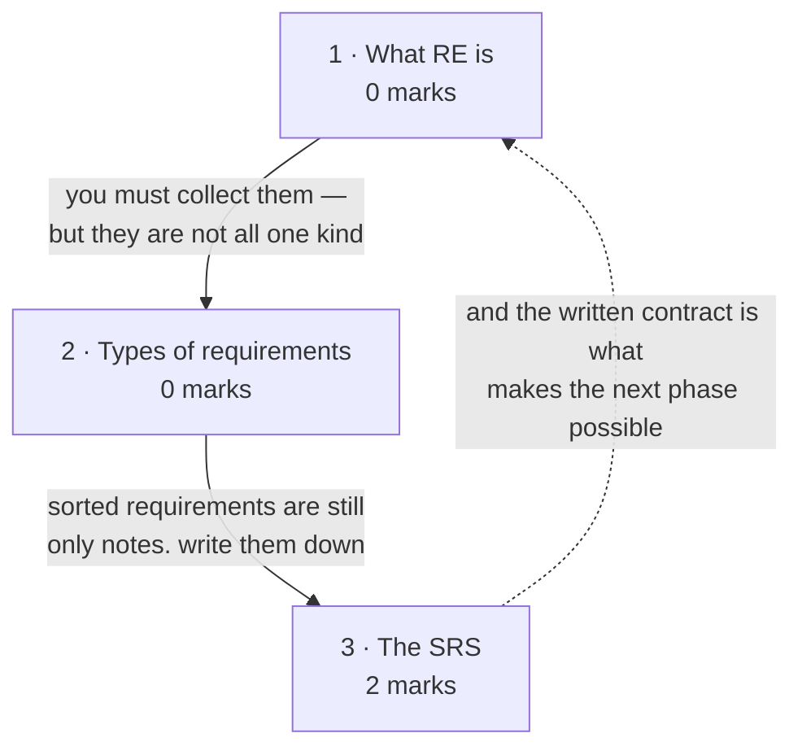

# Requirements Engineering

**Prerequisites:** [[SDLC & CMMI]]

## Overview

> [!info] 2 of 80 in [[se-ete-2025-26]] — question A3
> A3: *"Illustrate with reason that SRS document is required in large-scale
> projects but often avoided in Agile."* It is a **requirements** question with an
> agile framing, so its marks sit here rather than on [[Agile Development]].
> One paper only; see [[weightage]].

The cheapest place in the entire lifecycle to be wrong. Requirements engineering
is the systematic process of defining, documenting and maintaining what a system
must do — and the SRS is its output, the document that becomes a contract between
customer and developer. Get this wrong and every later phase amplifies the error;
that is the cost-of-change curve from [[story]] applied at its steepest point.

## Quick Reference

> [!abstract] The three that carry this topic
> - **Functional = what the system does. Non-functional = how well it does it.**
>   The single most-used distinction in the whole module.
> - **A good requirement (and a good SRS) is: correct, unambiguous, complete,
>   consistent, verifiable, feasible, traceable, modifiable.** Eight adjectives;
>   the SRS list drops *feasible*.
> - **The SRS is a contract.** That one word explains why large projects need it
>   and agile projects can skip it.

**Requirement engineering** — the systematic process of defining, documenting and
maintaining requirements, ensuring the software meets user needs, business goals
and technical feasibility. The deck's alternative phrasing: *the disciplined
application of proven principles, methods, tools and notations to describe a
proposed system's intended behaviour and its associated constraints.*

**Objectives:** understand what the customer really needs · avoid
miscommunication · give a clear unambiguous specification · serve as the basis
for design, coding and testing · handle changing requirements systematically.

**Characteristics of a good requirement**

| Property | Means |
|---|---|
| Correct | represents actual stakeholder needs |
| Unambiguous | only one possible interpretation |
| Complete | covers all scenarios |
| Consistent | no contradictions |
| Verifiable | can be tested or validated |
| Feasible | technically and financially possible |
| Traceable | linked to its origin |
| Modifiable | easy to change if needed |

**Types of requirements** — the deck lists ten; the first two carry the marks:

| # | Type | Defines | Example |
|---|---|---|---|
| 1 | **Functional** | what the system **does** — input → process → output | "System shall allow users to register with email and password" |
| 2 | **Non-functional** | how **well** it does it — quality attributes | "Response time < 2 sec"; "99.9% uptime"; "AES-256 encryption" |
| 3 | Domain | rules imposed by the industry | "Interest calculation must follow RBI rules" |
| 4 | User | high-level, natural language, for non-technical readers | "Customers can track order status" |
| 5 | System | detailed technical specs derived from user requirements | "Store order details in a relational database" |
| 6 | Business | why the system is being built at all | "Reduce support costs by 20%" |
| 7 | Regulatory / compliance | law and standards | "Comply with GDPR" |
| 8 | Interface | interaction with external entities | "Provide a REST API" |
| 9 | Transition | temporary, valid only during migration | "Old system runs in parallel for 3 months" |
| 10 | Stakeholder | needs of customers, users, developers, managers — often conflicting | cost vs maintainability vs speed |

**Non-functional requirements, split by who cares** (the deck's own grouping):

| For users | For developers |
|---|---|
| availability, reliability, usability, flexibility | maintainability, portability, testability |

**The three discovery classes:** known · unknown · **undreamed** requirements.
A **stakeholder** is anyone with direct or indirect influence on the system
requirements — users and affected persons.

**Three types of interface** in an interface specification: procedural interfaces
(APIs) · data structures · representation of data.

### The SRS

**Definition.** A detailed written document describing what a software system
should do and the constraints under which it must operate. It **bridges
stakeholders and developers** and **may act as a contract** between developer and
customer.

**Purpose:** clear understanding of what is to be built · reduce ambiguity · a
reference for design, coding and testing · a **contract** · help with estimation
of cost, time and resources · the basis for **acceptance testing**.

**IEEE 830 structure**

| § | Section | Contains |
|---|---|---|
| 1 | Introduction | purpose · scope · definitions and acronyms · references · overview |
| 2 | Overall description | product perspective · product functions · user characteristics · constraints · assumptions and dependencies |
| 3 | Specific requirements | functional · non-functional · external interface requirements · system features |
| 4 | Appendices | glossary · supporting information · references |

**Benefits by audience:** developers get a blueprint · testers get the basis for
test-case design · customers get assurance their requirements are captured ·
managers get tracking and estimation.

**Common SRS mistakes:** ambiguous language ("system should be fast") · mixing
requirements with **design details** · incomplete requirements (missing error
handling) · ignoring non-functional requirements.

**Challenges in RE:** ambiguity · changing business needs · stakeholder conflicts
· communication gaps · over- or under-specification. The deck's *state of
practice* list adds: requirements change · over-reliance on CASE tools · tight
schedules · communication barriers · market-driven development · lack of
resources.

## Subtopic map

| # | Subtopic | Marks | Why it's here |
|---|---|---|---|
| 1 | What requirements engineering is | 0 | the definition and why RE is hard |
| 2 | Types of requirements | 0 | functional vs non-functional, plus eight more |
| 3 | The SRS | **2** | carries A3; the document everything downstream reads |

## Mindmap

**1 · What requirements engineering is — 0 marks**
- **What:** the systematic process of defining, documenting and maintaining what
  a system must do.
- **Why:** it is the cheapest point in the lifecycle to be wrong, and the most
  expensive point to *stay* wrong.
- **Important:** never examined alone. Know the definition and three challenges.
  Note the **known / unknown / undreamed** split — customers cannot tell you what
  they have not imagined.

**2 · Types of requirements — 0 marks**
- **What:** ten categories, headed by functional and non-functional.
- **Why:** non-functional requirements are the ones projects forget and then fail
  acceptance on.
- **Important:** never examined here, but **functional vs non-functional is
  assumed everywhere downstream**. Know both definitions and two examples each.

**3 · The SRS — 2 marks**
- **What:** the document specifying what the system does and under what
  constraints; structured to IEEE 830.
- **Why:** it is the **contract** — and that single property explains both why
  large projects need it and why agile can drop it.
- **Important:** **A3, 2 marks.** Know the four IEEE 830 sections and the seven
  good-SRS characteristics.

## 1 · What requirements engineering is

**Intuition.** Customers rarely know what they want in a form you can build from.
They know their problem, they know their frustrations, and they will happily
describe a solution that would not work. Requirements engineering is the
discipline of converting that into statements precise enough to design against
and testable enough to verify — while accepting that requirements will keep
changing underneath you. The deck's *undreamed requirements* category is the
honest admission: some needs the customer cannot state because they have not yet
imagined the system could meet them.

**Definitions & distinctions.** Both definitions, the objectives and the
challenge lists are in Quick Reference. The three discovery classes are worth a
line each: **known** requirements the customer can state; **unknown** ones they
would state if prompted; **undreamed** ones they cannot conceive until they see
the system.

**Stakeholder** — anyone with direct or indirect influence on the system
requirements, spanning users and merely affected persons. The breadth matters:
excluding an affected party is how requirements end up incomplete.

**What gets asked.** Not examined directly. The definition is a serviceable
opening line for A3 or for any requirements question.

## 2 · Types of requirements

**Intuition.** "The system shall let a doctor view patient history" and "the
system shall respond within two seconds" are both requirements, but they fail
differently. Miss the first and a feature is absent; miss the second and every
feature is present and the system is still rejected. That is the functional /
non-functional split, and it is the reason non-functional requirements get their
own name — they are the ones teams forget until acceptance testing.

**Definitions & distinctions.** The ten types with examples are tabulated in
Quick Reference, as is the users/developers split of non-functional attributes.
The core pair:

> **Functional** requirements describe *what the software has to do* — often
> called product features, usually expressed as input → process → output.
> **Non-functional** requirements are mostly *quality* requirements: they
> stipulate *how well* the software does what it has to do.

**User vs system requirements** is the other distinction the deck stresses: user
requirements are written *for users* and include both functional and
non-functional; system requirements are **derived from** them and written
formally. Both are parts of the SRS.

**What gets asked.** Not examined on the one paper here. But the
functional/non-functional distinction is assumed by A3 and by every modeling
topic downstream, so it is not optional.

## 3 · The SRS

**Intuition.** Everything before this is conversation; the SRS is the moment it
becomes binding. It is simultaneously a blueprint for developers, a test basis
for testers, a scope boundary for managers and — critically — **a contract
between customer and developer**. That contractual role is what makes it
indispensable when many people must agree, and dispensable when a handful of
people can simply talk to each other. Which is exactly what A3 is asking.

**Definitions & distinctions.** The purpose list, the seven good-SRS
characteristics, the IEEE 830 structure, the benefits-by-audience table and the
common-mistakes list are all in Quick Reference.

The deck carries a **full worked SRS for a Hospital Management System** — purpose,
scope, definitions, references, overview, then product perspective, features, user
classes (admin / doctor / patient), operating environment and design constraints.
Worth reading once end to end: it shows the level of specificity IEEE 830 expects,
which is hard to infer from the section headings alone.

**Solved questions.**

> **[[se-ete-2025-26]] Q A3 (2 marks, CO2)** — "Illustrate with reason that SRS
> document is required in large-scale projects but often avoided in Agile."

**Answer.** The SRS is a **contract and a shared reference**; its value scales
with the number of people who must agree, and its cost scales with how fast the
requirements change.

**Why large-scale projects require it:**

1. **Many stakeholders and distributed teams** — designers, coders and testers who
   never meet the customer need one authoritative written source. Verbal
   agreement does not scale past a small co-located team.
2. **It is a contract** — it fixes scope legally and commercially, protecting
   both sides against disputes, and it is the basis for **acceptance testing**.
3. **Downstream dependence** — design, coding, test-case design and estimation of
   cost and time all read from it. Large projects also need **traceability** from
   requirement to design to code to test, which needs a written baseline.

**Why Agile often avoids it:**

1. **The manifesto trades it away** — *working software over comprehensive
   documentation*. Effort spent maintaining a document is effort not spent
   shipping.
2. **Requirements are expected to change**, so a frozen SRS is stale almost
   immediately and maintaining it costs more than it returns.
3. **It is replaced, not simply dropped** — user stories on cards, the product
   backlog, and an on-site customer serve the same purpose continuously, at lower
   cost, for a small co-located team.

**The reason underneath both halves:** an SRS is worth its cost when
communication cannot happen face to face and scope must be fixed in advance. Agile
removes both conditions.

*(No printed solution key exists for this paper, so this answer is unchecked —
no `✓`.)*

**What gets asked.** This subtopic carries the topic's only marks:

- **Spot it** — any question contrasting formal documentation with agile
  practice, or asking why a document is or is not needed.
- **Method** — 2 marks means one reason per side plus the underlying principle.
  Give the **contract / shared-reference** argument for large projects and the
  **change-rate / working-software** argument for agile. Say explicitly that
  agile *replaces* the SRS with stories and an on-site customer rather than
  abandoning specification.
- **Trap** — writing "Agile has no documentation". It does; it has *less*, and
  different. The manifesto values are "A **over** B", not "A instead of B". A
  answer that claims agile skips requirements entirely misreads the value and
  loses the mark.

## Question Bank

**PYQ questions — 1.**

> **[[se-ete-2025-26]] Q A3 (2 marks, CO2)** — "Illustrate with reason that SRS
> document is required in large-scale projects but often avoided in Agile."

Worked in full in subtopic 3. Short form: the SRS is a **contract and shared
reference**, essential when many people must agree and scope must be fixed;
agile has a small co-located team, an on-site customer and changing requirements,
so it **replaces** the SRS with user stories and a backlog rather than abandoning
specification. *(Unchecked.)*

**Deck questions — 1 problem statement, not a worked exercise.**

> `L5 Chapter 3 Software Requirements_2.pdf` — "A University wish to develop a
> software system for the student result management of its M.Tech. Programme. A
> problem statement is to be prepared for the software development company. The
> problem statement may give an overview of the existing system and broad
> expectations from the new software system."

This is the **running example** the deck uses across requirements, ER modeling and
design — and it is the same system as the image-only
`Case study Student Result Management System.pdf` (37 pages). No printed solution
is extractable, so no worked answer is offered here; the deck's own SRS worked
example is for the Hospital Management System instead.

**Textbook questions — unavailable for this topic.** Pressman 8e is not in
`raw/sources/`. The two Aggarwal & Singh chapters in the vault cover project
planning and design, not requirements.

## Mistakes & Traps

- **Claiming agile has no documentation.** It has less, and different. "Working
  software **over** comprehensive documentation" is a priority, not a prohibition.
- **Mixing requirements with design in an SRS.** The SRS says *what*, not *how* —
  the deck lists this as a common mistake explicitly.
- **Forgetting non-functional requirements.** They are what acceptance fails on.
- **Writing unverifiable requirements.** "The system should be fast" cannot be
  tested; "response time under 2 seconds" can. Verifiability is one of the eight
  characteristics.
- **Confusing user and system requirements.** User requirements are written for
  users; system requirements are derived from them and written formally.

## Course Material

- `raw/sources/ppts/2025/L2 Lec (9 - 14).pdf` — the main source. RE definition and
  objectives, the eight good-requirement characteristics, all ten requirement
  types with examples, RE tools and challenges, and the SRS in full: definition,
  purpose, characteristics, the IEEE 830 structure, benefits by audience, common
  mistakes, and a complete worked SRS for a Hospital Management System.
- `raw/sources/ppts/2025/L5 Chapter 3 Software Requirements_2.pdf` — a second
  treatment: the alternative RE definition, the *state of practice* difficulties,
  the known/unknown/undreamed split, the stakeholder definition, the
  users/developers grouping of non-functional attributes, user vs system
  requirements, and interface specification with its three interface types. Also
  introduces the **Student Result Management System** running example.

**Related:** [[story]] · [[syllabus]] · [[weightage]] · [[MTE Roadmap]] ·
previous [[SDLC & CMMI]] · next [[Software Engineering Practice]] ·
cross-reference [[Agile Development]]
